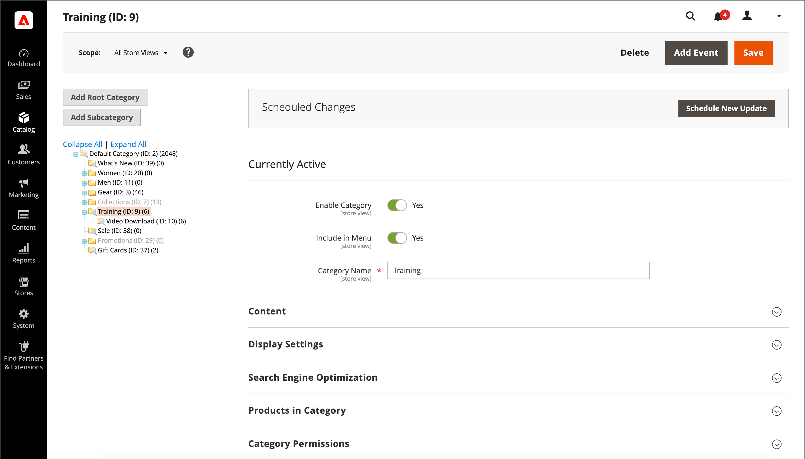

# Kategorienübersicht

Bevor Sie Produkte zu Ihrem Katalog hinzufügen, sollten Sie die grundlegende Kategoriestruktur Ihres Katalogs festlegen. Produkte können null oder mehr Kategorien zugewiesen werden. Normalerweise werden Kategorien im Voraus erstellt, bevor Produkte zum Katalog hinzugefügt werden. Sie können jedoch auch Kategorien _on the fly) hinzufügen_ während Sie ein Produkt erstellen. Die Kategoriestruktur des Katalogs wird im Hauptmenü - oder [Navigation oben](navigation-top.md) - des Stores angezeigt.

{width="700" zoomable="yes"}

| Kontrolle | Beschreibung |
|--- |--- |
| **[!UICONTROL Add Root Category]** | Erstellt eine Stammkategorie. |
| **[!UICONTROL Add Subcategory]** | Fügt eine Unterkategorie unterhalb der aktuellen Kategorie oder Unterkategorie hinzu. |
| **[!UICONTROL Collapse All]** / **[!UICONTROL Expand All]** | Reduziert oder erweitert die Kategoriestruktur. |
| **[!UICONTROL Delete]** | Entfernt die aktuelle Kategorie oder Unterkategorie aus der Baumstruktur. |
| **[!UICONTROL Save]** | Speichert alle Änderungen an der Kategorie. |

{style="table-layout:auto"}

>[!NOTE]
>
>Eingeschränkte Admins haben keinen Zugriff auf Stammkategorien und können keine Unterkategorien erstellen, es sei denn, sie haben Zugriff auf alle Websites.

## Fehlerbehebung bei Ressourcen

Hilfe bei der Fehlerbehebung bei Kategorieproblemen finden Sie in den folgenden Knowledge Base-Artikeln zum Commerce-Support:

- [Änderungen an Kategorien werden nicht gespeichert](https://experienceleague.adobe.com/docs/commerce-knowledge-base/kb/troubleshooting/miscellaneous/changes-to-categories-are-not-being-saved.html)
- [Hauptmenü (Kategorien) wird nicht auf Unterseiten angezeigt, wenn Fastly aktiviert ist](https://experienceleague.adobe.com/docs/commerce-knowledge-base/kb/troubleshooting/miscellaneous/main-menu-categories-not-displayed-on-subpages-with-fastly-enabled.html)
