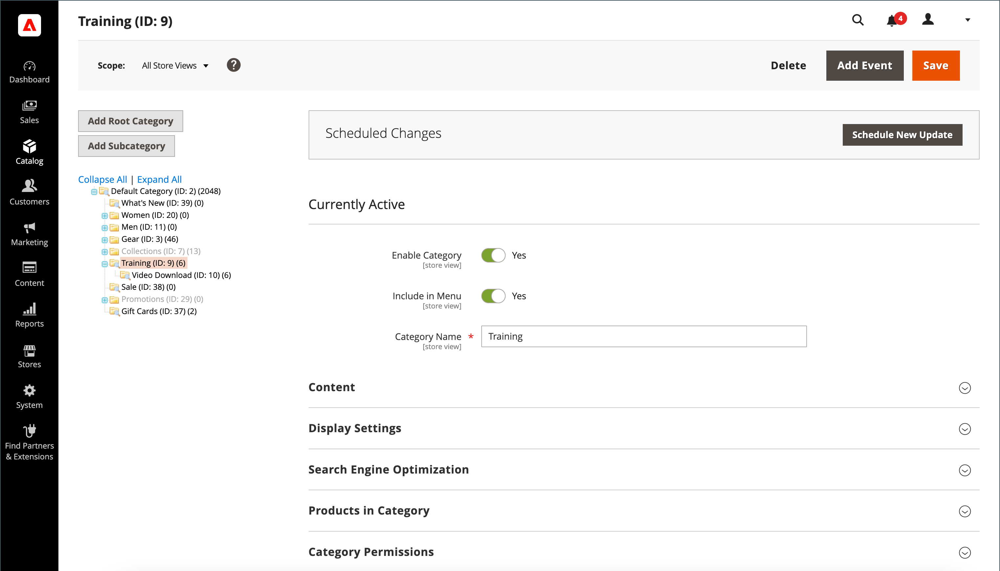

# Kategorien erstellen

Die Kategoriestruktur Ihres Katalogs ähnelt einer Aufwärtsstruktur mit der Wurzel oben. Jeder Bereich des Baums kann erweitert und reduziert werden. Alle deaktivierten oder ausgeblendeten Kategorien sind grau ausgeblendet. Die Kategorien auf der ersten Ebene (unter dem [Stamm](category-root.md)) werden normalerweise als Optionen im [Hauptmenü](navigation-top.md) angezeigt. Je nach der in der Konfiguration festgelegten maximalen Menütiefe können Sie beliebig viele weitere Unterkategorien erstellen. Kategorien können per Drag-and-Drop an andere Positionen im Baum gezogen werden. Die Kategorie-ID-Nummer wird in Klammern hinter dem Kategorienamen oben auf der Seite angezeigt.

Für eine Website mit mehreren [Stores](../stores-purchase/stores.md#add-stores) können Sie für jeden Store eine andere Stammkategorie erstellen, die den Satz von Kategorien definiert, der für die [obere Navigation](navigation-top.md) verwendet wird.

{width="700" zoomable="yes"}

## Best Practices

Verwenden Sie diese Best Practices bei der Planung und Erstellung von Kategorien.

### Kategoriestruktur

Die Struktur der Kategorien im Hauptmenü kann sich auf das Kundenerlebnis und die Leistung auswirken. Als Best Practice sollten Sie eine übergeordnete Kategorie der obersten Ebene identifizieren und vermeiden, dass andere Kategorien denselben Namen haben. Anstatt beispielsweise mehrere Kategorien für &quot;Kinder&quot;in verschiedenen Abteilungen zu organisieren, z. B. `Clothing/Kids`, `Shoes/Kids`, `Accessories/Kids`. Es kann effizienter sein, die übergeordnete Kategorie der obersten Ebene `Kids` festzulegen und anschließend nach Bedarf Unterkategorien zu erstellen. Halten Sie sich an die Kategoriestruktur und verwenden Sie denselben Ansatz für alle Produktarten in Ihrem Katalog.

### Geschäftsregeln und Automatisierung

Beachten Sie die Kategoriestruktur und die verfügbaren Attributwerte bei der Verwendung der Geschäftslogik, um ähnliche Elemente auf einer Katalogseite anzuzeigen oder um eine personalisierte Promotion, einen automatisierten Prozess oder Suchkriterien einzurichten. Wenn Sie beispielsweise &quot;polo&quot;als übergeordnete Kategorie angeben, können die Ergebnisse Produkte mit gemischtem Geschlecht und altersfremdem Alter umfassen. Wenn Sie jedoch eine bestimmte Unterkategorie von Polohemden auswählen, sind die Ergebnisse enger und können einen bestimmten Kunden ansprechen. Die Ergebnisse können sogar noch spezifischer sein, wenn sie mit anderen Attributwerten kombiniert werden, die auf einen bestimmten Kunden ausgerichtet sind. Betrachten Sie die Anzahl der Produkte, die gefiltert und abgerufen werden müssen, wenn auf einen bestimmten Kategoriepfad verwiesen wird. Der Unterschied in den Ergebnissen kann dramatisch sein. Betrachten Sie die verschiedenen Ergebnisse, die von den folgenden Kategoriepfaden zurückgegeben werden:

- `[Category:  All Products/Shirts/Father's Day/Polos/Sale]`
- `[Category Path: Men/Shirts/Polos]`
- `[Child Category: Polos]`

Es ist wichtig, kategorische Beziehungen klar zu definieren, z. B.:

- übergeordnete Kategorie
- Unterkategorie
- Kategoriepfad

Definieren Sie auch alle zugehörigen Suchbegriffe und Attribute, z. B.:

- Verfügbarkeit
- Verkaufspreis
- Marke
- size
- color

## Schritt 1: Erstellen einer Kategorie

1. Wechseln Sie in der Seitenleiste _Admin_ zu **[!UICONTROL Catalog]** > **[!UICONTROL Categories]**.

1. Legen Sie **[!UICONTROL Store View]** fest, um zu bestimmen, wo die neue Kategorie verfügbar sein soll.

1. Wählen Sie im Kategoriebaum die übergeordnete Kategorie der neuen Kategorie aus.

   Das übergeordnete Element liegt eine Ebene über der neuen Kategorie.

   Wenn Sie von Anfang an ohne Daten beginnen, gibt es möglicherweise nur zwei Kategorien in der Liste: _Standardkategorie_, die der Stamm ist, und eine _Beispielkategorie_

1. Klicken Sie auf **[!UICONTROL Add Subcategory]**.

## Schritt 2: Grundlegende Informationen ausfüllen

1. Wenn die Kategorie sofort im Speicher verfügbar sein soll, setzen Sie **[!UICONTROL Enable Category]** auf `Yes`.

1. Um die Kategorie in die [obere Navigation](navigation-top.md) aufzunehmen, setzen Sie **[!UICONTROL Include in Menu]** auf `Yes`.

1. Geben Sie den Wert **[!UICONTROL Category Name]** ein.

   {width="500" zoomable="yes"}

1. Klicken Sie auf **[!UICONTROL Save]** und fahren Sie fort.

## Schritt 3: Kategorieinhalt ausfüllen

1. Erweitern Sie  im Abschnitt **[!UICONTROL Content]** .

   {width="600" zoomable="yes"}

1. Um oben auf der Seite den Wert &quot;**[!UICONTROL Category Image]**&quot;anzuzeigen, können Sie entweder Ihr eigenes Bild hochladen oder ein Bild verwenden, das im [Medienspeicher](../content-design/media-storage.md) vorhanden ist.

   - Um Ihr eigenes Bild hochzuladen, klicken Sie auf **[!UICONTROL Upload]** und wählen Sie das Bild aus, das Sie für die Kategorie darstellen möchten.

   - Um Bilder aus dem Medienspeicher zu verwenden, klicken Sie auf **[!UICONTROL Select from Gallery]** und wählen Sie das Bild aus, das Sie für die Kategorie darstellen möchten.

   >[!NOTE]
   >
   >Innerhalb der Mediengalerie können Sie auch die [Adobe Stock-Integration](../content-design/adobe-stock.md) verwenden, um ein passendes Bild zu finden, indem Sie auf **[!UICONTROL Search Adobe Stock]** klicken.

1. Geben Sie für **[!UICONTROL Description]** den Text oder anderen Inhalt ein, der auf der Landingpage der Kategorie angezeigt werden soll.

   Weitere Informationen finden Sie unter [Kategorieinhalt](categories-content-settings.md).

1. Um einen Inhaltsbaustein in die Kategorie-Landingpage einzuschließen, wählen Sie die gewünschte **[!UICONTROL CMS Block]** aus.

1. Klicken Sie auf **[!UICONTROL Save]** und fahren Sie fort.

## Schritt 4: Ausfüllen der Anzeigeeinstellungen

1. Erweitern Sie  im Abschnitt **[!UICONTROL Display Setting]** .

   {width="600" zoomable="yes"}

   Weitere Informationen zu diesen Optionen finden Sie unter Weitere Informationen zu diesen Optionen finden Sie unter [Anzeigeeinstellungen](categories-display-settings.md).

1. Setzen Sie **[!UICONTROL Display Mode]** auf einen der folgenden Werte:

   - `Products Only`
   - `Static Block Only`
   - `Static Block and Products`

1. Wenn die Kategorieseite den Abschnitt &quot;_`Filter by Attribute`_&quot; der mehrschichtigen Navigation enthalten soll, setzen Sie &quot;**[!UICONTROL Anchor]**&quot;auf &quot;`Yes`&quot;.

1. Wählen Sie für die Optionen **[!UICONTROL Available Product Listing Sort By]** einen oder mehrere der verfügbaren Werte aus, die Kunden zum Sortieren der Liste zur Verfügung stehen sollen. Diese Einstellung gilt nicht für das [!DNL Live Search] [Seiten-Widget zur Produktauflistung](https://experienceleague.adobe.com/en/docs/commerce-merchant-services/live-search/live-search-storefront/plp-styling).

   Standardmäßig sind alle verfügbaren Werte eingeschlossen. Deaktivieren Sie das Kontrollkästchen **[!UICONTROL Use All]** , um die Auswahl zu ändern. Die Werte können beispielsweise Folgendes umfassen:

   - `Position`
   - `Product Name`
   - `Price`

1. Um die standardmäßige Sortierreihenfolge für die Kategorie festzulegen, wählen Sie den Wert **[!UICONTROL Default Product Listing Sort By]** aus. Diese Einstellung gilt nicht für das [!DNL Live Search] [Seiten-Widget zur Produktauflistung](https://experienceleague.adobe.com/en/docs/commerce-merchant-services/live-search/live-search-storefront/plp-styling).

1. Gehen Sie wie folgt vor, um die Standardeinstellung für die Navigation [Preisschritt](navigation-layered.md#configure-price-navigation) mit Ebenen zu ändern:

   - Deaktivieren Sie das Kontrollkästchen **[!UICONTROL Use Config Settings]** .

   - Geben Sie den Wert ein, der als inkrementeller Preisschritt für die Navigation mit Ebenen verwendet werden soll.

1. Klicken Sie auf **[!UICONTROL Save]** und fahren Sie fort.

## Schritt 5: Suchmaschinen-Optimierungseinstellungen durchführen

1. Erweitern Sie  im Abschnitt **[!UICONTROL Search Engine Optimization Settings]** .

   {width="600" zoomable="yes"}

   Weitere Informationen zu diesen Optionen finden Sie unter [Suchmaschinenoptimierung](categories-search-engine-optimization.md).

1. Füllen Sie die folgenden [Metadaten](../merchandising-promotions/meta-data.md) für die Kategorie aus:

   - [!UICONTROL Meta Title]
   - [!UICONTROL Meta Keywords]
   - [!UICONTROL Meta Description]

1. Klicken Sie auf **[!UICONTROL Save]** und fahren Sie fort.

## Schritt 6: Auswählen der Produkte in der Kategorie

1. Erweitern Sie  im Abschnitt **[!UICONTROL Products in Category]** .

   {width="600" zoomable="yes"}

   Weitere Informationen zu diesen Optionen finden Sie unter [Produkte in Kategorie](categories-product-assignments.md).

1. Verwenden Sie bei Bedarf die [Filter](../getting-started/admin-grid-controls.md) , um die Produkte zu finden.

   Um alle Datensätze anzuzeigen, die noch nicht in der Kategorie enthalten sind, setzen Sie die Datensatzauswahl in der ersten Spalte auf `No` und klicken Sie auf **[!UICONTROL Search]**.

1. Aktivieren Sie in der ersten Spalte das Kontrollkästchen für jedes Produkt, das in die Kategorie aufgenommen werden soll.

1. Klicken Sie auf **[!UICONTROL Save]** und fahren Sie fort.

## Schritt 7: Festlegen der Kategorieberechtigungen

{{ee-feature}}

1. Erweitern Sie  im Abschnitt **[!UICONTROL Category Permissions]** .

1. Wählen Sie für eine Installation mit mehreren Sites die **[!UICONTROL Website]** aus, für die die Kategorieberechtigungen gelten.

1. Wählen Sie die **[!UICONTROL Customer Group]** aus, für die die Kategorieberechtigungen gelten.

    ([Nur Adobe Commerce B2B](../b2b/introduction.md)) Bei Bedarf können Sie stattdessen einen **[!UICONTROL Shared Catalog]** auswählen.

1. Legen Sie die folgenden Berechtigungen nach Bedarf fest:

   - [!UICONTROL Browsing Category]
   - [!UICONTROL Display Product Prices]
   - [!UICONTROL Add to Cart]

1. Um eine weitere Berechtigungsregel hinzuzufügen, klicken Sie auf **[!UICONTROL New Permission]** und wiederholen Sie den Vorgang.

   {width="600" zoomable="yes"}

## Schritt 8: Fertigstellen der Designeinstellungen

1. Erweitern Sie  im Abschnitt **[!UICONTROL Design]** .

1. Legen Sie die Designeinstellungen nach Bedarf fest:

   - ([Nur Adobe Commerce B2B](../b2b/introduction.md)) Um die Design-Einstellungen der übergeordneten Kategorie auf diese Kategorie anzuwenden, setzen Sie **[!UICONTROL Use Parent Category Settings]** auf `Yes`.

   - Um das Design der Kategorieseiten zu ändern, wählen Sie die **[!UICONTROL Theme]** aus, die Sie anwenden möchten.

   - Um das Spaltenlayout der Kategorieseiten zu ändern, wählen Sie die gewünschte **[!UICONTROL Layout]** aus.

   - Um benutzerdefinierten Code einzugeben, geben Sie gültigen XML-Code in das Feld **[!UICONTROL Layout Update XML]** ein.

   - Um dasselbe Design für Produktseiten zu verwenden, setzen Sie **[!UICONTROL Apply Design to Products]** auf `Yes`.

   {width="600" zoomable="yes"}

1.  (nur Magento Open Source) Gehen Sie wie folgt vor, um das Design-Update für einen bestimmten Zeitraum zu planen:

   - Erweitern Sie den Abschnitt _[!UICONTROL Schedule Design Update]_.

   - Verwenden Sie den Kalender (), um das Datum für die Zeitplanaktualisierung **[!UICONTROL from]** und das Datum **[!UICONTROL to]** auszuwählen.

   {width="600" zoomable="yes"}

1. Klicken Sie nach Abschluss des Vorgangs auf **[!UICONTROL Save]**.
