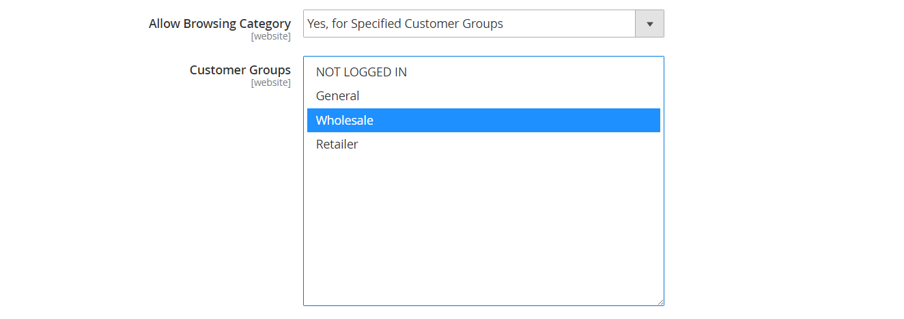

# Kategorienberechtigungen

{{ee-feature}}

Der Zugriff auf Kategorien kann auf bestimmte Kundengruppen beschränkt oder vollständig eingeschränkt sein. Sie können die Anzeige der Produktpreise steuern, bestimmen, welche Kundengruppen Produkte zum Warenkorb hinzufügen können, und die Landingpage angeben.

>[!NOTE]
>
>Kategorieberechtigungen haben einen globalen Gültigkeitsbereich und schränkt bei Aktivierung den Zugriff auf jede Kategorie entsprechend ihren individuellen Berechtigungen ein. Standardmäßig sind Kategorieberechtigungen nicht aktiviert.

Wenn Sie beispielsweise nur an Großkunden verkaufen, können Sie jedem erlauben, den Katalog zu durchsuchen, aber die Preise anzeigen und Käufe nur für Käufer im _Großhandel_ Kundengruppe. Im folgenden Beispiel haben nur angemeldete Benutzer Zugriff auf die Kategorie &quot;Sammlungen&quot;. Die Option &quot;Kollektionen&quot; erscheint nicht im Hauptmenü.

{width="600" zoomable="yes"}

Wenn diese Option aktiviert ist, wird eine neue _[!UICONTROL Category Permissions]_wird auf der Seite Kategorie angezeigt, über die Sie den erforderlichen Zugriff auf jede Kategorie anwenden können. Sie können jeder Kategorie mehrere Zugriffsregeln für verschiedene Websites und Kundengruppen hinzufügen.

## Schritt 1: Konfigurieren von Kategorieberechtigungen

>[!IMPORTANT]
>
>Alle vorhandenen [Gruppenberechtigungseinstellungen](../configuration-reference/catalog/catalog.md#category-permissions) werden von **_all_** Kategorien im Katalog, wenn die **_[!UICONTROL Shared Catalog]_** aktiviert ist. [!UICONTROL Shared Catalog] steuert alle Kategorieberechtigungen im Katalog vollständig, wenn sie aktiviert sind.

1. Im _Admin_ Seitenleiste, navigieren Sie zu **[!UICONTROL Stores]** > _[!UICONTROL Settings]_>**[!UICONTROL Configuration]**.

1. Erweitern Sie im linken Bereich **[!UICONTROL Catalog]** und wählen **[!UICONTROL Catalog]** darunter.

1. Erweitern  die **[!UICONTROL Category Permissions]** Abschnitt.

   {width="600" zoomable="yes"}

   Eine detaillierte Liste dieser Optionen finden Sie unter [Kategorieberechtigungen](../configuration-reference/catalog/catalog.md#category-permissions) im _Konfigurationsreferenz_.

1. Satz **[!UICONTROL Enable]** nach `Yes`.

1. Füllen Sie die anderen Optionen entsprechend dem aus, was Sie für Ihren Store zulassen oder beschränken möchten (siehe die folgenden Abschnitte).

1. Wenn Sie fertig sind, klicken Sie auf **[!UICONTROL Save Config]**.

1. Wenn Sie aufgefordert werden, den Cache zu aktualisieren, klicken Sie auf die **[!UICONTROL Cache Management]** in der Systemmeldung und befolgen Sie die Anweisungen zum Aktualisieren des Caches.

### [!UICONTROL Allow Browsing Category]

Diese Option gilt für alle Kategorien im [website](../getting-started/websites-stores-views.md).

So lassen Sie die Mitglieder eines **_spezifische Kundengruppe_** Gehen Sie wie folgt vor, um Kategorieprodukte zu durchsuchen:

1. Satz **[!UICONTROL Allow Browsing Category]** nach `Specified Customer Groups`.

1. Im **[!UICONTROL Customer Groups]** auswählen, wählen Sie jede Gruppe aus, die durch Produkte in der Kategorie navigieren darf.

   Um mehrere Gruppen auszuwählen, halten Sie die Strg-Taste (PC) oder die Befehlstaste (Mac) gedrückt, während Sie auf jede Gruppe klicken.

   {width="600" zoomable="yes"}

nach **_den Zugriff und die Weiterleitung auf eine Landingpage beschränken_** führen Sie folgende Schritte aus:

1. Satz **[!UICONTROL Allow Browsing Category]** nach `No, Redirect to Landing Page`.

1. Wählen Sie die **[!UICONTROL Landing Page]** wo Besucher umgeleitet werden.

   {width="600" zoomable="yes"}

   >[!NOTE]
   >
   >Obwohl die Variable _[!UICONTROL Allow Browsing Category]_-Einstellung für alle Kategorien auf der Website gilt, können Sie für jede Store-Ansicht eine andere Landingpage konfigurieren.

### [!UICONTROL Display Product Prices]

Diese Option gilt für alle Kategorien im [website](../getting-started/websites-stores-views.md).

So lassen Sie nur Mitglieder von **_spezifische Kundengruppen_** Gehen Sie wie folgt vor, um den Preis der Produkte der Kategorie anzuzeigen:

1. Satz **[!UICONTROL Display Product Prices]** nach `Yes, for Specified Customer Groups`.

1. Im **[!UICONTROL Customer Groups]** auswählen, wählen Sie jede Gruppe aus, die den Preis der Produkte in der Kategorie anzeigen darf.

   Um mehrere Gruppen auszuwählen, halten Sie die Strg-Taste (PC) oder die Befehlstaste (Mac) gedrückt, während Sie auf jede Gruppe klicken.)

   {width="600" zoomable="yes"}

### [!UICONTROL Allow Adding to Cart]

Diese Option gilt für alle Kategorien im [website](../getting-started/websites-stores-views.md).

So lassen Sie nur Mitglieder von **_spezifische Kundengruppen_** Gehen Sie wie folgt vor, um Kategorieprodukte in den Warenkorb zu legen:

1. Satz **[!UICONTROL Allow Adding to Cart]** nach `Yes, for Specified Customer Groups`.

1. Im **[!UICONTROL Customer Groups]** auswählen, wählen Sie jede Gruppe aus, die Produkte aus der Kategorie zum Warenkorb hinzufügen darf.

   Um mehrere Gruppen auszuwählen, halten Sie die Strg-Taste (PC) oder die Befehlstaste (Mac) gedrückt, während Sie auf jede Gruppe klicken.

   {width="600" zoomable="yes"}

### [!UICONTROL Disallow Catalog Search]

Legen Sie diese Option fest, um zu verhindern, dass Mitglieder einer bestimmten Kundengruppe die Katalogsuche verwenden. Sie gilt für alle Kategorien im [website](../getting-started/websites-stores-views.md).

- In **_Nur angemeldete Kunden_** Um die Katalogsuche zu verwenden, wählen Sie `NOT LOGGED IN`.

- In **_nur bestimmte Kundengruppen_** Um die Katalogsuche zu verwenden, wählen Sie jede Gruppe aus, die von der Verwendung der Kategoriesuche ausgeschlossen werden soll.

  Um mehrere Gruppen auszuwählen, halten Sie die Strg-Taste (PC) oder die Befehlstaste (Mac) gedrückt, während Sie auf jede Gruppe klicken.

  {width="600" zoomable="yes"}

## Schritt 2: Anwenden von Kategorieberechtigungen

1. Im _Admin_ Seitenleiste, navigieren Sie zu **[!UICONTROL Catalog]** > **[!UICONTROL Categories]**.

1. Wählen Sie im Kategoriebaum die Zielkategorie aus.

1. Erweitern  **[!UICONTROL Category Permissions]** auf der Seite und führen Sie folgende Schritte aus:

   - Klicken Sie zum Erstellen einer Berechtigungsregel auf **[!UICONTROL New Permission]**.

     {width="600" zoomable="yes"}

   - Wählen Sie die zutreffende **[!UICONTROL Website]** und **[!UICONTROL Customer Group]**.

   - Legen Sie die individuellen Berechtigungen nach Bedarf fest.

   >[!NOTE]
   >
   >Wann `Browsing Category` = `Deny` -Berechtigung für eine übergeordnete Kategorie festgelegt ist, wird sie nicht auf der [Breadcrumb-Pfad](navigation-breadcrumb-trail.md) auf der untergeordneten Kategorieseite.

1. Wenn Sie fertig sind, klicken Sie auf **[!UICONTROL Save]**.

>[!NOTE]
>
>Wenn **_Zulassen_** -Berechtigungen für `Root Category`festgelegt ist, werden diese Berechtigungen automatisch auf alle Unterkategorien und alle Produkte innerhalb der `Catalog`. Wenn ein Produkt mehreren Kategorien zugewiesen ist und **_Zulassen_** Berechtigungen für mindestens eine Kategorie, die automatisch dieselbe **_Zulassen_** Berechtigungen für alle zugewiesenen Kategorien.
