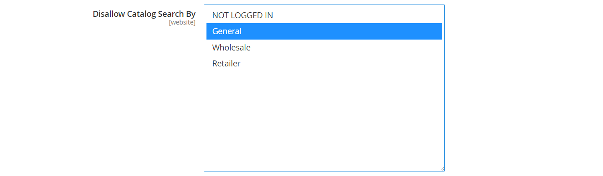

# Kategorienberechtigungen

{{ee-feature}}

Der Zugriff auf Kategorien kann auf bestimmte Kundengruppen beschränkt oder vollständig eingeschränkt sein. Sie können die Anzeige der Produktpreise steuern, bestimmen, welche Kundengruppen Produkte zum Warenkorb hinzufügen können, und die Landingpage angeben.

>[!NOTE]
>
>Kategorieberechtigungen haben einen globalen Gültigkeitsbereich und schränkt bei Aktivierung den Zugriff auf jede Kategorie entsprechend ihren individuellen Berechtigungen ein. Standardmäßig sind Kategorieberechtigungen nicht aktiviert.

Wenn Sie beispielsweise nur an Großkunden verkaufen, können Sie jedem erlauben, den Katalog zu durchsuchen, aber die Preise anzeigen und Käufe nur für Käufer in der Kundengruppe _Großhandel_ zulassen. Im folgenden Beispiel haben nur angemeldete Benutzer Zugriff auf die Kategorie &quot;Sammlungen&quot;. Die Option &quot;Kollektionen&quot; erscheint nicht im Hauptmenü.

{width="600" zoomable="yes"}

Wenn diese Option aktiviert ist, wird auf der Seite Kategorie ein neuer Abschnitt mit dem Titel _[!UICONTROL Category Permissions]_angezeigt, über den Sie den erforderlichen Zugriff auf jede Kategorie anwenden können. Sie können jeder Kategorie mehrere Zugriffsregeln für verschiedene Websites und Kundengruppen hinzufügen.

## Schritt 1: Konfigurieren von Kategorieberechtigungen

>[!IMPORTANT]
>
>Alle vorhandenen [Gruppenberechtigungseinstellungen](../configuration-reference/catalog/catalog.md#category-permissions) werden von den Kategorien **_Alle_** im Katalog ignoriert, wenn die Funktion **_[!UICONTROL Shared Catalog]_** aktiviert ist. [!UICONTROL Shared Catalog] steuert alle Kategorieberechtigungen im Katalog vollständig, wenn sie aktiviert sind.

1. Wechseln Sie in der Seitenleiste _Admin_ zu **[!UICONTROL Stores]** > _[!UICONTROL Settings]_>**[!UICONTROL Configuration]**.

1. Erweitern Sie im linken Bedienfeld den Wert **[!UICONTROL Catalog]** und wählen Sie unter &quot;**[!UICONTROL Catalog]**&quot;.

1. Erweitern Sie  im Abschnitt **[!UICONTROL Category Permissions]** .

   {width="600" zoomable="yes"}

   Eine detaillierte Liste dieser Optionen finden Sie unter [Kategorieberechtigungen](../configuration-reference/catalog/catalog.md#category-permissions) in der _Konfigurationsreferenz_.

1. Setzen Sie **[!UICONTROL Enable]** auf `Yes`.

1. Füllen Sie die anderen Optionen entsprechend dem aus, was Sie für Ihren Store zulassen oder beschränken möchten (siehe die folgenden Abschnitte).

1. Klicken Sie nach Abschluss des Vorgangs auf **[!UICONTROL Save Config]**.

1. Wenn Sie aufgefordert werden, den Cache zu aktualisieren, klicken Sie in der Systemmeldung auf den Link **[!UICONTROL Cache Management]** und befolgen Sie die Anweisungen zum Aktualisieren des Caches.

### [!UICONTROL Allow Browsing Category]

Diese Option gilt für alle Kategorien auf der [Website](../getting-started/websites-stores-views.md).

Gehen Sie wie folgt vor, um Mitgliedern einer **_bestimmten Kundengruppe_** zu ermöglichen, Kategorieprodukte zu durchsuchen:

1. Setzen Sie **[!UICONTROL Allow Browsing Category]** auf `Specified Customer Groups`.

1. Wählen Sie im Feld **[!UICONTROL Customer Groups]** jede Gruppe aus, die durch Produkte in der Kategorie navigieren darf.

   Um mehrere Gruppen auszuwählen, halten Sie die Strg-Taste (PC) oder die Befehlstaste (Mac) gedrückt, während Sie auf jede Gruppe klicken.

   {width="600" zoomable="yes"}

Um **_den Zugriff und die Weiterleitung auf eine Landingpage zu beschränken, gehen Sie wie folgt vor:_**

1. Setzen Sie **[!UICONTROL Allow Browsing Category]** auf `No, Redirect to Landing Page`.

1. Wählen Sie den **[!UICONTROL Landing Page]** aus, in den Besucher umgeleitet werden.

   {width="600" zoomable="yes"}

   >[!NOTE]
   >
   >Obwohl die Einstellung _[!UICONTROL Allow Browsing Category]_für alle Kategorien auf der Website gilt, können Sie für jede Store-Ansicht eine andere Landingpage konfigurieren.

### [!UICONTROL Display Product Prices]

Diese Option gilt für alle Kategorien auf der [Website](../getting-started/websites-stores-views.md).

Gehen Sie wie folgt vor, um nur Mitgliedern von **_bestimmten Kundengruppen_** die Anzeige des Produktpreises in der Kategorie zu ermöglichen:

1. Setzen Sie **[!UICONTROL Display Product Prices]** auf `Yes, for Specified Customer Groups`.

1. Wählen Sie im Feld **[!UICONTROL Customer Groups]** jede Gruppe aus, die den Preis der Produkte in der Kategorie anzeigen darf.

   Um mehrere Gruppen auszuwählen, halten Sie die Strg-Taste (PC) oder die Befehlstaste (Mac) gedrückt, während Sie auf jede Gruppe klicken.)

   {width="600" zoomable="yes"}

### [!UICONTROL Allow Adding to Cart]

Diese Option gilt für alle Kategorien auf der [Website](../getting-started/websites-stores-views.md).

Gehen Sie wie folgt vor, um es nur Mitgliedern von **_bestimmten Kundengruppen_** zu ermöglichen, Kategorieprodukte in den Warenkorb zu legen:

1. Setzen Sie **[!UICONTROL Allow Adding to Cart]** auf `Yes, for Specified Customer Groups`.

1. Wählen Sie im Feld **[!UICONTROL Customer Groups]** jede Gruppe aus, die Produkte aus der Kategorie zum Warenkorb hinzufügen darf.

   Um mehrere Gruppen auszuwählen, halten Sie die Strg-Taste (PC) oder die Befehlstaste (Mac) gedrückt, während Sie auf jede Gruppe klicken.

   {width="600" zoomable="yes"}

### [!UICONTROL Disallow Catalog Search]

Legen Sie diese Option fest, um zu verhindern, dass Mitglieder einer bestimmten Kundengruppe die Katalogsuche verwenden. Sie gilt für alle Kategorien auf der [Website](../getting-started/websites-stores-views.md).

- Damit **_nur angemeldete Kunden_** die Katalogsuche verwenden können, wählen Sie `NOT LOGGED IN` aus.

- Damit **_nur bestimmte Kundengruppen_** die Katalogsuche verwenden können, wählen Sie jede Gruppe aus, die von der Verwendung der Kategoriesuche ausgeschlossen werden soll.

  Um mehrere Gruppen auszuwählen, halten Sie die Strg-Taste (PC) oder die Befehlstaste (Mac) gedrückt, während Sie auf jede Gruppe klicken.

  {width="600" zoomable="yes"}

## Schritt 2: Anwenden von Kategorieberechtigungen

1. Wechseln Sie in der Seitenleiste _Admin_ zu **[!UICONTROL Catalog]** > **[!UICONTROL Categories]**.

1. Wählen Sie im Kategoriebaum die Zielkategorie aus.

1. Erweitern Sie  **[!UICONTROL Category Permissions]** auf der Seite und führen Sie folgende Schritte aus:

   - Um eine Berechtigungsregel zu erstellen, klicken Sie auf **[!UICONTROL New Permission]**.

     {width="600" zoomable="yes"}

   - Wählen Sie die entsprechenden **[!UICONTROL Website]** und **[!UICONTROL Customer Group]** aus.

   - Legen Sie die individuellen Berechtigungen nach Bedarf fest.

   >[!NOTE]
   >
   >Wenn die Berechtigung `Browsing Category` = `Deny` für eine übergeordnete Kategorie festgelegt ist, wird sie nicht auf der Seite der untergeordneten Kategorie im [Breadcrumb-Pfad](navigation-breadcrumb-trail.md) angezeigt.

1. Klicken Sie nach Abschluss des Vorgangs auf **[!UICONTROL Save]**.

>[!NOTE]
>
>Wenn irgendwelche **_Allow_** -Berechtigungen für den `Root Category` festgelegt sind, werden diese Berechtigungen automatisch auf alle Unterkategorien und alle Produkte innerhalb des `Catalog` angewendet. Wenn ein Produkt mehreren Kategorien zugewiesen ist und über **_Allow_** -Berechtigungen für mindestens eine Kategorie verfügt, verfügt es automatisch über dieselben **_Allow_** -Berechtigungen für alle zugewiesenen Kategorien.
