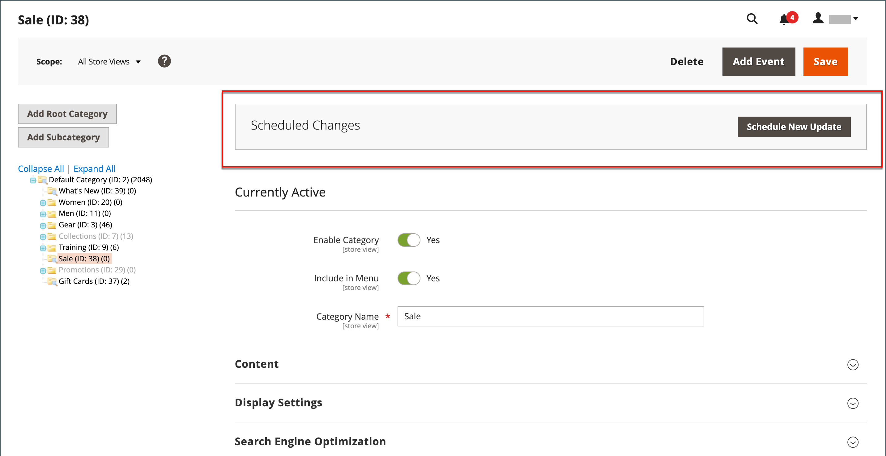

# Geplante Änderungen für Kategorien

{{ee-feature}}

Kategorieaktualisierungen können planmäßig angewendet und mit anderen Inhaltsänderungen gruppiert werden. Sie können eine Kampagne auf der Grundlage geplanter Änderungen an der Kategorie erstellen oder die Änderungen auf eine vorhandene Kampagne anwenden. Weitere Informationen finden Sie unter [Inhaltsbereitstellung](../content-design/content-staging.md).

Beachten Sie beim Planen von Änderungen für Kategorien Folgendes:

- Alle geplanten Aktualisierungen werden nacheinander angewendet, d. h., jede Entität kann nur jeweils eine geplante Aktualisierung haben. Jede geplante Aktualisierung wird auf alle Store-Ansichten innerhalb ihres Zeitrahmens angewendet. Daher kann eine Entität nicht mehrere geplante Aktualisierungen für verschiedene Store-Ansichten gleichzeitig haben. Alle Entitätsattributwerte in allen Store-Ansichten, die nicht von der aktuellen geplanten Aktualisierung betroffen sind, werden aus den Standardwerten übernommen, nicht aus der vorherigen geplanten Aktualisierung.

- Wenn eine Kampagne mit mehr als einer Kategorie verknüpft ist, kann die Kampagne nur über das [Staging-Dashboard für Inhalte](../content-design/content-staging-dashboard.md) bearbeitet werden.

- Wenn eine Kampagne mit mehr als einer Kategorie verknüpft ist, kann die Kampagne nur über das [Staging-Dashboard für Inhalte](../content-design/content-staging-dashboard.md) bearbeitet werden.

>[!NOTE]
>
>Die Registerkarte [!UICONTROL Schedule Design Update] wurde in  Adobe Commerce entfernt und kann in der Kategorie nicht direkt geändert werden. Für diese Aktivierungen muss ein geplantes Update erstellt werden.

## Planen einer Aktualisierung für eine Kategorie

1. Navigieren Sie in der _Admin_-Seitenleiste zu **[!UICONTROL Catalog]** > **[!UICONTROL Categories]**.

1. Wählen Sie in der Kategoriestruktur links die zu ändernde Kategorie aus.

1. Klicken Sie _Feld „Geplante_&quot; oben auf der Seite auf **[!UICONTROL Schedule New Update]**.

   {width="600" zoomable="yes"}

1. Legen Sie bei ausgewählter Option **[!UICONTROL Save as a New Update]** die grundlegenden Parameter für die Aktualisierung fest:

   - Geben Sie **[!UICONTROL Update Name]** einen Namen für die neue Inhalts-Staging-Kampagne ein.

   - Geben Sie eine kurze **[!UICONTROL Description]** der Aktualisierung und ihrer Verwendung ein.

   - Verwenden Sie das Tool Kalender  ), um die **[!UICONTROL Start Date]** und **[!UICONTROL End Date]** für die Kampagne auszuwählen.

   >[!IMPORTANT]
   >
   >**[!UICONTROL Start Date]** und **[!UICONTROL End Date]** für Campaign müssen mithilfe der Admin **_Zeitzone (Standard_** definiert werden, die aus der lokalen Zeitzone jeder Website konvertiert wird. Wenn Sie beispielsweise mehrere Websites in verschiedenen Zeitzonen haben, in denen Sie eine Kampagne basierend auf einer US-Zeitzone starten möchten, müssen Sie für jede lokale Zeitzone ein separates Update planen. Sie legen die **[!UICONTROL Start Date]** und **[!UICONTROL End Date]** für jeden Wert fest, der von der lokalen Website-Zeitzone in die standardmäßige Admin-Zeitzone konvertiert wird.

   {width="600" zoomable="yes"}

1. Nehmen Sie die erforderlichen Änderungen an der geplanten Aktualisierung vor.

1. Um eine Vorschau der Änderungen anzuzeigen, klicken Sie in der Symbolleiste rechts oben auf **[!UICONTROL Preview]** .

1. Klicken Sie abschließend auf **[!UICONTROL Save]**.

## Einem bestehenden Update zuweisen

1. Navigieren Sie in der _Admin_-Seitenleiste zu **[!UICONTROL Catalog]** > **[!UICONTROL Categories]**.

1. Wählen Sie in der Kategoriestruktur links die zu ändernde Kategorie aus.

1. Klicken Sie _Feld „Geplante_&quot; oben auf der Seite auf **[!UICONTROL Schedule New Update]**.

1. Wählen Sie **[!UICONTROL Assign to Existing Campaign]** aus.

1. Suchen Sie in der Liste die gewünschte Kampagne und klicken Sie auf **[!UICONTROL Select]**.

1. Nehmen Sie die erforderlichen Änderungen an der geplanten Aktualisierung vor.

1. Klicken Sie abschließend auf **[!UICONTROL Save]**.
