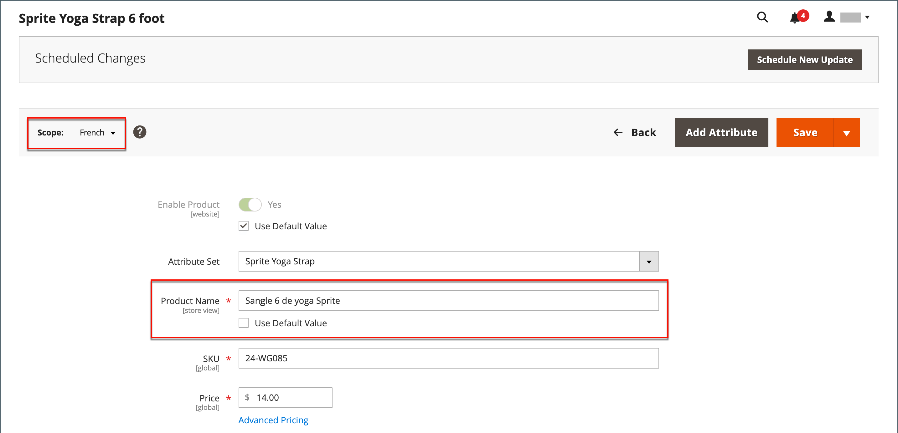
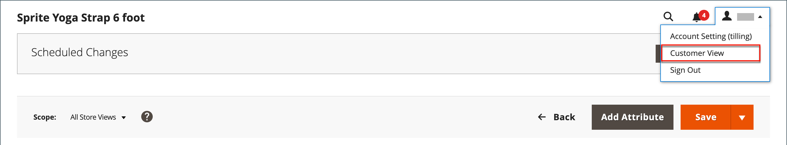

# Einführung in die Katalogverwaltung

Adobe Commerce und Magento Open Source verwenden den Begriff _Katalog_ auf die Produktdatenbank als Ganzes verweisen.

Einer der wichtigsten Bereiche beim Erstellen und Verwalten Ihres Geschäfts ist die Erstellung von Produkten und Kategorien. Der Administrator bietet verschiedene Tools, die Sie für die Ersteinrichtung Ihres Stores sowie für die Wartung Ihres Stores und die Optimierung Ihres Unternehmens verwenden.

>[!TIP]
>
>Inventory management für Adobe Commerce und Magento Open Source bietet Ihnen die Tools zur Verwaltung Ihres Produktbestands. Händler mit einem einzigen Geschäft zu mehreren Lagern, Geschäften, Abholstandorten, Ablagelagern und mehr können diese Funktionen nutzen, um die Mengen für den Verkauf zu halten und Sendungen für komplette Bestellungen abzuwickeln. Weitere Informationen zu diesen Funktionen und dazu, wie Sie sie zur Verwaltung von Lagern an mehreren Standorten verwenden können, finden Sie in der [Inventory management-Benutzerhandbuch](../inventory-management/introduction.md).

## Katalogbereich

Der Zugriff auf Katalogdaten wird durch verschiedene Faktoren bestimmt, darunter die [Umfang](../getting-started/websites-stores-views.md#scope-settings) -Einstellung, der Katalogkonfiguration und der [Stammkategorie](category-root.md) , das dem Store zugewiesen ist. Der Katalog enthält Produkte, die aktiviert und zum Verkauf angeboten werden, sowie Produkte, die derzeit nicht zum Verkauf angeboten werden.

Im Vertrieb wird der Begriff _Katalog_ bezieht sich normalerweise auf eine kuratierte Auswahl von Produkten, die zum Verkauf angeboten werden. Ein Store könnte beispielsweise über einen &quot;Frühjahrskatalog&quot;und einen &quot;Herbstkatalog&quot;verfügen.

Wie das Inhaltsverzeichnis eines gedruckten Katalogs, das Hauptmenü Ihres Ladens — oder _oberste Navigation_ - organisiert Produkte nach Kategorie, um es den Kunden zu erleichtern, das zu finden, was sie wollen. Das Hauptmenü basiert auf einer _Stammkategorie_: ein Container für das Menü, das dem Store zugewiesen ist. Da die spezifischen Menüoptionen auf der Ebene der Store-Ansicht definiert sind, kann jede Ansicht ein anderes Hauptmenü basierend auf derselben Stammkategorie haben. In jedem Menü können Sie eine kuratierte Auswahl an Produkten anbieten, die für den Laden geeignet sind.

{width="550"}

## Produktbereich

Bei Installationen mit mehreren Websites, Stores und Ansichten muss die Variable [Umfang](../getting-started/websites-stores-views.md#scope-settings) -Einstellung bestimmt, wo Produkte zum Verkauf angeboten werden, und welche Produktinformationen für jede Store-Ansicht verfügbar sind. Zunächst werden alle von Ihnen erstellten Produkte in der standardmäßigen Website-, Store- und Store-Ansicht veröffentlicht.

{width="550"}

Wenn Sie nur einen einzigen Store mit der Standardansicht haben, können Sie Ihren Store in [Einzelspeichermodus](../getting-started/websites-stores-views.md#single-store-mode) um die Perimeter-Einstellungen auszublenden. Wenn Ihr Store jedoch mehrere Ansichten hat, wird unter dem Namen jedes Felds eine Scope-Anzeige angezeigt.

- Um Produktinformationen für eine bestimmte Ansicht zu bearbeiten, verwenden Sie die _Store-Ansicht_ in der linken oberen Ecke ein Steuerelement zum Auswählen der Ansicht. Zusätzliche Steuerelemente stehen für alle Felder zur Verfügung, die auf der Ebene der Store-Ansicht bearbeitet werden können.

- Informationen zum Definieren des Umfangs eines Produkts in einer Multisite-Installation finden Sie unter [Produkt in Websites](settings-basic-websites.md) Abschnitt der Produktinformationen.

Der Prozess der Bearbeitung eines Produkts für eine Store-Ansicht ähnelt dem Hinzufügen einer Schicht von Produktinformationen, die für die Ansicht spezifisch sind.

Sie können nur Produkte für die Site bearbeiten oder zuweisen, für die Sie Berechtigungen haben, nicht für alle Sites, auf denen das Produkt zugewiesen ist.

Obwohl die Variable _spanisch_ Die Store-Ansicht ist im folgenden Beispiel ausgewählt. Die Produktinformationen werden weiterhin in der Originalsprache der standardmäßigen Store-Ansicht angezeigt. Um die Produktinformationen zu übersetzen, müssen Sie zum _spanisch_ die Textfelder speichern und übersetzen - wie Produktname, Beschreibung und Metadaten. Weitere Informationen finden Sie unter [Lokalisieren von Produkten](../stores-purchase/store-localize.md#localize-products).

## Produkt für eine andere Ansicht bearbeiten

>[!NOTE]
>
>Die _Alle Store-Ansichten_ Der Bereich ist für Admin-Benutzer deaktiviert, die auf einen bestimmten Bereich beschränkt sind, wenn das Produkt auch außerhalb des zulässigen Bereichs veröffentlicht wird. Der erste für die Bearbeitung verfügbare Bereich ist standardmäßig ausgewählt, da eingeschränkte Benutzer keine _global_ Aktionen oder Aktionen, die Bereiche betreffen, auf die sie keinen Zugriff haben.

1. Legen Sie in der oberen linken Ecke **[!UICONTROL Store View]** in die jeweilige Ansicht, die bearbeitet werden soll.

1. Um die Änderung des Umfangs zu bestätigen, klicken Sie auf **[!UICONTROL OK]**.

1. Aktualisieren Sie das Feld mit dem neuen Wert für die Store-Ansicht.

   Unter jedem Feld, das für die Store-Ansicht bearbeitet werden kann, wird ein Kontrollkästchen angezeigt. Um den Standardwert zu überschreiben, deaktivieren Sie die Option **Use Default Value** aktivieren.

   {width="600" zoomable="yes"}

1. Wenn Sie fertig sind, klicken Sie auf **[!UICONTROL Save]**.

1. Legen Sie in der oberen linken Ecke die **[!UICONTROL Store View]** zurück zum Standard.

1. Gehen Sie wie folgt vor, um die Änderung in Ihrem Store zu überprüfen:

   - Klicken Sie oben rechts auf die _Admin_ Menüpfeil und Auswahl **[!UICONTROL Customer View]**.

     {width="600" zoomable="yes"}

   - Legen Sie in der rechten oberen Ecke des Stores die **[!UICONTROL Language Chooser]** in die Store-Ansicht des Produkts, das Sie bearbeitet haben, und suchen Sie nach dem Produkt, das Sie für die Ansicht bearbeitet haben.

     {width="700" zoomable="yes"}
