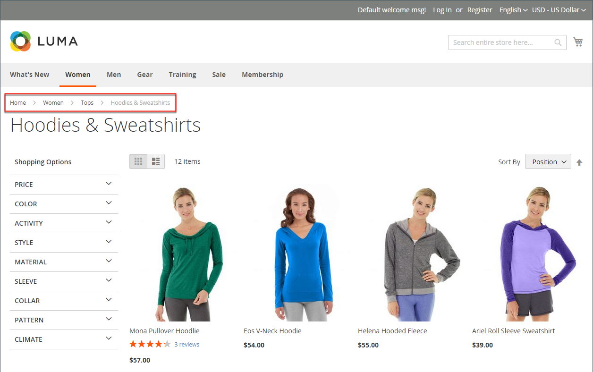

# Breadcrumb-Trails

Ein _Breadcrumb-Trail_ ist ein Satz von Links, die Kunden zeigen, wo sie sich im Verhältnis zu anderen Seiten im Store befinden. Sie können auf einen beliebigen Link im Breadcrumb-Pfad klicken, um zur vorherigen Seite zurückzukehren.

Die Breadcrumb-Spur kann so konfiguriert werden, dass sie auf Inhaltsseiten und auf Katalogseiten angezeigt wird. Format und Position des Breadcrumb-Pfads variieren je nach Thema, er befindet sich jedoch normalerweise direkt unter dem Header. Standardmäßig wird die Breadcrumb-Spur auf CMS-Seiten angezeigt.

{width="700" zoomable="yes"}

## Allgemeine Arten von Brotkrümeln

Breadcrumbs können in drei Haupttypen unterteilt werden, die sich in ihrem Zweck unterscheiden. Im Folgenden werden das Wesen und die Hauptprinzipien der Implementierung jeder Art von Brotkrumen beschrieben.

### Hierarchiebasierte Breadcrumbs

Dieser Breadcrumb-Typ basiert auf der Kategoriehierarchie, die auf der Site eingerichtet wurde. Die angezeigten Ketten geben dem Benutzer an, wo in der Struktur er sich befindet. In diesem Fall ist jeder Text-Link für eine Seite vorgesehen, die eine Ebene höher ist als die vorherige.

Beispiel: `Men > Tops > Hoodies & Sweatshirts`

Der Vorteil dieses Typs besteht darin, dass Benutzende leicht erkennen können, in welcher Kategorieebene sie sich befinden, und einen einfachen Zugriff auf die Navigation zwischen Katalogseiten haben.

### Verlaufsbasierte Breadcrumbs

Die Verlaufsbasierte Navigation ähnelt der Schaltfläche „Zurück“ in einem Browser. Diese Art der Navigation ermöglicht es Benutzenden, schnell zu den vorherigen Seiten zurückzukehren, die sie besucht haben, ohne Änderungen vorzunehmen.

Der Vorteil dieses Typs ist, dass er am hilfreichsten ist, wenn Kunden nach Auswahl mehrerer Filter auf einer Kategorieseite zu einer vorherigen Seite zurückkehren möchten.

Beispiel: `Home > What's New > Gear > Bags`

### Attributbasierte Breadcrumbs

Dieser Breadcrumb-Typ zeigt die auf der Kategorieseite ausgewählten Attribute an. Der Hauptunterschied zu den anderen Typen besteht darin, dass die attributbasierten Breadcrumbs die Filter und Optionen darstellen, die der Kunde in der Navigationsebene für bestimmte Produkte ausgewählt hat (z. B. Preis, Qualität und Farbe).

Beispiel: `Home > Suits > All Suits > Refined by > Slim Fit`

## Hinzufügen/Entfernen der Breadcrumbs aus CMS-Seiten

1. Navigieren Sie in _Admin_-Seitenleiste zu **[!UICONTROL Stores]** > _[!UICONTROL Settings]_>**[!UICONTROL Configuration]**.

1. Wählen Sie im linken Bedienfeld unter _[!UICONTROL General]_&#x200B;die Option **[!UICONTROL Web]**&#x200B;aus.

   {width="600" zoomable="yes"}

1. Erweitern Sie den Abschnitt _[!UICONTROL Default Pages]_.

1. Deaktivieren Sie das Kontrollkästchen **[!UICONTROL Use system value]** .

1. **[!UICONTROL Show Breadcrumbs for CMS Pages]** auf `No` oder `Yes` festlegen.

1. Klicken Sie abschließend auf **[!UICONTROL Save Config]**.

>[!NOTE]
>
>Die übergeordnete Kategorie wird nicht im Breadcrumb-Protokoll auf der Seite der untergeordneten Kategorie angezeigt, wenn sie über die Einstellungen `Browsing Category`= `Deny` [Kategorieberechtigung](category-permissions.md) verfügt.
