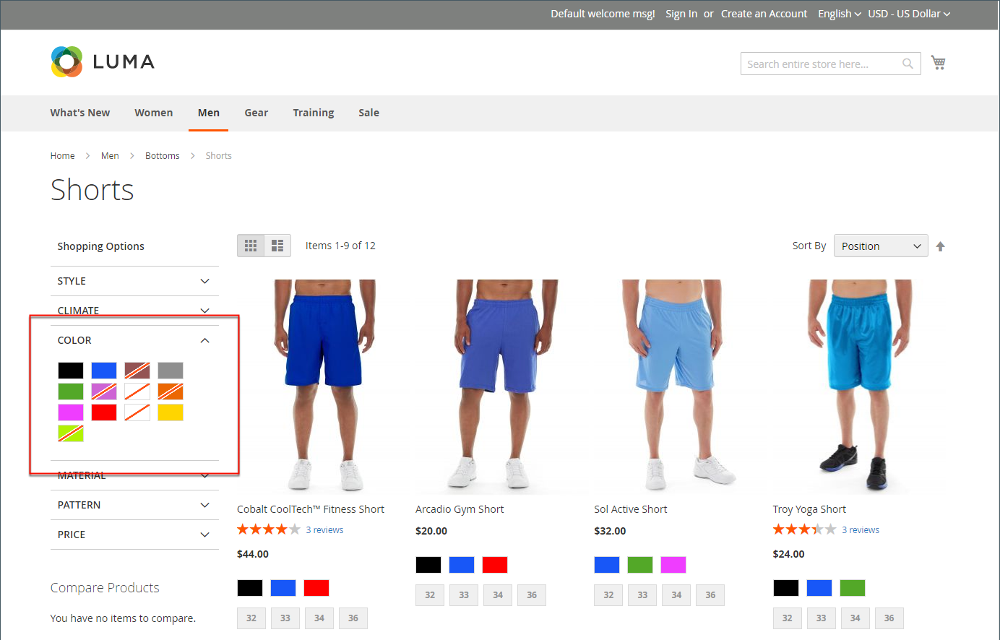
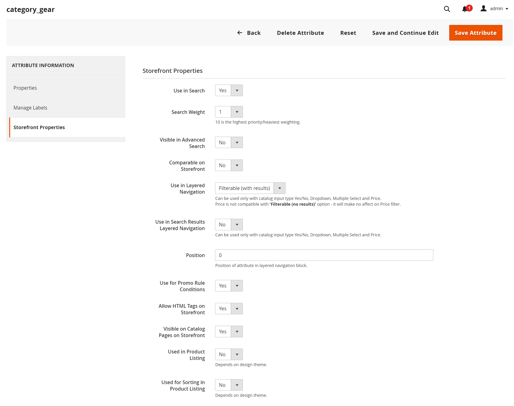

# Mehrschichtige Navigation

>[!NOTE]
>
>Die in diesem Abschnitt beschriebene standardmäßige mehrschichtige Navigation unterscheidet sich von der mit Live Search gefilterten Navigation mit [Facetten](https://experienceleague.adobe.com/docs/commerce/live-search/live-search-admin/facets/facets.html).

Die mehrschichtige Navigation erleichtert die Suche nach Produkten basierend auf der Kategorie, der Preisspanne oder einem anderen verfügbaren Attribut. Die mehrschichtige Navigation wird normalerweise in der linken Spalte der Suchergebnisse und Kategorieseiten und manchmal auf der Startseite angezeigt. Die Standardnavigation enthält eine Liste _Shop By_ mit Kategorien und Preiskategorien. Sie können die Anzeige der mehrschichtigen Navigation konfigurieren, einschließlich Produktanzahl und Preisbereich.

{width="700" zoomable="yes"}

## Filterbare Attribute

>[!NOTE]
>
>Die in diesem Thema beschriebenen Anforderungen an filterbare Attribute unterscheiden sich für [Live-Suche](https://experienceleague.adobe.com/docs/commerce/live-search/overview.html). Weitere Informationen finden Sie unter [Facetten](https://experienceleague.adobe.com/docs/commerce/live-search/live-search-admin/facets/facets.html).

Die mehrschichtige Navigation kann verwendet werden, um nach Produkten nach Kategorie oder Attribut zu suchen. Wenn ein Käufer beispielsweise die Kategorie Herren/Shorts in der oberen Navigation auswählt, umfassen die ersten Ergebnisse alle Produkte in der Kategorie. Die Liste kann weiter gefiltert werden, indem ein bestimmter Stil, ein bestimmtes Klima, eine bestimmte Farbe, ein bestimmtes Material, ein bestimmtes Muster oder ein bestimmter Preis - oder eine Kombination von Werten - ausgewählt wird. Filterbare Attribute werden in einem sich erweiternden Abschnitt angezeigt, in dem jeder Attributwert aufgelistet wird. Optional kann die Liste der Produkte mit übereinstimmenden Ergebnissen so konfiguriert werden, dass Produkte mit oder ohne Übereinstimmung einbezogen werden.

Die Attributeigenschaften bestimmen in Kombination mit dem Produkteingabetyp, welche Attribute für die mehrschichtige Navigation verwendet werden können. Die mehrschichtige Navigation ist nur für [_Anker_](categories-display-settings.md)-Kategorien verfügbar, kann aber auch zu Suchergebnisseiten hinzugefügt werden. Die **Catalog Input Type for Store Owner**-Eigenschaft jedes Attributs muss auf `Yes/No`, `Dropdown`, `Multiple Select` oder `Price` festgelegt werden. Damit die Attribute gefiltert werden können **muss die Eigenschaft &quot;** in der mehrschichtigen Navigation“ von jedem auf `Filterable (with results)` oder `Filterable (no results)` gesetzt werden.

_Beispiel: Filterbare Attribute mit Ergebnissen_

{width="700" zoomable="yes"}

_Beispiel: Filterbare Farbfeldwerte werden ohne Ergebnis angezeigt_

{width="700" zoomable="yes"}

Die folgenden Anweisungen zeigen, wie Sie eine einfache mehrschichtige Navigation mit filterbaren Attributen einrichten. Eine erweiterte mehrschichtige Navigation mit Preisschritten finden Sie unter [Preisnavigation](navigation-layered.md#configure-price-navigation).

## Schritt 1: Richten Sie die Attributeigenschaften ein

1. Navigieren Sie in _Admin_-Seitenleiste zu **[!UICONTROL Stores]** > _[!UICONTROL Attributes]_>**[!UICONTROL Product]**.

1. Durchsuchen Sie die Liste oder verwenden Sie die gefilterte Suche, um ein Attribut in ihr zu finden und im Bearbeitungsmodus zu öffnen.

   {width="700" zoomable="yes"}

1. Wählen Sie im linken Bedienfeld **[!UICONTROL Storefront Properties]** und legen Sie **[!UICONTROL Use In Layered Navigation]** auf eine der folgenden Einstellungen fest:

   - `Filterable (with results)` - Die mehrschichtige Navigation umfasst nur die Filter, für die passende Produkte gefunden werden können. Jeder Attributwert, der bereits für alle in der Liste aufgeführten Produkte gilt, sollte weiterhin als verfügbarer Filter angezeigt werden. Attributwerte mit einer Anzahl von null (0) Produktübereinstimmungen werden aus der Liste der verfügbaren Filter weggelassen. Die gefilterte Liste enthält nur die Produkte, die dem Filter entsprechen. Die Produktliste wird nur aktualisiert, wenn die ausgewählten Filter das Gezeigte ändern.

   - `Filterable (no results)` - Die mehrschichtige Navigation umfasst Filter für alle verfügbaren Attributwerte und ihre Produktanzahl, einschließlich Produkten mit null (0) Produktübereinstimmungen. Wenn der Attributwert ein Farbfeld ist, wird der Wert als Filter angezeigt, aber durchgestrichen. Die Filterung auf Preisebene wird von dieser Option nicht unterstützt und hat keine Auswirkungen auf Preisfilter.

1. Legen Sie **[!UICONTROL Use In Search Results Layered Navigation]** auf `Yes` fest.

   {width="600" zoomable="yes"}

1. Wiederholen Sie diese Schritte für jedes Attribut, das Sie in die mehrschichtige Navigation aufnehmen möchten.

>[!NOTE]
>
>Wenn die _[!UICONTROL Use in Search]_&#x200B;auf `No` festgelegt ist, wird die&#x200B;_[!UICONTROL Use in Search Results Layered Navigation]_ nicht angezeigt und das Produktattribut wird bei der Suche mit keinem [!UICONTROL Use in Layered Navigation] Einstellwert verwendet.

>[!NOTE]
>
>Das [!UICONTROL Position] ist standardmäßig abgeblendet, sodass Sie das Attribut speichern müssen, bevor Sie diese Einstellung ändern können.

## Schritt 2: Kategorie als Anker festlegen

1. Navigieren Sie in der _Admin_-Seitenleiste zu **[!UICONTROL Catalog]** > **[!UICONTROL Categories]**.

1. Wählen Sie in der Kategoriestruktur die Kategorie aus, für die Sie die mehrschichtige Navigation verwenden möchten.

1. Erweitern Sie  den Abschnitt **[!UICONTROL Display Settings]** und legen Sie **[!UICONTROL Anchor]** auf `Yes` fest.

   {width="600" zoomable="yes"}

1. Klicken Sie auf **[!UICONTROL Save]**.

## Schritt 3: Testen der Ergebnisse

Um die Einstellung zu testen, besuchen Sie Ihren Store und navigieren Sie im Hauptmenü zur Kategorie . Die Auswahl filterbarer Attribute wird im mehrschichtigen Navigationsbereich der Kategorieseite angezeigt.

Durchsuchen, Filtern und Überprüfen der angezeigten Produkte.

## Entfernen von filterbaren Attributwerten aus der mehrschichtigen Navigation

Die mehrschichtige Navigation enthält Filter für alle verfügbaren Attributwerte und ihre Produktanzahl, einschließlich Produkten mit null (0) Produktübereinstimmungen (wie in der folgenden Abbildung dargestellt).

{width="700" zoomable="yes"}

Dies kann es Kunden erschweren, ein bevorzugtes Produkt auszuwählen, und es besteht keine Notwendigkeit, Attributwerte &#x200B;mit 0 &#x200B; im Frontend anzuzeigen.

Sie können die folgenden Schritte verwenden, um filterbare Attributwerte mit 0 Produkten aus der mehrschichtigen Navigation zu entfernen:

1. Navigieren Sie in _Admin_-Seitenleiste zu **[!UICONTROL Stores]** > _[!UICONTROL Attributes]_>**[!UICONTROL Product]**.

1. Durchsuchen Sie die Liste oder verwenden Sie die gefilterte Suche, um ein Attribut in ihr zu finden und im Bearbeitungsmodus zu öffnen.

1. Klicken Sie unter _[!UICONTROL Attribute Information]_&#x200B;auf **[!UICONTROL Storefront Properties]**.

1. Wählen Sie **[!UICONTROL Layered Navigation]** &quot;`Filterable (with results)`&quot;.

   {width="600" zoomable="yes"}

1. Klicken Sie auf **[!UICONTROL Save Attribute]**.

## Preisnavigation

>[!NOTE]
>
>Die in diesem Thema beschriebene Preisnavigationskonfiguration unterscheidet sich für [Live-Suche](https://experienceleague.adobe.com/docs/commerce/live-search/overview.html).

Die Preisnavigation kann verwendet werden, um Produkte in einer mehrschichtigen Navigation nach Preisbereich zu verteilen. Sie können jeden Bereich auch in Intervallen teilen. Es gibt einige Möglichkeiten, die Preisnavigation zu berechnen:

- Automatisch (Preisbereiche ausgleichen)
- Automatisch (Produktzahlen ausgleichen)
- Manuell

Bei den ersten beiden Methoden werden die Navigationsschritte automatisch berechnet. Mit der manuellen Methode können Sie eine Unterteilungsgrenze für Preisintervalle festlegen. Das folgende Beispiel zeigt den Unterschied zwischen den Preisnavigationsschritten 10 und 100.

Die iterative Aufteilung bietet die beste Verteilung der Produkte auf die Preisklassen. Mit der iterativen Aufteilung kann der Kunde nach der Auswahl des Bereichs von 0,00 bis 99 USD mehrere Unterbereiche der Preise durchgehen. Die Aufteilung der Preisspanne stoppt, wenn die Anzahl der Produkte den Schwellenwert erreicht, der durch die Intervalldivisionsgrenze festgelegt wurde.

## Beispiel: Preisnavigationsschritte

| Preisschritt um 10 | Preisschritt um 100 |
|----------|--------|
| 20,00 - 29,99 $ (1) | 0,00 - 99,99 $ (4) |
| 30,00 - 39,99 $ (2) | 100 - 199,99 $ (5) |
| 70,00 - 79,99 $ (1) | 400,00 - 499,99 $ (2) |
| 100,00 - 109,99 $ (1) | 700,00 $ und mehr (1) |
| 120,00 - 129,99 $ (2) |   |
| 150,00 - 159,99 $ (1) |   |
| 180,00 - 189,99 $ (1) |   |
| 420,00 - 429,99 $ (1) |   |
| 440,00 - 449,99 $ (1) |   |
| 710,00 $ und mehr (1) |   |

{style="table-layout:auto"}

## Konfigurieren der Preisnavigation

>[!IMPORTANT]
>
>Um die Produkte und ihre Preise in Übereinstimmung mit _Preisfiltern_ in der mehrschichtigen Navigation korrekt anzuzeigen, stellen Sie sicher, dass die Einstellungen für die Preisanzeige in der [Mehrwertsteuerkonfiguration](../configuration-reference/sales/tax.md) den gleichen Wert aufweisen (`Excluding Tax`**oder** `Including Tax`). Überprüfen Sie für die _[!UICONTROL Calculation Settings]_&#x200B;den **[!UICONTROL Catalog Prices]**. Überprüfen Sie&#x200B;_[!UICONTROL Price Display Settings]_ den **[!UICONTROL Display Product Prices in Catalog]**. Wenn diese unterschiedliche Werte haben, können Preisfilter in der mehrschichtigen Navigation Produkte möglicherweise nicht ordnungsgemäß nach Preis filtern und sortieren.

1. Navigieren Sie in _Admin_-Seitenleiste zu **[!UICONTROL Stores]** > _[!UICONTROL Settings]_>**[!UICONTROL Configuration]**.

1. Erweitern Sie im linken Bereich **[!UICONTROL Catalog]** und wählen Sie darunter **[!UICONTROL Catalog]**.

1. Erweitern Sie  den Abschnitt _Ebenennavigation_.

   Standardmäßig ist **[!UICONTROL Display Product Count]** auf `Yes` festgelegt. Deaktivieren Sie bei Bedarf das Kontrollkästchen **[!UICONTROL Use system value]** , um diese Einstellung zu ändern.

   {width="600" zoomable="yes"}

   Eine detaillierte Liste dieser Konfigurationsoptionen finden Sie unter &quot;[ Navigation](../configuration-reference/catalog/catalog.md#layered-navigation) in der _Konfigurationsreferenz_.

1. Legen Sie **[!UICONTROL Price Navigation Steps Calculation]** für eine der Methoden in den folgenden Abschnitten fest.

1. Klicken Sie abschließend auf **[!UICONTROL Save Config]**.

### Methode 1: Automatisch (Preisspannen angleichen)

Belassen Sie **[!UICONTROL Price Navigation Steps Calculation]** auf `Automatic (Equalize Price Ranges)` (Standard). Diese Einstellung verwendet den Standardalgorithmus für die Preisnavigation.

### Methode 2: Automatisch (Produktzahlen ausgleichen)

>[!TIP]
>
>Deaktivieren Sie bei Bedarf zunächst das Kontrollkästchen **[!UICONTROL Use system value]** , um diese Einstellungen zu ändern.

1. Legen Sie **[!UICONTROL Price Navigation Steps Calculation]** auf `Automatic (equalize product counts)` fest.

1. Um einen einzelnen Preis anzuzeigen, wenn mehrere Produkte denselben Preis aufweisen, setzen Sie **[!UICONTROL Display Price Interval as One Price]** auf `Yes`.

1. Geben Sie **[!UICONTROL Interval Division Limit]** den Schwellenwert für die Anzahl der Produkte innerhalb einer Preisspanne an.

   Der Bereich kann über diese Grenze hinaus nicht weiter aufgeteilt werden. Der Standardwert ist `9`.

   {width="600" zoomable="yes"}

### Methode 3: Manuell

>[!NOTE]
>
>Deaktivieren Sie bei Bedarf zunächst das Kontrollkästchen **[!UICONTROL Use system value]** , um diese Einstellungen zu ändern.

1. Legen Sie **[!UICONTROL Price Navigation Steps Calculation]** auf `Manual` fest.

1. Geben Sie einen Wert ein, der die **[!UICONTROL Default Price Navigation Step]** bestimmt.

1. Geben Sie den zulässigen **[!UICONTROL Maximum Number of Price Intervals]** ein, maximal `100`.

   {width="600" zoomable="yes"}

## Konfigurieren der mehrschichtigen Navigation

>[!NOTE]
>
>Die auf dieser Seite beschriebene Standardkonfiguration unterscheidet sich für [Live Search](https://experienceleague.adobe.com/docs/commerce/live-search/overview.html).

Die Konfiguration der mehrschichtigen Navigation bestimmt, ob eine Produktanzahl nach jedem Attribut in Klammern angezeigt wird, und bestimmt die Größe des Berechnungsschritts, der in der Preisnavigation verwendet wird.

1. Navigieren Sie in _Admin_-Seitenleiste zu **[!UICONTROL Stores]** > _[!UICONTROL Settings]_>**[!UICONTROL Configuration]**.

1. Erweitern Sie im linken Bereich den Abschnitt _[!UICONTROL Catalog]_&#x200B;und wählen Sie darunter **[!UICONTROL Catalog]**.

1. Erweitern Sie den Abschnitt _[!UICONTROL Layered Navigation]_.

   >[!NOTE]
   >
   >Deaktivieren Sie bei Bedarf zunächst das Kontrollkästchen **[!UICONTROL Use system value]** , um diese Einstellungen zu ändern.

1. Um die Anzahl der für jedes Attribut gefundenen Produkte anzuzeigen, setzen Sie **[!UICONTROL Display Product Count]** auf `Yes`.

1. Legen Sie **[!UICONTROL Price Navigation Step Calculation]** auf `Automatic (equalize price ranges)` fest.

1. Klicken Sie abschließend auf **[!UICONTROL Save Config]**.
