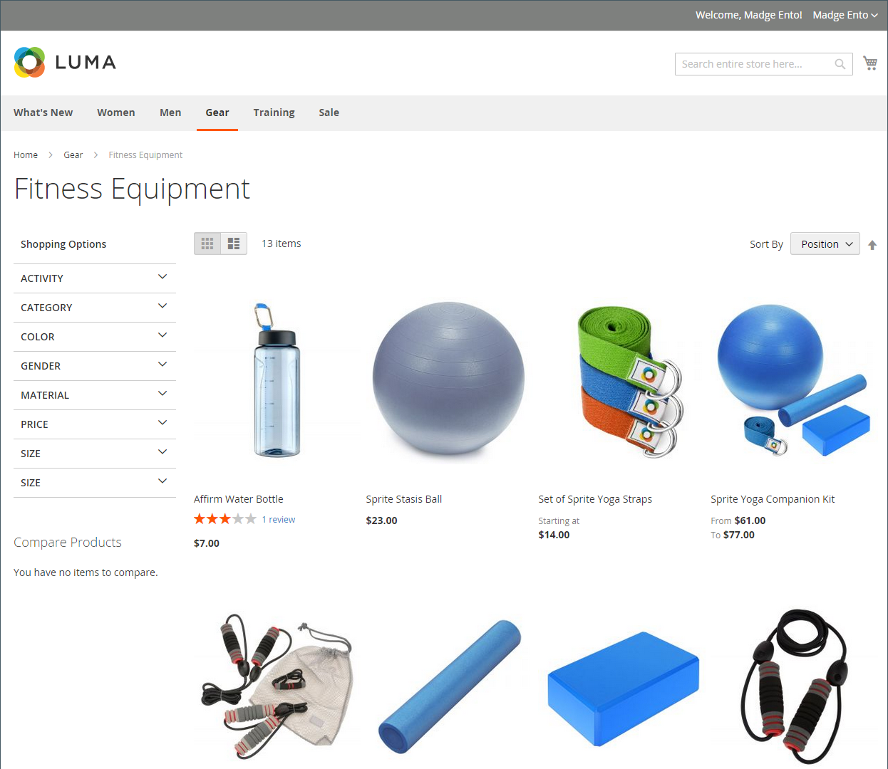
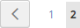

# Produktlisten

Produktlisten können standardmäßig als Liste oder Raster angezeigt werden. Sie können auch bestimmen, wie viele Produkte pro Seite angezeigt werden und welches Attribut zum Sortieren der Liste verwendet wird. Die Produktliste enthält eine Reihe von Steuerelementen, mit denen Sie die Produkte sortieren, das Listenformat ändern, nach Attribut sortieren und von einer Seite zur nächsten wechseln können.

>[!NOTE]
>
>Beim Sortieren einer Kategorie nach einem Produktattribut werden Produkte mit denselben Attributwerten auch nach ihren _[!UICONTROL Product ID]_in aufsteigender Reihenfolge.

{width="700" zoomable="yes"}

## Produktlisten konfigurieren

1. Im _Admin_ Seitenleiste, navigieren Sie zu **[!UICONTROL Stores]** > _[!UICONTROL Settings]_>**[!UICONTROL Configuration]**.

1. Erweitern Sie im linken Bereich **[!UICONTROL Catalog]** und wählen **[!UICONTROL Catalog]** darunter.

1. Erweitern  die **[!UICONTROL Storefront]** Abschnitt.

   {width="600" zoomable="yes"}

   Eine detaillierte Liste dieser Optionen finden Sie unter [Storefront](../configuration-reference/catalog/catalog.md#storefront) im _Konfigurationsreferenz_.

   >[!NOTE]
   >
   >So zeigen Sie Produkte und deren Preise korrekt an _Sortierung des Produkts nach Preis_ müssen Sie sicherstellen, dass die Preiseinstellungen in der Variablen [Konfiguration der Umsatzsteuer](../configuration-reference/sales/tax.md) weisen denselben Wert auf (`Excluding Tax` **oder** `Including Tax`). Für _[!UICONTROL Calculation Settings]_, überprüfen Sie die **[!UICONTROL Catalog Prices]**-Wert. Und für_[!UICONTROL Price Display Settings]_, überprüfen Sie die **[!UICONTROL Display Product Prices in Catalog]** -Wert. Wenn diese unterschiedliche Werte aufweisen, können Preisfilter in der mehrschichtigen Navigation Produkte möglicherweise nicht ordnungsgemäß nach Preisen filtern und sortieren.

1. Standardeinstellung festlegen **[!UICONTROL List Mode]** auf einen der folgenden Werte zu:

   - `Grid Only`
   - `List Only`
   - `Grid (default) / List`
   - `List (default / Grid`

1. Für **[!UICONTROL Products per Page on Grid Allowed Values]** Geben Sie die Anzahl der Produkte ein, die pro Seite angezeigt werden sollen, wenn sie im Rasterformat angezeigt werden.

   Um eine Werteauswahl vorzunehmen, trennen Sie jede Zahl durch ein Komma.

1. Für **[!UICONTROL Products per Page on Grid Default Value]**, geben Sie die Standardanzahl der Produkte ein, die pro Seite im Raster angezeigt werden sollen.

1. Für **[!UICONTROL Products per Page on List Allowed Values]** Geben Sie die Anzahl der Produkte ein, die pro Seite angezeigt werden sollen, wenn sie im Listenformat angezeigt werden.

   Um eine Werteauswahl vorzunehmen, trennen Sie jede Zahl durch ein Komma.

1. Für **[!UICONTROL Products per page on List Default Value]**, geben Sie die Standardanzahl der Produkte ein, die in der Liste pro Seite angezeigt werden.

1. Satz **[!UICONTROL Product Listing Sorted by]** dem Standardattribut, das ursprünglich zum Sortieren der Liste verwendet wurde.

1. Um Kunden die Möglichkeit zu geben, alle Produkte aufzulisten, legen Sie **[!UICONTROL Allow All Products on Page]** nach `Yes`.

1. Wenn Sie alle Paginierungseinstellungen beibehalten möchten, während Kunden durch Kataloglisten navigieren, legen Sie **[!UICONTROL Remember Category Pagination]** nach `Yes`.

   Durch Aktivierung dieser Einstellung wird sichergestellt, dass die Anzahl der in einer Liste oder einem Raster angezeigten Produkte beibehalten wird, wenn Besucher von einer Kategorie zur anderen navigieren. Standardmäßig ist dieses Feld auf `No` weil es mehr Cache-Speicher verwendet und sich auf die Art und Weise auswirken kann, wie Seiten von Suchmaschinen indiziert werden.

1. Wenn Sie eine [Flachkatalog](catalog-flat.md) (**nicht empfohlen**), führen Sie die folgenden Schritte aus:

   - Um eine flache Liste von Produkten anzuzeigen, legen Sie **[!UICONTROL Use Flat Catalog Category]** nach `Yes`.

   - Um eine einfache Produktliste anzuzeigen, legen Sie **[!UICONTROL Use Flat Catalog Product]** nach `Yes`.

1. Wenn Sie dynamische Verweise für Medien-Assets in Kategorie- und Produkt-URLs zulassen möchten, legen Sie **[!UICONTROL Allow Dynamic Media URLs in Products and Categories]** nach `Yes`.

1. Wenn Sie fertig sind, klicken Sie auf **[!UICONTROL Save Config]**.

## Seitensteuerelemente

| Kontrolle | Beschreibung |
|--- |--- |
| [!UICONTROL View As] | Zeigt die Produkte im Raster- oder Listenformat an. |
| [!UICONTROL Sort By] | Ändert die Sortierreihenfolge der Liste. |
| [!UICONTROL Show Per Page] | Bestimmt, wie viele Produkte pro Seite angezeigt werden. |
| Paginierungslinks | Navigationslinks zu anderen Seiten. |

{style="table-layout:auto"}

## Paginierungskontrollen

Die Paginierungseinstellungen werden oben und unten in der Liste angezeigt und steuern das Format der Paginierungslinks für Produktlisten. Sie können die Anzahl der Links festlegen, die im Steuerelement angezeigt werden, und die Links Weiter und Zurück konfigurieren. Damit die Paginierungslinks angezeigt werden, muss die Liste mehr Produkte enthalten, als pro Seite in der Produktlistenkonfiguration zulässig sind.

{width="700" zoomable="yes"}

### Steuerelemente für die Storefront-Paginierung

| Kontrolle | Beschreibung |
|--- |--- |
|  | [!UICONTROL View As] - Zeigt die Liste im Format &quot;Raster&quot;oder &quot;Liste&quot;an. |
|  | [!UICONTROL Sort By] - Ändert die Sortierreihenfolge der Liste. Die _[!UICONTROL Used for Sorting in Product Listing]_storefront property bestimmt, [Produktattribute](../catalog/product-attributes.md) kann zum Sortieren der Liste verwendet werden. |
|  | [!UICONTROL Show Per Page] - Bestimmt, wie viele Produkte pro Seite angezeigt werden. |
|  | Paginierungslinks - Navigationslinks zu anderen Seiten. |

{:style=&quot;table-layout:auto&quot;}

### Paginierungssteuerelemente konfigurieren

1. Im _Admin_ Seitenleiste, navigieren Sie zu **[!UICONTROL Content]** > _[!UICONTROL Design]_>**[!UICONTROL Configuration]**.

1. Suchen Sie die Store-Ansicht, die Sie konfigurieren möchten, und in der **[!UICONTROL Action]** Spalte, klicken **[!UICONTROL Edit]**.

1. under **[!UICONTROL Other Settings]**, erweitern  die **[!UICONTROL Pagination]** Abschnitt.

   {width="600" zoomable="yes"}

   Weitere Informationen zu diesen Einstellungen finden Sie unter [Designkonfiguration](../content-design/configuration.md).

1. Für **[!UICONTROL Pagination Frame]** Geben Sie die Anzahl der Links ein, die im Paginierungssteuerelement angezeigt werden sollen.

1. Für **[!UICONTROL Pagination Frame Skip]** Geben Sie die Anzahl der Links ein, die Sie überspringen möchten, bevor Sie den nächsten Satz von Links im Paginierungssteuerelement anzeigen.

   Wenn der Paginierungsrahmen beispielsweise fünf Links hat und Sie zu den nächsten fünf Links springen möchten, wie viele Links möchten Sie dann überspringen? Wenn Sie den Wert auf vier (`4`), ist der letzte Link aus dem vorherigen Satz der erste Link im nächsten Satz.

1. Für **[!UICONTROL Anchor Text for Previous]** eingeben, geben Sie den Text ein, der für den vorherigen Link angezeigt werden soll.

   Lassen Sie das Feld leer, um den Standardpfeil zu verwenden.

1. Für **[!UICONTROL Anchor Text for Next]** Geben Sie den Text ein, der für den Link Weiter angezeigt werden soll. Lassen Sie das Feld leer, um den Standardpfeil zu verwenden.

1. Wenn Sie fertig sind, klicken Sie auf **[!UICONTROL Save Configuration]**.
