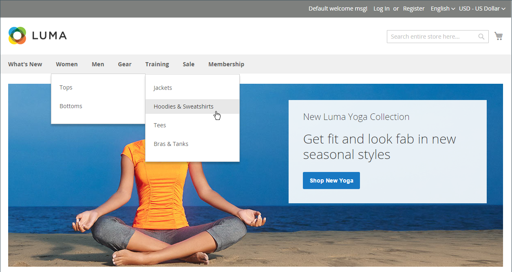

# Navigation oben

Das Hauptmenü Ihres Geschäfts ist wie ein Verzeichnis zu den verschiedenen Abteilungen in Ihrem Geschäft. Jede Option stellt eine andere Kategorie von Produkten dar. Position und Darstellung der oberen Navigation können je nach Thema variieren, aber die Funktionsweise ist im Wesentlichen die gleiche.

{width="700" zoomable="yes"}

Die Kategoriestruktur Ihres Katalogs kann sich darauf auswirken, wie gut Ihre Site von Suchmaschinen indiziert wird. Je tiefer eine Kategorie verschachtelt ist, desto unwahrscheinlicher ist eine gründliche Indizierung. Im Allgemeinen ist die Verwendung von zwischen einer und drei sichtbaren Ebenen die effektivste. Die [Stammkategorie](category-root.md) zählt als erste Ebene, obwohl sie nicht im Menü erscheint. Die maximale Anzahl von Ebenen, die in der oberen Navigation verfügbar sind, wird durch die Konfiguration bestimmt. Darüber hinaus kann es eine Begrenzung für die Anzahl der Menüebenen geben, die von Ihrem Store-Design unterstützt werden. Das Beispiel-Luma-Design unterstützt beispielsweise bis zu fünf Ebenen, einschließlich des Stamms.

## Menüebenen werden gezählt

| Element | Beschreibung |
|--- |--- |
| Stufe 1 | Die erste Ebene ist die Stammkategorie, die in den Beispieldaten „Standardkategorie“ genannt wird. Der Stamm ist ein Container für das Menü, dessen Name nicht als Option im Menü angezeigt wird. |
| Stufe 2 | Bei einem Desktop-Display ist die obere Navigation das Hauptmenü, das oben auf der Seite angezeigt wird. Auf einem Mobilgerät wird das Hauptmenü in der Regel als Ausklappmenü mit Optionen angezeigt. Die Optionen der zweiten Ebene im Luma Store sind _Was ist neu_, _Frauen_, _Männer_, _Ausrüstung_, _Training_ und _Sale_. |
| Stufe 3 | Die dritte Ebene wird unterhalb jeder Hauptmenüoption angezeigt. Beispielsweise sind unter _Women_ die Optionen der dritten Ebene _Tops_ und _Bottom_. |
| Stufe 4 | Die Optionen der vierten Ebene sind Unterkategorien, die aus einer Option der dritten Ebene hervorgehen. Beispielsweise sind unter _Tops_ die Menüoptionen der vierten Ebene _Jacken_, _Hoodies und Sweatshirts_, _Tees_ und _Bras &amp; Tanks_. |

{style="table-layout:auto"}

## Festlegen der oberen Navigation

Damit eine Kategorie in der oberen Navigation eines Stores angezeigt wird, führen Sie die folgenden Schritte aus:

### Schritt 1: Kategorie erstellen

1. Navigieren Sie in der _Admin_-Seitenleiste zu **[!UICONTROL Catalog]** > **[!UICONTROL Categories]**.

1. Legen Sie einen **[!UICONTROL Store View]** fest, um zu bestimmen, wo die neue Kategorie verfügbar sein soll.

1. Wählen Sie in der Kategoriestruktur die übergeordnete Kategorie der neuen Kategorie aus.

   Wenn Sie von Anfang an ohne Daten beginnen, gibt es möglicherweise nur zwei Kategorien in der Liste: _Standardkategorie_, die das Stammverzeichnis ist, und eine _Beispielkategorie_.

1. Klicken Sie auf **[!UICONTROL Add Subcategory]**.

1. Vervollständigen Sie die grundlegenden Informationen mit den folgenden Einstellungen:

   - **[!UICONTROL Enable Category]** festgelegt auf `Yes`
   - **[!UICONTROL Include in Menu]** festgelegt auf `Yes`

1. Stellen Sie in der Anzeigeeinstellung **[!UICONTROL Anchor]** auf `Yes`.

1. Füllen Sie alle anderen erforderlichen [Kategorieeinstellungen](category-create.md) aus.

1. Klicken Sie abschließend auf **[!UICONTROL Save]**.

Bei einer Multi-Store-Installation kann jedem (Store) ein anderes Hauptmenü als [Stammkategorie](category-root.md) zugewiesen .

### Schritt 2: Legen Sie die Tiefe der oberen Navigation fest

1. Navigieren Sie in _Admin_-Seitenleiste zu **[!UICONTROL Stores]** > _[!UICONTROL Settings]_>**[!UICONTROL Configuration]**.

1. Erweitern Sie im linken Bereich **[!UICONTROL Catalog]** und wählen Sie darunter **[!UICONTROL Catalog]**.

1. Erweitern Sie den Abschnitt **[!UICONTROL Category Top Navigation]** .

   {width="600" zoomable="yes"}

   Da die Tiefe der oberen Navigation einen globalen [Konfigurationsbereich) hat](../getting-started/websites-stores-views.md#scope-settings) gilt die Einstellung für alle Websites, Stores und Store-Ansichten in der Commerce-Installation. Der Abschnitt _[!UICONTROL Category Top Navigation]_-Konfiguration ist nur verfügbar, wenn_[!UICONTROL Store View]_ in der oberen linken Ecke auf `Default Config` eingestellt ist.

   Eine detaillierte Liste dieser Optionen finden Sie unter [Oberste Navigation ](../configuration-reference/catalog/catalog.md#layered-navigation) Kategorie“ _Konfigurationsreferenz_.

1. Um die Anzahl der Unterkategorien zu begrenzen, die in der oberen Navigation angezeigt werden, geben Sie die Zahl für **[!UICONTROL Maximal Depth]** ein.

   Der Standardwert ist `0`, wodurch die Anzahl der Unterkategorieebenen nicht beschränkt wird.

1. Klicken Sie abschließend auf **[!UICONTROL Save Config]**.
