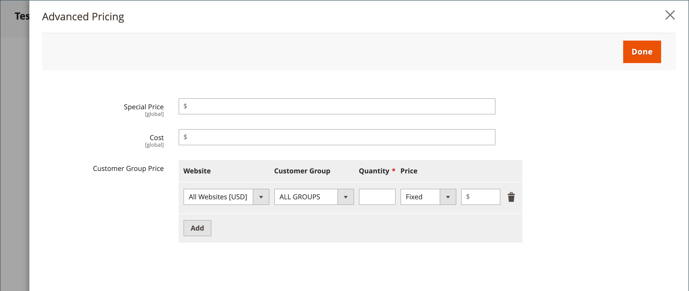

# Erweiterte Preise

Adobe Commerce und Magento Open Source unterstützen verschiedene Preisoptionen, die Sie für Werbeaktionen oder zur Erfüllung der Mindestanforderungen an die Preisgestaltung des Herstellers verwenden können. Änderungen an den Produktpreisen können planmäßig oder durch Preisregeln vorgenommen werden, die auf Produktebene oder im Warenkorb angewendet werden.

Verwalten Sie die Preise für Ihre Produkte mit erweiterten Preisen, um Kunden bessere Tarife anzubieten, die Verbraucher dazu anregen, mehr auszugeben, den Traffic zu Ihrer Site zu lenken und alte Lager zu löschen.

Die _[!UICONTROL Advanced Pricing]_-Einstellungen definieren die Bedingungen für spezielle Preise, die für eine bestimmte Kundengruppe oder einen freigegebenen Katalog verfügbar sind. Erweiterte Preise können auf einfache, virtuelle, herunterladbare und gebündelte Produkte angewendet werden. Um ermäßigte Preise auf andere Produktarten anzuwenden, verwenden Sie eine [Katalogpreisregel](../merchandising-promotions/price-rules-catalog.md). Weitere Informationen finden Sie unter [Preisumfang](catalog-price-scope.md).

Erweiterte Preisdaten werden mit Produktseiten synchronisiert. Wenn Sie beispielsweise eine Tier-Preismenge aktualisieren, aktualisiert das System den Wert auf der Produktseite.

 (Verfügbar mit [Adobe Commerce B2B](./b2b/../introduction.md) Nur) Wenn Sie freigegebene Kataloge verwenden, werden erweiterte Preisdaten sowohl mit Produktseiten als auch mit freigegebenen Katalogen synchronisiert. Wenn Sie beispielsweise eine Tier-Preismenge aktualisieren, aktualisiert das System den Wert im freigegebenen Katalog und auf der Produktseite. Alle benutzerdefinierten Preise, die im freigegebenen Katalog angegeben sind, haben Vorrang vor den Preisen für Kundengruppen. Siehe auch [Festlegen der gemeinsamen Preise und Struktur von Katalogen](https://experienceleague.adobe.com/docs/commerce-admin/b2b/shared-catalogs/define/catalog-shared-pricing-structure.html) im _Adobe Commerce B2B-Anleitung_.

{width="600" zoomable="yes"}

## Erweiterte Preisoptionen aufrufen

1. Öffnen Sie das Produkt im Bearbeitungsmodus.

1. under **[!UICONTROL Price]** klicken **[!UICONTROL Advanced Pricing]**.

1. Befolgen Sie die Anweisungen für die Art der erforderlichen erweiterten Preise.

   - [Gruppenpreis](product-price-group.md)

   - [Sonderpreis](product-price-special.md)

   - [Basispreis](product-price-tier.md)

   - [Mindestpreis für Werbung](product-price-minimum-advertised.md)

## Seitenverweis

### [!UICONTROL Special Price]

Geben Sie den Sonderpreis an, um einen ermäßigten Preis während eines bestimmten Zeitraums oder einer geplanten Kampagne anzubieten. Wenn ein spezieller Preis verfügbar ist, wird der Einzelhandelspreis durchgestrichen und der Sonderpreis unten in großem, fett gedrucktem Text angezeigt.

#### [!UICONTROL Special Price From] dates

{{ce-feature}}

| Feld | Beschreibung |
| ---- | ----------- |
| [!UICONTROL From] | Legt das erste Datum fest, an dem der Sonderpreis verfügbar ist. Sie können entweder das Datum eingeben oder es im Kalender auswählen. |
| [!UICONTROL To] | Legt das letzte Datum fest, an dem der Sonderpreis verfügbar ist. Sie können entweder das Datum eingeben oder es im Kalender auswählen. |

{style="table-layout:auto"}

### [!UICONTROL Cost]

Geben Sie die tatsächlichen Kosten des Artikels ein.

### [!UICONTROL Customer Group Price]

{width="600" zoomable="yes"}

Richtet Werbe- und Tierpreise für bestimmte Kundengruppen ein.

| Posten | Beschreibung |
| ---- | ----------- |
| [!UICONTROL Website] | Identifiziert die Website, auf der die Gruppenpreisregel gilt. Diese Option wird nur angezeigt, wenn die Installation über mehrere Websites verfügt. |
| [!UICONTROL Customer Group] | (Erforderlich) Identifiziert die Kundengruppe, die für den Erhalt des Rabattpreises qualifiziert ist. Wenn ein Wert in einem Gruppen- oder Katalogfeld geändert wird, wird die entsprechende Zeile mit dem benutzerdefinierten Preis, die mit der vorherigen Einstellung übereinstimmt, aus dem freigegebenen Katalog gelöscht.  **[!UICONTROL ALL GROUPS]**- Wendet die Regel auf alle Kundengruppen an. **[!UICONTROL NOT LOGGED IN]** - Wendet die Regelgäste und -kunden an, die nicht bei ihren Konten angemeldet sind. |
| [!UICONTROL Quantity] | Gibt die Menge an, die zum Erhalt eines Tier-Preises erforderlich ist. |
| [!UICONTROL Price] | (Erforderlich) Gibt einen festen oder ermäßigten Produktpreis für Mitglieder der Kundengruppe innerhalb der jeweiligen Website an. Optionen:  **[!UICONTROL Fixed]**- (Standard) Der Rabattpreis wird als fester Dezimalwert angegeben. Geben Sie beispielsweise `9.99` als Rabattpreis. **[!UICONTROL Discount]** - Der Rabattpreis wird als Prozentsatz (%) des Basisproduktpreises angegeben. Geben Sie beispielsweise `10` für einen 10% Rabatt. |
|  | Löscht die aktuelle Regel. |
| **[!UICONTROL Add]** | Fügt eine weitere Zeile für eine neue Regel ein. |

{style="table-layout:auto"}

### [!UICONTROL Catalog and Tier Price]

Richtet Werbe- und Tierpreise für bestimmte freigegebene Kataloge und Kundengruppen ein.

{{b2b-feature}}

{width="600" zoomable="yes"}

| Posten | Beschreibung |
|----|-----------|
| [!UICONTROL Website] | Identifiziert die Website, auf der die Gruppenpreisregel gilt. Diese Option wird nur angezeigt, wenn die Installation über mehrere Websites verfügt.  **_Wichtig:_**ALso auswählen_Webseite _im [Katalogpreisumfang](catalog-price-scope.md) Konfiguration, andernfalls werden die festgelegten erweiterten Preise angezeigt für**all **Websites. |
| [!UICONTROL Group or Catalog] | (Erforderlich) Identifiziert die Kundengruppe oder den freigegebenen Katalog, die bzw. der für den Erhalt des Rabattpreises qualifiziert ist. Wenn ein Wert in einem Gruppen- oder Katalogfeld geändert wird, wird die entsprechende Zeile mit dem benutzerdefinierten Preis, die mit der vorherigen Einstellung übereinstimmt, aus dem freigegebenen Katalog gelöscht.  **[!UICONTROL ALL GROUPS]**- Wendet die Regel auf alle Kundengruppen an. Der Wert wird nicht auf den freigegebenen Katalog angewendet und Änderungen an den erweiterten Preisdaten werden nicht mit dem freigegebenen Katalog synchronisiert. **[!UICONTROL NOT LOGGED IN]** - Wendet die Regelgäste und -kunden an, die nicht bei ihren Konten angemeldet sind. **[!UICONTROL Shared Catalogs]**- Wendet die Regel auf einen bestimmten freigegebenen Katalog an. |
| Menge | Gibt die Menge an, die zum Erhalt eines Tier-Preises erforderlich ist. |
| [!UICONTROL Price] | (Erforderlich) Gibt einen festen oder ermäßigten Produktpreis für Mitglieder der Kundengruppe innerhalb der jeweiligen Website an. Optionen:  **[!UICONTROL Fixed]**- (Standard) Der Rabattpreis wird als fester Dezimalwert angegeben. Geben Sie beispielsweise `9.99` als Rabattpreis. **[!UICONTROL Discount]** - Der Rabattpreis wird als Prozentsatz (%) des Basisproduktpreises angegeben. Geben Sie beispielsweise `10` für einen 10% Rabatt. |
|  | Löscht die aktuelle Regel. |
| **[!UICONTROL Add]** | Fügt eine weitere Zeile für eine neue Regel ein. |

{style="table-layout:auto"}

### [!UICONTROL Minimum Advertised Price]

Der Mindestpreis (MAP) für das Produkt.

### [!UICONTROL Display Actual Price]

Bestimmt, wo der tatsächliche Preis des Produkts für den Kunden sichtbar ist.

| Posten | Beschreibung |
|----|-----------|
| [!UICONTROL Use Config] | Verwendet die aktuelle Konfigurationseinstellung für die Preisanzeige. |
| [!UICONTROL On Gesture] | Zeigt den tatsächlichen Produktpreis in einem Popup-Fenster als Reaktion auf die _Zum Preis hier klicken_ oder _Was ist das?_ -Link. |
| [!UICONTROL In Cart] | Zeigt den tatsächlichen Produktpreis im Warenkorb an. |
| [!UICONTROL Before Order Confirmation] | Zeigt den tatsächlichen Produktpreis am Ende des Checkout-Prozesses an, kurz bevor die Bestellung gesendet wird. |

{style="table-layout:auto"}
