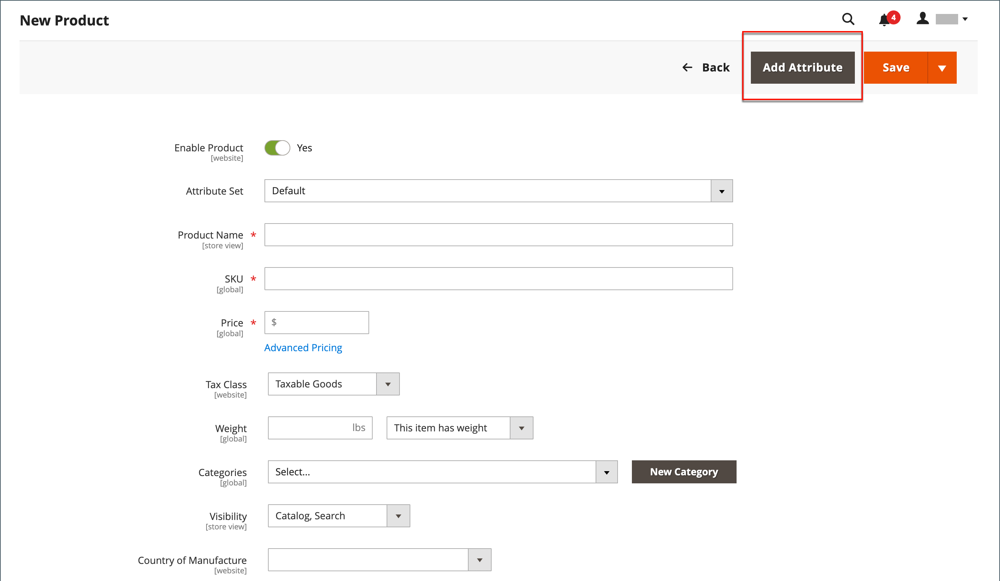

# Hinzufügen von Attributen zu einem Produkt

Obwohl Attribute primär über das Menü [Geschäfte](../stores-purchase/stores-menu.md) verwaltet werden, können Sie während der Arbeit an einem Produkt auch neue Attribute _spontan_ hinzufügen. Sie können aus der Liste der vorhandenen Attribute wählen oder ein Attribut erstellen. Das neue Attribut wird dem [Attributsatz](../catalog/attribute-sets.md) hinzugefügt, auf dem das Produkt basiert.

## Schritt 1: Attribut hinzufügen

1. Öffnen Sie das Produkt im Bearbeitungsmodus.

1. Klicken Sie in der oberen rechten Ecke auf **[!UICONTROL Add Attribute]**.

   {width="600" zoomable="yes"}

1. Um dem Produkt ein vorhandenes Attribut hinzuzufügen, verwenden Sie die [Filtersteuerelemente](../getting-started/admin-grid-controls.md) , um das Attribut im Raster zu finden, und gehen Sie wie folgt vor:

   - Aktivieren Sie das Kontrollkästchen in der ersten Spalte jedes hinzugefügten Attributs.

   - Klicken Sie auf **[!UICONTROL Add Selected]**.

   {width="600" zoomable="yes"}

1. Um ein neues Attribut zu definieren, klicken Sie auf **[!UICONTROL Create New Attribute]** und füllen Sie die Elemente in Schritt 2 aus.

## Schritt 2: Grundlegende Attributeigenschaften beschreiben

{width="600" zoomable="yes"}

1. Geben Sie unter &quot;_[!UICONTROL Attribute Properties]_&quot;eine &quot;**[!UICONTROL Attribute Label]**&quot;ein, um das Attribut zu identifizieren.

1. Setzen Sie **[!UICONTROL Catalog Input Type for Store Owner]** auf den Typ von [Eingabedialog](attributes-input-types.md), der für die Dateneingabe verwendet werden soll.

   Wenn das Attribut für ein [konfigurierbares Produkt](product-create-configurable.md) verwendet wird, wählen Sie `Dropdown`. Setzen Sie dann **[!UICONTROL Required]** auf `Yes`.

1. Gehen Sie für die Eingabetypen `Dropdown` und `Multiple Select` wie folgt vor:

   - Klicken Sie unter **[!UICONTROL Values]** auf **[!UICONTROL Add Value]**.

   - Geben Sie den ersten Wert ein, der in der Liste angezeigt werden soll.

     Sie können einen Wert für den Administrator und eine Übersetzung des Werts für jede Store-Ansicht eingeben. Wenn Sie nur eine Store-Ansicht haben, können Sie nur den Admin-Wert eingeben, der auch für die Storefront verwendet wird.

   - Klicken Sie auf **[!UICONTROL Add Value]** und wiederholen Sie den vorherigen Schritt für jede Option, die Sie in die Liste aufnehmen möchten.

   - Wählen Sie **[!UICONTROL Is Default]** aus, um die Option als Standardwert zu verwenden.

   {width="600" zoomable="yes"}

1. Wenn Sie möchten, dass der Kunde eine Option auswählt, bevor das Produkt erworben werden kann, setzen Sie **[!UICONTROL Required]** auf `Yes`.

## Schritt 3: Beschreibung der erweiterten Eigenschaften (optional)

{width="600" zoomable="yes"}

1. Geben Sie ein eindeutiges **[!UICONTROL Attribute Code]** in Kleinbuchstaben und ohne Leerzeichen ein.

1. Legen Sie **[!UICONTROL Scope]** fest, um anzugeben, wo in Ihrer Store-Hierarchie das Attribut verwendet werden kann.

   Wenn das Attribut für ein [konfigurierbares Produkt](product-create-configurable.md) verwendet wird, wählen Sie `Global`.

1. Wenn dieses Attribut nur für dieses Produkt gilt, setzen Sie **[!UICONTROL Unique Value]** auf `Yes`.

1. Um einen Gültigkeitstest für alle in ein Textfeld eingegebenen Daten durchzuführen, setzen Sie **[!UICONTROL Input Validation for Store Owner]** auf den Datentyp, den das Feld enthalten soll.

   Dieses Feld ist nicht für Eingabetypen mit ausgewählten Werten verfügbar. Die Eingabevalidierung kann für Folgendes verwendet werden:

   - `Decimal Number`
   - `Integer Number`
   - `Email`
   - `URL`
   - `Letters`
   - `Letters (a-z, A-Z) or Numbers (0-9)`

   {width="500"}

1. Wenn Sie das Attribut als Spalte im Raster Produkte einbeziehen möchten, setzen Sie **[!UICONTROL Add to Column Options]** auf `Yes`.

1. Wenn Sie das Raster _[!UICONTROL Products]_nach dieser Spalte filtern möchten, setzen Sie **[!UICONTROL Use in Filter Options]**auf `Yes`.

## Schritt 4: Feldbezeichnung eingeben

1. Erweitern Sie  im Abschnitt **[!UICONTROL Manage titles]** .

1. Geben Sie eine **[!UICONTROL Title]** ein, die als Beschriftung für das Feld verwendet werden soll.

   Wenn Ihr Store in verschiedenen Sprachen verfügbar ist, können Sie für jede Ansicht einen übersetzten Titel eingeben.

   {width="600" zoomable="yes"}

## Schritt 5: Beschreibung der Storefront-Eigenschaften

1. Erweitern Sie  im Abschnitt **[!UICONTROL Storefront Properties]** .

   {width="600" zoomable="yes"}

1. Um das Attribut für die Suche verfügbar zu machen, setzen Sie **[!UICONTROL Use in Search]** auf `Yes`.

1. Um das Attribut in den Produktvergleich einzubeziehen, setzen Sie **[!UICONTROL Comparable on Storefront]** auf `Yes`.

1. Um Dropdown, mehrere Auswahl- oder Preisattribute in die Navigation mit Ebenen einzubeziehen, setzen Sie **[!UICONTROL Use in Search Results Layered Navigation]** auf einen der folgenden Werte:

   - `Filterable (with results)` - Die Navigation mit Ebenen umfasst nur die Filter, für die passende Produkte gefunden werden können. Ein Attributwert, der bereits für alle in der Liste angezeigten Produkte gilt, wird nicht als verfügbarer Filter angezeigt. Attributwerte mit einer Anzahl von Nullprodukt-Übereinstimmungen (0) werden ebenfalls aus der Liste der verfügbaren Filter weggelassen.  Die gefilterte Liste von Produkten enthält nur die Produkte, die mit dem Filter übereinstimmen. Die Produktliste wird nur aktualisiert, wenn die ausgewählten Filter die angezeigten Elemente ändern.

   - `Filterable (no results)` - Die Navigation mit Ebenen umfasst Filter für alle verfügbaren Attributwerte und deren Produktzahlen, einschließlich der Produkte mit null (0) Produktübereinstimmungen. Wenn es sich bei dem Attributwert um ein Muster handelt, wird der Wert als Filter angezeigt, jedoch ausgekreuzt.

   >[!NOTE]
   >
   >Wenn die Einstellung _[!UICONTROL Use in Search]_auf `No` gesetzt ist, wird die Einstellung_[!UICONTROL Use in Search Results Layered Navigation]_ nicht angezeigt und das Produktattribut wird bei der Suche mit einem [!UICONTROL Use in Layered Navigation] -Einstellungswert nicht verwendet.

1. Um das Attribut in mehrschichtiger Navigation auf Suchergebnisseiten zu verwenden, setzen Sie **[!UICONTROL Use in Search Results Layered Navigation]** auf `Yes` und geben Sie eine Zahl in das Feld **[!UICONTROL Position]** ein.

   Die Positionsnummer gibt die relative Position des Attributs innerhalb des Navigationsblocks mit Ebenen an.

   >[!NOTE]
   >
   >Das Feld _[!UICONTROL Position]_ist standardmäßig abgeblendet und Sie müssen das Attribut speichern, bevor Sie diese Einstellung ändern können.

1. Um das Attribut in den Preisregeln zu verwenden, setzen Sie **[!UICONTROL Use for Promo Rule Conditions]** auf `Yes`.

1. Damit der Text mit HTML formatiert werden kann, setzen Sie **[!UICONTROL Allow HTML Tags on Storefront]** auf `Yes`.

   Durch diese Einstellung wird der WYSIWYG-Editor beim Bearbeiten des Felds verfügbar.

1. Um das Attribut auf der Produktseite einzubeziehen, setzen Sie **[!UICONTROL Visible on Catalog Pages on Storefront]** auf `Yes`.

1. Führen Sie die folgenden Einstellungen aus, wie von Ihrem Design unterstützt:

   - Um das Attribut in Produktlisten aufzunehmen, setzen Sie **[!UICONTROL Used in Product Listing]** auf `Yes`.

   - Um das Attribut als Sortierparameter für Produktlisten zu verwenden, setzen Sie **[!UICONTROL Used for Sorting in Product Listing]** auf `Yes`.

1. Klicken Sie nach Abschluss des Vorgangs auf **[!UICONTROL Save Attribute]**.
