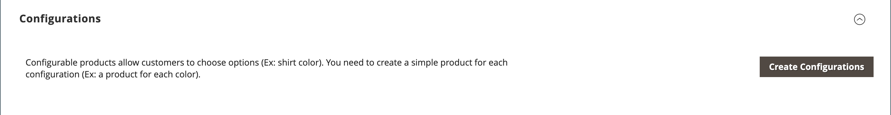

# Produkteinstellungen - [!UICONTROL Configurations]

Im Abschnitt _[!UICONTROL Configurations]_&#x200B;werden alle vorhandenen Varianten des Produkts aufgelistet und sie können verwendet werden, um Varianten für die Verwendung mit dem konfigurierbaren Produkttyp zu generieren. Weitere Informationen finden Sie unter [Konfigurierbares Produkt](product-create-configurable.md).

{width="600" zoomable="yes"}

{width="600" zoomable="yes"}

## Feldverweis

| Feld | Beschreibung |
|--- |--- |
| [!UICONTROL Image] | Produktbild |
| [!UICONTROL Name] | Der eindeutige Name für ein Produkt |
| [!UICONTROL SKU] | Basierend auf Produktname |
| [!UICONTROL Price] | Produktpreis |
| [!UICONTROL Quantity] | Verfügbare Lagerbestände für jedes Produkt |
| [!UICONTROL Weight] | Das Produktgewicht |
| [!UICONTROL Status] | Produktstatus **[!UICONTROL Enabled]**/**[!UICONTROL Disabled]** |
| [!UICONTROL Attributes] | Eine Reihe von Attributen, die zur Beschreibung eines Produkts verwendet werden |
| [!UICONTROL Actions] | Listet alle Aktionen auf, die auf ausgewählte Produkte angewendet werden können. Aktionen:  **[!UICONTROL Choose a different Product]** - Entfernt und ersetzt das aktuelle Produkt durch die neue Auswahl.  **[!UICONTROL Disable Product]**/**[!UICONTROL Enable Product]** - Deaktiviert oder aktiviert das ausgewählte Produkt.  **[!UICONTROL Remove Product]** - Entfernt das ausgewählte Produkt aus der aktuellen Konfiguration. |

{style="table-layout:auto"}
