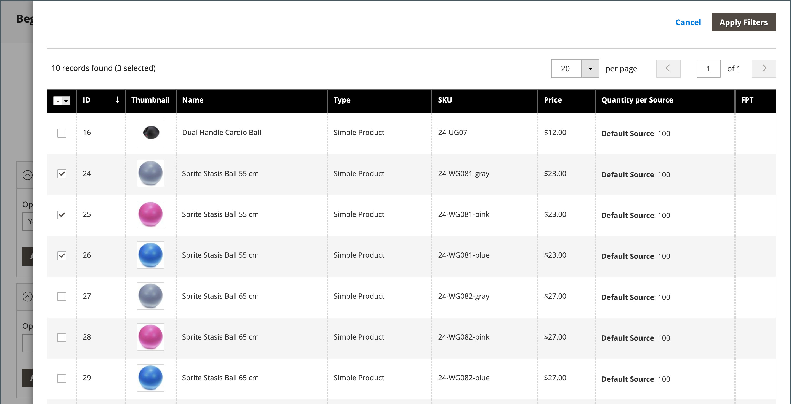

# Paket-Produkt

Ein Bundle ist ein _eigenes, anpassbares Produkt_ erstellen. Jedes Element in einem Bundle kann auf einem der folgenden Produkttypen basieren:

- [Einfaches Produkt](product-create-simple.md)
- [Virtuelles Produkt](product-create-virtual.md)

{width="700" zoomable="yes"}

Die Optionen werden angezeigt, wenn der Kunde auf **[!UICONTROL Customize]** oder **[!UICONTROL Add to Cart]** klickt. Da die im Bundle enthaltenen Produkte variieren, können SKU, Preis und Gewichtung entweder auf einen dynamischen oder auf einen festen Wert eingestellt werden.

>[!NOTE]
>
>Für Bundle-Produkte, die dynamische Preise verwenden, ist der Mindestpreis für Werbung (MAP) nicht verfügbar.

>[!NOTE]
>
>Das übergeordnete Bundle-Produkt wird immer automatisch als Upsell-Produkt für alle untergeordneten Produkte angezeigt.

Wenn [Sofortiger Kauf](../stores-purchase/checkout-instant-purchase.md) verfügbar ist, wird die Schaltfläche _Sofortiger Kauf_ unter der Schaltfläche _Zum Warenkorb hinzufügen_ für jedes Element im Bundle angezeigt.

{width="600" zoomable="yes"}

Die folgenden Anweisungen führen Sie durch den Prozess der Erstellung eines Bundle-Produkts mit einer [Produktvorlage](attribute-sets.md), erforderlichen Feldern und grundlegenden Einstellungen. Jedes erforderliche Feld ist mit einem roten Sternchen (`*`) gekennzeichnet. Wenn Sie die Grundlagen abgeschlossen haben, können Sie die anderen Produkteinstellungen nach Bedarf abschließen.

## Schritt 1: Produkttyp auswählen

1. Wechseln Sie in der Seitenleiste _Admin_ zu **[!UICONTROL Catalog]** > **[!UICONTROL Products]**.

1. Wählen Sie in der rechten oberen Ecke des Menüs _[!UICONTROL Add Product]_( {width="25"} ) die Option **[!UICONTROL Bundle Product]**.

   {width="700" zoomable="yes"}

## Schritt 2: Attributsatz auswählen

Führen Sie einen der folgenden Schritte aus, um den [Attributsatz](attribute-sets.md) auszuwählen, der als Vorlage für das Produkt verwendet wird:

- Geben Sie für &quot;**[!UICONTROL Search]**&quot;den Namen des Attributsatzes ein.
- Wählen Sie in der Liste den Attributsatz aus, den Sie verwenden möchten.

Das Formular wird entsprechend der Änderung aktualisiert.

{width="600" zoomable="yes"}

## Schritt 3: Ausführen der erforderlichen Einstellungen

1. Geben Sie das Produkt **[!UICONTROL Product Name]** ein.

1. Nehmen Sie entweder die standardmäßige **[!UICONTROL SKU]** an, die auf dem Produktnamen basiert, oder geben Sie einen anderen Wert ein.

   Gehen Sie wie folgt vor, um den SKU-Typ zu ermitteln, der jedem Bundle-Element zugewiesen ist:

   - Jedem Bundle-Element kann automatisch ein **[!UICONTROL Dynamic SKU]** zugewiesen werden, indem der standardmäßigen SKU ein Suffix hinzugefügt wird. Standardmäßig ist er auf `Yes` gesetzt.

   - Wenn Sie für jedes Bundle-Element eine eindeutige SKU zuweisen möchten, setzen Sie **[!UICONTROL Dynamic SKU]** auf `No`.

   {width="600" zoomable="yes"}

1. Führen Sie einen der folgenden Schritte aus, um den Preis des Bundles zu ermitteln:

   - Damit der Preis die vom Kunden gewählten Optionen widerspiegelt, setzen Sie **[!UICONTROL Dynamic Price]** auf `Yes` und lassen Sie **[!UICONTROL Price]** leer. In diesem Fall hat ein Bundle-Produkt keinen eigenen Preis aus dem Katalog, und der Produktpreis wird vom Preis der einzelnen Produkte abgeleitet, die im Bundle enthalten sind.

   - Um einen festen Preis für das Bundle zu berechnen, setzen Sie **[!UICONTROL Dynamic Price]** auf `No` und geben Sie die **[!UICONTROL Price]** ein, die Sie für das Bundle aufladen möchten.

   >[!NOTE]
   >
   >[!UICONTROL Special Price] und [!UICONTROL Customer Group Price] (Tier Price) werden immer als Rabattprozentsatz für alle Bundle-Produktarten festgelegt.

1. Da das Produkt noch nicht zur Veröffentlichung bereit ist, setzen Sie **[!UICONTROL Enable Product]** auf `No`.

1. Klicken Sie auf **[!UICONTROL Save]** und fahren Sie fort.

   Wenn das Produkt gespeichert wird, wird die Auswahl für die [Store-Ansicht](introduction.md#product-scope) in der oberen linken Ecke angezeigt.

1. Wählen Sie die **[!UICONTROL Store View]** aus, in der das Produkt verfügbar sein soll.

   {width="600" zoomable="yes"}

## Schritt 4: Grundlegende Einstellungen durchführen

1. Wenn das Bundle feste Preise aufweist, setzen Sie **[!UICONTROL Tax Class]** auf einen der folgenden Werte:

   - `None`
   - `Taxable Goods`

   Wenn das Bundle über dynamische Preise verfügt, wird die Steuer für **_jedes_** Bundle-Element bestimmt. Wenn das Bundle feste Preise hat, wird die Steuer für das Paket **_full_** festgelegt.

1. Beachten Sie Folgendes:

   - Der **[!UICONTROL Quantity]** ist nicht verfügbar, da der Wert für jedes Bundle-Element bestimmt wird.

   - Standardmäßig ist **[!UICONTROL Stock Status]** auf `In Stock` gesetzt.

1. Führen Sie einen der folgenden Schritte aus, um die Gewichtung des Bundles zu bestimmen:

   - Damit die Gewichtung die vom Kunden gewählten Optionen widerspiegelt, setzen Sie **[!UICONTROL Dynamic Weight]** auf `Yes` und lassen Sie **[!UICONTROL Weight]** leer.

   - Um dem Bundle eine feste Gewichtung zuzuweisen, setzen Sie **[!UICONTROL Dynamic Weight]** auf `No` und geben Sie die **[!UICONTROL Weight]** des Bundles ein.

   {width="600" zoomable="yes"}

1. Um das Produkt in der Liste der [neuen Produkte](../content-design/widget-new-products-list.md) zu kennzeichnen, aktivieren Sie das Kontrollkästchen **[!UICONTROL Set Product as New]** .

1. Nehmen Sie die standardmäßige **[!UICONTROL Visibility]** -Einstellung von `Catalog, Search` an.

1. Um dem Produkt _[!UICONTROL Categories]_zuzuweisen, klicken Sie auf das Feld **[!UICONTROL Select…]**und führen Sie einen der folgenden Schritte aus:

   **Wählen Sie eine vorhandene Kategorie:**

   - Beginnen Sie mit der Eingabe in das Feld, bis Sie eine Übereinstimmung finden.

   - Aktivieren Sie das Kontrollkästchen der jeweiligen Kategorie, die zugewiesen werden soll.

   {width="600" zoomable="yes"}

   **Erstellen einer Kategorie:**

   - Klicken Sie auf **[!UICONTROL New Category]**.

   - Geben Sie den Wert **[!UICONTROL Category Name]** ein und wählen Sie den Wert **[!UICONTROL Parent Category]** aus, der seine Position in der Menüstruktur bestimmt.

   - Klicken Sie auf **[!UICONTROL Create Category]**.

1. Wählen Sie die **[!UICONTROL Country of Manufacture]** aus.

   Es kann zusätzliche Attribute geben, die das Produkt beschreiben. Die Auswahl variiert den Attributsatz und kann später abgeschlossen werden.

## Schritt 5: Hinzufügen der Bundle-Elemente

Der Abschnitt _[!UICONTROL Bundle Items]_wird verwendet, um einem Bundle-Produkttyp Elemente hinzuzufügen und die aktuelle Auswahl von Elementen zu bearbeiten.

{width="600" zoomable="yes"}

1. Scrollen Sie nach unten zum Abschnitt _Bundle Items_ und legen Sie **[!UICONTROL Ship Bundle Items]** auf einen der folgenden Werte fest:

   - `Separately`
   - `Together`

   Wenn Sie &quot;`Together`&quot;auswählen, müssen allen Bundle-Elementen dieselbe [Quelle](../inventory-management/sources-manage.md) zugewiesen werden.

1. Klicken Sie auf **[!UICONTROL Add Option]** und führen Sie die folgenden Schritte aus:

   - Geben Sie eine **[!UICONTROL Option Title]** ein, die als Feldbezeichnung verwendet werden soll.

   - Setzen Sie **[!UICONTROL Input Type]** auf einen der folgenden Werte:

      - `Drop-down`
      - `Radio buttons`
      - `Checkbox`
      - `Multiple Select`

   - Um das Feld zu einem erforderlichen Eintrag zu machen, aktivieren Sie das Kontrollkästchen **[!UICONTROL Required]** .

   - Klicken Sie auf **[!UICONTROL Add Products to Option]** und aktivieren Sie das Kontrollkästchen der einzelnen Produkte, die Sie in diese Option aufnehmen möchten.

     Wenn es viele Produkte gibt, verwenden Sie die Listenfilter und Seitenumbruchsteuerungen, um die benötigten Produkte zu finden.

   - Klicken Sie auf **[!UICONTROL Add Selected Products]**.

     {width="600" zoomable="yes"}

   - Nachdem die Elemente im Abschnitt _Optionen_ angezeigt wurden, wählen Sie ein Element als **[!UICONTROL Default]** Auswahl aus.

   - Geben Sie in der Spalte _Standardmenge_ die Menge jedes Elements ein, das dem Bundle hinzugefügt werden soll, wenn ein Kunde das Element auswählt.

   - Um Kunden zu ermöglichen, die Menge eines Bundle-Elements zu ändern, wählen Sie **[!UICONTROL User Defined]** aus.

     >[!NOTE]
     >
     >Die Menge kann ein vordefinierter oder ein benutzerdefinierter Wert sein. Weisen Sie die Eigenschaft _[!UICONTROL User Defined]_jedoch nicht dem Kontrollkästchen oder Mehrfachauswahleingabetypen zu.

     Standardmäßig kann die Standardmenge, die in einem Bundle-Element enthalten ist, vom Kunden nicht geändert werden. Der Kunde kann jedoch die Menge des Elements eingeben, das in das Bundle aufgenommen werden soll.

     Wenn beispielsweise die Standardmenge des Sprite Status Ball auf `2` gesetzt ist und der Kunde die Option `4` dieses Bundles bestellt, beträgt die Gesamtzahl der gekauften Kugeln `8`.

     {width="600" zoomable="yes"}

1. Wiederholen Sie diese Schritte für jedes Element, das Sie zum Bundle hinzufügen möchten.

1. Um die Reihenfolge der Elemente in einem Bundle-Abschnitt zu ändern, klicken Sie am Anfang der Zeile auf das Symbol _Verschieben_ (  ) und ziehen Sie das Element an die Position.

   {width="600" zoomable="yes"}

   Die Reihenfolge der Elemente kann auch in den Daten eines exportierten Bundle-Produkts geändert und dann erneut in den Katalog importiert werden. Weitere Informationen finden Sie unter [Importieren von Bundle-Produkten](../systems/data-transfer-bundle-products.md).

   Um eine bessere Ansicht des Arbeitsbereichs zu erhalten, reduzieren Sie zunächst jeden Abschnitt und ziehen ihn dann an die gewünschte Position.

1. Um ein Element aus dem Bundle zu entfernen, klicken Sie auf das Symbol **[!UICONTROL Delete]** (  ).

1. Klicken Sie nach Abschluss des Vorgangs auf **[!UICONTROL Save]**.

## Schritt 6: Produktinformationen ausfüllen

Scrollen Sie nach unten und füllen Sie die Informationen in den folgenden Abschnitten nach Bedarf aus:

- [Inhalt](product-content.md)
- [Bilder und Videos](product-images-and-video.md)
- [Suchmaschinenoptimierung](product-search-engine-optimization.md)
- [Zugehörige Produkte, Up-Sells und Cross-Sells](related-products-up-sells-cross-sells.md)
- [Anpassbare Optionen](settings-advanced-custom-options.md)
- [Produkte in Websites](settings-basic-websites.md)
- [Design](settings-advanced-design.md)
- [Geschenkoptionen](product-gift-options.md)

## Schritt 7: Publish des Produkts

1. Wenn Sie bereit sind, das Produkt im Katalog zu veröffentlichen, setzen Sie **[!UICONTROL Enable Product]** auf `Yes` (  ).

1. Führen Sie einen der folgenden Schritte aus:

   **Methode 1:** Speichern und Vorschau anzeigen

   - Klicken Sie in der oberen rechten Ecke auf **[!UICONTROL Save]**.

   - Um das Produkt in Ihrem Store anzuzeigen, wählen Sie im Menü _Admin_ (  ) die Option **[!UICONTROL Customer View]** aus.

     Der Store wird in einer neuen Browser-Registerkarte geöffnet.

   {width="600" zoomable="yes"}

   **Methode 2:** Speichern und schließen

   Wählen Sie im Menü _[!UICONTROL Save]_( {width="25"} ) die Option **[!UICONTROL Save & Close]**.

## Eingabefelder

| Kontrolle | Beschreibung | Beispiel |
|--- |--- |--- |
| [!UICONTROL Drop-down] | Zeigt eine Dropdownliste mit Optionen mit Produktname und Preis an. Es kann nur ein Element ausgewählt werden. | {width="200"} |
| [!UICONTROL Radio Buttons] | Zeigt für jede Option ein Optionsfeld an, gefolgt von Produktname und Preis. Es kann nur ein Element ausgewählt werden. | {width="200"} |
| [!UICONTROL Checkbox] | Zeigt ein Kontrollkästchen für jede Option an, gefolgt vom Produktnamen und dem Preis. Es können mehrere Elemente ausgewählt werden. | {width="200"} |
| [!UICONTROL Multiple Select] | Zeigt eine Liste der Optionen mit Produktname und Preis an. Um mehrere Elemente auszuwählen, halten Sie die Strg-Taste (PC) oder die Befehlstaste (Mac) gedrückt und klicken Sie auf jedes Element. | {width="200"} |

{style="table-layout:auto"}

## Feldbeschreibungen

| Feld | Beschreibung |
|--- |--- |
| [!UICONTROL SKU] | Bestimmt, ob jedem Element eine Variable oder dynamische SKU zugewiesen wird oder ob eine feste SKU für das Bundle verwendet wird. Optionen: `Fixed` / `Dynamic` |
| [!UICONTROL Weight] | Gibt an, ob die Gewichtung anhand der ausgewählten Elemente berechnet wird oder eine feste Gewichtung für das gesamte Bundle ist. Optionen: `Fixed` / `Dynamic` |
| [!UICONTROL Price View] | Bestimmt, ob der Produktpreis als Bereich angezeigt wird, vom billigsten zum teuersten (Preisbereich) oder mit dem preiswertesten (Als Niedrig). Optionen: `Price Range` / `As Low As` |
| Pakete für Schiffe | Gibt an, ob einzelne Elemente separat ausgeliefert werden können. |

{style="table-layout:auto"}

## Produktstatus des Bundles

Der Status des Produktbestands des Bundles lautet **_automatisch auf &quot;Nicht auf Lager&quot;_** , wenn eines dieser Szenarien eintritt:

- Alle Optionen sind optional und alle zugehörigen Produkte sind _nicht auf Lager_.

- Einige Optionen sind erforderlich und Produkte, die mit den erforderlichen Optionen verknüpft sind, sind _nicht auf Lager_.

Der Status des Produktbestands des Bundles lautet **_nicht automatisch auf &quot;Nicht auf Lager&quot;_**, wenn eines dieser Szenarien eintritt:

- Alle Optionen sind optional und mindestens ein zugehöriges Produkt ist _Auf Lager_.

- Einige Optionen sind erforderlich und mindestens ein zugehöriges Produkt in jeder erforderlichen Option ist _Auf Lager_.

## Dinge, die man sich merken sollte

 Kunden können _ein eigenes Bundle-Produkt vom Typ_ erstellen.

 Bundle-Elemente können einfache oder virtuelle Produkte ohne benutzerdefinierte Optionen sein.

 Die Preisansicht kann auf `Price Range` oder `As Low As` eingestellt werden.

 SKU und Gewichtung können entweder `Fixed` oder `Dynamic` sein.

 Die Menge kann ein vordefinierter oder ein benutzerdefinierter Wert sein. Weisen Sie die Eigenschaft _[!UICONTROL User Defined]_jedoch nicht dem Kontrollkästchen oder Mehrfachauswahleingabetypen zu.

 Bundle-Elemente können zusammen oder separat ausgeliefert werden.

 Das übergeordnete Bundle-Produkt wird immer automatisch als Upsell-Produkt für alle untergeordneten Produkte angezeigt.

 [!UICONTROL Special Price] und [!UICONTROL Customer Group Price] (Tier Price) werden immer als Rabattprozentsatz für alle Bundle-Produktarten festgelegt.
