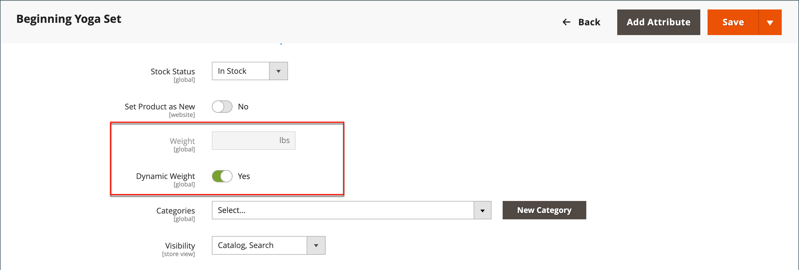

# Paket-Produkt

Ein Bundle ist eine _Erstellen eigener_, anpassbares Produkt. Jedes Element in einem Bundle kann auf einem der folgenden Produkttypen basieren:

- [Einfaches Produkt](product-create-simple.md)
- [Virtuelles Produkt](product-create-virtual.md)
- [herunterladbares Produkt](product-create-downloadable.md)
- [Virtuelles Produkt](product-create-virtual.md)

{width="700" zoomable="yes"}

Die Optionen werden angezeigt, wenn der Kunde auf Folgendes klickt: **[!UICONTROL Customize]** oder **[!UICONTROL Add to Cart]**. Da die im Bundle enthaltenen Produkte variieren, können SKU, Preis und Gewichtung entweder auf einen dynamischen oder auf einen festen Wert eingestellt werden.

>[!NOTE]
>
>Für Bundle-Produkte, die dynamische Preise verwenden, ist der Mindestpreis für Werbung (MAP) nicht verfügbar.

>[!NOTE]
>
>Das übergeordnete Bundle-Produkt wird immer automatisch als Upsell-Produkt für alle untergeordneten Produkte angezeigt.

Wenn [Sofortiger Kauf](../stores-purchase/checkout-instant-purchase.md) ist verfügbar, die _Sofortiger Kauf_ -Schaltfläche wird unter der _Zum Warenkorb hinzufügen_ -Schaltfläche für jedes Element im Bundle.

{width="600" zoomable="yes"}

Die folgenden Anweisungen führen Sie durch den Prozess der Erstellung eines Bundle-Produkts mit einem [Produktvorlage](attribute-sets.md), erforderliche Felder und grundlegende Einstellungen. Jedes erforderliche Feld ist mit einem roten Sternchen (`*`). Wenn Sie die Grundlagen abgeschlossen haben, können Sie die anderen Produkteinstellungen nach Bedarf abschließen.

## Schritt 1: Produkttyp auswählen

1. Im _Admin_ Seitenleiste, navigieren Sie zu **[!UICONTROL Catalog]** > **[!UICONTROL Products]**.

1. In der oberen rechten Ecke auf der _[!UICONTROL Add Product]_( {width="25"} ), wählen Sie **[!UICONTROL Bundle Product]**.

   {width="700" zoomable="yes"}

## Schritt 2: Attributsatz auswählen

So wählen Sie die [Attributset](attribute-sets.md) , die als Vorlage für das Produkt verwendet wird, führen Sie einen der folgenden Schritte aus:

- Für **[!UICONTROL Search]** den Namen des Attributsatzes eingeben,
- Wählen Sie in der Liste den Attributsatz aus, den Sie verwenden möchten.

Das Formular wird entsprechend der Änderung aktualisiert.

{width="600" zoomable="yes"}

## Schritt 3: Ausführen der erforderlichen Einstellungen

1. Produkt eingeben **[!UICONTROL Product Name]**.

1. Akzeptieren Sie entweder die Standardeinstellung **[!UICONTROL SKU]** , der auf dem Produktnamen basiert, oder geben Sie einen anderen Wert ein.

   Gehen Sie wie folgt vor, um den SKU-Typ zu ermitteln, der jedem Bundle-Element zugewiesen ist:

   - A **[!UICONTROL Dynamic SKU]** kann automatisch jedem Bundle-Element zugewiesen werden, indem der standardmäßigen SKU ein Suffix hinzugefügt wird. Standardmäßig ist er auf `Yes`.

   - Wenn Sie für jedes Bundle-Element eine eindeutige SKU zuweisen möchten, legen Sie **[!UICONTROL Dynamic SKU]** nach `No`.

   {width="600" zoomable="yes"}

1. Führen Sie einen der folgenden Schritte aus, um den Preis des Bundles zu ermitteln:

   - Damit der Preis die vom Kunden gewählten Optionen widerspiegelt, setzen Sie **[!UICONTROL Dynamic Price]** nach `Yes` und verlassen **[!UICONTROL Price]** leer.

   - Um einen festen Preis für das Bundle zu berechnen, legen Sie **[!UICONTROL Dynamic Price]** nach `No` und geben Sie die **[!UICONTROL Price]** die Sie für das Bundle aufladen möchten.

   >[!NOTE]
   >
   >[!UICONTROL Special Price] und [!UICONTROL Customer Group Price] (Tier Price) werden immer als Rabattprozentsatz für alle Bundle-Produktarten festgelegt.

1. Da das Produkt noch nicht zur Veröffentlichung bereit ist, legen Sie **[!UICONTROL Enable Product]** nach `No`.

1. Klicks **[!UICONTROL Save]** und fortfahren.

   Wenn das Produkt gespeichert wird, wird die [Store-Ansicht](introduction.md#product-scope) wird in der linken oberen Ecke angezeigt.

1. Wählen Sie die **[!UICONTROL Store View]** wo das Produkt verfügbar sein soll.

   {width="600" zoomable="yes"}

## Schritt 4: Grundlegende Einstellungen durchführen

1. Wenn das Bundle feste Preise hat, legen Sie **[!UICONTROL Tax Class]** auf einen der folgenden Werte zu:

   - `None`
   - `Taxable Goods`

   Wenn das Bundle über dynamische Preise verfügt, wird die Steuer für **_each_** Bundle-Element Wenn das Bundle feste Preise hat, wird die Steuer für die Variable **_ganz_** Paket-Produkt.

1. Beachten Sie Folgendes:

   - Die **[!UICONTROL Quantity]** ist nicht verfügbar, da der Wert für jedes Bundle-Element bestimmt wird.

   - Standardmäßig wird die Variable **[!UICONTROL Stock Status]** auf `In Stock`.

1. Führen Sie einen der folgenden Schritte aus, um die Gewichtung des Bundles zu bestimmen:

   - Damit die Gewichtung den vom Kunden gewählten Optionen entspricht, legen Sie **[!UICONTROL Dynamic Weight]** set `Yes` und verlassen **[!UICONTROL Weight]** leer.

   - Um dem Bundle eine feste Gewichtung zuzuweisen, legen Sie **[!UICONTROL Dynamic Weight]** nach `No` und geben Sie die **[!UICONTROL Weight]** des Bundles.

   {width="600" zoomable="yes"}

1. So stellen Sie das Produkt in der Liste der [neue Produkte](../content-design/widget-new-products-list.md), wählen Sie die **[!UICONTROL Set Product as New]** aktivieren.

1. Standard akzeptieren **[!UICONTROL Visibility]** Einstellung von `Catalog, Search`.

1. Zuweisen _[!UICONTROL Categories]_klicken Sie auf das **[!UICONTROL Select…]**und führen Sie einen der folgenden Schritte aus:

   **Wählen Sie eine vorhandene Kategorie aus:**

   - Beginnen Sie mit der Eingabe in das Feld, bis Sie eine Übereinstimmung finden.

   - Aktivieren Sie das Kontrollkästchen der jeweiligen Kategorie, die zugewiesen werden soll.

   {width="600" zoomable="yes"}

   **Erstellen Sie eine Kategorie:**

   - Klicks **[!UICONTROL New Category]**.

   - Geben Sie die **[!UICONTROL Category Name]** und wählen Sie **[!UICONTROL Parent Category]**, der seine Position in der Menüstruktur bestimmt.

   - Klicks **[!UICONTROL Create Category]**.

1. Wählen Sie die **[!UICONTROL Country of Manufacture]**.

   Es kann zusätzliche Attribute geben, die das Produkt beschreiben. Die Auswahl variiert den Attributsatz und kann später abgeschlossen werden.

## Schritt 5: Hinzufügen der Bundle-Elemente

Die _[!UICONTROL Bundle Items]_-Abschnitt wird verwendet, um einem Bundle-Produkttyp Elemente hinzuzufügen und die aktuelle Elementauswahl zu bearbeiten.

{width="600" zoomable="yes"}

1. Scrollen Sie nach unten zum _Bundle-Elemente_ Abschnitt und Satz **[!UICONTROL Ship Bundle Items]** auf einen der folgenden Werte zu:

   - `Separately`
   - `Together`

   Wenn Sie `Together`, müssen alle Bundle-Elemente denselben [source](../inventory-management/sources-manage.md).

1. Klicks **[!UICONTROL Add Option]** und gehen Sie wie folgt vor:

   - Geben Sie eine **[!UICONTROL Option Title]** als Feldbezeichnung verwendet werden.

   - Satz **[!UICONTROL Input Type]** auf einen der folgenden Werte zu:

      - `Drop-down`
      - `Radio buttons`
      - `Checkbox`
      - `Multiple Select`

   - Um das Feld zu einem erforderlichen Eintrag zu machen, wählen Sie die **[!UICONTROL Required]** aktivieren.

   - Klicks **[!UICONTROL Add Products to Option]** und aktivieren Sie das Kontrollkästchen jedes Produkts, das Sie in diese Option aufnehmen möchten.

     Wenn es viele Produkte gibt, verwenden Sie die Listenfilter und Seitenumbruchsteuerungen, um die benötigten Produkte zu finden.

   - Klicks **[!UICONTROL Add Selected Products]**.

     {width="600" zoomable="yes"}

   - Nachdem die Elemente im _Optionen_ -Abschnitt ein Element auswählen, um **[!UICONTROL Default]** auswählen.

   - Im _Standardmenge_ geben Sie die Menge jedes Elements ein, das dem Bundle hinzugefügt werden soll, wenn ein Kunde das Element auswählt.

   - Um Kunden die Änderung der Menge eines Bundle-Elements zu ermöglichen, wählen Sie **[!UICONTROL User Defined]**.

     >[!NOTE]
     >
     >Die Menge kann ein vordefinierter oder ein benutzerdefinierter Wert sein. Weisen Sie jedoch nicht die _[!UICONTROL User Defined]_-Eigenschaft zu aktivieren oder Eingabetypen mit Mehrfachauswahl aktivieren.

     Standardmäßig kann die Standardmenge, die in einem Bundle-Element enthalten ist, vom Kunden nicht geändert werden. Der Kunde kann jedoch die Menge des Elements eingeben, das in das Bundle aufgenommen werden soll.

     Wenn beispielsweise die Standardmenge des Sprite-Status-Balls auf `2` und Kundenbestellungen `4` der Option &quot;Bundle&quot;die Gesamtzahl der gekauften Kugeln beträgt `8`.

     {width="600" zoomable="yes"}

1. Wiederholen Sie diese Schritte für jedes Element, das Sie zum Bundle hinzufügen möchten.

1. Um die Reihenfolge der Elemente in einem Bundle-Abschnitt zu ändern, klicken Sie auf das _Verschieben_ (  ) am Anfang der Zeile und ziehen Sie das Element an die gewünschte Position.

   {width="600" zoomable="yes"}

   Die Reihenfolge der Elemente kann auch in den Daten eines exportierten Bundle-Produkts geändert und dann erneut in den Katalog importiert werden. Weitere Informationen finden Sie unter [Importieren von Bundle-Produkten](../systems/data-transfer-bundle-products.md).

   Um eine bessere Ansicht des Arbeitsbereichs zu erhalten, reduzieren Sie zunächst jeden Abschnitt und ziehen ihn dann an die gewünschte Position.

1. Um ein Element aus dem Paket zu entfernen, klicken Sie auf das **[!UICONTROL Delete]** (  ).

1. Wenn Sie fertig sind, klicken Sie auf **[!UICONTROL Save]**.

## Schritt 6: Produktinformationen ausfüllen

Scrollen Sie nach unten und füllen Sie die Informationen in den folgenden Abschnitten nach Bedarf aus:

- [Inhalt](product-content.md)
- [Bilder und Videos](product-images-and-video.md)
- [Suchmaschinenoptimierung](product-search-engine-optimization.md)
- [Zugehörige Produkte, Up-Sells und Cross-Sells](related-products-up-sells-cross-sells.md)
- [Anpassbare Optionen](settings-advanced-custom-options.md)
- [Produkte in Websites](settings-basic-websites.md)
- [Design](settings-advanced-design.md)
- [Geschenkoptionen](product-gift-options.md)

## Schritt 7: Produkt veröffentlichen

1. Wenn Sie bereit sind, das Produkt im Katalog zu veröffentlichen, legen Sie **[!UICONTROL Enable Product]** nach `Yes` (  ).

1. Führen Sie einen der folgenden Schritte aus:

   **Methode 1:** Speichern und Vorschau anzeigen

   - Klicken Sie oben rechts auf **[!UICONTROL Save]**.

   - Um das Produkt in Ihrem Geschäft anzuzeigen, wählen Sie **[!UICONTROL Customer View]** auf _Admin_ (  ).

     Der Store wird in einer neuen Browser-Registerkarte geöffnet.

   {width="600" zoomable="yes"}

   **Methode 2:** Speichern und schließen

   Im _[!UICONTROL Save]_( {width="25"} ), wählen Sie **[!UICONTROL Save & Close]**.

## Eingabefelder

| Kontrolle | Beschreibung | Beispiel |
|--- |--- |--- |
| [!UICONTROL Drop-down] | Zeigt eine Dropdownliste mit Optionen mit Produktname und Preis an. Es kann nur ein Element ausgewählt werden. | {width="200"} |
| [!UICONTROL Radio Buttons] | Zeigt für jede Option ein Optionsfeld an, gefolgt von Produktname und Preis. Es kann nur ein Element ausgewählt werden. | {width="200"} |
| [!UICONTROL Checkbox] | Zeigt ein Kontrollkästchen für jede Option an, gefolgt vom Produktnamen und dem Preis. Es können mehrere Elemente ausgewählt werden. | {width="200"} |
| [!UICONTROL Multiple Select] | Zeigt eine Liste der Optionen mit Produktname und Preis an. Um mehrere Elemente auszuwählen, halten Sie die Strg-Taste (PC) oder die Befehlstaste (Mac) gedrückt und klicken Sie auf jedes Element. | {width="200"} |

{style="table-layout:auto"}

## Feldbeschreibungen

| Feld | Beschreibung |
|--- |--- |
| [!UICONTROL SKU] | Bestimmt, ob jedem Element eine Variable oder dynamische SKU zugewiesen wird oder ob eine feste SKU für das Bundle verwendet wird. Optionen: `Fixed` / `Dynamic` |
| [!UICONTROL Weight] | Gibt an, ob die Gewichtung anhand der ausgewählten Elemente berechnet wird oder eine feste Gewichtung für das gesamte Bundle ist. Optionen: `Fixed` / `Dynamic` |
| [!UICONTROL Price View] | Bestimmt, ob der Produktpreis als Bereich angezeigt wird, vom billigsten zum teuersten (Preisbereich) oder mit dem preiswertesten (Als Niedrig). Optionen: `Price Range` / `As Low As` |
| Pakete für Schiffe | Gibt an, ob einzelne Elemente separat ausgeliefert werden können. |

{style="table-layout:auto"}

## Produktstatus des Bundles

Status des Produktbestands des Bundles ist **_automatisch in &quot;Nicht vorrätig&quot;geändert_** wenn eines dieser Szenarien eintritt:

- Alle Optionen sind optional und alle zugehörigen Produkte sind _Nicht vorrätig_.

- Einige Optionen sind erforderlich und Produkte, die mit den erforderlichen Optionen verknüpft sind, sind _Nicht vorrätig_.

Status des Produktbestands des Bundles ist **_nicht automatisch in &quot;Nicht auf Lager&quot;geändert_** wenn eines dieser Szenarien eintritt:

- Alle Optionen sind optional und mindestens ein verknüpftes Produkt ist verfügbar. _Auf Lager_.

- Einige Optionen sind erforderlich und mindestens ein zugehöriges Produkt in jeder erforderlichen Option ist _Auf Lager_.

## Dinge, die man sich merken sollte

 Kunden können _Erstellen eigener_ Paket-Produkt.

 Bundle-Elemente können einfache oder virtuelle Produkte ohne benutzerdefinierte Optionen sein.

 Die Preisansicht kann auf Folgendes eingestellt werden: `Price Range` oder `As Low As`.

 SKU und Gewichtung können entweder `Fixed` oder `Dynamic`.

 Die Menge kann ein vordefinierter oder ein benutzerdefinierter Wert sein. Weisen Sie jedoch nicht die _[!UICONTROL User Defined]_-Eigenschaft zu aktivieren oder Eingabetypen mit Mehrfachauswahl aktivieren.

 Bundle-Elemente können zusammen oder separat versendet werden.

 Das übergeordnete Bundle-Produkt wird immer automatisch als Upsell-Produkt für alle untergeordneten Produkte angezeigt.

 [!UICONTROL Special Price] und [!UICONTROL Customer Group Price] (Tier Price) werden immer als Rabattprozentsatz für alle Bundle-Produktarten festgelegt.
