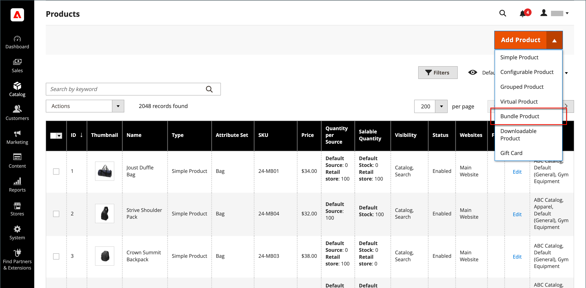

# Produkt im Paket

Ein Bundle ist ein _eigenes erstellen_, anpassbares Produkt. Jedes Element in einem Bundle kann auf einem der folgenden Produkttypen basieren:

- [einfaches Produkt](product-create-simple.md)
- [Virtuelles Produkt](product-create-virtual.md)

{width="700" zoomable="yes"}

Die Optionen werden angezeigt, wenn der Kunde entweder auf **[!UICONTROL Customize]** oder auf **[!UICONTROL Add to Cart]** klickt. Da die im Bundle enthaltenen Produkte variieren, können SKU, Preis und Gewicht entweder auf einen dynamischen oder auf einen festen Wert festgelegt werden.

>[!NOTE]
>
>Der Mindest-Angebotspreis (MAP) ist nicht für Bundle-Produkte verfügbar, die dynamische Preise verwenden.

>[!NOTE]
>
>Das übergeordnete Bundle-Produkt wird für alle untergeordneten Produkte immer automatisch als Upsell-Produkt angezeigt.

Wenn [Sofortkauf](../stores-purchase/checkout-instant-purchase.md) verfügbar ist, wird die Schaltfläche _Sofortkauf_ für jeden Artikel im Bundle unter der Schaltfläche _Zum Warenkorb_ angezeigt.

{width="600" zoomable="yes"}

Die folgenden Anweisungen führen Sie durch den Prozess der Erstellung eines Produktpakets mithilfe einer [Produktvorlage](attribute-sets.md), erforderlichen Feldern und Grundeinstellungen. Jedes erforderliche Feld ist mit einem roten Sternchen (`*`) gekennzeichnet. Wenn Sie die Grundlagen fertig gestellt haben, können Sie die anderen Produkteinstellungen nach Bedarf abschließen.

## Schritt 1: Produkttyp auswählen

1. Navigieren Sie in der _Admin_-Seitenleiste zu **[!UICONTROL Catalog]** > **[!UICONTROL Products]**.

1. Wählen Sie oben rechts im Menü _[!UICONTROL Add Product]_( {width="25"} ) die Option **[!UICONTROL Bundle Product]**&#x200B;aus.

   {width="700" zoomable="yes"}

## Schritt 2: Attributsatz auswählen

Um den [Attributsatz](attribute-sets.md) auszuwählen, der als Vorlage für das Produkt verwendet wird, führen Sie einen der folgenden Schritte aus:

- Geben Sie **[!UICONTROL Search]** den Namen des Attributsatzes ein,
- Wählen Sie in der Liste den Attributsatz aus, den Sie verwenden möchten.

Das Formular wird mit der Änderung aktualisiert.

{width="600" zoomable="yes"}

## Schritt 3: Erforderliche Einstellungen vornehmen

1. Geben Sie die **[!UICONTROL Product Name]** ein.

1. Akzeptieren Sie entweder die **[!UICONTROL SKU]**, die auf dem Produktnamen basiert, oder geben Sie einen anderen Wert ein.

   Gehen Sie wie folgt vor, um den SKU-Typ zu ermitteln, der jedem Bundle-Element zugewiesen ist:

   - Jedem Bundle-Element kann automatisch ein **[!UICONTROL Dynamic SKU]** zugewiesen werden, indem der Standard-SKU ein Suffix hinzugefügt wird. Standardmäßig ist dies auf `Yes` festgelegt.

   - Wenn Sie für jedes Bundle-Element eine eindeutige SKU zuweisen möchten, setzen Sie **[!UICONTROL Dynamic SKU]** auf `No`.

   {width="600" zoomable="yes"}

1. Führen Sie einen der folgenden Schritte aus, um den Preis des Pakets zu bestimmen:

   - Damit der Preis die vom Kunden gewählten Optionen widerspiegelt, setzen Sie **[!UICONTROL Dynamic Price]** auf `Yes` und lassen Sie **[!UICONTROL Price]** leer. In diesem Fall hat ein gebündeltes Produkt keinen eigenen Preis aus dem Katalog, und der Produktpreis wird aus dem Preis der einzelnen Produkte abgeleitet, die im Paket enthalten sind.

   - Um einen Festpreis für das Bundle zu berechnen, setzen Sie **[!UICONTROL Dynamic Price]** auf `No` und geben Sie die **[!UICONTROL Price]** ein, die Sie für das Bundle berechnen möchten.

   >[!NOTE]
   >
   >[!UICONTROL Special Price] und [!UICONTROL Customer Group Price] (Stufenpreis) werden immer als Rabattprozentsatz für alle Bundle-Produktarten festgelegt.

1. Da das Produkt noch nicht zur Veröffentlichung bereit ist, setzen Sie **[!UICONTROL Enable Product]** auf `No`.

1. Klicken Sie auf **[!UICONTROL Save]** und fahren Sie fort.

   Wenn das Produkt gespeichert wird, wird [ Auswahl „Store](introduction.md#product-scope)Ansicht“ in der oberen linken Ecke angezeigt.

1. Wählen Sie die **[!UICONTROL Store View]** aus, in der das Produkt verfügbar sein soll.

   {width="600" zoomable="yes"}

## Schritt 4: Vervollständigen Sie die Grundeinstellungen

1. Wenn das Bundle Festpreise aufweist, legen Sie **[!UICONTROL Tax Class]** auf einen der folgenden Werte fest:

   - `None`
   - `Taxable Goods`

   Wenn das Bundle über eine dynamische Preisfindung verfügt, wird die Steuer für **_jedes_** Bundle-Element bestimmt. Wenn das Bundle Festpreise hat, wird die Steuer für das **_gesamte_** Bundle-Produkt bestimmt.

1. Beachten Sie Folgendes:

   - Die **[!UICONTROL Quantity]** ist nicht verfügbar, da der Wert für jedes Bundle-Element bestimmt wird.

   - Standardmäßig ist der **[!UICONTROL Stock Status]** auf `In Stock` festgelegt.

1. Führen Sie einen der folgenden Schritte aus, um die Gewichtung des Bundles zu bestimmen:

   - Damit die Gewichtung den vom Kunden ausgewählten Optionen entspricht, legen Sie **[!UICONTROL Dynamic Weight]** `Yes` fest und lassen Sie **[!UICONTROL Weight]** leer.

   - Um dem Bundle eine feste Gewichtung zuzuweisen, setzen Sie **[!UICONTROL Dynamic Weight]** auf `No` und geben Sie die **[!UICONTROL Weight]** des Bundles ein.

   {width="600" zoomable="yes"}

1. Um das Produkt in der Liste der [neuen Produkte](../content-design/widget-new-products-list.md) zu verwenden, aktivieren Sie das Kontrollkästchen **[!UICONTROL Set Product as New]** .

1. Akzeptieren Sie die **[!UICONTROL Visibility]** Standardeinstellung von `Catalog, Search`.

1. Um dem Produkt _[!UICONTROL Categories]_&#x200B;zuzuweisen, klicken Sie auf das **[!UICONTROL Select…]**&#x200B;und führen Sie einen der folgenden Schritte aus:

   **Vorhandene Kategorie auswählen:**

   - Beginnen Sie mit der Eingabe in das Feld, bis Sie eine Übereinstimmung finden.

   - Aktivieren Sie das Kontrollkästchen jeder Kategorie, die zugewiesen werden soll.

   {width="600" zoomable="yes"}

   **Erstellen einer Kategorie:**

   - Klicken Sie auf **[!UICONTROL New Category]**.

   - Geben Sie die **[!UICONTROL Category Name]** ein und wählen Sie die **[!UICONTROL Parent Category]** aus, die ihre Position in der Menüstruktur bestimmt.

   - Klicken Sie auf **[!UICONTROL Create Category]**.

1. Wählen Sie die **[!UICONTROL Country of Manufacture]** aus.

   Möglicherweise gibt es zusätzliche Attribute, die das Produkt beschreiben. Die Auswahl variiert im Attributsatz und kann später abgeschlossen werden.

## Schritt 5: Bundle-Elemente hinzufügen

Der Abschnitt _[!UICONTROL Bundle Items]_&#x200B;wird verwendet, um Elemente zu einem Bundle-Produkttyp hinzuzufügen und die aktuelle Auswahl von Elementen zu bearbeiten.

{width="600" zoomable="yes"}

1. Scrollen Sie nach unten zum Abschnitt _Bundle Items_ und legen Sie **[!UICONTROL Ship Bundle Items]** auf eine der folgenden Einstellungen fest:

   - `Separately`
   - `Together`

   Wenn Sie `Together` auswählen, müssen allen Bundle-Elementen dieselbe [Quelle“ zugewiesen ](../inventory-management/sources-manage.md).

1. Klicken Sie auf **[!UICONTROL Add Option]** und führen Sie folgende Schritte aus:

   - Geben Sie einen **[!UICONTROL Option Title]** ein, der als Feldbezeichnung verwendet werden soll.

   - Legen Sie **[!UICONTROL Input Type]** auf eine der folgenden Einstellungen fest:

      - `Drop-down`
      - `Radio buttons`
      - `Checkbox`
      - `Multiple Select`

   - Um das Feld zu einem erforderlichen Eintrag zu machen, aktivieren Sie das Kontrollkästchen **[!UICONTROL Required]** .

   - Klicken Sie auf **[!UICONTROL Add Products to Option]** und aktivieren Sie das Kontrollkästchen jedes Produkts, das Sie in diese Option einbeziehen möchten.

     Wenn es viele Produkte gibt, verwenden Sie die Listenfilter und Paginierungssteuerelemente, um die benötigten Produkte zu finden.

   - Klicken Sie auf **[!UICONTROL Add Selected Products]**.

     {width="600" zoomable="yes"}

   - Nachdem die Elemente im Abschnitt _Optionen_ angezeigt wurden, wählen Sie ein Element als **[!UICONTROL Default]** aus.

   - Geben Sie in _Spalte &quot;_&quot; die Menge jedes Artikels ein, der dem Bundle hinzugefügt werden soll, wenn ein Kunde den Artikel auswählt.

   - Um Kunden zu ermöglichen, die Menge eines Bundle-Artikels zu ändern, wählen Sie **[!UICONTROL User Defined]** aus.

     >[!NOTE]
     >
     >Die Menge kann ein voreingestellter oder benutzerdefinierter Wert sein. Weisen Sie die _[!UICONTROL User Defined]_-Eigenschaft jedoch nicht dem Kontrollkästchen oder den Mehrfach-Auswahl-Eingabetypen zu.

     Standardmäßig kann die Standardmenge, die in einem Bundle-Artikel enthalten ist, vom Kunden nicht geändert werden. Der Kunde kann jedoch die Menge des Artikels eingeben, der in das Paket aufgenommen werden soll.

     Wenn beispielsweise die Standardmenge der Sprite Status Ball auf `2` eingestellt ist und der Kunde `4` dieser Bundle-Option bestellt, wird die Gesamtzahl der gekauften Bälle `8`.

     {width="600" zoomable="yes"}

1. Wiederholen Sie diese Schritte für jedes Element, das Sie dem Bundle hinzufügen möchten.

1. Um die Reihenfolge der Elemente in einem Bundle-Abschnitt zu ändern, klicken Sie auf _Verschieben_-Symbol  ) am Anfang der Zeile und ziehen Sie das Element an die gewünschte Position.

   {width="600" zoomable="yes"}

   Die Reihenfolge der Elemente kann auch in den Daten eines exportierten Produktpakets geändert und dann erneut in den Katalog importiert werden. Weitere Informationen finden Sie unter [Bundle-Produkte importieren](../systems/data-transfer-bundle-products.md).

   Um eine bessere Ansicht des Arbeitsbereichs zu erhalten, reduzieren Sie zuerst jeden Abschnitt und ziehen Sie ihn dann an die gewünschte Position.

1. Um ein Element aus dem Bundle zu entfernen, klicken Sie auf das Symbol **[!UICONTROL Delete]** (  ).

1. Klicken Sie abschließend auf **[!UICONTROL Save]**.

## Schritt 6: Füllen Sie die Produktinformationen aus

Scrollen Sie nach unten und füllen Sie die Informationen in den folgenden Abschnitten nach Bedarf aus:

- [Inhalt](product-content.md)
- [Bilder und Videos](product-images-and-video.md)
- [Suchmaschinenoptimierung](product-search-engine-optimization.md)
- [Ähnliche Produkte, Upsell und Crosssell](related-products-up-sells-cross-sells.md)
- [Anpassbare Optionen](settings-advanced-custom-options.md)
- [Produkte in Websites](settings-basic-websites.md)
- [Design](settings-advanced-design.md)
- [Geschenkoptionen](product-gift-options.md)

## Schritt 7: Publish das Produkt

1. Wenn Sie bereit sind, das Produkt im Katalog zu veröffentlichen, legen Sie **[!UICONTROL Enable Product]** auf `Yes` fest (  ).

1. Führen Sie einen der folgenden Schritte aus:

   **Methode 1: Speichern** Vorschau

   - Klicken Sie oben rechts auf **[!UICONTROL Save]**.

   - Um das Produkt in Ihrem Geschäft anzuzeigen, wählen Sie **[!UICONTROL Customer View]** im Menü _Admin_ (  ).

     Der Store wird in einer neuen Browser-Registerkarte geöffnet.

   {width="600" zoomable="yes"}

   **Methode 2:** Speichern und schließen

   Wählen Sie im Menü _[!UICONTROL Save]_( {width="25"} ) die Option **[!UICONTROL Save & Close]**&#x200B;aus.

## Eingabedialoge

| Kontrolle | Beschreibung | Beispiel |
|--- |--- |--- |
| [!UICONTROL Drop-down] | Zeigt eine Dropdown-Liste mit Optionen mit Produktname und Preis an. Es kann nur ein Element ausgewählt werden. | {width="200"} |
| [!UICONTROL Radio Buttons] | Zeigt für jede Option ein Optionsfeld an, gefolgt vom Produktnamen und dem Preis. Es kann nur ein Element ausgewählt werden. | {width="200"} |
| [!UICONTROL Checkbox] | Zeigt für jede Option ein Kontrollkästchen mit dem Produktnamen und dem Preis an. Es können mehrere Elemente ausgewählt werden. | {width="200"} |
| [!UICONTROL Multiple Select] | Zeigt eine Liste von Optionen mit Produktname und Preis an. Um mehrere Elemente auszuwählen, halten Sie die Strg-Taste (PC) oder die Befehlstaste (Mac) gedrückt und klicken Sie auf die einzelnen Elemente. | {width="200"} |

{style="table-layout:auto"}

## Feldbeschreibungen

| Feld | Beschreibung |
|--- |--- |
| [!UICONTROL SKU] | Bestimmt, ob jedem Element eine variable oder dynamische SKU zugewiesen ist oder ob eine feste SKU für das Bundle verwendet wird. Optionen: `Fixed` / `Dynamic` |
| [!UICONTROL Weight] | Gibt an, ob die Gewichtung basierend auf den ausgewählten Elementen berechnet wird oder eine feste Gewichtung für das gesamte Bundle ist. Optionen: `Fixed` / `Dynamic` |
| [!UICONTROL Price View] | Bestimmt, ob der Produktpreis als Spanne zwischen dem niedrigsten und dem teuersten Preis (Preisspanne) oder dem niedrigsten Preis (Niedrig bis) angezeigt wird. Optionen: `Price Range` / `As Low As` |
| Paketartikel versenden | Gibt an, ob einzelne Artikel separat versendet werden können. |

{style="table-layout:auto"}

## Status des gebündelten Produktbestands

Der Lagerstatus des Bundles wird **_automatisch in „Nicht vorrätig_** geändert, wenn eines der folgenden Szenarien eintritt:

- Alle Optionen sind optional und alle zugehörigen Produkte sind _nicht vorrätig_.

- Einige Optionen sind erforderlich und Produkte, die mit den erforderlichen Optionen verknüpft sind, sind _nicht vorrätig_.

Der Lagerstatus des Bundles wird **_nicht automatisch in „Nicht vorrätig_** geändert, wenn eines dieser Szenarien eintritt:

- Alle Optionen sind optional und mindestens ein verknüpftes Produkt ist _Auf Lager_.

- Einige Optionen sind erforderlich und mindestens ein zugehöriges Produkt in jeder erforderlichen Option ist _Auf Lager_.

## Zu beachtende Dinge

 Kunden können _ihr eigenes_ Bundle erstellen.

 Alle untergeordneten Produkte werden dem Bundle-Produkt (**_)_** für alle Websites, Stores und Store-Ansichten gleichzeitig zugewiesen und deren Zuweisung aufgehoben.

 Bundle-Elemente können einfache oder virtuelle Produkte ohne benutzerdefinierte Optionen sein.

 Die Preisansicht kann entweder auf `Price Range` oder auf `As Low As` festgelegt werden.

 SKU und Gewicht können entweder `Fixed` oder `Dynamic` sein.

 Die Menge kann ein voreingestellter oder benutzerdefinierter Wert sein. Weisen Sie die _[!UICONTROL User Defined]_-Eigenschaft jedoch nicht dem Kontrollkästchen oder den Mehrfach-Auswahl-Eingabetypen zu.

 Bundle-Elemente können zusammen oder separat versendet werden.

 Das übergeordnete Bundle-Produkt wird für alle untergeordneten Produkte immer automatisch als Upsell-Produkt angezeigt.

 [!UICONTROL Special Price] und [!UICONTROL Customer Group Price] (Stufenpreis) werden immer als Rabattprozentsatz für alle Bundle-Produkttypen festgelegt.
