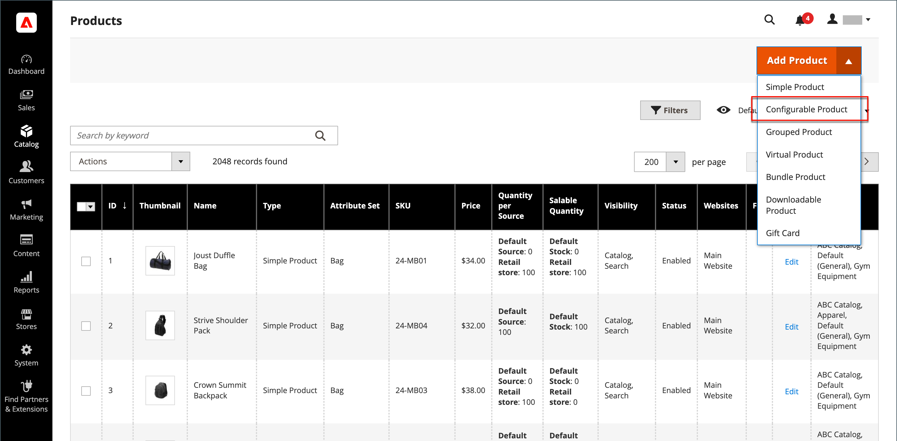

# Konfigurierbares Produkt

Ein konfigurierbares Produkt sieht wie ein einzelnes Produkt mit einer Dropdown-Liste für jede Variante aus. Jedes Listenelement ist eigentlich ein separates einfaches Produkt mit einer eindeutigen SKU, die es ermöglicht, den Bestand für jede Produktvariante zu verfolgen. Sie könnten einen ähnlichen Effekt erzielen, indem Sie ein einfaches Produkt mit benutzerdefinierten Optionen verwenden, aber ohne die Möglichkeit, den Bestand für jede Variante zu verfolgen.

Die folgenden Anweisungen zeigen den Prozess der Erstellung eines konfigurierbaren Produkts mithilfe einer [Produktvorlage](attribute-sets.md), erforderlichen Feldern und grundlegenden Einstellungen. Jedes erforderliche Feld ist mit einem roten Sternchen (`*`) gekennzeichnet. Wenn Sie die Grundlagen fertig gestellt haben, können Sie die anderen Produkteinstellungen nach Bedarf abschließen.

{width="700" zoomable="yes"}

## Teil 1: Erstellen eines konfigurierbaren Produkts

Obwohl ein konfigurierbares Produkt mehr SKUs verwendet und die Einrichtung anfangs etwas länger dauern kann, kann es Ihnen am Ende Zeit sparen. Wenn Sie planen, Ihr Geschäft auszubauen, ist der konfigurierbare Produkttyp eine gute Wahl für Produkte mit mehreren Optionen.

Bereiten Sie vor dem Start einen [Attributsatz](attribute-sets.md) vor, der ein Attribut enthält, das für jede Produktvariante auf einen der zulässigen Eingabetypen festgelegt ist. Der Attributsatz kann beispielsweise Dropdown-Attribute für Farbe und Größe enthalten.

Die Eigenschaften der einzelnen Attribute, die für eine konfigurierbare Produktvariante verwendet werden, müssen die folgenden Einstellungen aufweisen:

### Anforderungen an Produktvariantenattribute

| Eigenschaft | Einstellung |
|--- |--- |
| [!UICONTROL Scope] | `Global` |
| [!UICONTROL Catalog Input Type for Store Owner] | Der Eingabetyp eines Attributs, das für eine Produktvariante verwendet wird, muss einer der folgenden sein: `Dropdown`, `Visual Swatch` oder `Text Swatch`. |
| [!UICONTROL Values Required] | `Yes` |
| [!UICONTROL Use for Promo Rule Conditions] | `Yes` |

{style="table-layout:auto"}

### Schritt 1: Produkttyp auswählen

1. Navigieren Sie in der _Admin_-Seitenleiste zu **[!UICONTROL Catalog]** > **[!UICONTROL Products]**.

1. Wählen Sie im Menü _[!UICONTROL Add Product]_{width="25"} oben rechts **[!UICONTROL Configurable Product]**aus.

   {width="700" zoomable="yes"}

### Schritt 2: Attributsatz auswählen

Der [Attributsatz](attribute-sets.md) bestimmt die Auswahl der Felder, die im Produkt verwendet werden. Der im folgenden Beispiel verwendete Attributsatz weist Attribute für Farbe und Größe auf. Der Name des Attributsatzes wird oben auf der Seite angezeigt und ist zunächst auf `Default` festgelegt.

1. Um das für das Produkt festgelegte Attribut auszuwählen, klicken Sie auf das Feld oben auf der Seite und führen Sie einen der folgenden Schritte aus:

   - Geben Sie **[!UICONTROL Search]** den Namen des Attributsatzes an.
   - Wählen Sie in der Liste den Attributsatz aus, den Sie verwenden möchten.

   Das Formular wird mit der Änderung aktualisiert.

1. Wenn Sie dem Attributsatz ein weiteres Attribut hinzufügen möchten, klicken Sie auf **[!UICONTROL Add Attribute]** und befolgen Sie die Anweisungen unter [Attribut hinzufügen](product-attributes-add.md).

   {width="600" zoomable="yes"}

### Schritt 3: Erforderliche Einstellungen vornehmen

1. Geben Sie die **[!UICONTROL Product Name]** ein.

1. Akzeptieren Sie die **[!UICONTROL SKU]**, die auf dem Produktnamen basiert, oder geben Sie einen anderen ein.

1. Geben Sie die **[!UICONTROL Price]** ein.

1. Da das Produkt noch nicht zur Veröffentlichung bereit ist, setzen Sie **[!UICONTROL Enable Product]** auf `No`.

1. Klicken Sie auf **[!UICONTROL Save]** und fahren Sie fort.

   Wenn das Produkt gespeichert wird, wird [ Auswahl „Store](introduction.md#product-scope)Ansicht“ in der oberen linken Ecke angezeigt.

1. Wählen Sie die **[!UICONTROL Store View]** aus, in der das Produkt verfügbar sein soll.

   {width="600" zoomable="yes"}

### Schritt 4: Vervollständigen Sie die Grundeinstellungen

1. Legen Sie **[!UICONTROL Tax Class]** auf eine der folgenden Einstellungen fest:

   - `None`
   - `Taxable Goods`

1. Die **[!UICONTROL Quantity]** wird durch die Produktvarianten bestimmt, sodass Sie sie leer lassen können.

1. Belassen Sie die **[!UICONTROL Stock Status]** als eingestellt.

   Der Lagerstatus eines konfigurierbaren Produkts wird durch jede zugehörige Konfiguration bestimmt. Da das Produkt gespeichert wurde, ohne eine Menge einzugeben, wird der **[!UICONTROL Stock Status]** auf `Out of Stock` gesetzt.

   >[!NOTE]
   >
   >Der **Lagerstatus** des konfigurierbaren Produkts ist eine **_halbmanuell_** gesteuerte Einstellung. Es wird teilweise durch den Lagerstatus seiner untergeordneten Produkte kontrolliert. Sie ist Teil einer **_Mehrkriterium_** Berechnung des Lagerstatus, die im Abschnitt [Konfigurieren des Lagerstatus](#configure-the-stock-status) beschrieben wird.

1. Geben Sie die **[!UICONTROL Weight]** ein.

>[!NOTE]
>
>Ein konfigurierbares Produkt muss immer eine Gewichtung haben. Wenn Sie **[!UICONTROL This item has no weight]** aus der Dropdown-Liste auswählen, wird diese nach dem Speichern des Produkts automatisch in **[!UICONTROL This item has weight]** geändert.

1. Akzeptieren Sie die **[!UICONTROL Visibility]** Standardeinstellung von `Catalog, Search`.

1. Um das Produkt in der Liste der [neuen Produkte](../content-design/widget-new-products-list.md) zu verwenden, aktivieren Sie das Kontrollkästchen **[!UICONTROL Set Product as New]** .

1. Um dem Produkt Kategorien zuzuweisen, klicken Sie auf das **[!UICONTROL Select…]** und führen Sie einen der folgenden Schritte aus:

   **Vorhandene Kategorie auswählen**:

   - Beginnen Sie mit der Eingabe in das Feld, bis Sie eine Übereinstimmung finden.

   - Aktivieren Sie das Kontrollkästchen der Kategorie, die zugewiesen werden soll.

   {width="600" zoomable="yes"}

   **Erstellen einer Kategorie**:

   - Klicken Sie auf **[!UICONTROL New Category]**.

   - Geben Sie die **[!UICONTROL Category Name]** ein und wählen Sie die **[!UICONTROL Parent Category]** aus, die ihre Position in der Menüstruktur bestimmt.

   s- Klicken Sie auf **[!UICONTROL Create Category]**.

1. Wählen Sie die **[!UICONTROL Country of Manufacture]** aus.

   Es können zusätzliche Attribute vorhanden sein, die zur Beschreibung des Produkts verwendet werden. Die Auswahl variiert je nach Attributsatz, und Sie können sie später abschließen.

### Schritt 5: Speichern und fortfahren

Jetzt ist ein guter Zeitpunkt, um Ihre Arbeit zu speichern. Klicken Sie oben rechts auf **[!UICONTROL Save]**. In der nächsten Reihe von Schritten richten Sie die Konfigurationen für jede Produktvariante ein.

## Teil 2: Hinzufügen von Konfigurationen

Das folgende Beispiel zeigt, wie Konfigurationen für drei Farben und drei Größen hinzugefügt werden. Insgesamt werden neun einfache Produkte mit eindeutigen SKUs erstellt, um jede mögliche Kombination von Varianten abzudecken. Standardmäßig basieren der Produktname und die SKU für jede Variante auf dem Attributwert und entweder dem übergeordneten Produktnamen oder der SKU.

Die Fortschrittsleiste oben auf der Seite zeigt an, wo Sie sich im Prozess befinden, und führt Sie durch die einzelnen Schritte.

### Schritt 1: Attribute auswählen

1. Scrollen Sie dann von oben nach unten zum Abschnitt _[!UICONTROL Configurations]_und klicken Sie auf **[!UICONTROL Create Configurations]**.

   {width="600" zoomable="yes"}

1. Aktivieren Sie das Kontrollkästchen jedes Attributs, das Sie als Konfiguration einbeziehen möchten.

   In diesem Beispiel sind `color` und `size` ausgewählt.

   {width="600" zoomable="yes"}

   Die Liste enthält alle Attribute aus dem Attributsatz , die in einem konfigurierbaren Produkt verwendet werden können.

1. Wenn Sie ein Attribut hinzufügen möchten, klicken Sie auf **[!UICONTROL Create New Attribute]** und führen Sie folgende Schritte aus:

   - Vervollständigen Sie die Attributeigenschaften.

   - Klicken Sie auf **[!UICONTROL Save Attribute]**.

   - Aktivieren Sie das Kontrollkästchen für das Attribut .

1. Klicken Sie oben rechts auf **[!UICONTROL Next]**.

### Schritt 2: Attributwerte eingeben

1. Aktivieren Sie für jedes Attribut das Kontrollkästchen der Werte, die für das Produkt gelten.

   {width="600" zoomable="yes"}

1. Um die Attribute neu anzuordnen, greifen Sie das Symbol _Neu anordnen_ (  ) und verschieben Sie den Abschnitt an eine neue Position.

   Die Reihenfolge bestimmt die Position der Dropdown-Listen auf der Produktseite.

1. Klicken Sie in der Fortschrittsleiste auf **[!UICONTROL Next]**.

### Schritt 3: Konfigurieren Sie die Bilder, den Preis und die Menge

Dieser Schritt bestimmt die Bilder, die Preise und die Menge jeder Konfiguration. Die verfügbaren Optionen sind für alle identisch, und Sie können nur eine auswählen. Sie können dieselbe Einstellung auf alle SKUs anwenden, eine eindeutige Einstellung auf jede SKU anwenden oder die Einstellungen für vorerst überspringen.

Wählen Sie die entsprechenden Konfigurationsoptionen aus.

Verwenden Sie eine der folgenden Methoden, um die **[!UICONTROL images]** zu konfigurieren:

**Methode 1:** Wenden Sie einen einzelnen Bildsatz auf alle SKUs an

1. Wählen Sie **[!UICONTROL Apply single set of images to all SKUs]** aus.

1. Navigieren Sie zu jedem Bild, das Sie in die Produktgalerie aufnehmen möchten, oder ziehen Sie es in das Feld.

{width="600" zoomable="yes"}

**Methode 2:** Anwenden eindeutiger Bilder für jede SKU

Da das Bild für das übergeordnete Produkt bereits hochgeladen wurde, können Sie mit dieser Option ein Bild jeder Farbe hochladen. Sie können ein anderes Bild hinzufügen, das im Warenkorb angezeigt wird, wenn jemand den Artikel in einer bestimmten Farbe kauft.

1. Wählen Sie **[!UICONTROL Apply unique images by attribute to each SKU]** aus.

1. Wählen Sie die **[!UICONTROL Attribute]** aus, die die Bilder veranschaulichen, z. B. `color`.

1. Navigieren Sie für jeden Attributwert entweder zu den Bildern, die Sie für diese Konfiguration verwenden möchten, oder ziehen Sie sie in das Feld.

   Wenn Sie das Bild in ein Wertefeld ziehen, wird es auch in den Abschnitten für die anderen Werte angezeigt. Wenn Sie ein Bild löschen möchten, klicken Sie auf das Symbol _Papierkorb_ ().

   {width="600" zoomable="yes"}

Verwenden Sie eine der folgenden Methoden, um die **[!UICONTROL prices]** zu konfigurieren:

>[!NOTE]
>
>Ein konfigurierbares Produkt hat keinen eigenen Preis im Katalog. Der konfigurierbare Produktpreis wird aus den [!UICONTROL In Stock] untergeordneten Produkten abgeleitet.

**Methode 1:** Wenden Sie für alle SKUs denselben Preis an

1. Wenn der Preis für alle Varianten gleich ist, wählen Sie **[!UICONTROL Apply single price to all SKUs]** aus.

1. Geben Sie die **[!UICONTROL Price]** ein.

   {width="600" zoomable="yes"}

**Methode 2:** Für jede SKU einen anderen Preis anwenden

1. Wenn der Preis für jedes oder für einige Varianten des Produkts unterschiedlich ist, wählen Sie **[!UICONTROL Apply unique prices by attribute to each SKU]** aus.

1. Wählen Sie die **[!UICONTROL Attribute]** aus, die der Preisdifferenz zugrunde liegt.

1. Geben Sie die **[!UICONTROL Price]** für jeden Attributwert ein.

   In diesem Beispiel kostet die XL-Größe mehr.

   {width="600" zoomable="yes"}

Verwenden Sie eine der folgenden Methoden, um die **[!UICONTROL Quantity]** zu konfigurieren:

**Methode 1:** Gleiche Menge auf alle SKUs anwenden

Wenn die Menge für alle SKUs gleich ist, wählen Sie **[!UICONTROL Apply single quantity to each SKU]** aus und geben Sie die Menge an.

_Händler aus einer Hand_ - Geben Sie die **[!UICONTROL Quantity]** ein.

_Händler mit mehreren Sources, die [Inventory management](../inventory-management/introduction.md)_ verwenden - Quellen zuweisen und Mengen für alle generierten Produktvarianten hinzufügen:

1. Wählen Sie die Option **[!UICONTROL Apply single quantity to each SKU]** aus.

1. Um eine Quelle hinzuzufügen, klicken Sie auf **[!UICONTROL Assign Sources]**.

1. Suchen Sie nach einer Quelle, die Sie hinzufügen möchten. Aktivieren Sie das Kontrollkästchen neben den Quellen, die Sie für das Produkt hinzufügen möchten.

1. Geben Sie einen Lagerbestand pro Quelle ein.

   {width="600" zoomable="yes"}

**Methode 2:** Anwendung unterschiedlicher Mengen nach Attribut

_Händler aus einer Hand_ - Geben Sie die **[!UICONTROL Quantity]** ein.

_Händler mit mehreren Sources, die [Inventory management](../inventory-management/introduction.md)_ verwenden - Quellen zuweisen und Mengen für alle generierten Produktvarianten hinzufügen:

1. Wenn die Menge für jede SKU unterschiedlich ist, wählen Sie **[!UICONTROL Apply unique quantity by attribute to each SKU]** aus.

1. Geben Sie die **[!UICONTROL Quantity]** für jeden Knoten ein.

   {width="600" zoomable="yes"}

Wenn die Konfiguration der Bilder, des Preises und der Menge abgeschlossen ist, klicken Sie oben rechts auf **[!UICONTROL Next]**.

### Schritt 4: Generieren der Produktkonfigurationen

Warten Sie einen Moment, bis die Liste der Produkte angezeigt wird, und führen Sie einen der folgenden Schritte aus:

- Wenn Sie mit den Konfigurationen zufrieden sind, klicken Sie auf **[!UICONTROL Generate Products]**.

- Um Korrekturen vorzunehmen, klicken Sie auf **[!UICONTROL Back]**.

{width="600" zoomable="yes"}

Die aktuellen Produktvarianten werden unten im Abschnitt _Konfiguration_ angezeigt.

{width="600" zoomable="yes"}

### Schritt 5: Hinzufügen von Produktbildern

1. Scrollen Sie nach unten und erweitern Sie  den Abschnitt _[!UICONTROL Images and Videos]_.

1. Klicken Sie auf _Kamera_ und navigieren Sie zum Hauptbild, das Sie für das konfigurierbare Produkt verwenden möchten.

Weitere Informationen finden Sie unter [Bilder und Video](product-images-and-video.md).

### Schritt 6: Füllen Sie die Produktinformationen aus

Scrollen Sie nach unten und füllen Sie die Informationen in den folgenden Abschnitten nach Bedarf aus:

- [Inhalt](product-content.md)

- [Ähnliche Produkte, Upsell und Crosssell](related-products-up-sells-cross-sells.md)

- [Suchmaschinenoptimierung](product-search-engine-optimization.md)

- [Anpassbare Optionen](settings-advanced-custom-options.md)

- [Produkte in Websites](settings-basic-websites.md)

- [Design](settings-advanced-design.md)

- [Geschenkoptionen](product-gift-options.md)

### Schritt 7: Produkt veröffentlichen

1. Wenn Sie bereit sind, das Produkt im Katalog zu veröffentlichen, legen Sie **[!UICONTROL Enable Product]** auf `Yes` fest und führen Sie einen der folgenden Schritte aus:

   - **Methode 1: Speichern** Vorschau

      - Klicken Sie oben rechts auf **[!UICONTROL Save]**.

      - Um das Produkt in Ihrem Geschäft anzuzeigen, wählen Sie **[!UICONTROL Customer View]** im Menü _Admin_ (  ).

     Der Store wird in einer neuen Browser-Registerkarte geöffnet.

     {width="600" zoomable="yes"}

   - **Methode 2:** Speichern und schließen

     Wählen Sie im Menü _[!UICONTROL Save]_( {width="25"} ) die Option **[!UICONTROL Save & Close]**aus.

### Schritt 8: Konfigurieren der Miniaturansichten des Warenkorbs

Wenn Sie für jede Variante ein anderes Bild haben, können Sie die Konfiguration so einstellen, dass das richtige Bild für die Miniaturansicht des Warenkorbs verwendet wird.

1. Navigieren Sie in _Admin_-Seitenleiste zu **[!UICONTROL Stores]** > _[!UICONTROL Settings]_>**[!UICONTROL Configuration]**.

1. Erweitern Sie im linken Bereich **[!UICONTROL Sales]** und wählen Sie darunter **[!UICONTROL Checkout]**.

1. Erweitern Sie  den Abschnitt _[!UICONTROL Shopping Cart]_.

1. Legen Sie **[!UICONTROL Configurable Product Image]** auf `Product Thumbnail Itself` fest.

1. Klicken Sie abschließend auf **[!UICONTROL Save Config]**.

   {width="600" zoomable="yes"}

## Konfigurieren des Lagerstatus

Der konfigurierbare Produktbestandsstatus unterscheidet sich vom Lagerstatus des einfachen Produkts, wobei er eine direkte Darstellung der Produktverfügbarkeit ist. Für ein konfigurierbares Produkt ist der Lagerstatus Teil einer **_Mehrkriterien_** Bestandsstatusberechnung.

### Übersicht

Die wichtigsten Grundsätze der Bestandsstatusbeziehungen sind:

- Wenn Sie die **[!UICONTROL Stock Status]** des konfigurierbaren Produkts wie `Out of Stock` ändern und auf **[!UICONTROL Save]** klicken, wird es **_nicht_** durch den Lagerstatus seiner untergeordneten Produkte gesteuert. Er wird immer als `Out of Stock` in der Admin und in der Storefront angezeigt.

- Wenn Sie den **[!UICONTROL Stock Status]** des konfigurierbaren Produkts als `In Stock` festlegen und auf **[!UICONTROL Save]** klicken, wird es **_nur teilweise)_** den Lagerstatus seiner untergeordneten Produkte gesteuert, die in der Admin-Konsole und in der Storefront angezeigt werden.

### Detaillierte Beschreibung

Der _Lagerstatus_ des konfigurierbaren Produkts wird teilweise durch den Lagerstatus seiner untergeordneten Produkte und gemäß den folgenden (**_)_** gesteuert:

#### Nur mit Standardquelle/Standardlager:

- Wenn der konfigurierbare Produktbestandsstatus **_manuell_** von einem Admin-Benutzer, Dateiimport oder API-Aufruf auf `Out of Stock` `Out of Stock` festgelegt ist, bleibt er sowohl auf **_Admin_** als auch auf **_Storefront_** unverändert, bis er **_manuell_** von einem Admin-Benutzer, Dateiimport oder API-Aufruf in `In stock` geändert wird. Es kann nicht durch den Lagerstatus seiner untergeordneten Produkte gesteuert werden.

- Wenn der konfigurierbare Produktbestandsstatus **_manuell_** von einem Admin-Benutzer, Dateiimport oder API-Aufruf auf `In Stock` festgelegt ist, wird sein Lagerstatus **_automatisch_** vom Lagerstatus seiner untergeordneten Produkte sowohl auf der **_Admin_** als auch auf der **_Storefront_**.

>[!NOTE]
>
>Benutzerdefinierte Lager und Quellen sind Teil der [Inventory management](../inventory-management/sources-stocks.md)-Erweiterung. Es wird dringend empfohlen, dieses Tool ausschließlich zur Verwaltung von Lagern und Quellen zu verwenden. Die standardmäßigen Quell- und Stock-Funktionen sind Teil des `CatalogInventory`-Moduls, das jetzt nicht mehr unterstützt wird.

#### Mit mindestens einer benutzerdefinierten Quelle/einem benutzerdefinierten Lager:

- Wenn der konfigurierbare Produktbestandsstatus-Wert **_manuell_** von einem Admin-Benutzer, Dateiimport oder API-Aufruf auf `Out of Stock` `Out of Stock` festgelegt ist, bleibt er sowohl auf **_Admin_** als auch auf **_Storefront_** unverändert, bis er **_manuell_** von einem Admin-Benutzer, Dateiimport oder API-Aufruf in `In Stock` geändert wird. Sie **_nicht_** durch den Lagerstatus ihrer untergeordneten Produkte gesteuert werden.

- Wenn der konfigurierbare Wert für den Produktbestandsstatus **_manuell_** von einem Admin-Benutzer, Dateiimport oder API-Aufruf auf `In Stock` festgelegt ist, wird sein Lagerstatus nur **_automatisch_** durch den Lagerstatus seiner untergeordneten Produkte in der **_Storefront_**.

- Wenn der konfigurierbare Produktbestandsstatus-Wert **_manuell_** von einem Admin-Benutzer, Dateiimport oder API-Aufruf auf `In Stock` festgelegt ist, bleibt er im **_Admin_** so lange `In Stock`, bis er **_manuell_** von einem Admin-Benutzer, Dateiimport oder API-Aufruf `Out of Stock` wird. Sie **_nicht_** durch den Lagerstatus ihrer untergeordneten Produkte gesteuert werden.

## Zu beachtende Dinge

- Mit einem konfigurierbaren Produkt kann der Käufer Optionen aus den Eingabetypen „Dropdown“, „Mehrfachauswahl“, „Visuelles Farb-/Bildmuster“ und „Textmuster“ auswählen. Jede Option ist ein separates, einfaches Produkt.

- [Lagerstatus](../inventory-management/sources-stocks.md) für ein konfigurierbares Produkt ist eine halbmanuell gesteuerte Einstellung. Sie unterscheidet sich vom Lagerstatus des einfachen Produkts, bei dem es sich um eine direkte Darstellung der Produktverfügbarkeit handelt. Für ein konfigurierbares Produkt ist der Lagerstatus Teil einer mehrstufigen Lagerstatusberechnung.

- Konfigurierbare untergeordnete Produkte können einfache oder virtuelle Produkte sein **ohne benutzerdefinierte Optionen**. Um benutzerdefinierte untergeordnete Produkte als virtuelle Produkte festzulegen, müssen Sie für jedes dieser Produkte `Тhis item has no weight` für die **[!UICONTROL Weight]** auswählen.

- Alle untergeordneten Produkte werden dem konfigurierbaren Produkt (global **_für_** Websites, Stores und Store-Ansichten gleichzeitig zugewiesen und deren Zuweisung aufgehoben.

- Ein konfigurierbares Produkt hat keinen eigenen Preis im Katalog. Der konfigurierbare Produktpreis wird aus den [!UICONTROL In Stock] untergeordneten Produkten abgeleitet.

- Die Attribute, die für Produktvarianten verwendet werden, müssen einen globalen Umfang haben und der Kunde muss einen Wert auswählen. Die Produktvariantenattribute müssen in dem Attributsatz enthalten sein, der als Vorlage für das konfigurierbare Produkt verwendet wird.

- Der Attributsatz, der als Vorlage für ein konfigurierbares Produkt verwendet wird, muss die Attribute enthalten, die die für jede Produktvariante erforderlichen Werte enthalten.

- Das Miniaturbild im Warenkorb kann so eingestellt werden, dass das Bild aus dem konfigurierbaren Produktdatensatz oder aus der Produktvariante angezeigt wird.

- [Farbfeldattribute](swatches.md#create-swatches-for-products) können so konfiguriert werden, dass entsprechende einfache Produktbilder nicht angezeigt werden, wenn das Farbfeld ausgewählt ist, indem der Wert der Option &quot;**[!UICONTROL Update Product Preview Image]**&quot; auf der Seite „Attributbearbeitung“ in Admin auf `No` gesetzt wird.

- Das Design steuert, wie sich die Bildgalerie verhält, wenn Benutzende zwischen Produktkonfigurationen wechseln. Das Standardverhalten für das Design _leer_ besteht darin, die übergeordneten konfigurierbaren Produktbilder mit der ausgewählten Produktvariante zu überschreiben. Für das Luma-Design besteht das Standardverhalten darin, den übergeordneten konfigurierbaren Produktbildern die ausgewählten Produktvariantenbilder voranzustellen.
