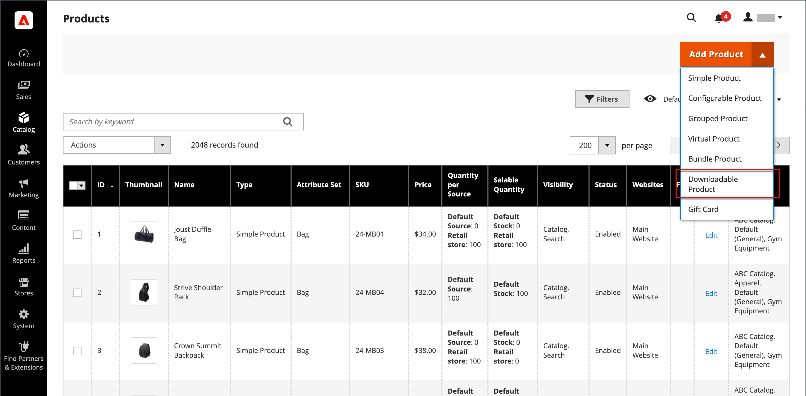

# herunterladbares Produkt

Ein herunterladbares Produkt kann alles sein, was Sie als Datei bereitstellen können, z. B. ein eBook, eine Musik, ein Video, eine Software-Anwendung oder ein Update. Sie können ein Album zum Verkauf anbieten und jedes Lied einzeln verkaufen. Sie können auch ein herunterladbares Produkt verwenden, um eine elektronische Version Ihres Produktkatalogs bereitzustellen.

Da der Download erst nach dem Kauf verfügbar ist, können Sie Beispiele wie einen Auszug aus einem Buch, einen Clip aus einer Audiodatei oder einen Trailer aus einem Video bereitstellen. Ein Beispiel kann der Kunde vor dem Kauf des Produkts ausprobieren. Die Dateien, die Sie zum Herunterladen bereitstellen, können entweder auf Ihren Server oder von einem anderen Server hochgeladen werden.

{width="700" zoomable="yes"}

Herunterladbare Produkte können so konfiguriert werden, dass der Kunde sich bei einem Konto anmeldet, um den Link zu erhalten, oder dass er per E-Mail gesendet und für andere freigegeben werden kann. Der Status der Bestellung, bevor der Download verfügbar wird, Standardwerte und andere Bereitstellungsoptionen werden in der Konfiguration festgelegt. Beachten Sie beim Planen der herunterladbaren Katalogadditionen Folgendes:

- Herunterladbare Produkte können auf den Server hochgeladen oder von einem anderen Server im Internet mit verlinkt werden.

- Sie können bestimmen, wie oft ein Kunde ein Produkt herunterladen kann.

- Kunden, die ein herunterladbares Produkt erwerben, müssen sich vor dem Checkout anmelden.

- Die Bereitstellung eines herunterladbaren Produkts kann erfolgen, wenn die Bestellung entweder in einer `Pending` oder `Invoiced` -Status.

- Da herunterladbare Produkte nicht ausgeliefert werden, wird die _Versand_ Schritt des Checkout wird übersprungen, wenn der Warenkorb nur das herunterladbare Produkt enthält.

## Download-Optionen konfigurieren

Die herunterladbaren Konfigurationseinstellungen bestimmen die Standardwerte und Bereitstellungsoptionen für herunterladbare Produkte und geben an, ob Gäste Downloads erwerben können.

1. Im _Admin_ Seitenleiste, navigieren Sie zu **[!UICONTROL Stores]** > _[!UICONTROL Settings]_>**[!UICONTROL Configuration]**.

1. Erweitern Sie im linken Bereich **[!UICONTROL Catalog]** und wählen **[!UICONTROL Catalog]** darunter.

1. Erweitern  die _[!UICONTROL Downloadable Product Options]_Abschnitt.

   {width="700" zoomable="yes"}

   Eine detaillierte Liste dieser Konfigurationsoptionen finden Sie unter [_Herunterladbare Produktoptionen_](../configuration-reference/catalog/catalog.md#downloadable-product-options) im _Konfigurationsreferenz_.

1. Um den Status des Bestellprozesses zu bestimmen, wenn der Download verfügbar wird, legen Sie **[!UICONTROL Order Item Status to Enable Downloads]** auf einen der folgenden Werte zu:

   - `Pending`
   - `Invoiced`

1. Geben Sie die Zahl für ein **[!UICONTROL Default Maximum Number of Downloads]**.

1. Satz **[!UICONTROL Shareable]** auf einen der folgenden Werte zu:

   - `Yes` - Ermöglicht es Kunden, den Download-Link per E-Mail an andere Personen zu senden.
   - `No` - Verhindert, dass Kunden den Download-Link für andere freigeben, indem sie Kunden auffordern, sich bei ihren Konten anzumelden, um auf Download-Links zugreifen zu können.

1. Für **[!UICONTROL Default Sample Title]** Geben Sie die Überschrift ein, die oberhalb der Auswahl der Beispiele angezeigt werden soll.

   {width="400"}

1. Für **[!UICONTROL Default Link Title]** Geben Sie den Standardtext ein, den Sie für Downloadlinks verwenden möchten.

1. Wenn der Download-Link in einem neuen Browser-Fenster geöffnet werden soll, legen Sie **[!UICONTROL Opens Links in New Window]** nach `Yes`.

   Mit dieser Einstellung wird das Browser-Fenster für Ihren Store geöffnet gehalten.

1. Legen Sie fest, wie herunterladbare Inhalte bereitgestellt werden sollen **[!UICONTROL Use Content Disposition]** auf einen der folgenden Werte zu:

   - `Attachment` - Stellt den Download-Link per E-Mail als Anhang bereit.
   - `Inline` - Stellt den Downloadlink als Link auf einer Webseite bereit.

1. Wenn Sie verlangen möchten, dass sich Käufer für ein Kundenkonto registrieren und sich vor dem Kauf eines Downloads anmelden, legen Sie **[!UICONTROL Disable Guest Checkout if Cart Contains Downloadable Items]** nach `Yes`.

1. Wenn Sie fertig sind, klicken Sie auf **[!UICONTROL Save Config]**.

## Erstellen eines herunterladbaren Produkts

Die folgenden Anweisungen zeigen den Prozess der Erstellung eines herunterladbaren Produkts mit einem [Produktvorlage](attribute-sets.md), erforderliche Felder und grundlegende Einstellungen. Jedes erforderliche Feld ist mit einem roten Sternchen (`*`). Wenn Sie die Grundlagen abgeschlossen haben, können Sie die anderen Produkteinstellungen nach Bedarf abschließen.

>[!NOTE]
>
>Herunterladbare Dateinamen können Buchstaben und Zahlen enthalten. Entweder ein Bindestrich oder ein Unterstrich kann verwendet werden, um einen Abstand zwischen Wörtern darzustellen. Ungültige Zeichen im Dateinamen werden durch einen Unterstrich ersetzt.

### Schritt 1: Produkttyp auswählen

1. Im _Admin_ Seitenleiste, navigieren Sie zu **[!UICONTROL Catalog]** > **[!UICONTROL Products]**.

1. Im _[!UICONTROL Add Product]_( {width="25"} ) in der oberen rechten Ecke auswählen `Downloadable Product`.

   {width="700" zoomable="yes"}

### Schritt 2: Attributsatz auswählen

Die Beispieldaten enthalten eine [Attributset](attribute-sets.md) aufgerufen _herunterladbar_ , die spezielle Felder für herunterladbare Produkte enthält. Sie können eine vorhandene Vorlage verwenden oder eine andere erstellen, bevor das Produkt gespeichert wird.

Führen Sie einen der folgenden Schritte aus, um den Attributsatz auszuwählen, der als Vorlage für das Produkt verwendet wird:

- Für **[!UICONTROL Search]**, geben Sie den Namen des Attributsatzes ein.

- Wählen Sie in der Liste die `Downloadable` -Attributsatz.

Das Formular wird entsprechend der Änderung aktualisiert.

{width="600" zoomable="yes"}

### Schritt 3: Ausführen der erforderlichen Einstellungen

1. Geben Sie die **[!UICONTROL Product Name]**.

1. Standard akzeptieren **[!UICONTROL SKU]** , der auf dem Produktnamen basiert, oder geben Sie einen anderen ein.

1. Produkt eingeben **[!UICONTROL Price]**.

1. Da das Produkt noch nicht zur Veröffentlichung bereit ist, legen Sie **[!UICONTROL Enable Product]** nach `No`.

1. click **[!UICONTROL Save]** und fortfahren.

   Wenn das Produkt gespeichert wird, wird die [Store-Ansicht](introduction.md#product-scope) wird in der linken oberen Ecke angezeigt.

1. Wählen Sie die **[!UICONTROL Store View]** wo das Produkt verfügbar sein soll.

   {width="600" zoomable="yes"}

### Schritt 4: Grundlegende Einstellungen durchführen

1. Satz **[!UICONTROL Tax Class]** auf einen der folgenden Werte zu:

   - `None`
   - `Taxable Goods`

1. Geben Sie die **[!UICONTROL Quantity]** des vorrätigen Erzeugnisses.

   Beachten Sie Folgendes:

   - Standardmäßig ist **[!UICONTROL Stock Status]** auf `Out of Stock`.

   - Da herunterladbare Produkte nicht ausgeliefert werden, wird die **[!UICONTROL Weight]** nicht verwendet. Wenn Sie diese Funktion aktivieren, wird sie zu einem [Einfaches Produkt](product-create-simple.md) und _Ist dieses herunterladbare Produkt?_ -Registerkarte nicht verwendet werden.

   >[!NOTE]
   >
   >Wenn Sie [Inventory management](../inventory-management/introduction.md), legen Einzelquellenhändler die Menge in diesem Abschnitt fest. Multi-Source-Händler fügen Quellen und Mengen im Bereich Quellen hinzu. Siehe Folgendes _Zuweisen von Quellen und Mengen (Inventory management)_ Abschnitt.

1. Standard akzeptieren **[!UICONTROL Visibility]** Einstellung von `Catalog, Search`.

1. So stellen Sie das Produkt im [Liste der neuen Produkte](../content-design/widget-new-products-list.md), wählen Sie die **[!UICONTROL Set Product as New]** aktivieren.

1. Zuweisen _[!UICONTROL Categories]_klicken Sie auf das **[!UICONTROL Select…]**und führen Sie einen der folgenden Schritte aus:

   **Vorhandene Kategorie auswählen**:

   - Beginnen Sie mit der Eingabe in das Feld, bis Sie eine Übereinstimmung finden.

   - Aktivieren Sie das Kontrollkästchen der jeweiligen Kategorie, die zugewiesen werden soll.

   **Erstellen einer Kategorie**:

   - Klicken **[!UICONTROL New Category]**.

   - Geben Sie die **[!UICONTROL Category Name]** und wählen Sie **[!UICONTROL Parent Category]**, der seine Position in der [Menüstruktur](category-root.md).

   - Klicken **[!UICONTROL Create Category]**.

1. Satz **[!UICONTROL Format]** auf einen der folgenden Werte zu:

   - `Download`
   - `DVD`

   Bei Bedarf können Sie die [attribute](attribute-product-create.md) , um weitere Werte hinzuzufügen.

   Es kann zusätzliche Attribute geben, die das Produkt beschreiben. Die Auswahl variiert je nach Attributsatz und kann zu einem späteren Zeitpunkt abgeschlossen werden.

#### Quellen und Mengen zuweisen ([!DNL Inventory Management])

{{$include /help/_includes/inventory-assign-sources.md}}

### Schritt 5: Herunterladbare Informationen ausfüllen

Nach unten scrollen, erweitern  die _[!UICONTROL Downloadable Information]_und wählen Sie die **[!UICONTROL Is this downloadable product?]**aktivieren.

Wenn diese Option aktiviert ist, wird die _[!UICONTROL Downloadable Information]_-Bereich besteht aus zwei Teilen. Der erste Teil beschreibt jeden Downloadlink und der zweite Teil jede Beispieldatei. Der Standardwert für viele dieser Optionen kann im [Konfiguration](#configure-the-download-options).

{width="600" zoomable="yes"}

#### Links ausfüllen

1. Im _[!UICONTROL Links]_eingeben.**[!UICONTROL Title]**die Sie als Überschrift für die Downloadlinks verwenden möchten.

1. Wählen Sie ggf. die **[!UICONTROL Links can be purchased separately]** aktivieren.

1. Klicks **[!UICONTROL Add Link]** und gehen Sie wie folgt vor:

   - Geben Sie die **[!UICONTROL Title]** und **[!UICONTROL Price]** des Downloads.

   - Für beide **[!UICONTROL File]** und **[!UICONTROL Sample]** -Dateien, wählen Sie eine der folgenden Verteilungsmethoden für die Downloads:

      - `Upload File` - Wählen Sie diese Methode, um die Verteilungsdatei auf den Server hochzuladen. Navigieren Sie zur Datei und wählen Sie sie zum Hochladen aus.
      - `URL` - Wählen Sie diese Methode, um über eine URL auf die Verteilungsdatei zuzugreifen. Geben Sie die vollständige URL zur Download-Datei ein.

   >[!NOTE]
   >
   >Links zu externen Ressourcen können nicht als herunterladbare Produkte verwendet werden. Gültige Link-Domänen werden programmgesteuert im `env.php` Datei (siehe [env.php-Referenz](https://experienceleague.adobe.com/docs/commerce-operations/configuration-guide/files/config-reference-envphp.html) im _Konfigurationshandbuch_).

   - Satz **[!UICONTROL Shareable]** auf einen der folgenden Werte zu:

      - `No` - Erfordert Kunden, sich bei ihren Konten anzumelden, um auf den Downloadlink zuzugreifen.

      - `Yes` - Sendet den Link per E-Mail, den Kunden für andere freigeben können.

      - `Use Config` - Verwendet die in der Variablen [Herunterladbare Produktoptionen](../configuration-reference/catalog/catalog.md) Konfiguration.

   - Führen Sie einen der folgenden Schritte aus:

      - Um Downloads pro Kunde zu begrenzen, geben Sie die maximale Anzahl für **[!UICONTROL Max. Downloads]**.
      - Um unbegrenzte Downloads zu ermöglichen, wählen Sie die **[!UICONTROL Unlimited]** aktivieren.

   {width="600" zoomable="yes"}

1. Um einen weiteren Link hinzuzufügen, klicken Sie auf **[!UICONTROL Add Link]** und wiederholen Sie diese Schritte.

#### Füllen Sie die Beispiele aus

1. Im _[!UICONTROL Samples]_eingeben.**[!UICONTROL Title]**die Sie als Überschrift für die Beispiele verwenden möchten.

1. Um die Informationen für jedes Beispiel auszufüllen, klicken Sie auf **[!UICONTROL Add Link]**.

   {width="600" zoomable="yes"}

1. Füllen Sie die Link-Details wie folgt aus:

   - Geben Sie die **[!UICONTROL Title]** der Einzelprobe.

   - Wählen Sie eine der folgenden Verteilungsmethoden:

      - `Upload File` - Wählen Sie diese Methode, um die Verteilungsdatei auf den Server hochzuladen. Navigieren Sie zur Datei und wählen Sie sie zum Hochladen aus.
      - `URL` - Wählen Sie diese Methode, um über eine URL auf die Verteilungsdatei zuzugreifen. Geben Sie die vollständige URL zur Download-Datei ein.

   - Um ein weiteres Beispiel hinzuzufügen, klicken Sie auf **[!UICONTROL Add Link]** und wiederholen Sie diese Schritte.

   - Um die Reihenfolge der Proben zu ändern, nehmen Sie die _Reihenfolge ändern_ (  ) und ziehen Sie das Beispiel an eine neue Position.

### Schritt 6: Produktinformationen ausfüllen

Scrollen Sie nach unten und füllen Sie die Informationen in den folgenden Abschnitten nach Bedarf aus:

- [Inhalt](product-content.md)
- [Bilder und Videos](product-images-and-video.md)
- [Suchmaschinenoptimierung](product-search-engine-optimization.md)
- [Zugehörige Produkte, Up-Sells und Cross-Sells](related-products-up-sells-cross-sells.md)
- [Anpassbare Optionen](settings-advanced-custom-options.md)
- [Produkte in Websites](settings-basic-websites.md)
- [Design](settings-advanced-design.md)
- [Geschenkoptionen](product-gift-options.md)

### Schritt 7: Produkt veröffentlichen

Wenn Sie bereit sind, das Produkt im Katalog zu veröffentlichen, legen Sie **[!UICONTROL Enable Product]** nach `Yes` und führen Sie einen der folgenden Schritte aus:

**Methode 1:** Speichern und Vorschau anzeigen

- Klicken Sie oben rechts auf **[!UICONTROL Save]**.

- Um das Produkt in Ihrem Geschäft anzuzeigen, wählen Sie **[!UICONTROL Customer View]** auf _Admin_ (  ).

  Der Store wird in einer neuen Browser-Registerkarte geöffnet.

  {width="600" zoomable="yes"}

**Methode 2:** Speichern und schließen

Im _[!UICONTROL Save]_( {width="25"} ), wählen Sie **[!UICONTROL Save & Close]**.

## Storefront-Erlebnis

Im Dashboard des Kundenkontos muss die _[!UICONTROL My Downloadable Products]_Seitenlinks zu den einzelnen Bestellungen der herunterladbaren Produkte. Die Downloads sind über das Kundenkonto verfügbar, sobald die Bestellung abgeschlossen ist.

{width="700" zoomable="yes"}

Die folgende Tabelle beschreibt die _Meine herunterladbaren Produkte_ -Werte:

| Spalte | Beschreibung |
|--- |--- |
| [!UICONTROL Order#] | Die [bestellen](../stores-purchase/orders.md) in dem das herunterladbare Produkt gekauft wurde. Stellt einen Link zu den Bestelldetails bereit. |
| [!UICONTROL Date] | Erstellungsdatum der Bestellung. |
| [!UICONTROL Title] | Der Name des herunterladbaren Produkts, das mit der Bestellung gekauft wurde. Stellt einen Link zum herunterladbaren Produkt bereit. |
| [!UICONTROL Status] | Auftragsverarbeitungsstatus. |
| [!UICONTROL Remaining Downloads] | Anzahl der verfügbaren Downloads des heruntergeladenen Produkts. |

_**So laden Sie eine Produktdatei vom Konto-Dashboard herunter**_

1. Im Dashboard seines Kontos wählt der Kunde **[!UICONTROL My Downloadable Products]**.

1. Sucht die Reihenfolge in der Liste und klickt auf den Link nach dem Titel.

1. Klicken Sie rechts unten im Download-Fenster auf die Schaltfläche _herunterladen_ Symbol.

1. Platziert die Datei am Speicherort des Downloads und speichert sie am gewünschten Speicherort.
