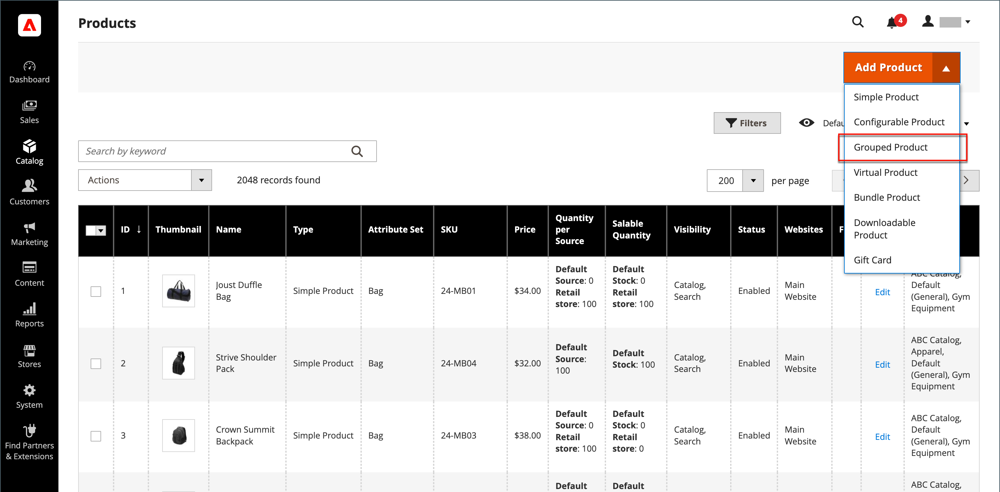

# Gruppierungsprodukt

Ein gruppiertes Produkt besteht aus einfachen eigenständigen Produkten, die als Gruppe präsentiert werden. Sie können Varianten eines einzelnen Produkts anbieten oder sie nach Saison oder Thema gruppieren. Die Präsentation eines gruppierten Produkts kann einen Anreiz für Kunden schaffen, zusätzliche Artikel zu kaufen. Ein gruppiertes Produkt bietet eine einfache Möglichkeit, Varianten eines Produkts anzubieten und sie alle auf derselben Seite aufzulisten.

Sie können beispielsweise Open Stock-Flachbildschirme verkaufen und alle Arten von Utensilien auflisten, die in einer formalen Platzierungseinstellung verwendet werden. Manche bestellen vielleicht mehrere Salatgabeln, Fischgabeln, Essgabeln, Essmesser, Fischmesser, Buttermesser, Suppenlöffel und Dessert-Löffel. Andere Kunden könnten eine einfache Gabel, ein Messer und einen Löffel bestellen. Kunden können beliebig viele Artikel bestellen.

Obwohl sie als Gruppe präsentiert werden, wird jedes Produkt der Gruppe als separater Artikel gekauft. Im Warenkorb wird jeder Artikel und die gekaufte Menge als separater Zeileneintrag angezeigt.

Die folgenden Anweisungen zeigen den Prozess der Erstellung eines gruppierten Produkts mit einer [Produktvorlage](attribute-sets.md), erforderliche Felder und grundlegende Einstellungen. Jedes erforderliche Feld ist mit einem roten Sternchen (`*`). Wenn Sie die Grundlagen abgeschlossen haben, können Sie die anderen Produkteinstellungen nach Bedarf abschließen.

{width="700" zoomable="yes"}

## Schritt 1: Produkttyp auswählen

1. Im _Admin_ Seitenleiste, navigieren Sie zu **[!UICONTROL Catalog]** > **[!UICONTROL Products]**.

1. Im _[!UICONTROL Add Product]_( {width="25"} ) in der oberen rechten Ecke auswählen **[!UICONTROL Grouped Product]**.

   {width="700" zoomable="yes"}

## Schritt 2: Attributsatz auswählen

So wählen Sie die [Attributset](attribute-sets.md) , die als Vorlage für das Produkt verwendet wird, führen Sie einen der folgenden Schritte aus:

- Geben Sie den Namen der **[!UICONTROL Attribute Set]**.
- Wählen Sie in der Liste den Attributsatz aus, den Sie verwenden möchten.

Das Formular wird entsprechend der Änderung aktualisiert.

{width="600" zoomable="yes"}

Wenn die erforderlichen Attribute nicht vorhanden sind, können Sie beim Erstellen eines Produkts neue Attribute hinzufügen:

- Klicken Sie oben rechts auf **[!UICONTROL Add Attribute]**.
- Definieren Sie ein neues Attribut (siehe [Hinzufügen eines Attributs zu einem Produkt](product-attributes-add.md)).

  {width="600" zoomable="yes"}

Um dem Produkt ein vorhandenes Attribut hinzuzufügen, verwenden Sie die [Filtersteuerelemente](../getting-started/admin-grid-controls.md) , um das Attribut im Raster zu finden, und gehen Sie wie folgt vor:

- Aktivieren Sie das Kontrollkästchen in der ersten Spalte jedes hinzugefügten Attributs.
- Klicks **[!UICONTROL Add Selected]**.

## Schritt 3: Ausführen der erforderlichen Einstellungen

1. Geben Sie die **[!UICONTROL Product Name]**.

1. Standard akzeptieren **[!UICONTROL SKU]** , der auf dem Produktnamen basiert, oder geben Sie einen anderen ein.

   Beachten Sie Folgendes: **[!UICONTROL Quantity]** ist nicht verfügbar, da der Wert aus den einzelnen Produkten der Gruppe abgeleitet wird.

   Ein gruppiertes Produkt hat keinen eigenen Preis im Katalog. Der gruppierte Produktpreis ergibt sich aus dem Preis der einzelnen Produkte, die in der Gruppe enthalten sind.

1. Da das Produkt noch nicht zur Veröffentlichung bereit ist, legen Sie **[!UICONTROL Enable Product]** nach `No` (  ).

1. Klicks **[!UICONTROL Save]** und fortfahren.

   Wenn das Produkt gespeichert wird, wird der Produktname oben auf der Seite angezeigt und die [Store-Ansicht](introduction.md#product-scope) wird in der linken oberen Ecke angezeigt.

1. Wählen Sie die **[!UICONTROL Store View]** wo das Produkt verfügbar sein soll.

   {width="600" zoomable="yes"}

## Schritt 4: Grundlegende Einstellungen durchführen

1. Akzeptieren Sie die **[!UICONTROL Stock Status]** Einstellung von `In Stock`.

1. Zuweisen **[!UICONTROL Categories]** klicken Sie auf das **[!UICONTROL Select…]** und führen Sie einen der folgenden Schritte aus:

   **Wählen Sie eine vorhandene Kategorie aus:**

   - Beginnen Sie mit der Eingabe in das Feld, bis Sie eine Übereinstimmung finden.

   - Aktivieren Sie das Kontrollkästchen der Kategorie, die zugewiesen werden soll.

   **Erstellen Sie eine Kategorie:**

   - Klicks **[!UICONTROL New Category]**.

   - Geben Sie die **[!UICONTROL Category Name]** und wählen Sie **[!UICONTROL Parent Category]**, der seine Position in der Menüstruktur bestimmt.

   - Klicks **[!UICONTROL Create Category]**.

1. Akzeptieren Sie die **[!UICONTROL Visibility]** Einstellungen von `Catalog, Search`.

1. So stellen Sie das Produkt im [Liste der neuen Produkte](../content-design/widget-new-products-list.md), wählen Sie die **[!UICONTROL Set Product as New]** **[!UICONTROL from]** und **[!UICONTROL to]** Daten im Kalender.

1. Wählen Sie die **[!UICONTROL Country of Manufacture]**.

   Es kann zusätzliche individuelle Attribute geben, die das Produkt beschreiben. Die Auswahl variiert den Attributsatz und kann später abgeschlossen werden.

## Schritt 5: Produkte zur Gruppe hinzufügen

1. Scrollen Sie nach unten zum **[!UICONTROL Grouped Products]** und klicken Sie auf **[!UICONTROL Add Products to Group]**.

   {width="600" zoomable="yes"}

1. Verwenden Sie bei Bedarf die [Filter](../getting-started/admin-grid-controls.md) um die Produkte zu finden, die Sie in die Gruppe aufnehmen möchten.

1. Aktivieren Sie in der Liste das Kontrollkästchen der einzelnen Elemente, die Sie in die Gruppe aufnehmen möchten.

   >[!NOTE]
   >
   >Nur einfache, herunterladbare und virtuelle Produkte ohne konfigurierbare Optionen können untergeordnete Produkte gruppiert werden. Andere Produkttypen werden nicht in der Auswahlliste angezeigt.

   {width="600" zoomable="yes"}

1. Um sie zur Produktgruppe hinzuzufügen, klicken Sie auf **[!UICONTROL Add Selected Products]**.

   Die ausgewählten Produkte werden im _[!UICONTROL Grouped Products]_Abschnitt.

   Für Händler mit mehreren Quellen mit [Inventory management](../inventory-management/sources-stocks.md), enthält das Raster eine **[!UICONTROL Quantity per Source]** Spalte mit jeder zugewiesenen Quelle und Bestandsmenge.

   {width="600" zoomable="yes"}

1. Geben Sie einen **[!UICONTROL Default Quantity]** für einen der Artikel.

1. Um die Reihenfolge der Produkte zu ändern, nehmen Sie die _Reihenfolge ändern_ Symbol (  ) in der ersten Spalte und ziehen Sie das Produkt an die neue Position in der Liste.

1. Um ein Produkt aus der Gruppe zu entfernen, klicken Sie auf **[!UICONTROL Remove]**.

## Schritt 5: Ausfüllen der Produktinformationen

Füllen Sie die Informationen in den folgenden Abschnitten nach Bedarf aus:

- [Inhalt](product-content.md)
- [Bilder und Videos](product-images-and-video.md)
- [Suchmaschinenoptimierung](product-search-engine-optimization.md)
- [Zugehörige Produkte, Up-Sells und Cross-Sells](related-products-up-sells-cross-sells.md)
- [Anpassbare Optionen](settings-advanced-custom-options.md)
- [Produkte in Websites](settings-basic-websites.md)
- [Design](settings-advanced-design.md)
- [Geschenkoptionen](product-gift-options.md)

## Schritt 6: Produkt veröffentlichen

1. Wenn Sie bereit sind, das Produkt im Katalog zu veröffentlichen, legen Sie **[!UICONTROL Enable Product]** nach `Yes`.

1. Führen Sie einen der folgenden Schritte aus:

   **Methode 1:** Speichern und Vorschau anzeigen

   - Klicken Sie oben rechts auf **[!UICONTROL Save]**.

   - Um das Produkt in Ihrem Geschäft anzuzeigen, wählen Sie **[!UICONTROL Customer View]** auf _Admin_ (  ).

     Der Store wird in einer neuen Browser-Registerkarte geöffnet.

     {width="700" zoomable="yes"}

   **Methode 2:** Speichern und schließen

   - Im _[!UICONTROL Save]_( {width="25"} ), wählen Sie **[!UICONTROL Save & Close]**.

## Schritt 7: Konfigurieren Sie die Miniaturansichten des Warenkorbs (optional)

Wenn Sie für jedes Produkt in der Gruppe ein anderes Bild haben, können Sie die Konfiguration so konfigurieren, dass das richtige Bild für die Warenkorbminiatur verwendet wird.

1. Im _Admin_ Seitenleiste, navigieren Sie zu **[!UICONTROL Stores]** > _[!UICONTROL Settings]_>**[!UICONTROL Configuration]**.

1. Erweitern Sie im linken Bereich **[!UICONTROL Sales]** und wählen **[!UICONTROL Checkout]**.

1. Erweitern  die **[!UICONTROL Shopping Cart]**.

   Eine detaillierte Liste dieser Konfigurationsoptionen finden Sie unter [Warenkorb](../configuration-reference/sales/checkout.md#shopping-cart) im _Konfigurationsreferenz_.

1. Satz **[!UICONTROL Grouped Product Image]** nach `Product Thumbnail Itself`.

   {width="600" zoomable="yes"}

   Deaktivieren Sie bei Bedarf die **[!UICONTROL Use system value]** aktivieren, um diese Option festzulegen.

1. Klicks **[!UICONTROL Save Config]**.

## Dinge, die man sich merken sollte

- Ein gruppiertes Produkt ist im Wesentlichen eine Sammlung einfacher verknüpfter Produkte.

- Gruppierte untergeordnete Produkte können einfach, herunterladbar oder virtuelle Produkte sein. **[!UICONTROL without custom options]**.

- Jeder gekaufte Artikel erscheint einzeln im Warenkorb und nicht als Teil der Gruppe.

- Ein gruppiertes Produkt hat keinen eigenen Preis im Katalog. Der gruppierte Produktpreis ergibt sich aus dem Preis der einzelnen Produkte, die in der Gruppe enthalten sind.

- Das Miniaturbild im Warenkorb kann so eingestellt werden, dass es das Bild des gruppierten übergeordneten Produkts oder des zugehörigen Produkts anzeigt.
