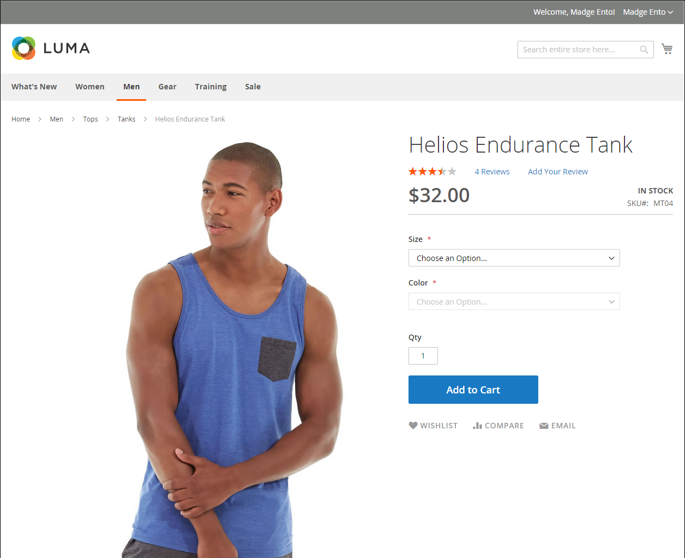
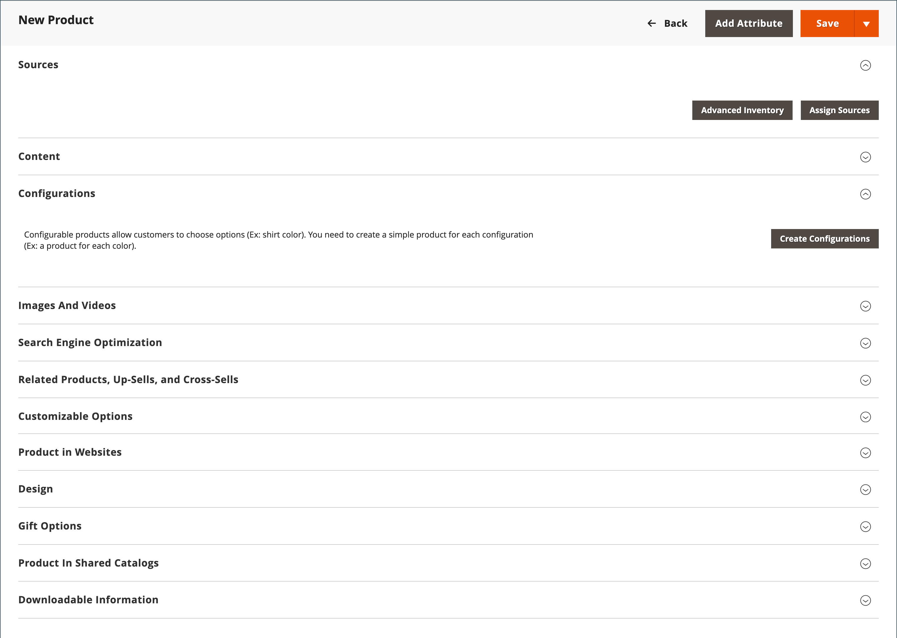

# Produkt erstellen

Die Auswahl eines Produkttyps ist eines der ersten Dinge, die Sie tun müssen, um ein Produkt zu erstellen. Wenn Sie gerade erst mit der Erstellung Ihres Produktkatalogs beginnen, können Sie einige Beispielprodukte erstellen, um mit jedem Produkttyp zu experimentieren. Zusätzlich zu den grundlegenden Produktarten wird der Begriff _komplexes Produkt_ manchmal verwendet, um Produkte mit mehreren Optionen zu bezeichnen, wie z. B. ein konfigurierbares Produkt, das in verschiedenen Farben und Größen verfügbar ist.

>[!NOTE]
>
>Weitere Informationen finden Sie unter Katalog [Navigation](navigation.md), Einrichten [Kategorien](categories.md) und [Attribute](product-attributes.md) und die verfügbaren [&#x200B; (URL](catalog-urls.md). Nachdem Sie diese Konzepte verstanden haben, ist die effizienteste Möglichkeit, viele Produkte zum Katalog hinzuzufügen, [, sie &#x200B;](../systems/data-import.md) einer CSV-Datei zu importieren.

{width="700" zoomable="yes"}

## Produktarten

**[Einfaches Produkt](product-create-simple.md)** - Ein einfaches Produkt ist ein physischer Artikel mit einer einzelnen SKU. Einfache Produkte haben verschiedene Preise und Eingabedialoge, die es ermöglichen, Varianten des Produkts zu verkaufen. Einfache Produkte können in Verbindung mit gruppierten, gebündelten und konfigurierbaren Produkten verwendet werden.

**[Konfigurierbares Produkt](product-create-configurable.md)** - Ein konfigurierbares Produkt scheint ein einzelnes Produkt mit Listen von Optionen für jede Variante zu sein. Jede Option stellt jedoch ein separates, einfaches Produkt mit einer unterschiedlichen SKU dar, mit der der Bestand für jede Variante verfolgt werden kann.

**[Gruppiertes Produkt](product-create-grouped.md)** - Ein gruppiertes Produkt stellt mehrere eigenständige Produkte als Gruppe dar. Sie können Varianten eines einzelnen Produkts anbieten oder sie für eine Promotion gruppieren. Die Produkte können einzeln oder als Gruppe erworben werden.

**[Virtuelle Produkte](product-create-virtual.md)** - Ein virtuelles Produkt ist kein materielles Produkt und wird normalerweise für Produkte wie Services, Mitgliedschaften, Gewährleistungen und Abonnements verwendet. Virtuelle Produkte können in Verbindung mit gruppierten und gebündelten Produkten verwendet werden.

**[Bundle-Produkt](product-create-bundle.md)** Ein Bundle-Produkt ermöglicht es Kunden, aus einer Vielzahl von Optionen „ihre eigenen aufzubauen“. Das Paket kann ein Geschenkkorb, ein Computer oder alles andere sein, das angepasst werden kann. Jedes Element im Bundle ist ein separates, eigenständiges Produkt.

**[Herunterladbares Produkt](product-create-downloadable.md)** - Ein digital herunterladbares Produkt besteht aus einer oder mehreren Dateien, die heruntergeladen werden. Die Dateien können sich auf Ihrem -Server befinden oder als URLs zu einem anderen Server bereitgestellt werden.

**[Geschenkkarte](product-gift-card-create.md)** - (nur [Adobe Commerce](../landing/home.md#product-editions)) Es gibt drei Arten von Geschenkkarten. _Virtual_ Geschenkkarten werden per E-Mail verschickt. _Physische_ Geschenkkarten werden an den Empfänger gesendet. _Kombiniert_ Geschenkkarten, die eine Kombination aus virtuell und physisch sind. Jeder hat einen eindeutigen Code, der beim Checkout eingelöst wird. Geschenkgutscheine können auch in einem gruppierten Produkt enthalten sein.

## Produkteinstellungen

Die am häufigsten verwendeten Produkteinstellungen und -attribute werden oben auf der Seite angezeigt, gefolgt von benutzerdefinierten Attributen. Alle anderen Produkteinstellungen finden Sie in erweiterbaren Abschnitten unten auf der Seite.

{width="600" zoomable="yes"}

| Einstellung | Beschreibung |
|--- |--- |
| [[!UICONTROL Sources]](../inventory-management/sources-assign-per-product.md) | (Wenn [[!DNL Inventory Management]](../inventory-management/introduction.md) aktiviert ist) Listet die Quellen auf, aus denen das Produkt verteilt werden kann. |
| [[!UICONTROL Content]](product-content.md) | Dient zur Eingabe und Bearbeitung der Hauptproduktbeschreibung, die auf der Storefront-Produktseite angezeigt wird. |
| [[!UICONTROL Configurations]](product-configurations.md) | Listet alle vorhandenen Varianten des Produkts auf und kann verwendet werden, um Varianten für die Verwendung mit dem konfigurierbaren Produkttyp zu generieren. |
| [[!UICONTROL Product Reviews]](settings-advanced-product-reviews.md) | Listet alle Bewertungen auf, die Kundinnen und Kunden für das Produkt gesendet haben. |
| [[!UICONTROL Search Engine Optimization]](product-search-engine-optimization.md) | Gibt den URL-Schlüssel und die Metadatenfelder an, die von Suchmaschinen zur Indizierung des Produkts verwendet werden. |
| [[!UICONTROL Related Products, Up-Sells, and Cross-Sells]](related-products-up-sells-cross-sells.md) | Wird verwendet, um einfache Werbeblöcke auf der Storefront einzurichten, die eine Auswahl zusätzlicher Produkte darstellen, die für den Kunden von Interesse sein könnten. |
| [[!UICONTROL Customizable Options]](settings-advanced-custom-options.md) | Fügt einem Produkt anpassbare Optionen hinzu. |
| [[!UICONTROL Product in Websites]](settings-basic-websites.md) | Identifiziert jede Website, auf der das Produkt verfügbar ist, gemäß der Store-Hierarchie. |
| [[!UICONTROL Design]](settings-advanced-design.md) | Wird verwendet, um ein anderes Design auf die Produktseite anzuwenden, das Spalten-Layout zu ändern, zu bestimmen, wo die Produktoptionen angezeigt werden, und benutzerdefinierten XML-Code einzugeben. |
| [[!UICONTROL Gift options]](product-gift-options.md) | Wird verwendet, um eine Geschenknachrichtenoption während des Checkouts auf Produktebene zu aktivieren oder zu deaktivieren. |
| [[!UICONTROL Product In Shared Catalogs]](../b2b/catalog-shared.md) |  (nur verfügbar mit [Adobe Commerce B2B](../b2b/introduction.md)) Ermöglicht die Verwaltung freigegebener Kataloge mit benutzerdefinierter Preisgestaltung für verschiedene Unternehmen. |
| [[!UICONTROL Downloadable Information]](product-create-downloadable.md#step-5-complete-the-downloadable-information) | Wird zum Definieren der Parameter für den Produktdownload verwendet. |

{style="table-layout:auto"}

## Erweiterte Preise und Bestand

Um auf die erweiterten Einstellungen für Preise und Lagerbestand zuzugreifen, klicken Sie auf den Link unter **[!UICONTROL Price]** und **[!UICONTROL Quantity]**. Weitere Informationen finden Sie unter [Preise verwalten](pricing-advanced.md) und [Inventory management](../inventory-management/introduction.md).
