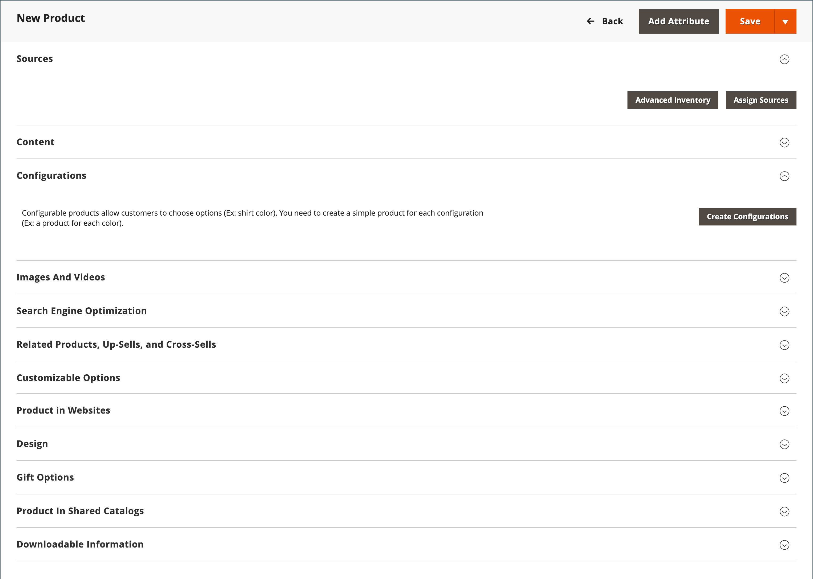

# Produkt erstellen

Die Auswahl eines Produkttyps ist eines der ersten Dinge, die Sie tun müssen, um ein Produkt zu erstellen. Wenn Sie gerade erst mit der Erstellung Ihres Produktkatalogs beginnen, können Sie einige Beispielprodukte erstellen, um mit jedem Produkttyp zu experimentieren. Zusätzlich zu den grundlegenden Warentypen bezeichnet der Begriff _komplexes Produkt_ wird manchmal verwendet, um Produkte mit mehreren Optionen zu referenzieren, z. B. ein konfigurierbares Produkt, das in verschiedenen Farben und Größen verfügbar ist.

>[!NOTE]
>
>Weitere Informationen finden Sie im Katalog . [Navigation](navigation.md), wie Sie [categories](categories.md) und [attributes](product-attributes.md)und dem Katalog [URL-Optionen](catalog-urls.md) verfügbar sind. Wenn Sie diese Konzepte verstanden haben, ist die effizienteste Methode, viele Produkte zum Katalog hinzuzufügen, die [importieren](../systems/data-import.md) sie aus einer CSV-Datei.

{width="700" zoomable="yes"}

## Produkttypen

**[Einfaches Produkt](product-create-simple.md)** - Ein einfaches Produkt ist ein physisches Element mit einer einzigen SKU. Einfache Produkte verfügen über unterschiedliche Preise und Kontrollen der Vorleistungen, die den Verkauf von Produktvarianten ermöglichen. Einfache Produkte können zusammen mit gruppierten, gebündelten und konfigurierbaren Produkten verwendet werden.

**[Konfigurierbares Produkt](product-create-configurable.md)** - Ein konfigurierbares Produkt scheint ein einzelnes Produkt mit einer Liste von Optionen für jede Variante zu sein. Jede Option stellt jedoch ein separates, einfaches Produkt mit einer eigenen SKU dar, die es ermöglicht, den Bestand für jede Variante zu verfolgen.

**[Gruppierungsprodukt](product-create-grouped.md)** - Ein gruppiertes Produkt präsentiert mehrere eigenständige Produkte als Gruppe. Sie können Varianten eines einzelnen Produkts anbieten oder sie für eine Promotion gruppieren. Die Produkte können separat oder als Gruppe erworben werden.

**[Virtuelle Produkte](product-create-virtual.md)** - Ein virtuelles Produkt ist kein greifbares Produkt und wird normalerweise für Produkte wie Dienstleistungen, Mitgliedschaften, Garantien und Abonnements verwendet. Virtual Produkte können zusammen mit gruppierten und gebündelten Produkten verwendet werden.

**[Paket-Produkt](product-create-bundle.md)**  - Ein Bundle-Produkt ermöglicht es Kunden, aus einer Reihe von Optionen ein eigenes zu erstellen. Das Bundle kann ein Geschenkkorb, ein Computer oder alles andere sein, das angepasst werden kann. Jedes Element im Bundle ist ein separates, eigenständiges Produkt.

**[herunterladbares Produkt](product-create-downloadable.md)** - Ein digital herunterladbares Produkt besteht aus einer oder mehreren heruntergeladenen Dateien. Die Dateien können sich auf Ihrem Server befinden oder als URLs für einen anderen Server bereitgestellt werden.

**[Geschenkkarte](product-gift-card-create.md)** - ([Adobe Commerce](../landing/home.md#product-editions) Es gibt drei Arten von Geschenkkarten. _Virtual_ Geschenkgutscheine werden per E-Mail verschickt. _Physikalisch_ Geschenkgutscheine werden an den Empfänger versandt. _Kombiniert_ Geschenkkarten, die eine Kombination aus virtueller und physischer. Jeder hat einen eindeutigen Code, der beim Checkout eingelöst wird. Geschenkkarten können auch in einem gruppierten Produkt enthalten sein.

## Produkteinstellungen

Die am häufigsten verwendeten Produkteinstellungen und Attribute werden oben auf der Seite angezeigt, gefolgt von benutzerdefinierten Attributen. Alle anderen Produkteinstellungen befinden sich in erweiterbaren Abschnitten am unteren Rand der Seite.

{width="600" zoomable="yes"}

| Einstellung | Beschreibung |
|--- |--- |
| [[!UICONTROL Sources]](../inventory-management/sources-assign-per-product.md) | (When [[!DNL Inventory Management]](../inventory-management/introduction.md) aktiviert ist) Listet die Quellen auf, aus denen das Produkt verteilt werden kann. |
| [[!UICONTROL Content]](product-content.md) | Wird verwendet, um die Hauptproduktbeschreibung einzugeben und zu bearbeiten, die auf der Produktseite der Storefront angezeigt wird. |
| [[!UICONTROL Configurations]](product-configurations.md) | Listet alle vorhandenen Varianten des Produkts auf und kann verwendet werden, um Varianten für die Verwendung mit dem konfigurierbaren Produkttyp zu generieren. |
| [[!UICONTROL Product Reviews]](settings-advanced-product-reviews.md) | Listet alle Bewertungen auf, die Kunden für das Produkt eingereicht haben. |
| [[!UICONTROL Search Engine Optimization]](product-search-engine-optimization.md) | Gibt den URL-Schlüssel und die Metadatenfelder an, die von Suchmaschinen zum Indizieren des Produkts verwendet werden. |
| [[!UICONTROL Related Products, Up-Sells, and Cross-Sells]](related-products-up-sells-cross-sells.md) | Wird verwendet, um einfache Werbeblöcke auf der Storefront einzurichten, die eine Auswahl zusätzlicher Produkte darstellen, die für den Kunden von Interesse sein könnten. |
| [[!UICONTROL Customizable Options]](settings-advanced-custom-options.md) | Fügt anpassbare Optionen zu einem Produkt hinzu. |
| [[!UICONTROL Product in Websites]](settings-basic-websites.md) | Identifiziert jede Website, auf der das Produkt verfügbar ist, gemäß der Store-Hierarchie. |
| [[!UICONTROL Design]](settings-advanced-design.md) | Wird verwendet, um ein anderes Design auf die Produktseite anzuwenden, das Spaltenlayout zu ändern, festzulegen, wo Produktoptionen angezeigt werden, und geben Sie benutzerdefinierten XML-Code ein. |
| [[!UICONTROL Gift options]](product-gift-options.md) | Wird zum Aktivieren oder Deaktivieren einer Option für eine Geschenknachricht beim Checkout auf Produktebene verwendet. |
| [[!UICONTROL Product In Shared Catalogs]](../b2b/catalog-shared.md) |  (Verfügbar mit [B2B für Adobe Commerce](../b2b/introduction.md) nur) Ermöglicht die Pflege freigegebener Kataloge mit benutzerdefinierten Preisen für verschiedene Unternehmen. |
| [[!UICONTROL Downloadable Information]](product-create-downloadable.md#step-5-complete-the-downloadable-information) | Wird zum Definieren der Parameter für den Produktdownload verwendet. |

{style="table-layout:auto"}

## Erweiterte Preise und Inventar

Klicken Sie auf den unten stehenden Link, um auf die erweiterten Einstellungen für Preise und Lagerbestände zuzugreifen. **[!UICONTROL Price]** und **[!UICONTROL Quantity]**. Weitere Informationen finden Sie unter [Verwaltung von Preisen](pricing-advanced.md) und [Inventory management](../inventory-management/introduction.md).
