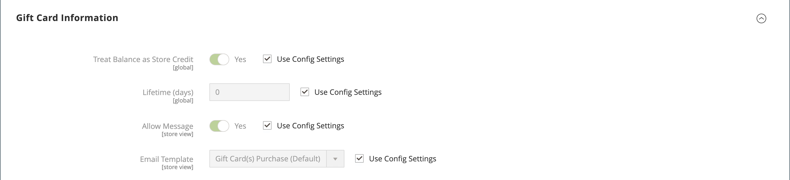

# Geschenkkartenprodukt

{{ee-feature}}

Jede Geschenkkarte verfügt über einen eindeutigen Code, der von nur einem Kunden während des Checkout eingelöst werden kann. A [Code-Pool](../stores-purchase/product-gift-card-accounts.md#step-3-establish-the-gift-card-code-pool) vor dem Verkauf der Geschenkgutscheine müssen Sie feststellen. Siehe [GitCard-Workflow](../stores-purchase/product-gift-card-workflow.md) für Informationen darüber, wie Geschenkkarten im Warenkorb eingelöst werden.

{width="700" zoomable="yes"}

Es gibt drei Arten von Geschenkgutscheinprodukten:

- **Virtual** - Eine virtuelle Geschenkkarte wird an die E-Mail-Adresse des Empfängers geschickt, die während des Kaufs der Geschenkkarte benötigt wird. Eine Lieferadresse ist nicht erforderlich.

- **Physikalisch** - Eine physische Geschenkkarte wird an die Empfängeradresse versandt, die während des Kaufs der Geschenkkarte benötigt wird.

- **Kombiniert** - Eine kombinierte Geschenkkarte wird versandt und per E-Mail an den Empfänger geschickt. Die E-Mail-Adresse des Empfängers und die Lieferadresse sind während des Kaufs der Geschenkkarte erforderlich.

## Geschenkkartenprodukt erstellen

Die folgenden Anweisungen zeigen den Vorgang der Erstellung einer Geschenkkarte mit einer [Produktvorlage](attribute-sets.md), erforderliche Felder und grundlegende Einstellungen. Jedes erforderliche Feld ist mit einem roten Sternchen (`*`). Wenn Sie die Grundlagen abgeschlossen haben, können Sie die anderen Produkteinstellungen nach Bedarf abschließen.

### Schritt 1: Produkttyp auswählen

1. Im _Admin_ Seitenleiste, navigieren Sie zu **[!UICONTROL Catalog]** > **[!UICONTROL Products]**.

1. In der oberen rechten Ecke auf der _[!UICONTROL Add Product]_( {width="25"}  ), wählen Sie **[!UICONTROL Gift Card]**.

   {width="700" zoomable="yes"}

### Schritt 2: Attributsatz auswählen

Sie können die Standardeinstellung `Gift Card` -Attributsatz oder wählen Sie eine andere. Führen Sie einen der folgenden Schritte aus, um den Attributsatz auszuwählen, der als Vorlage für das Produkt verwendet wird:

- Klicken Sie in der **[!UICONTROL Attribute Set]** und geben Sie den Namen des Attributsatzes ganz oder teilweise ein.

- Wählen Sie in der angezeigten Liste den zu verwendenden Attributsatz aus.

{width="600" zoomable="yes"}

### Schritt 3: Ausführen der erforderlichen Einstellungen

1. Geben Sie einen **[!UICONTROL Product Name]** für die Geschenkkarte.

   Sie können auch den Typ der Geschenkkarte im Namen angeben. Beispiel: _Luma Virtual Gift Card_.

1. Geben Sie einen **[!UICONTROL SKU]** für das Produkt.

   Standardmäßig wird der Produktname als standardmäßige SKU verwendet.

1. Satz **[!UICONTROL Card Type]** auf einen der folgenden Werte zu:

   - `Virtual` - Virtuelle Geschenkkarten werden dem Empfänger per E-Mail zugestellt.
   - `Physical` - Körperliche Geschenkgutscheine können im Voraus in großem Maßstab hergestellt und mit einmaligen Codes versehen werden.
   - `Combined` - Eine kombinierte Geschenkkarte hat sowohl die Eigenschaften einer virtuellen als auch einer physischen Geschenkkarte.

   {width="600" zoomable="yes"}

1. Klicken Sie auf , um dem Kunden eine Auswahl an Festbeträgen anzubieten. **[!UICONTROL Add Amount]** und geben Sie den ersten festen Wert der Karte als Dezimalzahl ein.

   Wiederholen Sie diesen Schritt für jede Komponente, um die Festbeträge auszuwählen.

1. Gehen Sie wie folgt vor, um Kunden die Möglichkeit zu geben, den Wert der Geschenkkarte festzulegen:

   - Satz **[!UICONTROL Open Amount]** nach `Yes`.

   - Um den Bereich der zulässigen Mindest- und Höchstwerte festzulegen, geben Sie die **[!UICONTROL Open Amount From]** und **[!UICONTROL To]** -Werte.

   Sie können Geschenkgutscheine mit festen Preisen, einem offenen Preis oder beidem erstellen.

   >[!NOTE]
   >
   >Ein Geschenkgutschein hat keinen eigenen Preis im Katalog. Der Preis der Geschenkkarte wird aus dem ausgewählten Betrag der Geschenkkarte während des Kaufs abgeleitet.

   {width="600" zoomable="yes"}

### Schritt 4: Grundlegende Einstellungen durchführen

1. Geben Sie für eine physische oder kombinierte Geschenkkarte die **[!UICONTROL Quantity]** auf Lager.

1. Wenn die zu versendende Geschenkkarte, geben Sie die **[!UICONTROL Weight]** des Pakets.

1. Im **[!UICONTROL Categories]** Feld, wählen Sie `Gift Card`.

Es kann zusätzliche individuelle Attribute geben, die das Produkt beschreiben. Die Auswahl variiert den Attributsatz und kann später abgeschlossen werden.

### Schritt 5: Geschenkgutschein-Informationen ausfüllen

Die _[!UICONTROL Gift Card Information]_-Abschnitt der Produkteinstellungen verwendet werden, um die [Konfiguration der Geschenkkarte](../configuration-reference/sales/gift-cards.md) -Einstellungen, die bestimmen, wie die Karte verwaltet wird.

1. Scrollen Sie nach unten zum _[!UICONTROL Gift Card Information]_Abschnitt.

   Die Standardeinstellungen in diesem Abschnitt werden durch die Systemkonfiguration bestimmt.

   {width="600" zoomable="yes"}

1. Ändern Sie zusätzliche Felder entsprechend der gewünschten Funktion der Geschenkkarte:

   - **[!UICONTROL Treat Balance as Store Credit]** - Stellt fest, ob der Besitzer der Geschenkkarte den Restbetrag als Gutschrift im Geschäft einlösen kann.

   - **[!UICONTROL Lifetime (days)]** - Bestimmt die Anzahl der Tage nach dem Kauf, bis die Geschenkkarte abläuft. Wenn Sie keine Begrenzung für die Lebensdauer der Karte festlegen möchten, lassen Sie dieses Feld leer.

   - **[!UICONTROL Allow Message]** - Stellt fest, ob der Käufer der Geschenkkarte eine Nachricht für den Empfänger eingeben kann. Eine Geschenknachricht kann sowohl für virtuelle (per E-Mail versandte) als auch für physische (versandte) Geschenkkarten enthalten sein.

   - **[!UICONTROL Email Template]** - Bestimmt die E-Mail-Vorlage, die für die Benachrichtigung verwendet wird, die an den Empfänger einer Geschenkkarte gesendet wird.

### Schritt 6: Produktinformationen ausfüllen

Füllen Sie die Informationen in den folgenden Abschnitten nach Bedarf aus:

- [Inhalt](product-content.md)
- [Bilder und Videos](product-images-and-video.md)
- [Zugehörige Produkte, Up-Sells und Cross-Sells](related-products-up-sells-cross-sells.md)
- [Suchmaschinenoptimierung](product-search-engine-optimization.md)
- [Anpassbare Optionen](settings-advanced-custom-options.md)
- [Produkte in Websites](settings-basic-websites.md)
- [Design](settings-advanced-design.md)
- [Geschenkoptionen](product-gift-options.md)

### Schritt 7: Produkt veröffentlichen

1. Wenn Sie bereit sind, das Produkt im Katalog zu veröffentlichen, legen Sie die **Produkt aktivieren** Switch zu `Yes`.

1. Führen Sie einen der folgenden Schritte aus:

   **Methode 1:** Speichern und Vorschau anzeigen

   - Klicken Sie oben rechts auf **[!UICONTROL Save]**.

   - Um das Produkt in Ihrem Geschäft anzuzeigen, wählen Sie **[!UICONTROL Customer View]** auf _Admin_ (  ),

   {width="600" zoomable="yes"}

   **Methode 2:** Speichern und schließen

   Im _[!UICONTROL Save]_( {width="25"} ), wählen Sie **[!UICONTROL Save & Close]**.

## Dinge, die man sich merken sollte

- A _Code-Pool_ die individuellen Nummern müssen erzeugt werden, bevor eine Geschenkkarte zum Verkauf angeboten werden kann.

- Geschenkkarten können auf `Redeemable` oder `Non-Redeemable`.

- Steuern **_nicht angewendet_** für Geschenkgutscheine während des Geschenkes. Steuern werden nur auf Produkte erhoben, wenn eine erworbene Geschenkkarte zum Kauf von Produkten verwendet wird.

- Die Lebensdauer einer Geschenkkarte kann unbegrenzt sein oder auf eine bestimmte Anzahl von Tagen festgelegt werden.

- Der Wert einer Geschenkkarte kann auf einen festen Betrag oder auf einen offenen Betrag mit einem Mindest- und Höchstwert gesetzt werden.

- Ein Geschenkgutschein hat keinen eigenen Preis im Katalog. Der Preis der Geschenkkarte wird aus dem ausgewählten Betrag der Geschenkkarte während des Kaufs abgeleitet.

- Ein Geschenkkartenkonto für den Kunden kann bei der Bestellung oder zum Zeitpunkt der Rechnung erstellt werden.
