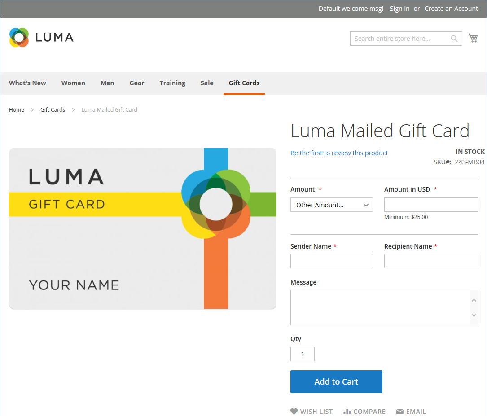
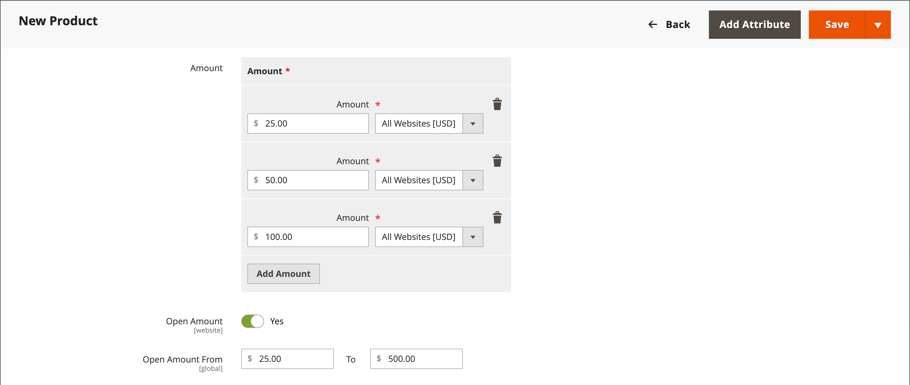

# Geschenkkartenprodukt

{{ee-feature}}

Jede Geschenkkarte hat einen einzigartigen Code, der von nur einem Kunden während des Checkouts eingelöst werden kann. Ein [Code-Pool](../stores-purchase/product-gift-card-accounts.md#step-3-establish-the-gift-card-code-pool) muss eingerichtet werden, bevor Geschenkgutscheine verkauft werden können. Informationen [, wie Geschenkgutscheine im Warenkorb eingelöst &#x200B;](../stores-purchase/product-gift-card-workflow.md), finden Sie unter „Arbeitsablauf für Geschenkgutscheine“.

{width="700" zoomable="yes"}

Es gibt drei Arten von Geschenkkartenprodukten:

- **Virtual** - Eine virtuelle Geschenkkarte wird an die E-Mail-Adresse des Empfängers gesendet, die beim Kauf der Geschenkkarte erforderlich ist. Eine Lieferadresse ist nicht erforderlich.

- **Physisch** - Eine physische Geschenkkarte wird an die Adresse des Empfängers gesendet, die beim Kauf der Geschenkkarte erforderlich ist.

- **Kombiniert** - Eine kombinierte Geschenkkarte wird versendet und per E-Mail an den Empfänger gesendet. Die E-Mail-Adresse und die Lieferadresse des Empfängers sind beim Kauf der Geschenkkarte erforderlich.

## Erstellen eines Geschenkkartenprodukts

Die folgenden Anweisungen zeigen den Prozess der Erstellung einer Geschenkkarte mithilfe einer [Produktvorlage](attribute-sets.md), Pflichtfelder und Grundeinstellungen. Jedes erforderliche Feld ist mit einem roten Sternchen (`*`) gekennzeichnet. Wenn Sie die Grundlagen fertig gestellt haben, können Sie die anderen Produkteinstellungen nach Bedarf abschließen.

### Schritt 1: Produkttyp auswählen

1. Navigieren Sie in der _Admin_-Seitenleiste zu **[!UICONTROL Catalog]** > **[!UICONTROL Products]**.

1. In der oberen rechten Ecke des _[!UICONTROL Add Product]_( {width="25"}  ), wählen Sie **[!UICONTROL Gift Card]**.

   {width="700" zoomable="yes"}

### Schritt 2: Attributsatz auswählen

Sie können das standardmäßige `Gift Card`-Attribut verwenden oder ein anderes auswählen. Um den Attributsatz auszuwählen, der als Vorlage für das Produkt verwendet wird, führen Sie einen der folgenden Schritte aus:

- Klicken Sie in das Feld **[!UICONTROL Attribute Set]** und geben Sie den vollständigen Namen des Attributsatzes oder einen Teil davon ein.

- Wählen Sie in der angezeigten Liste das Attributset aus, das Sie verwenden möchten.

{width="600" zoomable="yes"}

### Schritt 3: Erforderliche Einstellungen vornehmen

1. Geben Sie einen **[!UICONTROL Product Name]** für die Geschenkkarte ein.

   Sie können auch den Typ der Geschenkkarte im Namen angeben. Beispiel: _Virtuelle Geschenkkarte von Luma_.

1. Geben Sie einen **[!UICONTROL SKU]** für das Produkt ein.

   Standardmäßig wird der Produktname als Standard-SKU verwendet.

1. Legen Sie **[!UICONTROL Card Type]** auf eine der folgenden Einstellungen fest:

   - `Virtual` - Virtuelle Geschenkgutscheine werden per E-Mail an den Empfänger zugestellt.
   - `Physical` - Physische Geschenkkarten können im Voraus in großen Mengen hergestellt und mit einzigartigen Codes geprägt werden.
   - `Combined` - Eine kombinierte Geschenkkarte hat die Eigenschaften einer virtuellen und physischen Geschenkkarte.

   {width="600" zoomable="yes"}

1. Um dem Kunden eine Auswahl von Festbeträgen anzubieten, klicken Sie auf **[!UICONTROL Add Amount]** und geben Sie den ersten festen Wert der Karte als Dezimalzahl ein.

   Um die Auswahl der Festbeträge einzugeben, wiederholen Sie diesen Schritt für jeden.

1. Gehen Sie wie folgt vor, um Kunden die Möglichkeit zu geben, den Wert der Geschenkkarte festzulegen:

   - Legen Sie **[!UICONTROL Open Amount]** auf `Yes` fest.

   - Um den Bereich der akzeptablen Mindest- und Höchstwerte zu definieren, geben Sie die **[!UICONTROL Open Amount From]** und **[!UICONTROL To]** Werte ein.

   Sie können Geschenkgutscheine mit Festpreisen, Preisen für offene Beträge oder beides erstellen.

   >[!NOTE]
   >
   >Ein Geschenkkartenprodukt hat keinen eigenen Preis im Katalog. Der Preis der Geschenkkarte wird aus dem während des Kaufs ausgewählten Betrag der Geschenkkarte abgeleitet.

   {width="600" zoomable="yes"}

### Schritt 4: Vervollständigen Sie die Grundeinstellungen

1. Für eine physische oder kombinierte Geschenkkarte, geben Sie die **[!UICONTROL Quantity]** auf Lager.

1. Wenn die Geschenkkarte, die versendet werden soll, geben Sie die **[!UICONTROL Weight]** des Pakets.

1. Wählen Sie im Feld **[!UICONTROL Categories]** die Option `Gift Card` aus.

Möglicherweise gibt es zusätzliche individuelle Attribute, die das Produkt beschreiben. Die Auswahl variiert im Attributsatz und kann später abgeschlossen werden.

### Schritt 5: Füllen Sie die Geschenkkarteninformationen aus

Der Abschnitt &quot;_[!UICONTROL Gift Card Information]_&quot; der Produkteinstellungen kann verwendet werden, um die Einstellungen für [Geschenkkarte-Konfiguration](../configuration-reference/sales/gift-cards.md) zu überschreiben, die bestimmen, wie die Karte verwaltet wird.

1. Scrollen Sie nach unten zum Abschnitt _[!UICONTROL Gift Card Information]_.

   Die Standardeinstellungen in diesem Abschnitt werden durch die Systemkonfiguration bestimmt.

   {width="600" zoomable="yes"}

1. Ändern Sie zusätzliche Felder entsprechend der gewünschten Funktion der Geschenkkarte:

   - **[!UICONTROL Treat Balance as Store Credit]** - Legt fest, ob der Geschenkkarteninhaber den Saldo als Warenkredit einlösen kann.

   - **[!UICONTROL Lifetime (days)]** - Bestimmt die Anzahl der Tage nach dem Kauf, bis die Geschenkkarte abläuft. Wenn Sie kein Limit für die Lebensdauer der Karte festlegen möchten, lassen Sie dieses Feld leer.

   - **[!UICONTROL Allow Message]** - Legt fest, ob der Käufer der Geschenkkarte eine Nachricht für den Empfänger eingeben kann. Eine Geschenknachricht kann sowohl für virtuelle (per E-Mail) als auch für physische (versendete) Geschenkkarten enthalten sein.

   - **[!UICONTROL Email Template]** - Bestimmt die E-Mail-Vorlage, die für die Benachrichtigung verwendet wird, die an den Empfänger einer Geschenkkarte gesendet wird.

### Schritt 6: Füllen Sie die Produktinformationen aus

Füllen Sie die Informationen in den folgenden Abschnitten nach Bedarf aus:

- [Inhalt](product-content.md)
- [Bilder und Videos](product-images-and-video.md)
- [Ähnliche Produkte, Upsell und Crosssell](related-products-up-sells-cross-sells.md)
- [Suchmaschinenoptimierung](product-search-engine-optimization.md)
- [Anpassbare Optionen](settings-advanced-custom-options.md)
- [Produkte in Websites](settings-basic-websites.md)
- [Design](settings-advanced-design.md)
- [Geschenkoptionen](product-gift-options.md)

### Schritt 7: Publish das Produkt

1. Wenn Sie bereit sind, das Produkt im Katalog zu veröffentlichen, legen Sie den **Produkt aktivieren** auf `Yes` fest.

1. Führen Sie einen der folgenden Schritte aus:

   **Methode 1: Speichern** Vorschau

   - Klicken Sie oben rechts auf **[!UICONTROL Save]**.

   - Um das Produkt in Ihrem Geschäft anzuzeigen, wählen Sie **[!UICONTROL Customer View]** im Menü _Admin_ (  ),

   {width="600" zoomable="yes"}

   **Methode 2: Speichern und schließen**

   Wählen Sie im Menü _[!UICONTROL Save]_( {width="25"} ) die Option **[!UICONTROL Save & Close]**&#x200B;aus.

## Zu beachtende Dinge

- Ein _Code-Pool_ eindeutiger Nummern muss generiert werden, bevor eine Geschenkkarte zum Verkauf angeboten werden kann.

- Geschenkgutscheine können auf `Redeemable` oder `Non-Redeemable` eingestellt werden.

- Bei Geschenkgutscheinen **_beim Kauf_** Geschenkgutscheins keine Steuern erhoben. Steuern werden nur dann auf Produkte erhoben, wenn eine gekaufte Geschenkkarte zum Kauf von Produkten verwendet wird.

- Die Lebensdauer einer Geschenkkarte kann unbegrenzt sein oder auf eine bestimmte Anzahl von Tagen festgelegt werden.

- Der Wert einer Geschenkkarte kann auf einen festen Betrag oder auf einen offenen Betrag mit einem Mindest- und Höchstwert eingestellt werden.

- Ein Geschenkkartenprodukt hat keinen eigenen Preis im Katalog. Der Preis der Geschenkkarte wird aus dem während des Kaufs ausgewählten Betrag der Geschenkkarte abgeleitet.

- Ein Geschenkkartenkonto für den Kunden kann bei der Bestellung oder zum Zeitpunkt der Rechnung erstellt werden.
