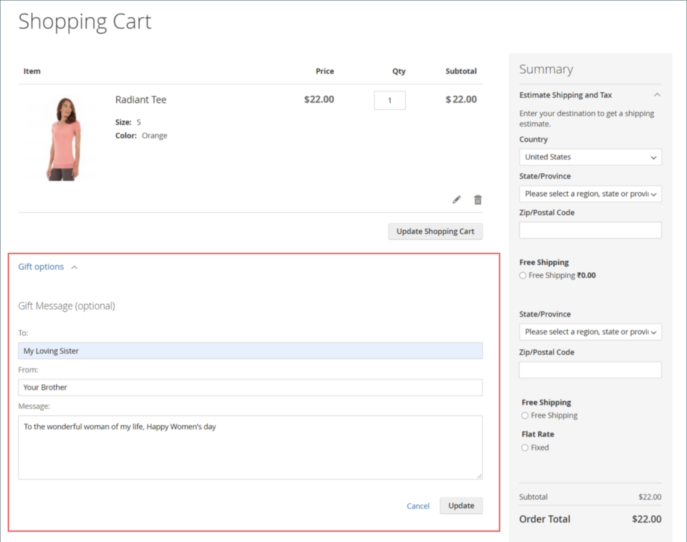

# Produkteinstellungen - [!UICONTROL Gift Options]

Im Abschnitt _[!UICONTROL Gift Options]_können Sie Optionen für Geschenknachrichten und Geschenkverpackungen beim Checkout auf Produktebene festlegen. Um die Standardkonfigurationseinstellung zu überschreiben, deaktivieren Sie das Kontrollkästchen **[!UICONTROL Use Config Settings]**.

{width="600" zoomable="yes"}

## Festlegen von Geschenkoptionen für ein einzelnes Produkt

1. Öffnen Sie das Produkt im Bearbeitungsmodus.

1. Scrollen Sie nach unten und erweitern Sie  den Abschnitt _[!UICONTROL Gift Options]_und führen Sie die folgenden Schritte aus:

   - Um die Standardeinstellung zu überschreiben, deaktivieren Sie das Kontrollkästchen **[!UICONTROL Use Config Settings]** .

   - Legen Sie **[!UICONTROL Allow Gift Message]** nach Bedarf für das Produkt fest.

   -  (nur [Adobe Commerce](../landing/home.md#product-editions)) Legen Sie **[!UICONTROL Allow Gift Wrapping]** nach Bedarf für das Produkt fest.

   -  ([nur Adobe Commerce](../landing/home.md#product-editions)) Geben Sie bei Bedarf die **[!UICONTROL Price for Gift Wrapping]** ein.

1. Klicken Sie abschließend auf **[!UICONTROL Save]**.

## Aktivieren von Geschenknachrichten für Ihren Shop

Standardmäßig ermöglicht Commerce es den Kundinnen und Kunden, ihren Bestellungen und Produkten während des Checkout-Prozesses eine personalisierte Geschenknachricht hinzuzufügen.

Sie können diese Funktion Kunden bereitstellen, indem Sie _Geschenknachricht_ für Ihren Store aktivieren:

1. Navigieren Sie in _Admin_-Seitenleiste zu **[!UICONTROL Stores]** > _[!UICONTROL Settings]_>**[!UICONTROL Configuration]**.

1. Erweitern Sie im linken Bereich **[!UICONTROL Sales]** und wählen Sie darunter **[!UICONTROL Sales]**.

1. Erweitern Sie  **[!UICONTROL Gift Options]** auf der Seite.

1. Wählen Sie **[!UICONTROL Allow Gift Messages on Order Level]** die Option `Yes` aus, um eine einzelne Geschenknachricht für die gesamte Bestellung zu aktivieren.

1. Wählen Sie **[!UICONTROL Allow Gift Messages for Order Items]** die Option `Yes` aus, um das separate Hinzufügen von Geschenknachrichten zu einzelnen Artikeln im Warenkorb des Kunden zu aktivieren.

1. Klicken Sie auf **[!UICONTROL Save Config]**.

Mit dieser Konfiguration können Kundinnen und Kunden der Warenkorbseite eine Geschenknachricht von der Storefront hinzufügen, wie im folgenden Beispiel gezeigt:

{width="600" zoomable="yes"}
