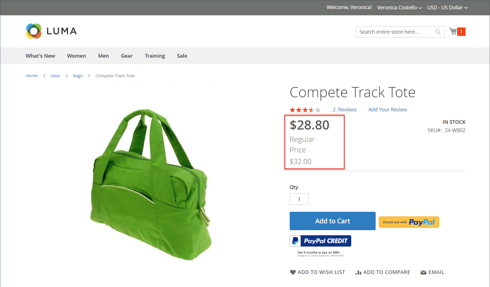
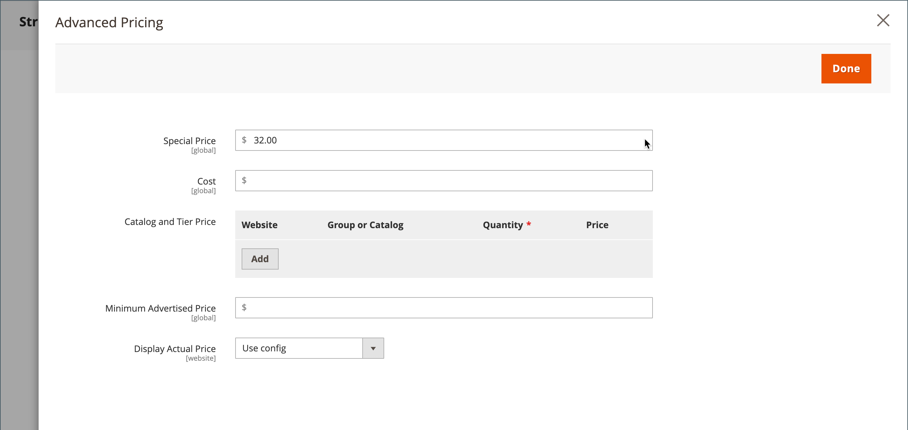

# Preisgestaltung einer Gruppe

Sie können die Produktkonfigurationseinstellungen im Admin-Bereich verwenden, um Preise für ermäßigte Artikel basierend auf Kundengruppen in Ihrem Geschäft festzulegen. Dieses strategische Preismodell wird _Gruppenpreisfindung“_.

Der ermäßigte Preis eines Produkts kann Mitgliedern einer bestimmten Kundengruppe angeboten werden, wenn der Käufer in seinem Konto eingeloggt ist. Auf der Produktseite wird der Kundengruppenpreis zusammen mit dem regulären Preis angezeigt, sodass ein Käufer die Preise einfach vergleichen und entsprechend handeln kann. Nachdem der Kunde das Produkt zum Warenkorb hinzugefügt hat, wird der reguläre Preis durch den Gruppenpreis auf Basis der Kundengruppe ersetzt.

Die Preisgestaltung für Kundengruppen ist eine Komponente der [Preisstaffelung](product-price-tier.md) und wird auf ähnliche Weise festgelegt. Der einzige Unterschied besteht darin, dass die Preise der Kundengruppen eine Menge von 1 haben.

{width="600" zoomable="yes"}

## Vorteile der Verwendung von Gruppenpreisen

- Geeignet für Großabnehmer

- Anreiz für Kunden, ihre Kundengruppe zu aktualisieren, um Rabatte zu nutzen

- Gezielte Marketing-Kampagnen

- Aufbau von Vertrauen und Glaubwürdigkeit durch Belohnung treuer Kunden

## Gruppenpreis einrichten

1. Öffnen Sie das Produkt im Bearbeitungsmodus.

1. Klicken Sie unter dem Feld _[!UICONTROL Price]_&#x200B;auf **[!UICONTROL Advanced Pricing]**.

1. Klicken Sie im Abschnitt _[!UICONTROL Customer Group Price]_&#x200B;auf **[!UICONTROL Add]**.

   Wenn Ihr Store [Adobe Commerce B2B](../b2b/introduction.md) enthält und [freigegebene Kataloge](../b2b/catalog-shared.md) aktiviert hat, ist dieser Abschnitt _[!UICONTROL Catalog and Tier Price]_.

   {width="600" zoomable="yes"}

1. Konfigurieren Sie den Gruppenpreis:

   - Wählen Sie für eine Installation an mehreren Standorten die **[!UICONTROL Website]** aus, für die der Gruppenpreis gilt.

   - Wählen Sie die **[!UICONTROL Customer Group]** aus, die den Rabatt erhalten soll.

   - Geben Sie eine **[!UICONTROL Quantity]** von `1` ein.

   - Legen Sie **[!UICONTROL Price]** den Preistyp und den Betrag fest:

      - `Fixed` - Geben Sie den reduzierten Produktpreis ein.

      - `Discount` - Geben Sie den ermäßigten Preis als Prozentsatz des Produktpreises ein.

     {width="600" zoomable="yes"}

1. Um einen weiteren Gruppenpreis hinzuzufügen, klicken Sie auf **[!UICONTROL Add]** und wiederholen Sie den vorherigen Schritt.

1. Klicken Sie abschließend auf **[!UICONTROL Done]** und dann auf **[!UICONTROL Save]**.

>[!NOTE]
>
>Der **_Endpreis_** der Ware wird als **_Mindestpreis_** berechnet, und zwar nach folgender Formel:  `Final Price=Min(Regular(Base) Price, Group(Tier) Price, Special Price, Catalog Price Rule) + Sum(Min Price per each required custom option)`

>[!NOTE]
>
>**_Festpreis_** Anpassbare Produktoptionen werden _nicht_ durch Gruppenpreis-, Stufenpreis-, Sonderpreis- oder Katalogpreisregeln beeinflusst.
