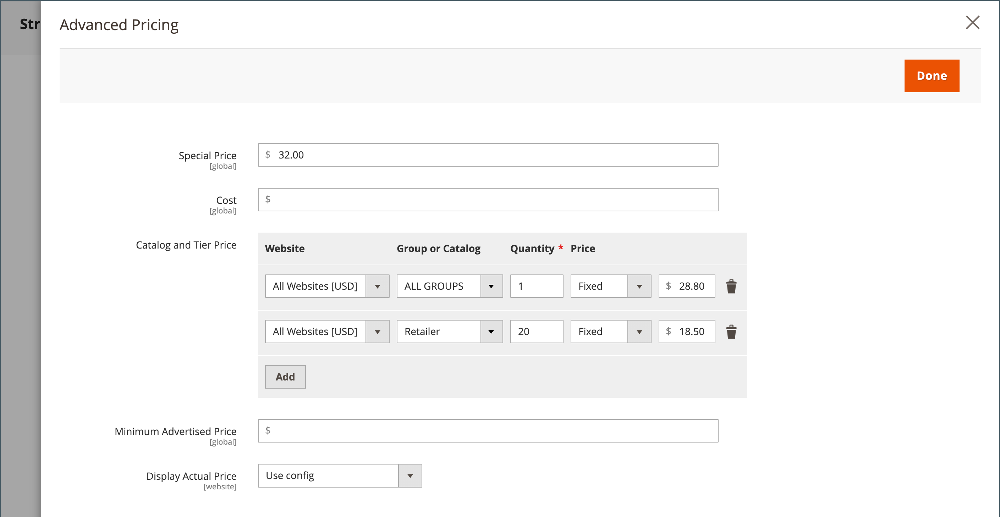

# Gruppenpreise

Sie können die Produktkonfigurationseinstellungen in der Admin-Konsole verwenden, um Preise für ermäßigte Artikel auf der Grundlage von Kundengruppen in Ihrem Geschäft festzulegen. Dieses strategische Preismodell heißt _Gruppenpreise_.

Der ermäßigte Preis eines Produkts kann Mitgliedern einer bestimmten Kundengruppe angeboten werden, wenn der Käufer bei seinem Konto angemeldet ist. Der Kundengruppenpreis wird zusammen mit dem regulären Preis auf der Produktseite angezeigt, sodass ein Käufer die Preise einfach vergleichen und entsprechend handeln kann. Nachdem der Kunde das Produkt zum Warenkorb hinzugefügt hat, wird der reguläre Preis durch den auf seiner Kundengruppe basierenden Gruppenpreis ersetzt.

Die Preise für Kundengruppen sind eine Komponente von [gestaffelte Preise](product-price-tier.md) und auf ähnliche Weise festgelegt ist. Der einzige Unterschied besteht darin, dass die Preise der Kundengruppen eine Menge von 1 aufweisen.

{width="600" zoomable="yes"}

## Vorteile der Verwendung von Gruppenpreisen

- Geeignet für Großkäufer

- Anreize für Kunden, ihre Kundengruppe zu aktualisieren, um von Rabatten zu profitieren

- Zielgerichtete Marketing-Kampagnen

- Vertrauen und Glaubwürdigkeit schaffen durch Belohnung treuer Kunden

## Einrichten eines Gruppenpreises

1. Öffnen Sie das Produkt im Bearbeitungsmodus.

1. Unter dem _[!UICONTROL Price]_Feld, klicken Sie auf **[!UICONTROL Advanced Pricing]**.

1. Im _[!UICONTROL Customer Group Price]_Abschnitt, klicken Sie auf **[!UICONTROL Add]**.

   Wenn Ihr Store [Adobe Commerce B2B](../b2b/introduction.md) und [freigegebene Kataloge](../b2b/catalog-shared.md) aktiviert ist, wird dieser Abschnitt _[!UICONTROL Catalog and Tier Price]_.

   {width="600" zoomable="yes"}

1. Konfigurieren Sie den Gruppenpreis:

   - Wählen Sie für eine Installation mit mehreren Sites die **[!UICONTROL Website]** wenn der Gruppenpreis gilt.

   - Wählen Sie die **[!UICONTROL Customer Group]** das heißt, den Rabatt zu erhalten.

   - Geben Sie einen **[!UICONTROL Quantity]** von `1`.

   - Für **[!UICONTROL Price]**, legen Sie den Preistyp und den Betrag fest:

      - `Fixed` - Geben Sie den ermäßigten Produktpreis ein.

      - `Discount` - Geben Sie den ermäßigten Preis als Prozentsatz des Produktpreises an.

     {width="600" zoomable="yes"}

1. Um einen weiteren Gruppenpreis hinzuzufügen, klicken Sie auf **[!UICONTROL Add]** und wiederholen Sie den vorherigen Schritt.

1. Wenn Sie fertig sind, klicken Sie auf **[!UICONTROL Done]** und dann **[!UICONTROL Save]**.

>[!NOTE]
>
>Die **_final_** Der Produktpreis wird als **_Minimum_** relevanter Preis nach folgender Formel:  `Final Price=Min(Regular(Base) Price, Group(Tier) Price, Special Price, Catalog Price Rule) + Sum(Min Price per each required custom option)`

>[!NOTE]
>
>**_Festpreis_** Anpassbare Produktoptionen sind _not_ beeinflusst von den Regeln für Gruppenpreis, Tier-Preis, Sonderpreis oder Katalogpreis.
