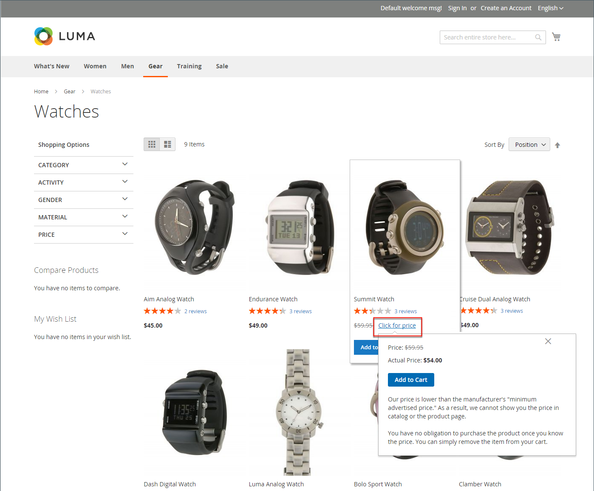
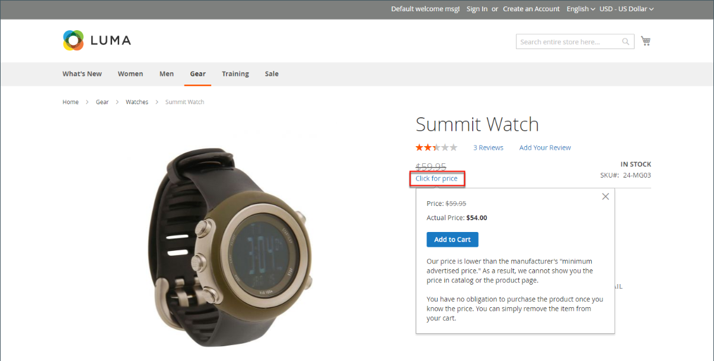
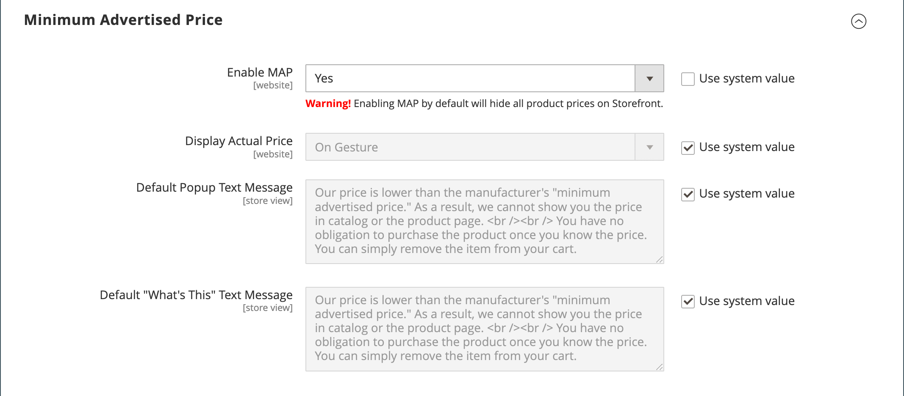
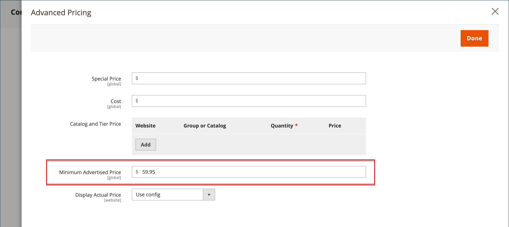

# Angebotshöchstpreis

Händlern ist es manchmal untersagt, einen Preis anzuzeigen, der unter dem vom Hersteller vorgeschlagenen Einzelhandelspreis liegt. Der Mindest-Werbepreis (MAP) bietet Ihnen die Möglichkeit, die Anforderungen des Herstellers zu erfüllen und Ihren Kunden einen besseren Preis zu bieten. Da die Anforderungen von Hersteller zu Hersteller unterschiedlich sind, können Sie Ihren Shop so konfigurieren, dass der tatsächliche Preis auf Seiten, auf denen er nicht zulässig ist, nicht angezeigt wird.

Mit der MAP-Funktion wird ein dedizierter _Click for Price_-Link anstelle des regulären Produktpreises hinzugefügt. Wenn der Preis in Ihrem Geschäft unter dem Mindestpreis für dieses Produkt liegt, gibt es zwei Möglichkeiten, die Preisinformationen in der Storefront zu verarbeiten. Der erste Weg ist, dass der Preis nicht angezeigt wird. Wenn der Käufer auf die _Click for Price_-Schaltfläche klickt, wird erst dann der tatsächliche Preis, zu dem Sie das Produkt verkaufen, angezeigt. Der zweite Weg besteht darin, dass der Listenpreis bzw. der Marktpreis durchgestrichen angezeigt wird, um zu betonen, dass Ihr Preis niedriger ist.

Außerdem können Sie mit der MAP-Funktion einige Verbesserungen vorschlagen. Wenn ein Kunde beispielsweise ein solches Produkt zu seinem Warenkorb hinzufügt, wird er nicht zum Warenkorb weitergeleitet. Stattdessen werden Angebote angezeigt, die es dem Käufer ermöglichen:

- Entfernen Sie einen Artikel aus dem Warenkorb (kann getan werden, wenn der Käufer nur den Preis klären möchte und noch keine Kaufentscheidung getroffen hat)

- Lassen Sie es in ihrem Warenkorb und kaufen Sie weiter

- Zur Kasse gehen

## MAP-Logik

Einige Produkte haben Preise, die von einer ausgewählten Option abhängen, wie z. B. benutzerdefinierte Optionen oder einfache Produkte mit eigenen SKUs und Lagerverwaltung). Für diese Produkte wird je nach Produkttyp und Preiseinstellung die folgende Logik angewendet. Der tatsächliche Preis wird von Order Management, Customer Management-Tools und Berichten verwendet.

## Verwenden von MAP mit Produkttypen

| Produkttyp | Beschreibung |
|--- |--- |
| [Einfach](product-create-simple.md), [virtuell](product-create-virtual.md) | Der tatsächliche Preis wird nicht automatisch auf Kataloglisten- und Produktseiten angezeigt, sondern ist nur gemäß der [!UICONTROL Display Actual Price] enthalten. Benutzerdefinierte Optionspreise erscheinen normal. |
| [Gruppiert](product-create-grouped.md) | Die Preise der zugehörigen einfachen Produkte erscheinen nicht automatisch auf der Katalogliste und den Produktseiten, sondern sind nur gemäß der [!UICONTROL Display Actual Price] enthalten. |
| [Konfigurierbar](product-create-configurable.md) | Der tatsächliche Preis wird nicht automatisch auf Kataloglisten- und Produktseiten angezeigt, sondern ist nur gemäß der [!UICONTROL Display Actual Price] enthalten. Optionspreise erscheinen normal. |
| [Bundle](product-create-bundle.md) (mit Festpreis) | Der tatsächliche Preis erscheint nicht automatisch auf den Katalogseiten, sondern ist nur gemäß der [!UICONTROL Display Actual Price] enthalten. Die Preise der Paketartikel erscheinen normal. MAP ist nicht für Bundle-Produkte mit dynamischen Preisen verfügbar. |
| [herunterladbar](product-create-downloadable.md) | Der tatsächliche Preis wird nicht automatisch auf Kataloglisten- und Produktseiten angezeigt, sondern ist nur gemäß der [!UICONTROL Display Actual Price] enthalten. Der Preis für jeden Download-Link wird normal angezeigt. |

{style="table-layout:auto"}

## MAP mit Preiseinstellungen verwenden

| Preisfestsetzung | Beschreibung |
|--- |--- |
| Hauptpreis | Wenn MAP auf den Hauptpreis angewendet wird, erscheinen die Preise von Optionen, Paketartikeln und zugehörigen Produkten (die den Hauptpreis addieren oder subtrahieren) normal. |
| Zugeordneter Produktpreis | Wenn ein Produkt keinen Hauptpreis hat und sein Preis von den zugehörigen Produktpreisen abgeleitet wird (z. B. bei einem gruppierten Produkt), werden die MAP-Einstellungen der zugehörigen Produkte angewendet. |
| [MSRP](product-price-minimum-advertised.md) | Wenn für ein Produkt im Warenkorb der vom Hersteller vorgeschlagene Einzelhandelspreis (MSRP) angegeben wurde, ist der Preis nicht durchgestrichen. |
| [Tier-Preis](product-price-tier.md) | Wenn Preisstufe festgelegt ist, wird die Preismeldung für die Stufe nicht im Katalog angezeigt. Auf der Produktseite wird eine Benachrichtigung angezeigt, die anzeigt, dass der Preis bei der Bestellung von mehr als einer bestimmten Menge niedriger sein kann, der Rabatt jedoch nur in Prozent angezeigt wird. Für zugehörige Produkte eines gruppierten Produkts werden die Rabatte nicht auf der Produktseite angezeigt. Der Stufenpreis wird entsprechend der Einstellung „Ist-Preis anzeigen“ angezeigt. |
| [Sonderpreis](product-price-special.md) | Wenn der Sonderpreis festgelegt ist, wird der Sonderpreis entsprechend der Einstellung Ist-Preis anzeigen angezeigt. |

## MAP-Konfiguration

Die Funktion Mindest-Angebotspreis (MAP) ist nicht standardmäßig aktiviert. Wenn Sie diese Funktion zu Ihrem Store hinzufügen möchten, müssen Sie sie aktivieren und die MAP-Einstellungen für Ihre Produkte konfigurieren. Die MAP-Einstellungen können auf alle Produkte in Ihrem Katalog angewendet oder für bestimmte Produkte konfiguriert werden. Wenn „MAP“ global aktiviert ist, werden alle Produktpreise in der Storefront ausgeblendet. Es gibt verschiedene Konfigurationsoptionen, mit denen Sie die Bedingungen Ihrer Vereinbarung mit dem Hersteller einhalten und Ihren Kunden dennoch einen besseren Preis bieten können.

{width="700" zoomable="yes"}

Auf globaler Ebene können Sie MAP aktivieren oder deaktivieren, es auf alle Produkte anwenden und definieren, wie der tatsächliche Preis angezeigt wird. Sie können auch den Text der zugehörigen Nachrichten und Tipps bearbeiten, die im Store angezeigt werden.

Wenn „ZUORDNUNG“ aktiviert ist, werden die Zuordnungseinstellungen auf Produktebene verfügbar. Sie können MAP auf ein einzelnes Produkt anwenden, indem Sie den MSRP eingeben und auswählen, wie der tatsächliche Preis im Geschäft angezeigt werden soll. Die MAP-Einstellungen auf Produktebene setzen die globalen MAP-Einstellungen außer Kraft.

{width="700" zoomable="yes"}

### Schritt 1: Aktivieren der MAP für die Store-Ansicht

1. Navigieren Sie in _Admin_-Seitenleiste zu **[!UICONTROL Stores]** > _[!UICONTROL Settings]_>**[!UICONTROL Configuration]**.

1. Falls zutreffend, **[!UICONTROL Store View]** Sie rechts oben auf die Ansicht, für die die Konfiguration gilt.

1. Erweitern Sie im linken Bereich **[!UICONTROL Sales]** und wählen Sie darunter **[!UICONTROL Sales]**.

1. Erweitern Sie  den Abschnitt _[!UICONTROL Minimum Advertised Price]_.

1. Falls erforderlich, setzen **MAP aktivieren** auf `Yes`.

   {width="600" zoomable="yes"}

   Eine detaillierte Liste dieser Konfigurationsoptionen finden Sie unter [_Mindest-Angebotspreis_](../configuration-reference/sales/sales.md#minimum-advertised-price) in der _Konfigurationsreferenz_.

### Schritt 2: Konfigurieren der MAP-Einstellungen

Verwenden Sie eine der folgenden Methoden, um die MAP-Einstellungen zu konfigurieren:

#### Methode 1: Konfigurieren der MAP für alle Produkte

1. Gehen Sie wie folgt vor, um zu bestimmen, wann und wo der tatsächliche Preis für die Kunden sichtbar sein soll:

   - Um den Standardwert zu ändern, deaktivieren Sie das Kontrollkästchen **[!UICONTROL Use system value]** .

   - Legen Sie **Tatsächlichen Preis anzeigen** auf eine der folgenden Einstellungen fest:
      - `In Cart`
      - `Before Order Confirmation`
      - `On Gesture (on click)`

1. Geben Sie den Text ein, der im **[!UICONTROL Default Popup Text Message]** angezeigt werden soll.

1. Geben Sie eine zusätzliche Erklärung ein, die im **[!UICONTROL Default "What's This" Text Message]** angezeigt werden soll.

1. Klicken Sie abschließend auf **[!UICONTROL Save Config]**.

#### Methode 2: Konfigurieren von MAP für ein einzelnes Produkt

1. Navigieren Sie in _Admin_-Seitenleiste zu **[!UICONTROL Catalog]** > **[!UICONTROL Inventory]** > **[!UICONTROL Products]**.

1. Öffnen Sie das Produkt im **[!UICONTROL Edit]**.

1. Erweitern Sie im linken Bereich **[!UICONTROL Advanced Settings]** und wählen Sie **[!UICONTROL Advanced Pricing]**.

   >[!NOTE]
   >
   >Die Felder [!UICONTROL Manufacturer's Suggested Retail Price] und [!UICONTROL Display Actual Price] werden nur angezeigt, wenn [Mindestpreis für Werbung](../configuration-reference/sales/sales.md#minimum-advertised-price) in der Konfiguration aktiviert ist.

1. Geben Sie den **[!UICONTROL Manufacturer's Suggested Retail Price]** (MSRP) ein.

   In diesem Beispiel beträgt der Produktpreis 54,00 $ und der MSRP 59,95 $.

   {width="600" zoomable="yes"}

1. Legen Sie **[!UICONTROL Display Actual Price]** auf eine der folgenden Einstellungen fest:

   - `Use config` - (Standard) Wendet die Anzeigeeinstellungen als [konfiguriert](../configuration-reference/sales/sales.md#minimum-advertised-price) für den Store an. |
   - `On Gesture` - Zeigt den tatsächlichen Produktpreis in einem Popup an, wenn der Kunde auf den _Klick für Preis_ oder _Was ist das?_ Link.
   - `In Cart` - Zeigt den tatsächlichen Produktpreis im Warenkorb an.
   - `Before Order Confirmation` - Zeigt den tatsächlichen Produktpreis am Ende des Checkout-Prozesses an, kurz bevor die Bestellung bestätigt wird.

1. Klicken Sie abschließend auf **[!UICONTROL Done]** und dann auf **[!UICONTROL Save]**.
