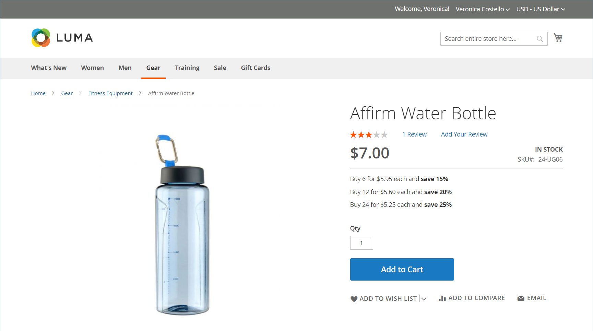

# Preisstufe

Mit Preisstufen können Sie einen Mengenrabatt von einer Produktliste oder Produktseite in der Storefront anbieten. Der Rabatt kann auf eine bestimmte Shop-Ansicht, Kundengruppe oder einen freigegebenen Katalog angewendet werden.

Wenn Sie viele Produkte aktualisieren müssen, ist es am effizientesten, die Preisänderungen der Stufe zu importieren, anstatt sie einzeln einzugeben. Weitere Informationen finden Sie unter [Preise der Importstufe](../systems/data-import-price-tier.md).

{width="700" zoomable="yes"}

Die Produktseite berechnet den Mengenrabatt und zeigt eine Meldung an, z. B.:

`Buy 6 for $5.95 each and save 15%`

Die Preise in der Storefront haben Vorrang von der höchsten zur niedrigsten Menge. Wenn Sie einen Stufenpreis für die Menge `5` und einen für `10` haben und ein Kunde fünf, sechs, sieben, acht oder neun Artikel in den Warenkorb legt, erhält der Kunde den ermäßigten Preis für die Menge `5` Stufe. Wenn der Kunde den zehnten Artikel hinzufügt, ersetzt der für die Menge `10` Stufe angegebene abgezinste Preis die Stufe für eine Menge von `5`, und der abgezinste Preis für `10` gilt.

## Preisstufe für ein Produkt hinzufügen

1. Öffnen Sie das Produkt im Bearbeitungsmodus.

1. Klicken Sie unter dem Feld _[!UICONTROL Price]_auf **[!UICONTROL Advanced Pricing]**.

1. Klicken Sie im Abschnitt _[!UICONTROL Tier Price]_auf **[!UICONTROL Add]**.

   Wenn Sie eine Preisstufe mit mehreren Preisen erstellen, klicken Sie auf **[!UICONTROL Add]** für jede zusätzliche Ebene, damit Sie alle Ebenen gleichzeitig bearbeiten können. Jede Ebene in der Gruppe verfügt über dieselbe Website und Kundengruppe oder gemeinsame Katalogzuweisung, aber eine andere Menge und einen anderen Preis.

## Konfigurieren der Preisstufe

1. Wenn Ihr Store über mehrere Websites verfügt, wählen Sie die **[!UICONTROL Website]** aus, für die die Preisstufe gilt.

1. Schränken Sie bei Bedarf die Verfügbarkeit der Preisstufe ein, indem Sie die **[!UICONTROL Customer Group]** oder den **[!UICONTROL Shared Catalog]** auswählen ( Nur verfügbar mit [Adobe Commerce B2B](./b2b/../introduction.md)).

1. Geben Sie **[!UICONTROL Qty]** die Menge ein, die bestellt werden muss, um den Rabatt zu erhalten.

   - **Methode 1:** Geben Sie den Preis als festen Betrag ein

     Legen Sie **[!UICONTROL Price]** auf `Fixed` fest und geben Sie den angepassten Preis für eine Einheit dieser Stufe ein.

     {width="600" zoomable="yes"}

   - **Methode 2:** Geben Sie den Preis in Prozent ein.

     Setzen Sie **[!UICONTROL Price]** auf `Discount` und geben Sie den Rabattpreis als Prozentsatz des Grundpreises des Produkts ein.

     Geben Sie beispielsweise für einen Rabatt von 15 % die Zahl `15` ein. (Der Preis wird mit zwei Dezimalstellen gespeichert, z. B. `15.00`.)

     >[!NOTE]
     >
     >Um den reduzierten Preis abzurufen, wird der definierte Prozentsatz anhand des im Feld _[!UICONTROL Price]_definierten Werts berechnet und nicht anhand des Felds_[!UICONTROL Special Price]_.

     {width="600" zoomable="yes"}

## Abschließen der Preiskonfiguration

1. Um einen weiteren Satz von Preisstufen für eine andere Website oder Kundengruppe hinzuzufügen, wiederholen Sie die vorherigen Schritte.

1. Klicken Sie abschließend auf **[!UICONTROL Done]** und dann auf **[!UICONTROL Save]**.

>[!NOTE]
>
>Der **_Endpreis_** der Ware wird als **_Mindestpreis_** berechnet, und zwar nach folgender Formel:  `Final Price=Min(Regular(Base) Price, Group(Tier) Price, Special Price, Catalog Price Rule) + Sum(Min Price per each required custom option)`

>[!NOTE]
>
>**_Festpreis_** Anpassbare Produktoptionen werden _nicht_ durch Gruppenpreis-, Stufenpreis-, Sonderpreis- oder Katalogpreisregeln beeinflusst.

## Festlegen der Preisstufe für Katalogpreisregeln

[!BADGE nur SaaS]{type=Positive url="https://experienceleague.adobe.com/en/docs/commerce/user-guides/product-solutions" tooltip="Gilt nur für Adobe Commerce as a Cloud Service-Projekte (von Adobe verwaltete SaaS-Infrastruktur)."}

In früheren Versionen von Commerce konnte die Preisstufe nicht in Verbindung mit Katalogpreisregeln verwendet werden. Die Katalogregeln ignorierten die Stufenpreiskonfiguration und berechneten Rabatte nur vom ursprünglichen Grundpreis. Mit Adobe Commerce as a Cloud Service können Sie jetzt Preisstufen in die Berechnung von Katalogpreisregeln einbeziehen.

So aktivieren Sie diese Funktion:

1. Navigieren Sie zu **[!UICONTROL Stores]** > *[!UICONTROL Settings]* > **[!UICONTROL Configuration]** > **[!UICONTROL Sales]** > **[!UICONTROL Sales]** > **[!UICONTROL Promotions]** und legen Sie das Feld **[!UICONTROL Apply Catalog Price Rule on Grouped Price]** auf **[!UICONTROL Yes]** fest.

   {width="700" zoomable="yes"}

1. Definieren Sie einen Stufenkurs mit einer `1` für jede spezifische Kundengruppe oder jeden freigegebenen Katalog (z. B. `Wholesale`, `Retail` oder eine von Händlern definierte Gruppe), den Sie mit Katalogpreisregeln ansprechen möchten. Die `ALL GROUPS` Kundengruppe und `Default` freigegebene Katalog können zu diesem Zweck nicht verwendet werden. Die Preisstufe ist für keine Gruppe aktiviert, für die kein Preisstufe mit einer Menge von `1` definiert ist.

1. Definieren Sie bei Bedarf zusätzliche Stufenpreise mit Mengen über `1`. Diese zusätzlichen Preisstufen werden wie gewohnt angewendet, wenn der Kunde zusätzliche Mengen des Produkts in den Warenkorb legt. Die Katalogpreisregeln gelten nicht für diese zusätzlichen Preisstufen.

Betrachten Sie das folgende Beispiel, um zu veranschaulichen, wie die Preisstaffelung beim Kauf eines einzelnen Produkts mit den Katalogpreisregeln funktioniert:

- Der Standardgrundpreis eines Produkts beträgt 100 USD.
- Für die `Wholesale` Kundengruppe wird ein Stufenpreis mit einer Menge von `1` und einem Festpreis von 90 USD definiert.
- Eine Katalogpreisregel bietet einen Rabatt von 10 % für die `Wholesale` Kundengruppe.

Wenn die Preisstufe für Katalogpreisregeln aktiviert ist, verwendet das System den folgenden Fluss, um den endgültigen Preis zu berechnen:

1. Bevor sich der Kunde anmeldet, wird der Produktpreis als 100 USD angezeigt (der Standard-Basispreis).

1. Nachdem sich der Kunde als Mitglied der `Wholesale` angemeldet hat, wird der Produktpreis auf 90 USD (der Stufenpreis für die `Wholesale`) angepasst.

1. Es wird die Katalogpreisregel angewendet, die einen Rabatt von 10 % auf den Stufenpreis von 90 USD bietet, was zu einem Endpreis von 81 USD führt.

In der folgenden Tabelle sind Preisberechnungen zusammengefasst, wenn die Preisstufe für Katalogpreisregeln aktiviert ist und eine Katalogpreisregel einen Rabatt von 10 % für alle Kundengruppen bietet:

Produkt: Standardpreis $100 (Einzelkauf)

| Kundengruppe | Stufenpreis (Menge = 1) | Neuer Basispreis | Endgültiger Preis |
|---|---|---|---|
| ALL GROUPS | Nicht konfiguriert | 100 $ | $100 - 10% = $90 |
| Großhandel | Behoben: $85 | 85 $ | $ 85 - 10 % = $ 76,50 |
| Retailer | 20 % Rabatt | 80 $ | $ 80 - 10 % = $ 72,00 |
| VIP | 15 % Rabatt | 85 $ | $ 85 - 10 % = $ 76,50 |
