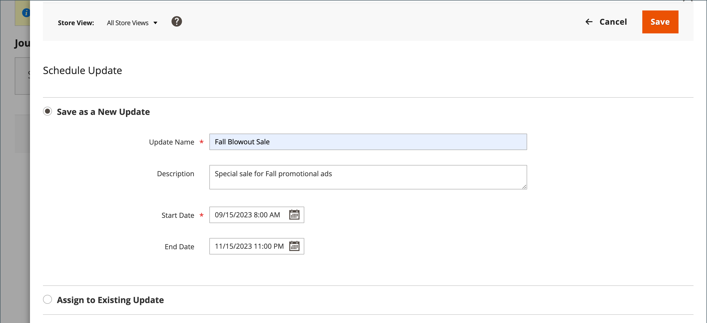

# Produktaktualisierungen planen

{{ee-feature}}

Produktaktualisierungen können planmäßig angewendet und mit anderen Inhaltsänderungen gruppiert werden. Sie können [Inhaltstaging](../content-design/content-staging.md) verwenden, um eine Kampagne basierend auf geplanten Änderungen am Produkt zu erstellen, oder die Änderungen auf eine bestehende Kampagne anwenden.

>[!NOTE]
>
>Die Felder [!UICONTROL Set Product as New From] und [!UICONTROL To] sowie die Registerkarte [!UICONTROL Schedule Design Update] wurden in der Adobe Commerce für  entfernt und können nicht direkt am Produkt geändert werden. Sie müssen eine geplante Aktualisierung für diese Aktivierungen erstellen.

>[!NOTE]
>
>Alle geplanten Aktualisierungen werden nacheinander angewendet, d. h. jede Entität kann nur eine geplante Aktualisierung gleichzeitig haben. Jede geplante Aktualisierung wird auf alle Store-Ansichten innerhalb des Zeitrahmens angewendet. Daher kann eine Entität nicht mehrere geplante Aktualisierungen für verschiedene Store-Ansichten gleichzeitig aufweisen. Alle Entitätsattributwerte in allen Store-Ansichten, die von der aktuellen geplanten Aktualisierung nicht betroffen sind, werden von den Standardwerten übernommen und nicht von der vorherigen geplanten Aktualisierung.

>[!NOTE]
>
>Eine Staging-Vorschau für eine geplante Aktualisierung beginnt immer in der Store-Ansicht &quot;**default**&quot;, in der das Kundenerlebnis der Navigation durch die Staging-Update-Kampagne emuliert wird.

## Geplantes Update erstellen

1. Wechseln Sie in der Seitenleiste _Admin_ zu **[!UICONTROL Catalog]** > **[!UICONTROL Products]**.

1. Wählen Sie ein vorhandenes Produkt aus und klicken Sie auf **[!UICONTROL Edit]**.

1. Klicken Sie auf **[!UICONTROL Schedule New Update]**.

1. Wählen Sie **[!UICONTROL Save as a New Update]** aus.

1. Geben Sie für **[!UICONTROL Update Name]** einen Namen für die neue Inhaltstaging-Kampagne ein.

1. Geben Sie eine kurze Beschreibung **[!UICONTROL Description]** der Aktualisierung ein und geben Sie an, wie sie verwendet werden soll.

1. Verwenden Sie das Kalendersymbol (), um die **[!UICONTROL Start Date]** und die **[!UICONTROL End Date]** für die Kampagne auszuwählen.

   >[!NOTE]
   >
   >Campaign **[!UICONTROL Start Date]** und **[!UICONTROL End Date]** müssen mithilfe der **_default_** Admin-Zeitzone definiert werden, die für jede Website aus der lokalen Zeitzone konvertiert wird. Bei mehreren Websites in verschiedenen Zeitzonen, auf denen Sie eine Kampagne basierend auf einer US-Zeitzone starten möchten, müssen Sie beispielsweise für jede lokale Zeitzone eine separate Aktualisierung planen. Legen Sie für jede Seite **[!UICONTROL Start Date]** und **[!UICONTROL End Date]** fest und es wird aus der lokalen Website-Zeitzone in die standardmäßige Admin-Zeitzone konvertiert.

   {width="600" zoomable="yes"}

1. Scrollen Sie nach unten zu _[!UICONTROL Price]_und klicken Sie auf **[!UICONTROL Advanced Pricing]**.

1. Geben Sie während der geplanten Kampagne einen **[!UICONTROL Special Price]** für das Produkt ein und klicken Sie auf **[!UICONTROL Done]**.

1. Klicken Sie nach Abschluss des Vorgangs auf **[!UICONTROL Save]**.

## Zu vorhandener Aktualisierung zuweisen

1. Wechseln Sie in der Seitenleiste _Admin_ zu **[!UICONTROL Catalog]** > **[!UICONTROL Products]**.

1. Wählen Sie ein vorhandenes Produkt aus und klicken Sie auf **[!UICONTROL Edit]**.

1. Klicken Sie auf **[!UICONTROL Schedule New Update]**.

1. Wählen Sie **[!UICONTROL Assign to Existing Campaign]** aus.

1. Wählen Sie in der Liste die zu ändernde Kampagne aus.

   {width="600" zoomable="yes"}

1. Erweitern Sie  **[!UICONTROL Content]**.

1. Klicken Sie nach Abschluss des Vorgangs auf **[!UICONTROL Save]**.

## Geplante Änderung anzeigen

Die geplante Änderung wird oben auf der Produktseite mit dem Start- und Enddatum der Kampagne angezeigt.

{width="600" zoomable="yes"}

## Geplante Änderung bearbeiten

1. Klicken Sie im Feld _[!UICONTROL Scheduled Changes]_oben auf der Seite auf **[!UICONTROL View/Edit]**.

1. Nehmen Sie die erforderlichen Änderungen an der geplanten Aktualisierung vor.

>[!NOTE]
>
>Wenn eine Kampagne mit mehreren Produkten verknüpft ist, kann die Kampagne nur über das Dashboard [Inhaltstaging-Dashboard](../content-design/content-staging-dashboard.md) bearbeitet werden.

1. Klicken Sie auf **[!UICONTROL Save]**.

## Die geplante Änderung entfernen

1. Klicken Sie im Feld _[!UICONTROL Scheduled Changes]_oben auf der Seite auf **[!UICONTROL View/Edit]**.

1. Klicken Sie in der oberen Leiste auf **[!UICONTROL Remove from Update]**.

   {width="600" zoomable="yes"}

1. Wählen Sie im Dialogfeld **[!UICONTROL Delete the Update]** aus und klicken Sie auf **[!UICONTROL Done]**.

   >[!NOTE]
   >
   >Das Produkt wird aus der Aktualisierung entfernt und alle geplanten Änderungen gehen verloren.

## Planen einer Design-Aktualisierung

{{ce-feature}}

Im Abschnitt _[!UICONTROL Schedule Design Update]_können Sie temporäre Änderungen am Erscheinungsbild der Produktseite vornehmen. Sie können Designänderungen für eine Saison, eine Promotion oder einfach nur planen, um Dinge neu zu gestalten. Designänderungen können im Voraus geplant werden, sodass sie entsprechend Ihrem definierten Zeitplan in Kraft treten.__

{width="600" zoomable="yes"}

| Feld | Beschreibung |
|--- |--- |
| [!UICONTROL Schedule Update From/To] | Bestimmt den Datumsbereich, in dem ein benutzerdefiniertes Layout auf das Produkt angewendet wird. |
| [!UICONTROL New Theme] | Wendet ein benutzerdefiniertes Design auf das Produkt an. |
| [!UICONTROL New Layout] | Wendet ein anderes Layout auf die Produktseite an. Optionen:  **[!UICONTROL No layout updates]**- Standardmäßig sind keine Layoutaktualisierungen für die Produktseite verfügbar. **[!UICONTROL Empty]** - Ermöglicht Ihnen die Definition Ihres eigenen Layouts, z. B. einer vierspaltigen Seite. (Erfordert ein Verständnis von XML.)  **[!UICONTROL 1 column]**- Wendet ein einspaltiges Layout auf die Produktseite an. **[!UICONTROL 2 columns with left bar]** - Wendet ein zweispaltiges Layout mit einer linken Seitenleiste auf die Produktseite an.  **[!UICONTROL 2 columns with right bar]**- Wendet ein zweispaltiges Layout mit einer rechten Seitenleiste auf die Produktseite an. **[!UICONTROL 3 columns]** - Wendet ein dreiseitiges Layout auf die Produktseite an. |

{style="table-layout:auto"}
