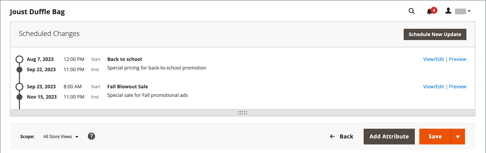

# Planen von Produkt-Updates

{{ee-feature}}

Produktaktualisierungen können planmäßig angewendet und mit anderen Inhaltsänderungen gruppiert werden. Sie können [Inhalts-Staging](../content-design/content-staging.md) verwenden, um eine Kampagne auf der Grundlage geplanter Änderungen am Produkt zu erstellen oder die Änderungen auf eine vorhandene Kampagne anzuwenden.

Beachten Sie beim Konfigurieren von Zeitplänen für Produktaktualisierungen und beim Bearbeiten von Kampagnen Folgendes:

- Alle geplanten Aktualisierungen werden nacheinander angewendet, d. h., jede Entität kann nur jeweils eine geplante Aktualisierung haben. Jede geplante Aktualisierung wird auf alle Store-Ansichten innerhalb ihres Zeitrahmens angewendet. Daher kann eine Entität nicht gleichzeitig verschiedene geplante Aktualisierungen für verschiedene Store-Ansichten haben. Alle Entitätsattributwerte in allen Store-Ansichten, die nicht von der aktuellen geplanten Aktualisierung betroffen sind, werden aus den Standardwerten übernommen, nicht aus der vorherigen geplanten Aktualisierung.

- Eine Staging-Vorschau für ein geplantes Update beginnt immer in der **Standard** Store-Ansicht, die das Kundenerlebnis beim Navigieren durch die Staging-Update-Kampagne emuliert.

- Wenn eine Kampagne mit mehr als einem Produkt verknüpft ist, kann die Kampagne nur über das [Staging-Dashboard für Inhalte“ bearbeitet &#x200B;](../content-design/content-staging-dashboard.md).

- Wenn eine aktive Kampagne anfänglich ohne Enddatum erstellt wird, kann die Kampagne nicht später bearbeitet werden, um ein Enddatum einzuschließen. In diesem Fall müssen Sie eine doppelte Kampagne erstellen und das erforderliche Enddatum eingeben.

>[!NOTE]
>
>Die Felder [!UICONTROL Set Product as New From] und [!UICONTROL To] sowie [!UICONTROL Schedule Design Update] Registerkarte wurden in  Adobe Commerce entfernt und können nicht direkt am Produkt geändert werden. Für diese Aktivierungen muss ein geplantes Update erstellt werden.

## Geplantes Update erstellen

1. Navigieren Sie in der _Admin_-Seitenleiste zu **[!UICONTROL Catalog]** > **[!UICONTROL Products]**.

1. Wählen Sie ein vorhandenes Produkt aus und klicken Sie auf **[!UICONTROL Edit]**.

1. Klicken Sie auf **[!UICONTROL Schedule New Update]**.

1. Wählen Sie **[!UICONTROL Save as a New Update]** aus.

1. Geben Sie **[!UICONTROL Update Name]** einen Namen für die neue Inhalts-Staging-Kampagne ein.

1. Geben Sie eine kurze **[!UICONTROL Description]** der Aktualisierung und ihrer Verwendung ein.

1. Verwenden Sie das Tool Kalender , um den **[!UICONTROL Start Date]** und die **[!UICONTROL End Date]** für die Kampagne auszuwählen.

   >[!NOTE]
   >
   >**[!UICONTROL Start Date]** und **[!UICONTROL End Date]** für Kampagnen müssen mithilfe der Admin-Zeitzone **_Standard_** definiert werden, die für jede Website aus der lokalen Zeitzone konvertiert wird. Wenn Sie beispielsweise mehrere Websites in verschiedenen Zeitzonen haben, in denen Sie eine Kampagne basierend auf einer US-Zeitzone starten möchten, müssen Sie für jede lokale Zeitzone ein separates Update planen. Legen Sie **[!UICONTROL Start Date]** und **[!UICONTROL End Date]** für jeden Wert fest und konvertieren Sie ihn von der lokalen Website-Zeitzone in die standardmäßige Admin-Zeitzone.

   {width="600" zoomable="yes"}

1. Scrollen Sie nach unten zu _[!UICONTROL Price]_&#x200B;und klicken Sie auf **[!UICONTROL Advanced Pricing]**.

1. Geben Sie während der geplanten Kampagne einen **[!UICONTROL Special Price]** für das Produkt ein und klicken Sie auf **[!UICONTROL Done]**.

1. Klicken Sie abschließend auf **[!UICONTROL Save]**.

## Zu vorhandenem Update zuweisen

1. Navigieren Sie in der _Admin_-Seitenleiste zu **[!UICONTROL Catalog]** > **[!UICONTROL Products]**.

1. Wählen Sie ein vorhandenes Produkt aus und klicken Sie auf **[!UICONTROL Edit]**.

1. Klicken Sie auf **[!UICONTROL Schedule New Update]**.

1. Wählen Sie **[!UICONTROL Assign to Existing Campaign]** aus.

1. Wählen Sie in der Liste die zu ändernde Kampagne aus.

   {width="600" zoomable="yes"}

1. Erweitern Sie  **[!UICONTROL Content]**.

1. Klicken Sie abschließend auf **[!UICONTROL Save]**.

## Geplante Änderung anzeigen

Die geplante Änderung wird oben auf der Produktseite mit dem Start- und Enddatum der Kampagne angezeigt.

{width="600" zoomable="yes"}

## Geplante Änderung bearbeiten

1. Klicken Sie im _[!UICONTROL Scheduled Changes]_&#x200B;oben auf der Seite auf **[!UICONTROL View/Edit]**.

1. Nehmen Sie die erforderlichen Änderungen an der geplanten Aktualisierung vor.

1. Klicken Sie auf **[!UICONTROL Save]**.

## Geplante Änderung entfernen

1. Klicken Sie im _[!UICONTROL Scheduled Changes]_&#x200B;oben auf der Seite auf **[!UICONTROL View/Edit]**.

1. Klicken Sie in der oberen Leiste auf **[!UICONTROL Remove from Update]**.

   {width="600" zoomable="yes"}

1. Wählen Sie im Dialogfeld die Option **[!UICONTROL Delete the Update]** und klicken Sie auf **[!UICONTROL Done]**.

   Das Produkt wird aus dem Update entfernt, und alle geplanten Änderungen gehen verloren.

## Planen eines Design-Updates

{{ce-feature}}

Im Abschnitt _[!UICONTROL Schedule Design Update]_&#x200B;können Sie temporäre Änderungen am Erscheinungsbild der Produktseite vornehmen. Sie können Design-Änderungen für eine Saison, eine Promotion oder einfach nur planen, um Dinge neu zu gestalten. Konstruktionsänderungen können im Voraus geplant werden, sodass sie in dem von Ihnen festgelegten Zeitplan in Kraft treten_ oder _tropfen).

{width="600" zoomable="yes"}

| Feld | Beschreibung |
|--- |--- |
| [!UICONTROL Schedule Update From/To] | Bestimmt den Datumsbereich, in dem ein benutzerdefiniertes Layout auf das Produkt angewendet wird. |
| [!UICONTROL New Theme] | Wendet ein benutzerdefiniertes Design auf das Produkt an. |
| [!UICONTROL New Layout] | Wendet ein anderes Layout auf die Produktseite an. Optionen:  **[!UICONTROL No layout updates]**- Standardmäßig sind Layout-Aktualisierungen für die Produktseite nicht verfügbar. **[!UICONTROL Empty]** - Ermöglicht die Definition eines eigenen Layouts, z. B. einer 4-spaltigen Seite. (XML ist ein Verständnis erforderlich.)  **[!UICONTROL 1 column]**- Wendet ein einspaltiges Layout auf die Produktseite an. **[!UICONTROL 2 columns with left bar]** - Wendet ein zweispaltiges Layout mit einer linken Seitenleiste auf die Produktseite an.  **[!UICONTROL 2 columns with right bar]**- Wendet ein zweispaltiges Layout mit einer rechten Seitenleiste auf die Produktseite an. **[!UICONTROL 3 columns]** - Wendet ein dreispaltiges Layout auf die Produktseite an. |

{style="table-layout:auto"}
