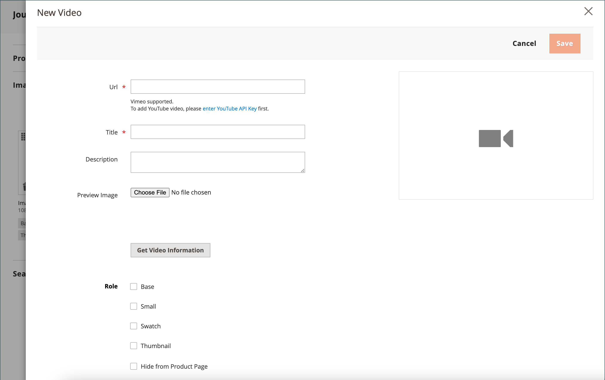

# Produktvideos hinzufügen

Um ein Produktvideo hinzuzufügen, müssen Sie zunächst einen API-Schlüssel aus Ihrem Google-Konto abrufen und in die Konfiguration Ihres Stores eingeben. Anschließend können Sie über das Produkt einen Link zum Video erstellen.

## Schritt 1: Abrufen des YouTube-API-Schlüssels

1. Melden Sie sich bei Ihrem Google-Konto an und rufen Sie die [Google Developers Console][1] auf.

1. Geben Sie im Suchfeld oben &quot;`YouTube Data API v3`&quot;ein und klicken Sie auf das Suchsymbol.

1. Stellen Sie sicher, dass die API-Seite aktiviert ist, wenn sie angezeigt wird.

1. Wählen Sie im linken Bereich **[!UICONTROL Credentials]** aus.

1. Je nachdem, ob Sie über Anmeldeinformationen verfügen oder nicht, führen Sie einen der folgenden Schritte aus:

   - Wenn Sie bereits über die erforderlichen Anmeldeinformationen verfügen, kopieren Sie den Schlüssel in die Tabelle _API-Schlüssel_.

   - Wenn Sie noch keine Anmeldeinformationen für diese API haben, klicken Sie oben auf **[!UICONTROL Create Credentials]** und befolgen Sie die Anweisungen zum Erstellen der erforderlichen Anmeldeinformationen. Kopieren Sie unter _Anmeldeinformationen abrufen_ den API-Schlüssel und klicken Sie auf **[!UICONTROL Done]**.

1. Kopieren Sie den API-Schlüssel in die Zwischenablage.

1. Klicken Sie rechts auf das Symbol Bearbeiten und legen Sie die Einschränkungen fest, um sicherzustellen, dass der API-Schlüssel auf die richtigen verweisenden Stellen beschränkt ist.

1. Warten Sie einen Augenblick, während der Schlüssel generiert wird, und kopieren Sie dann den Schlüssel in die Zwischenablage.

   Im nächsten Schritt fügen Sie den Schlüssel in die Konfiguration Ihres Stores ein.

## Schritt 2: Konfigurieren des Schlüssels in Commerce

1. Wechseln Sie in der Seitenleiste _Admin_ zu **[!UICONTROL Stores]** > _[!UICONTROL Settings]_>**[!UICONTROL Configuration]**.

1. Erweitern Sie im linken Bedienfeld den Wert **[!UICONTROL Catalog]** und wählen Sie unter &quot;**[!UICONTROL Catalog]**&quot;.

1. Erweitern Sie  den Abschnitt _[!UICONTROL Product Video]_und fügen Sie Ihren **[!UICONTROL YouTube API key]**ein.

   {width="600" zoomable="yes"}

1. Klicken Sie nach Abschluss des Vorgangs auf **[!UICONTROL Save Config]**.

1. Wenn Sie dazu aufgefordert werden, aktualisieren Sie den Cache.

## Schritt 3: Link zum Video

1. Öffnen Sie ein Produkt im Bearbeitungsmodus.

1. Scrollen Sie zum Abschnitt _[!UICONTROL Images and Videos]_und erweitern Sie ihn.

   {width="600" zoomable="yes"}

1. Klicken Sie auf **[!UICONTROL Add Video]**.

   Wenn Sie Ihren YouTube-API-Schlüssel noch nicht konfiguriert haben, klicken Sie auf **[!UICONTROL OK]** , um fortzufahren. Sie können zwar keine Verknüpfung zu einem YouTube-Video herstellen, den Vorgang jedoch fortsetzen.

1. Geben Sie für &quot;**[!UICONTROL Url]**&quot;die URL des YouTube- oder Vimeo-Videos ein.

   {width="600" zoomable="yes"}

1. Klicken Sie außerhalb des Felds und warten Sie auf Feedback zum API-Schlüssel oder Video.

   Wenn alles ausgecheckt wird, stellt YouTube Basisinformationen für das Video bereit

1. Geben Sie die **[!UICONTROL Title]** und die **[!UICONTROL Description]** des Videos ein.

1. Um eine 0 hochzuladen, navigieren Sie zum Bild und wählen Sie die Datei aus.**[!UICONTROL Preview Image]**

   >[!NOTE]
   >
   >Nach dem Hochladen wird das angezeigte Vorschaubild automatisch von einem externen Videodienstleister generiert. Sie können das Bild nicht über den Adobe Commerce-Administrator bearbeiten.

1. Wenn Sie die Videometadaten bevorzugen, klicken Sie auf **[!UICONTROL Get Video Information]**.

1. Um zu bestimmen, wie das Video im Store verwendet wird, aktivieren Sie das Kontrollkästchen der jeweiligen zutreffenden **[!UICONTROL Role]** :

   - `Base Image`
   - `Small Image`
   - `Swatch Image`
   - `Thumbnail`
   - `Hide from Product Page`

1. Klicken Sie nach Abschluss des Vorgangs auf **[!UICONTROL Save]**.

   >[!NOTE]
   >
   >Wenn die Konfigurationsoption _[!UICONTROL Autostart base video]_auf `Yes` festgelegt ist, das Video jedoch nicht automatisch abgespielt wird, kann dies auf die vom Browser erzwungenen automatischen Wiedergaberegeln zurückzuführen sein, die nicht von Adobe Commerce gesteuert werden können. Jeder unterstützte Browser verfügt über eigene Autoplay-Richtlinien, die sich im Laufe der Zeit ändern können und Ihr Video in Zukunft möglicherweise nicht automatisch abgespielt wird. Als Best Practice wird empfohlen, sich nicht auf die automatische Wiedergabe für geschäftskritische Funktionen zu verlassen und das Videokotoplay-Verhalten in Ihrem Store mit jedem unterstützten Browser zu testen.

## API-Zugriff verwalten

Gemäß den [Nutzungsbedingungen] des Google-Entwicklers kann YouTube den API-Zugriff für Konten deaktivieren, die seit mehr als 90 Tagen inaktiv sind. Dieses Vorkommen kann dazu führen, dass Ihre Videos nicht angezeigt werden. Um Ihren API-Zugriff auf dem neuesten Stand zu halten, verwenden Sie einen Cron-Auftrag, um die API in regelmäßigen Abständen zu pingen:

```code
30 10 1 * * curl -i -G -e https://yourdomain.com/ -d "part=snippet&maxResults=1&q=test&key=YOUTUBEAPIKEY" https://www.googleapis.com/youtube/v3/search >/dev/null 2>&1
```

## Feldreferenz

| Feld | Beschreibung |
|--- |--- |
| [!UICONTROL URL] | Die URL des zugehörigen Videos. |
| [!UICONTROL Title] | Der Videotitel. |
| [!UICONTROL Description] | Die Videobeschreibung. |
| [!UICONTROL Preview Image] | Ein hochgeladenes Bild, das als Vorschau des Videos in Ihrem Store verwendet wird. |
| [!UICONTROL Get Video Information] | Ruft die auf dem Host-Server gespeicherten Video-Metadaten ab. Sie können die Originaldaten verwenden oder nach Bedarf aktualisieren. |
| [!UICONTROL Role] | Bestimmt, wie das Vorschaubild in Ihrem Store verwendet wird. Sie können eine beliebige Kombination von Optionen auswählen: `Base Image`, `Small Image`, `Thumbnail`, `Swatch Image`, `Hide from Product Page` |

{style="table-layout:auto"}

[1]: https://console.developers.google.com/
[Geschäftsbedingungen]: https://developers.google.com/youtube/terms/developer-policies#d.-accessing-youtube-api-services
