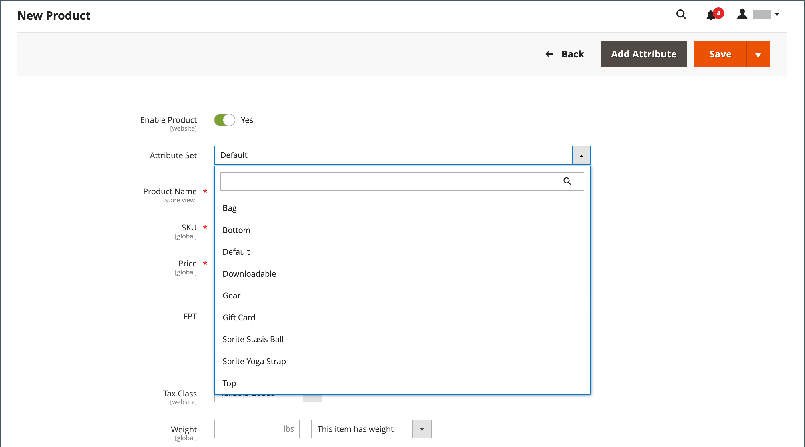

# Produktarbeitsbereich

Der Arbeitsbereich Produkt ist für alle Produkttypen grundsätzlich identisch, obwohl sich die Auswahl der Felder je nach verwendetem Attributsatz ändert. Die Produktattribute befinden sich am Anfang des Formulars, gefolgt von erweiterbaren Abschnitten mit Produktinformationen. Wenn ein neues Produkt zum ersten Mal gespeichert wird, wird die _[!UICONTROL Store View]_-Auswahl oben links im Formular angezeigt.

{width="700" zoomable="yes"}

## [!UICONTROL Enable Product]

Der Online-Status des Produkts wird durch den Schalter am oberen Rand des Formulars angezeigt. Um den Online-Status zu ändern, stellen Sie den **[!UICONTROL Enable Product]** auf `Yes` oder `No`.

| Kontrolle | Beschreibung |
|-------- | ----------- |
|  | Gibt an, dass das Produkt online ist. |
|  | Gibt an, dass das Produkt offline ist. |

{style="table-layout:auto"}

## Attributsatz

Der Name des [Attributsatzes](attribute-sets.md) wird in der oberen linken Ecke angezeigt und bestimmt die Felder, die im Produktdatensatz angezeigt werden. Um einen anderen Attributsatz auszuwählen, klicken Sie auf den Abwärtspfeil neben dem Namen des standardmäßigen Attributsatzes.

{width="600" zoomable="yes"}

## Erweitern/Reduzieren

Um einen Abschnitt zu erweitern oder zu reduzieren, klicken Sie entweder auf das Symbol  oder auf das Symbol .

## Menü [!UICONTROL Save]

Das Menü _[!UICONTROL Save]_&#x200B;enthält mehrere Optionen, mit denen Sie speichern und fortfahren, ein Produkt speichern und erstellen, das Produkt speichern und duplizieren oder speichern und schließen können.

{width="600" zoomable="yes"}

| Befehl | Beschreibung |
|--- |--- |
| [!UICONTROL Save] | Speichern Sie das aktuelle Produkt und arbeiten Sie weiter. |
| [!UICONTROL Save & New] | Speichern und schließen Sie das aktuelle Produkt, und beginnen Sie ein neues Produkt basierend auf demselben Produkttyp und derselben Vorlage. |
| [!UICONTROL Save & Duplicate] | Speichern und schließen Sie das aktuelle Produkt, und öffnen Sie eine neue Duplikatkopie. |
| [!UICONTROL Save & Close] | Speichern Sie das aktuelle Produkt und kehren Sie zum Arbeitsbereich _[!UICONTROL Products]_&#x200B;zurück. |

{style="table-layout:auto"}

## Standardfeldwerte

Um beim Erstellen von Produkten Zeit zu sparen, verweist der Standardwert mehrerer Produktfelder auf Werte aus einem anderen Feld. Sie können entweder den Standardwert annehmen oder einen anderen eingeben. Die folgenden Felder haben automatisch Standardwerte generiert:

| Feld | Standard |
|----- |------- |
| [!UICONTROL SKU] | Basierend auf Produktname. |
| [!UICONTROL Meta Title] | Basierend auf Produktname. |
| [!UICONTROL Meta Keywords] | Basierend auf Produktname. |
| [!UICONTROL Meta Description] | Basierend auf Produktname und Beschreibung. |

{style="table-layout:auto"}

Die Platzhalter, die den Wert eines anderen Felds darstellen, werden in geschweifte Klammern eingeschlossen. Jeder Attributcode, der im Produkt ([) enthalten &#x200B;](attribute-sets.md), kann als Platzhalter verwendet werden.

{width="600" zoomable="yes"}

Eine detaillierte Liste dieser Einstellungen finden Sie unter [Automatische Generierung von Produktfeldern](../configuration-reference/catalog/catalog.md#product-fields-auto-generation) in der _Konfigurationsreferenz_.

### Bearbeiten des Platzhalterwerts

1. Navigieren Sie in _Admin_-Seitenleiste zu **[!UICONTROL Stores]** > _[!UICONTROL Settings]_>**[!UICONTROL Configuration]**.

1. Erweitern Sie im linken Bereich **[!UICONTROL Catalog]** und wählen Sie darunter **[!UICONTROL Catalog]**.

1. Erweitern Sie  den Abschnitt **[!UICONTROL Product Fields Auto-Generation]** und nehmen Sie die erforderlichen Änderungen an den Platzhalterwerten vor.

   Wenn es beispielsweise ein bestimmtes Keyword gibt, das Sie für jedes Produkt oder eine Phrase in jede Metabeschreibung aufnehmen möchten, geben Sie den Wert direkt in das entsprechende Feld ein.

   >[!NOTE]
   >
   >Wenn Sie die vorhandenen Platzhalterwerte beibehalten möchten, behalten Sie die doppelten geschweiften Klammern bei, die jedes Markup-Tag einschließen.

1. Klicken Sie abschließend auf **[!UICONTROL Save Config]**.

### Allgemeine Platzhalter

- `{{color}}`
- `{{country_of_manufacture}}`
- `{{description}}`
- `{{gender}}`
- `{{material}}`
- `{{name}}`
- `{{short_description}}`
- `{{size}}`
- `{{sku}}`

