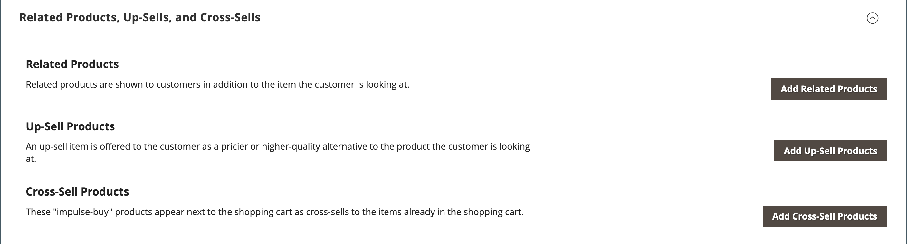
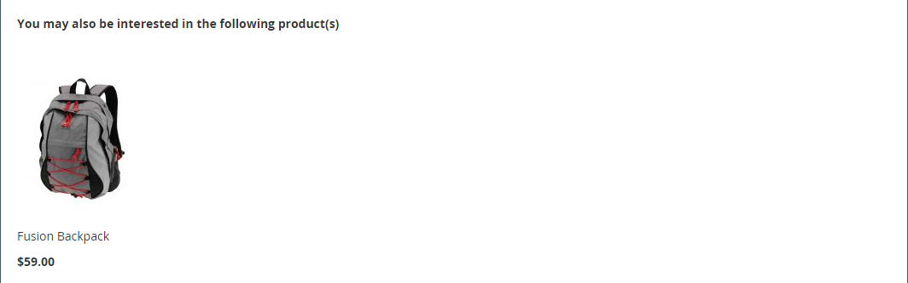

# Produkteinstellungen - [!UICONTROL Related Products, Up-Sells, and Cross-Sells]

Verwenden Sie den Abschnitt _[!UICONTROL Related Products, Up-Sells, and Cross-Sells]_, um einfache Werbeblöcke einzurichten, die eine Auswahl zusätzlicher Produkte enthalten, die für den Kunden von Interesse sein könnten. Weitere Informationen finden Sie unter [Produktbeziehungen](../merchandising-promotions/product-relationships.md).

{width="600" zoomable="yes"}

Jeder Baustein besteht aus einer Liste von Produkten, die zu einer bestimmten Option gehören.

| Feld | Beschreibung |
|--- |--- |
| [!UICONTROL ID] | Eine eindeutige numerische Kennung, die einer Produktentität zugewiesen ist. |
| [!UICONTROL Thumbnail] | Miniaturbild des Produkts. |
| [!UICONTROL Name] | Der Name des Produkts. |
| [!UICONTROL Status] | Gibt den Produktstatus an. Optionen: `Enabled` / `Disabled`. Deaktivierte Produkte werden nicht in den Blöcken im Frontend angezeigt. |
| [!UICONTROL Attribute Set] | Der Name des Attributsatzes, der als Vorlage für das Produkt verwendet wird. |
| [!UICONTROL SKU] | Die eindeutige Lagerhaltungseinheit, die dem Produkt zugewiesen ist. |
| [!UICONTROL Price] | Der Stückpreis des Produkts. |
| [!UICONTROL Action] | Optionen: `Remove`. Entfernt ein Produkt aus dem Block. |

{style="table-layout:auto"}

>[!TIP]
>
> (nur Adobe Commerce) **Product Recommendations powered by Adobe Sensei** vereinfacht die Definition von Produktbeziehungen durch die Verwendung von Algorithmen für künstliche Intelligenz und maschinelles Lernen, um eine gründliche Analyse aggregierter Besucherdaten durchzuführen. Wenn diese Daten mit Ihrem Adobe Commerce-Katalog kombiniert werden, ergeben sich für den Erstkäufer sehr ansprechende, relevante und personalisierte Erlebnisse.
> 
>Weitere Informationen zur Verwendung dieser von Adobe entwickelten Erweiterung als Alternative zu manuell konfigurierten Produktempfehlungen und Upsells finden Sie im _[Product Recommendations Guide](https://experienceleague.adobe.com/docs/commerce/product-recommendations/guide-overview.html)_.

## Verwandte Produkte

Zugehörige Produkte sind zusätzlich zu dem Artikel zu kaufen, den der Kunde betrachtet. Der Kunde kann den Artikel in den Warenkorb legen, indem er einfach auf das Kontrollkästchen klickt. Die Platzierung des _Related Products_-Blocks variiert je nach definiertem Design und Seiten-Layout. Im folgenden Beispiel wird der _Verwandte Produkte_ unten auf der Seite &quot;_&quot;_. Bei einem zweispaltigen Layout wird der Block _Verwandte Produkte_ oft in der rechten Seitenleiste angezeigt.

{width="600" zoomable="yes"}

So richten Sie verwandte Produkte ein:

1. Öffnen Sie das Produkt im Bearbeitungsmodus.

1. Scrollen Sie nach unten und erweitern Sie  den Abschnitt **[!UICONTROL Related Products, Up-Sells, and Cross-Sells]** .

1. Klicken Sie auf **[!UICONTROL Add Related Products]**.

1. Verwenden Sie die [Filtersteuerelemente](../getting-started/admin-grid-controls.md) um die gewünschten Produkte zu finden.

1. Aktivieren Sie in der Liste das Kontrollkästchen jedes Produkts, das Sie als verwandtes Produkt verwenden möchten.

   {width="600" zoomable="yes"}

1. Klicken Sie abschließend auf **[!UICONTROL Add Selected Products]**.

## Up-Sells

Upsell-Produkte sind Artikel, die Ihr Kunde möglicherweise anstelle des aktuell in Betracht gezogenen Produkts bevorzugt. Ein als Upsell angebotener Artikel könnte eine höhere Qualität aufweisen, beliebter sein oder eine bessere Gewinnspanne aufweisen. Upsell-Produkte werden auf der Produktseite unter einer Überschrift wie _Sie können sich auch für folgende Produkte interessieren_ angezeigt.

{width="600" zoomable="yes"}

Upsell-Produkte auswählen:

1. Öffnen Sie das Produkt im Bearbeitungsmodus.

1. Scrollen Sie nach unten und erweitern Sie  den Abschnitt **[!UICONTROL Related Products, Up-Sells, and Cross-Sells]** .

1. Klicken Sie auf **[!UICONTROL Add Up-Sell Products]**.

1. Verwenden Sie die [Filtersteuerelemente](../getting-started/admin-grid-controls.md) um die gewünschten Produkte zu finden.

1. Aktivieren Sie in der Liste das Kontrollkästchen jedes Produkts, das Sie als Upsell-Produkt verwenden möchten.

   {width="600" zoomable="yes"}

1. Klicken Sie abschließend auf **[!UICONTROL Add Selected Products]**.

>[!NOTE]
>
>Das übergeordnete Bundle-Produkt wird für alle untergeordneten Produkte immer automatisch als Upsell-Produkt angezeigt.

## Crosssell

Crosssell-Artikel ähneln Impulskäufen, die neben der Kasse in der Kasse platziert werden. Produkte, die als Crosssell angeboten werden, werden auf der Warenkorbseite angezeigt, kurz bevor der Kunde den Checkout-Prozess beginnt.

>[!NOTE]
>
>Um Crosssell-Artikel pro Shop-Ansicht ein- oder auszublenden, sehen Sie sich die Option [Checkout > Warenkorb](../configuration-reference/sales/checkout.md) im Warenkorb _[!UICONTROL Show Cross-sell Items]_&#x200B;an. Sie können Crosssell-Angebote während bestimmter Verkäufe oder für A/B-Tests in einer Store-Ansicht ausblenden.

{width="600" zoomable="yes"}

**_So wählen Sie Crosssell-Produkte aus:_**

1. Öffnen Sie das Produkt im Bearbeitungsmodus.

1. Scrollen Sie nach unten und erweitern Sie  den Abschnitt **[!UICONTROL Related Products, Up-Sells, and Cross-Sells]** .

1. Klicken Sie auf **[!UICONTROL Add Cross-Sell Products]**.

1. Verwenden Sie die [Filtersteuerelemente](../getting-started/admin-grid-controls.md) um die gewünschten Produkte zu finden.

1. Aktivieren Sie in der Liste das Kontrollkästchen jedes Produkts, das Sie als Crosssell-Produkt verwenden möchten.

   {width="600" zoomable="yes"}

1. Klicken Sie abschließend auf **[!UICONTROL Add Selected Products]**.
