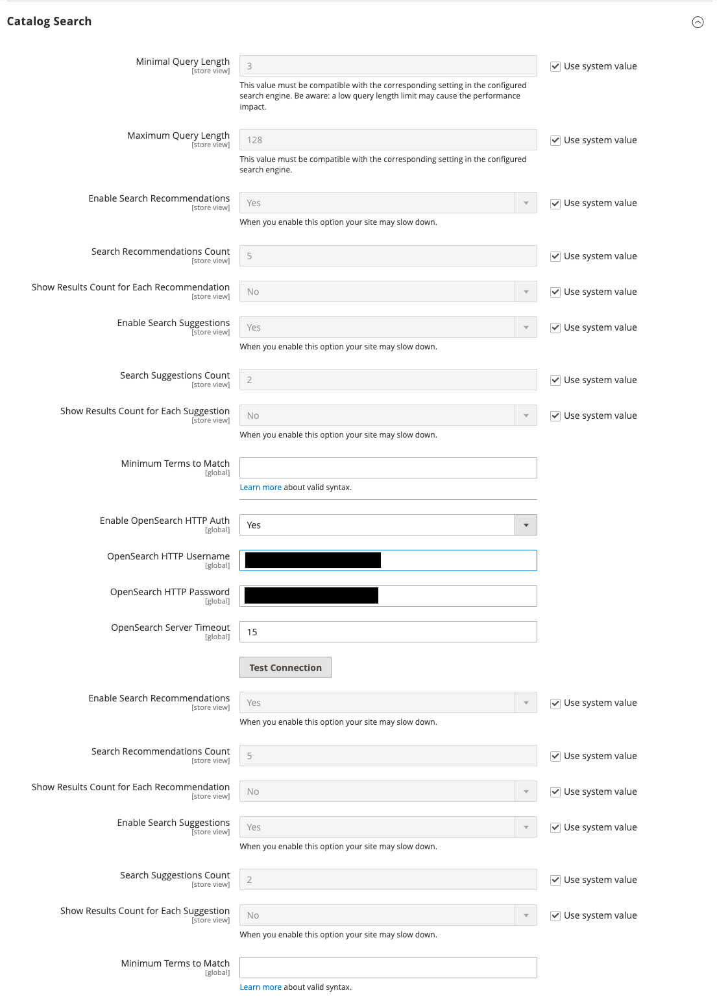

# Konfigurieren der Katalogsuche

Es gibt zwei Varianten der Konfiguration für die Katalogsuche. Die erste Methode beschreibt die verfügbaren Einstellungen, wenn [Live Search](https://experienceleague.adobe.com/docs/commerce/live-search/overview.html?lang=de) installiert ist. Die zweite Methode beschreibt die Konfigurationseinstellungen für native Adobe Commerce mit [OpenSearch](https://experienceleague.adobe.com/docs/commerce-operations/installation-guide/prerequisites/search-engine/overview.html?lang=de){:target="_blank"}.

>[!NOTE]
>
>Informationen zu Cloud-Infrastrukturprojekten finden Sie in den zusätzlichen Anweisungen im [_Handbuch zu Commerce on Cloud Infrastructure_](https://experienceleague.adobe.com/de/docs/commerce-cloud-service/user-guide/configure/service/opensearch).

## Methode 1: Adobe Commerce mit [!DNL Live Search]

1. Navigieren Sie in _Admin_-Seitenleiste zu **[!UICONTROL Stores]** > _[!UICONTROL Settings]_>**[!UICONTROL Configuration]**.

1. Erweitern Sie im linken Bereich **[!UICONTROL Catalog]** und wählen Sie darunter **[!UICONTROL Catalog]**.

1. Erweitern Sie  den Abschnitt **[!UICONTROL Catalog Search]** .

   {width="600" zoomable="yes"}

   Eine detaillierte Liste dieser Optionen finden Sie unter [Adobe Commerce mit Live Search](../configuration-reference/catalog/catalog.md#adobe-commerce-with-live-search) in der _Konfigurationsreferenz_.

1. Um die Länge und Wortzahl des Textes der Suchanfrage zu begrenzen, legen Sie einen Wert für **[!UICONTROL Minimal Query Length]** und **[!UICONTROL Maximum Query Length]** fest.

1. Um die Anzahl der beliebten Suchergebnisse zu begrenzen, die für schnellere Antworten zwischengespeichert werden sollen, legen Sie eine Menge für **[!UICONTROL Number of top search results to cache]** fest.

   Der Standardwert ist `100`. Bei Eingabe des Werts `0` werden alle Suchbegriffe und Ergebnisse bei einer zweiten Eingabe zwischengespeichert.

1. Um die maximale Anzahl von Zeilen zu ändern, die für zurückgegebene Ergebnisse im „Storefront[Pop-Over“ verfügbar sind](https://experienceleague.adobe.com/docs/commerce/live-search/live-search-storefront/quick-tour.html?lang=de) geben Sie einen anderen **[!UICONTROL Autocomplete Limit]** ein.

   Durch die Begrenzung der Zeilenanzahl wird die Leistung der Suchvorgänge verbessert und die Größe der zurückgegebenen Liste verringert. Der Standardwert ist `8` Zeilen.

## Methode 2: Commerce mit OpenSearch

>[!IMPORTANT]
>
>- Aufgrund der Ankündigung zum [!DNL Elasticsearch 7] Ende der Unterstützung für August 2023 wird empfohlen, dass alle Adobe Commerce-Kunden zur OpenSearch 2.x -Suchmaschine migrieren. Informationen zur Migration Ihrer Suchmaschine während des Produkt-Upgrades finden Sie unter [Migration zu OpenSearch](https://experienceleague.adobe.com/docs/commerce-operations/upgrade-guide/prepare/opensearch-migration.html?lang=de) im _Upgrade-Handbuch_.
>- In den Versionen 2.4.4 und 2.4.3-p2 gelten alle Felder mit der Bezeichnung Elasticsearch auch für OpenSearch. Mit der Einführung der Unterstützung für Elasticsearch 8.x in Version 2.4.6 wurden neue Bezeichnungen erstellt, um zwischen Elasticsearch- und OpenSearch-Konfigurationen zu unterscheiden. Die Konfigurationsoptionen für beide sind jedoch identisch.

### Schritt 1: Konfigurieren der allgemeinen Suchoptionen

>[!NOTE]
>
>Bei OpenSearch und Elasticsearch gibt es keine vordefinierte Unterstützung für die Suche nach dem Suffix. Beispielsweise liefert die Suche nach SKU möglicherweise nicht das erwartete Ergebnis, wenn das Keyword nur den Endteil der SKU enthält.

1. Navigieren Sie in _Admin_-Seitenleiste zu **[!UICONTROL Stores]** > _[!UICONTROL Settings]_>**[!UICONTROL Configuration]**.

1. Erweitern Sie im linken Bereich **[!UICONTROL Catalog]** und wählen Sie darunter **[!UICONTROL Catalog]**.

1. Erweitern Sie  den Abschnitt **[!UICONTROL Catalog Search]** .

   {zoomable="yes"}

   Weitere Informationen zu diesen Optionen finden Sie unter [Adobe Commerce mit nativer Suche](../configuration-reference/catalog/catalog.md#adobe-commerce-with-native-search) in der _Konfigurationsreferenz_.

1. Um die Länge und Wortzahl des Textes der Suchanfrage zu begrenzen, legen Sie einen Wert für **[!UICONTROL Minimal Query Length]** und **[!UICONTROL Maximum Query Length]** fest.

   >[!IMPORTANT]
   >
   >Der Wert für diesen minimalen und maximalen Bereich muss mit dem entsprechenden Bereich kompatibel sein, der in Ihrer Suchmaschinenkonfiguration festgelegt ist. Wenn Sie diese Werte beispielsweise in Commerce auf `2` und `300` setzen, aktualisieren Sie die entsprechenden Werte in Ihrer Suchmaschine.

1. Um die Anzahl der beliebten Suchergebnisse zu begrenzen, die für schnellere Antworten zwischengespeichert werden sollen, legen Sie eine Menge für **[!UICONTROL Number of top search results to cache]** fest.

   Der Standardwert ist `100`. Bei Eingabe des Werts `0` werden alle Suchbegriffe und Ergebnisse bei einer zweiten Eingabe zwischengespeichert.

1. Wenn Sie den Produkt-EAV-Indexer aktivieren oder deaktivieren möchten, legen Sie die **[!UICONTROL Enable EAV Indexer]** fest.

   Diese Funktion verbessert die Indexierungsgeschwindigkeit und verhindert, dass der Indexer von Erweiterungen von Drittanbietern verwendet werden kann.

1. Um die maximale Anzahl von Suchergebnissen zu begrenzen, die für die automatische Vervollständigung der Suche angezeigt werden sollen, legen Sie einen Betrag für **[!UICONTROL Autocomplete Limit]** fest.

   Wenn Sie diesen Wert einschränken, wird die Leistung der Suche gesteigert und die angezeigte Listengröße verringert. Der Standardwert ist `8`.

### Schritt 2: Konfigurieren der OpenSearch-Verbindung

>[!IMPORTANT]
>
>Die Felder **[!UICONTROL Search Engine]**, **[!UICONTROL OpenSearch Server Hostname]**, **[!UICONTROL OpenSearch Server Port]**, **[!UICONTROL OpenSearch Index Prefix]**, **[!UICONTROL Enable OpenSearch HTTP Auth]** und **[!UICONTROL OpenSearch Server Timeout]** wurden konfiguriert, als Commerce installiert oder aktualisiert wurde. Diese Werte sollten nur beim Aktualisieren oder Ändern von OpenSearch geändert werden.

1. Wählen Sie **[!UICONTROL Search Engine]** `OpenSearch` aus.

1. Akzeptieren Sie **[!UICONTROL OpenSearch Server Hostname]** den Standardwert, der bei der Installation von Commerce konfiguriert wurde.

1. Akzeptieren Sie **[!UICONTROL OpenSearch Server Port]** den Standardwert, der bei der Installation von Commerce konfiguriert wurde.

   In diesem Beispiel ist der Standardwert `9200`.

1. Geben Sie **[!UICONTROL OpenSearch Index Prefix]** ein Präfix ein, um den Elasticsearch-Index zu identifizieren.

   Der Standardwert ist `magento2`.

1. Wenn Sie die HTTP-Authentifizierung verwenden möchten, um einen Benutzernamen und ein Kennwort für den Zugriff auf den OpenSearch-Server einzugeben, setzen Sie **[!UICONTROL Enable OpenSearch HTTP Auth]** auf `Yes`.

1. Geben Sie **[!UICONTROL OpenSearch Server Timeout]** die Anzahl Sekunden ein, nach denen das System eine Zeitüberschreitung aufweist.

   Der Standardwert ist `15`.

1. Um die Konfiguration zu überprüfen, klicken Sie auf **[!UICONTROL Test Connection]**.

### Schritt 3: Konfigurieren von Vorschlägen und Empfehlungen

>[!NOTE]
>
>Suchvorschläge und -empfehlungen können die Serverleistung beeinträchtigen.

1. Um Empfehlungen zu geben, setzen Sie **[!UICONTROL Enable Search Recommendations]** auf `Yes` und gehen Sie wie folgt vor:

   - Geben Sie **[!UICONTROL Search Recommendation Count]** die Anzahl der zu unterbreitenden Empfehlungen ein.

   - Um die Anzahl der Ergebnisse anzuzeigen, die für jede Empfehlung gefunden wurden, setzen Sie **[!UICONTROL Show Results Count for Each Recommendation]** auf `Yes`.

1. Legen Sie **[!UICONTROL Enable Search Suggestions]** auf `Yes` fest und führen Sie folgende Schritte aus:

   - Geben Sie **[!UICONTROL Search Suggestions Count]** die Anzahl der anzubietenden Suchvorschläge ein.

   - Um die Anzahl der Ergebnisse anzuzeigen, die für jeden Vorschlag gefunden wurden, setzen Sie **[!UICONTROL Show Results for Each Suggestion]** auf `Yes`.

### Schritt 4: Konfigurieren der Mindestbedingungen, die übereinstimmen

Um die Mindestanzahl von Begriffen aus Ihrer Abfrage zu steuern, mit denen die Suchergebnisse für die Rückgabe übereinstimmen sollen, geben Sie einen Wert für **[!UICONTROL Minimum Terms to Match]** an. Durch die Angabe dieses Werts wird eine optimale Ergebnisrelevanz für Erstkäufer sichergestellt. Eine Liste der zulässigen Werte finden Sie unter [minimum_should_match-Parameter](https://opensearch.org/docs/latest/query-dsl/minimum-should-match/) in der OpenSearch-Dokumentation.

Klicken Sie abschließend auf **[!UICONTROL Save Config]**.
