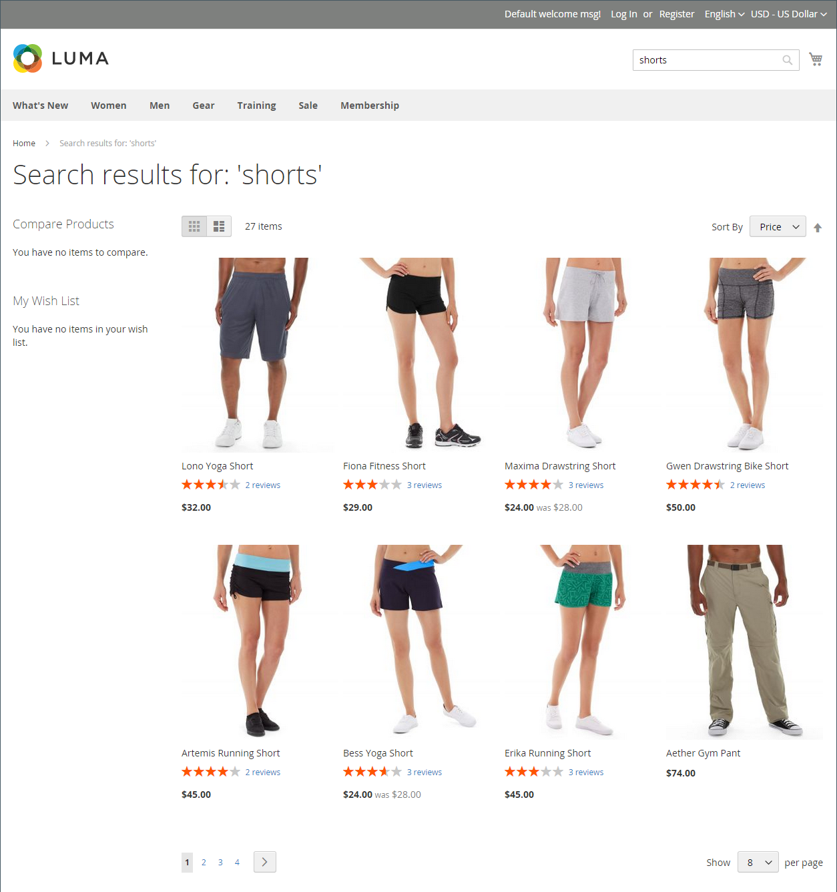

# Suchergebnisse

>[!NOTE]
>
>Auf dieser Seite werden Standardsuchfunktionen beschrieben, die sich von der [Live Search“ ](https://experienceleague.adobe.com/docs/commerce/live-search/overview.html?lang=de).

Die _Suchergebnisse_ enthält alle Produkte, die den im Feld „Schnellsuche“ oder im Formular „Erweiterte Suche“ angegebenen Suchkriterien entsprechen. Jede Produktliste im Katalog verfügt im Wesentlichen über dieselben Steuerelemente. Der einzige Unterschied besteht darin, dass einer das Ergebnis einer Suchanfrage ist und der andere das Ergebnis von [Navigation](navigation.md).

Die Ergebnisse können entweder als Raster oder Liste formatiert und nach einer Auswahl von Attributen sortiert werden. Die Steuerelemente für die Paginierung werden angezeigt, wenn mehr Produkte auf der Seite vorhanden sind als passen. Verwenden Sie diese Steuerelemente, um von einer Seite zur nächsten zu wechseln. Die Anzahl der Datensätze pro Seite wird durch die Katalog-Frontend-Konfiguration bestimmt. Weitere Informationen finden Sie unter [Produktlisten](navigation-product-listings.md).

Mit **Elasticsearch**:

- Es gibt keine vordefinierte Unterstützung für die Suche nach dem Suffix. Beispielsweise liefert die Suche nach SKU möglicherweise nicht das erwartete Ergebnis, wenn das Keyword nur den Endteil der SKU enthält.
- Die Suche nach Präfix (partielle Keyword-Suche) wird nur für `name` und `sku` Produktattribute standardmäßig unterstützt. Alle anderen Produktattribute werden nach dem gesamten Keyword durchsucht, wobei die exakte Übereinstimmung vorliegt.
- Suchergebnisse für `name` und `sku` Produktattribute basieren auf der Relevanz und nicht auf einer exakten Übereinstimmung. Die relevantesten Übereinstimmungen, z. B. ein exakt übereinstimmender _Produktname_ oder _SKU_, werden zuerst aufgeführt. Um nach einer exakten Übereinstimmung zu suchen, kann der Kunde doppelte Anführungszeichen in der Suchabfrage verwenden. Beispielsweise kann eine `WSH12-32-Red` Suchanfrage mehrere Produkte zurückgeben, sortiert nach Relevanz. Eine `"WSH12-32-Red"` Suchanfrage gibt jedoch nur ein Produkt mit der **_exakt_** übereinstimmenden `sku` zurück.

{width="700" zoomable="yes"}

>[!IMPORTANT]
>
>Aufgrund der Ankündigung zum Ende der Unterstützung für Elasticsearch 7 im August 2023 wird empfohlen, dass alle Adobe Commerce-Kunden zur OpenSearch 2.x -Suchmaschine migrieren. Informationen zur Migration Ihrer Suchmaschine während des Produkt-Upgrades finden Sie unter [Migration zu OpenSearch](https://experienceleague.adobe.com/docs/commerce-operations/upgrade-guide/prepare/opensearch-migration.html?lang=de) im _Upgrade-Handbuch_.

## Keyword-Mapping zur Erweiterung der Suchergebnisse

Bei dieser Technik wird ein -Attribut verwendet, um eine schlüsselwortbasierte Zuordnung zwischen zwei Produkten zu erstellen, sodass eine Suche nach einem der beiden Produkte Ergebnisse für beide Produkte zurückgibt. Sie können die Keyword-Zuordnung verwenden, um ein Produkt in Suchergebnissen zu bewerben, in denen es sonst nicht angezeigt würde.

{width="700" zoomable="yes"}

Im folgenden Beispiel wird die Schlüsselwortzuordnung basierend auf der SKU verwendet. Wenn eine der SKU in das Suchfeld eingegeben wird, erscheinen beide Produkte in den Ergebnissen. Die SKUs der folgenden konfigurierbaren Produkte werden anstelle der SKUs von Produktvarianten zugeordnet:

- Montana Windjacke (MJ03)
- Chaz Känguru Hoodie (MH01)

### Schritt 1: Attribut erstellen

1. Öffnen Sie in der _[!UICONTROL Products]_-Liste die `Montana Wind Jacket` (MJ03) im Bearbeitungsmodus.
1. Klicken Sie oben rechts auf **[!UICONTROL Add Attribute]**.
1. Klicken Sie auf _Seite „Attribut_&quot; auf **[!UICONTROL Create New Attribute]**.
1. Füllen Sie die Attributeigenschaften wie folgt aus:

   **[!UICONTROL Attribute Properties]**

   - [!UICONTROL Attribute Label] - `Search Keywords`
   - [!UICONTROL Catalog Input Type for Store Owner] - `Text Field`

   **[!UICONTROL Advanced Attribute Properties]**

   - [!UICONTROL Add to Column Options] - `Yes` (Standard)
   - [!UICONTROL Use in Filter Options] - `Yes` (Standard)

   **[!UICONTROL Storefront Properties]**

   - [!UICONTROL Use in Search] - `Yes`
   - [!UICONTROL Visible on Catalog Pages in the Storefront] - `No`
   - [!UICONTROL Used in Product Listings] - `No`

1. Klicken Sie abschließend auf **[!UICONTROL Save Attribute]**.

   Das Attribut wird dem für das Produkt festgelegten Attribut hinzugefügt.

### Schritt 2: Zuordnen des ersten Produkts

1. Scrollen Sie auf der Seite Produkteinstellungen nach unten und erweitern Sie den Abschnitt _[!UICONTROL Attributes]_.
1. Geben Sie im Feld **[!UICONTROL Search Keywords]** die SKU-`MH01` ein, die diesem Produkt zugeordnet werden soll.

   Sie können mehrere SKUs eingeben, die im Feld Suchbegriffe durch ein Leerzeichen getrennt sind. In diesem Beispiel wird nur eine eingegeben.

   {width="600" zoomable="yes"}

1. Klicken Sie abschließend auf **[!UICONTROL Save]**.
1. Wechseln Sie zu **[!UICONTROL System]** > _[!UICONTROL Tools]_>**[!UICONTROL Cache Management]**&#x200B;und aktualisieren Sie die **[!UICONTROL Page Cache]**.

### Schritt 3: Zweites Produkt zuordnen

1. Öffnen Sie in der _[!UICONTROL Products]_&#x200B;die `Chaz Kangaroo Hoodie` (MH01) im Bearbeitungsmodus.
1. Scrollen Sie nach unten und erweitern Sie den Abschnitt **[!UICONTROL Attributes]** .
1. Geben Sie im Feld **[!UICONTROL Search Keywords]** die SKU für das andere Produkt `MJ03` ein.
1. Klicken Sie auf **[!UICONTROL Save]**.
1. Wechseln Sie zu **[!UICONTROL System]** > _[!UICONTROL Tools]_>**[!UICONTROL Cache Management]**&#x200B;und aktualisieren Sie die **[!UICONTROL Page Cache]**.

### Schritt 4: Testen in der Storefront

1. Wechseln Sie zur Storefront und geben Sie `MJ03` in das Feld _Schnellsuche_ ein.
1. Stellen Sie sicher, dass beide Produkte in der Suchergebnisliste zurückgegeben werden.

## Gewichtete Suche

Produktattributen, die für die Katalogsuche aktiviert sind, kann eine Gewichtung zugewiesen werden, um ihnen einen höheren Wert in den Suchergebnissen zu verleihen. Attribute mit einer größeren Gewichtung werden vor Attributen mit einer niedrigeren Gewichtung zurückgegeben. Beispiel: Es gibt zwei Attribute im System: _color_ mit der Suchgewichtung 3 und _description_ mit der Suchgewichtung 1. Bei der Suche nach dem Wort _rot_ wird eine Liste von Produkten mit dem Farbattributwert `red` oben in den Suchergebnissen zurückgegeben. Außerdem werden Produkte mit Beschreibungen zurückgegeben, die das Wort _rot_ unten in den Suchergebnissen enthalten. In diesem Beispiel hat das Attribut `color` eine größere definierte Gewichtung als das Attribut `description` .

>[!IMPORTANT]
>
>Die Sortierung nach Relevanz wird durch **_mehrere_** Kriterien und Beziehungen zwischen ihnen **_gleichzeitig_** beeinflusst. [!UICONTROL Search Weight] ist nur eines dieser Kriterien. Dies bedeutet, dass manchmal Attribute mit niedrigerer Suchgewichtung immer noch mehr Relevanz haben als Attribute mit höherer Suchgewichtung. Andere Kriterien können die Anzahl der Übereinstimmungen in einem bestimmten Attribut, die Position des gefundenen Suchbegriffs und die Gesamttextstruktur vor und nach einem Suchbegriff sein.

**_So legen Sie die Eigenschaften für die Suchgewichtung eines Attributs fest:_**

1. Navigieren Sie in _Admin_-Seitenleiste zu **[!UICONTROL Stores]** > _[!UICONTROL Attributes]_>**[!UICONTROL Product]**.

1. Suchen Sie das Attribut in der Liste und öffnen Sie es im Bearbeitungsmodus.

1. Wählen Sie im linken Bedienfeld **[!UICONTROL Storefront Properties]** aus und führen Sie folgende Schritte aus:

   - Um das -Attribut in Suchabfragen aufzunehmen, setzen Sie **[!UICONTROL Use in Search]** auf `Yes`.

   - Um den Suchwert des Attributs festzulegen, legen Sie **[!UICONTROL Search Weight]** auf eine Zahl von 1 bis 10 fest, wobei `10` die höchste Priorität hat. Wenn kein Wert eingegeben wird, wird für alle Attribute standardmäßig eine Suchgewichtung von `1` festgelegt.

   {width="600" zoomable="yes"}

1. Klicken Sie abschließend auf **[!UICONTROL Save Attribute]**.
