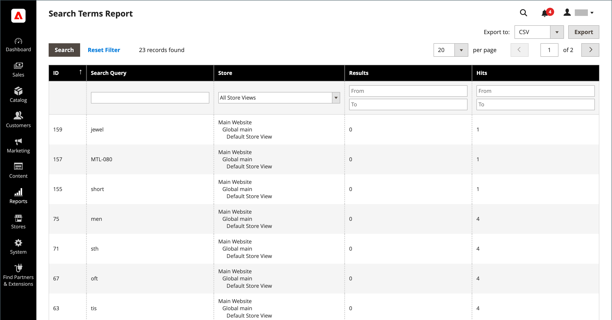

# Verwalten von Suchbegriffen

Die [Landingpage](../content-design/pages.md) für einen Suchbegriff kann eine Inhaltsseite, eine Kategorieseite, eine Produktdetailseite oder auch eine Seite auf einer anderen Site sein.

Verwenden Sie Suchbegriffe, um häufige Rechtschreibfehler zu erfassen und auf die entsprechende Seite weiterzuleiten. Wenn Sie zum Beispiel schmiedeeiserne Terrassenmöbel verkaufen, wissen Sie, dass viele Leute den Begriff falsch buchstabieren _Stabeisen_ oder sogar _Roteisen_. Sie können jedes falsch geschriebene Wort als Suchbegriff eingeben und es zu Synonymen für &quot;_&quot;_. Obwohl das Wort falsch geschrieben wurde, wird die Suche auf die Seite für Schmiedeeisen geleitet.

Sie können auch erfahren, was Ihre Kunden suchen, indem Sie die Suchbegriffe überprüfen, die sie verwenden, um Produkte in Ihrem Geschäft zu finden. Wenn genügend Personen nach einem Produkt suchen, das nicht in Ihrem Katalog enthalten ist, könnte dies auf eine Verkaufschance hindeuten. In der Zwischenzeit können Sie sie an ein anderes Produkt in Ihrem Katalog weiterleiten, anstatt sie mit leeren Händen zu lassen.

## Suchbegriffe hinzufügen

Wenn Sie neue Wörter lernen, mit denen Personen in Ihrem Geschäft suchen, können Sie sie zu Ihrer Suchbegriffliste hinzufügen, um Personen zu den Produkten in Ihrem Katalog zu leiten, die am ehesten mit Ihnen übereinstimmen.

{width="700" zoomable="yes"}

| Spalte | Beschreibung |
|--- |--- |
| [!UICONTROL Search Query] | Die Abfrage, die für die Suche verwendet wird. |
| [!UICONTROL Store] | Der Speicher, auf den die Suchanfrage angewendet wurde. |
| [!UICONTROL Results] | Anzahl der Ergebnisse durch die Abfrage. |
| [!UICONTROL Uses] | Anzahl der Verwendungen. |
| [!UICONTROL Redirect URL] | URL der Zielseite, auf die der Benutzer nach der Suche weitergeleitet wurde. |
| [!UICONTROL Suggested Terms] | Legt fest, ob das Abfrageergebnis vorgeschlagene Begriffe anzeigt. |
| [!UICONTROL Actions] | Öffnet das Produkt im Bearbeitungsmodus. |

{style="table-layout:auto"}

>[!NOTE]
>
>Die Anzahl der Ergebnisse wird jedes Mal aktualisiert, wenn ein Käufer eine Suche mit dieser Suchanfrage ausführt. Es wird nicht aktualisiert, wenn eines der Produkte geändert oder entfernt wird.

### Suchbegriff hinzufügen

1. Navigieren Sie in _Admin_-Seitenleiste zu **[!UICONTROL Marketing]** > _[!UICONTROL SEO & Search]_>**[!UICONTROL Search Terms]**.

1. Klicken Sie auf **[!UICONTROL Add New Search Term]**.

   {width="600" zoomable="yes"}

1. Geben Sie unter _[!UICONTROL General Information]_im Feld **[!UICONTROL Search Query]**das Wort oder die Phrase ein, das bzw. die Sie als neuen Suchbegriff hinzufügen möchten.

1. Wenn Ihr Store in mehreren Sprachen verfügbar ist, wählen Sie die entsprechende **[!UICONTROL Store]** aus.

1. Um die Suchergebnisse zu einer anderen Seite in Ihrem Geschäft oder zu einer anderen Website umzuleiten, geben Sie die vollständige URL der Zielseite in das Feld **[!UICONTROL Redirect URL]** ein.

1. Wenn dieser Begriff als Vorschlag verfügbar sein soll, wenn eine Suche keine Ergebnisse zurückgibt, setzen Sie **[!UICONTROL Display in Suggested Terms]** auf `Yes`.

1. Klicken Sie abschließend auf **[!UICONTROL Save Search]**.

## Bearbeiten eines Suchbegriffs

1. Klicken Sie im _[!UICONTROL Search Terms]_auf die Zeile eines Datensatzes, um den Suchbegriff im Bearbeitungsmodus zu öffnen.

1. Nehmen Sie die erforderlichen Änderungen vor.

1. Klicken Sie abschließend auf **[!UICONTROL Save Search]**.

## Löschen eines Suchbegriffs

Es gibt zwei Methoden zum Löschen eines Suchbegriffs - im Raster und auf der Bearbeitungsseite.

**Methode 1:** Im _[!UICONTROL Search Terms]_Raster

1. Aktivieren Sie in der Liste das Kontrollkästchen des zu löschenden Begriffs.

1. Setzen Sie oben links in der Liste **[!UICONTROL Actions]** auf `Delete`.

1. Klicken Sie abschließend auf **[!UICONTROL Submit]**.

**Methode 2:** Auf der _[!UICONTROL Edit a Search Term]_Seite

1. Navigieren Sie in _Admin_-Seitenleiste zu **[!UICONTROL Marketing]** > _[!UICONTROL SEO & Search]_>**[!UICONTROL Search Terms]**.

1. Suchen Sie den zu löschenden Suchbegriff und öffnen Sie ihn im Bearbeitungsmodus.

1. Klicken Sie auf **[!UICONTROL Delete Search]**.

1. Um die Aktion zu bestätigen, klicken Sie auf **[!UICONTROL OK]**.

## Beliebte Suchbegriffe

Der _Suchbegriffe_ in der Fußzeile Ihres Stores zeigt die von den Besucherinnen und Besuchern Ihres Stores verwendeten Suchbegriffe an, sortiert nach Popularität. Suchbegriffe werden im _Tag-Cloud_-Format angezeigt, wobei die Textgröße die Popularität des Begriffs angibt.

Standardmäßig sind „Beliebte Suchbegriffe“ als Suchmaschinenoptimierungs-Tool aktiviert, haben jedoch keine direkte Verbindung zum Katalogsuchprozess. Da die Suchbegriffseite von Suchmaschinen indiziert wird, können alle Begriffe auf der Seite dazu beitragen, das Suchmaschinen-Ranking und die Sichtbarkeit Ihres Stores zu verbessern. Die URL der Seite mit den beliebten Suchbegriffen lautet: `mystore.com/search/term/popular/`

{width="600" zoomable="yes"}

**_So konfigurieren Sie beliebte Suchbegriffe:_**

1. Navigieren Sie in _Admin_-Seitenleiste zu **[!UICONTROL Stores]** > _[!UICONTROL Settings]_>**[!UICONTROL Configuration]**.

1. Erweitern Sie im linken Bereich **[!UICONTROL Catalog]** und wählen Sie darunter **[!UICONTROL Catalog]**.

1. Erweitern Sie  den Abschnitt **[!UICONTROL Search Engine Optimization]** .

   {width="600" zoomable="yes"}

   Eine detaillierte Liste dieser Optionen finden Sie unter [Suchmaschinenoptimierung](../configuration-reference/catalog/catalog.md#search-engine-optimization) in der _Konfigurationsreferenz_.

1. **[!UICONTROL Popular Search Terms]** nach Bedarf festlegen.

   Deaktivieren Sie bei Bedarf das Kontrollkästchen **[!UICONTROL Use system value]** , um diese Einstellung zu ändern.

1. Klicken Sie abschließend auf **[!UICONTROL Save Config]**.

>[!NOTE]
>
>Sie können außerdem das Caching beliebter [ (Katalogsuchen) ](search-configuration.md).

## Synonyme suchen

Eine Möglichkeit, die Effektivität der [Katalogsuche](search-configuration.md) zu verbessern, besteht darin, verschiedene Begriffe einzubeziehen, die Personen zur Beschreibung desselben Elements verwenden können. Sie wollen keinen Verkauf verlieren, nur weil jemand nach einem _Sofa_ sucht und Ihr Produkt als _Couch_ aufgeführt ist. Sie können eine breitere Palette von Suchbegriffen erfassen, indem Sie _sofa_, _davenport_ und _loveseat_ als Synonyme für _couch_ eingeben und sie zur gleichen Landingpage weiterleiten.

Adobe Commerce unterstützt zwei verschiedene Synonym-Management-Lösungen:

- Die Live Search [Synonyme](https://experienceleague.adobe.com/docs/commerce-merchant-services/live-search/live-search-admin/synonyms/synonyms.html)-Funktion ist für Adobe Commerce-Installationen mit installierter Live Search verfügbar.
- Die Standardfunktion für Suchsynonyme (auf dieser Seite beschrieben) ist für alle Adobe Commerce-Installationen standardmäßig verfügbar.

>[!NOTE]
>
>Die standardmäßige Suchsynonyme-Funktion unterstützt standardmäßig `name` und `sku` Produktattribute **_nur_**.

>[!IMPORTANT]
>
>Die Suchsynonyme-Funktion verwendet nur eine Volltext-Suchmethode.

{width="700" zoomable="yes"}

### Synonym-Gruppe erstellen

1. Navigieren Sie in _Admin_-Seitenleiste zu **[!UICONTROL Marketing]** > _[!UICONTROL SEO & Search]_>**[!UICONTROL Search Synonyms]**.

   Das _[!UICONTROL Search Synonyms]_wird angezeigt. Wenn Sie zum ersten Mal Suchsynonyme verwenden, ist das Raster leer.

   {width="700" zoomable="yes"}

1. Klicken Sie auf **[!UICONTROL New Synonym Group]**.

   {width="700" zoomable="yes"}

1. Legen Sie **[!UICONTROL Scope]** auf die Store-Ansichten fest, für die die Synonyme gelten.

1. Geben Sie jedes Synonym in der Gruppe durch Kommas getrennt ein. Wählen Sie Wörter aus, die Benutzer als Suchkriterien verwenden könnten. Beispiel:

   - `sweatshirt, sweat shirt, hoodie, fleece`
   - `cell phone, mobile phone, smart phone`
   - `couch, sofa, davenport`
   - `wrought iron, rot iron, rod iron`

1. Um diese Synonyme mit anderen, die denselben Umfang haben, zu einer Gruppe zusammenzuführen, aktivieren Sie das Kontrollkästchen **[!UICONTROL Merge existing synonyms]** .

1. Klicken Sie abschließend auf **[!UICONTROL Save Synonym Group]**.

### Bearbeiten einer Synonymgruppe

1. Klicken Sie im _[!UICONTROL Search Synonyms]_auf die Zeile eines Datensatzes, um die Gruppe der Synonyme im Bearbeitungsmodus zu öffnen.

1. Nehmen Sie die erforderlichen Änderungen vor.

1. Klicken Sie abschließend auf **[!UICONTROL Save Synonym Group]**.

### Löschen einer Synonymgruppe

Es gibt zwei Methoden zum Löschen einer Gruppe von Synonymen: aus dem Raster und auf der Bearbeitungsseite.

**Methode 1:** Im Raster „Synonyme suchen“

1. Aktivieren Sie im _[!UICONTROL Search Synonyms]_das Kontrollkästchen der zu löschenden Gruppe.

1. Setzen Sie oben links in der Liste **[!UICONTROL Actions]** auf `Delete`.

1. Klicken Sie abschließend auf **[!UICONTROL Submit]**.

**Methode 2:** Auf der Seite „Synonym-Gruppe bearbeiten“

1. Klicken Sie im Raster Synonyme suchen auf die Zeile eines Datensatzes, um die Gruppe Synonyme im Bearbeitungsmodus zu öffnen.

1. Klicken Sie auf **[!UICONTROL Delete Synonym Group]**.

1. Bestätigen Sie nach Aufforderung die Entfernung der Gruppe.

## Bericht zu Suchbegriffen

Der Bericht zu Suchbegriffen zeigt die Anzahl der Ergebnisse für jeden Begriff und die Anzahl der Treffer (Treffer) an, die der Begriff verwendet wurde. Die Berichtsdaten können nach Begriff, Speicher, Ergebnissen und Treffern gefiltert und zur weiteren Analyse exportiert werden.

### Anzeigen des Berichts

1. Navigieren Sie in _Admin_-Seitenleiste zu **[!UICONTROL Reports]** > _[!UICONTROL Marketing]_>**[!UICONTROL Search Terms]**.

1. Verwenden Sie die Steuerelemente, um den Bericht nach Bedarf zu filtern.

   {width="700" zoomable="yes"}

## Exportieren des Berichts

1. Wählen Sie **[!UICONTROL Export to]** ein Exportformat aus:

   - `CSV` : Eine kommagetrennte Wertedatei, die Textdaten enthält.
   - `Excel XML` - Ein XML-basiertes Tabellendatenformat

1. Klicken Sie auf **[!UICONTROL Export]**.

   Die generierte Datei wird automatisch in Ihrem vorgesehenen Ordner für Downloads gespeichert.

### Berichtsspalten

| Spalte | Beschreibung |
|--- |--- |
| [!UICONTROL ID] | Eindeutige numerische ID, die für den Suchbegriffeintrag generiert wurde |
| [!UICONTROL Search Query] | Die Abfrage, die für die Suche verwendet wird |
| [!UICONTROL Store] | Der Speicher, auf den die Suchanfrage angewendet wurde |
| [!UICONTROL Results] | Anzahl der Ergebnisse |
| [!UICONTROL Hits] | Anzahl der Verwendungen |

{style="table-layout:auto"}
