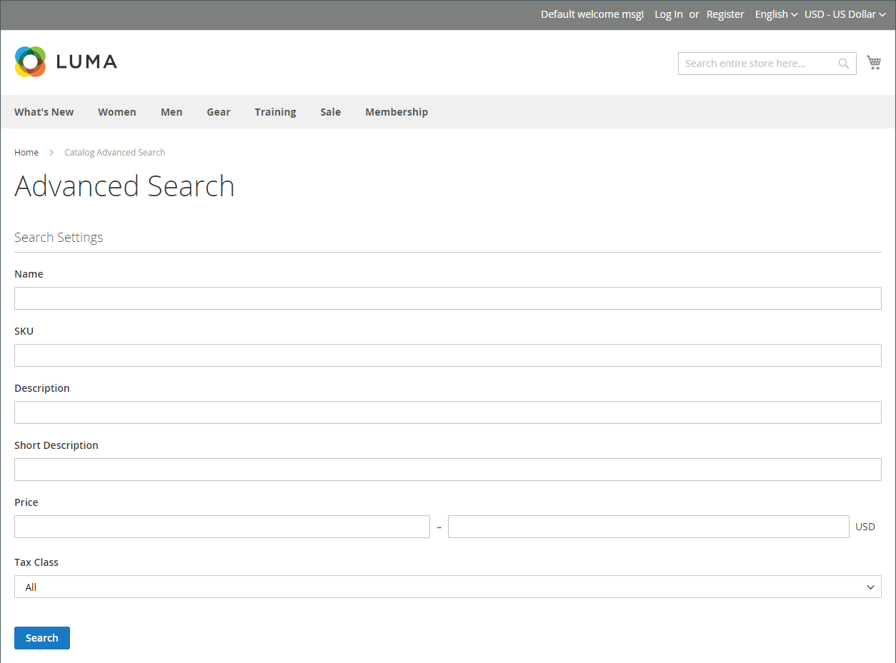

# Katalogsuche - Übersicht

>[!TIP]
>
>[[!DNL Live Search]](https://experienceleague.adobe.com/docs/commerce-merchant-services/live-search/overview.html) bietet ein schnelles, superrelevantes und intuitives Sucherlebnis und steht Adobe Commerce ohne zusätzliche Kosten zur Verfügung. In diesem Abschnitt werden die Standardsuchfunktionen beschrieben, die sich von [!DNL Live Search].

Untersuchungen zeigen, dass Personen, die die Suche verwenden, mit höherer Wahrscheinlichkeit einen Kauf tätigen als Kunden, die sich allein auf die Navigation verlassen. Tatsächlich ist es nach einigen Studien fast doppelt so wahrscheinlich, dass Menschen, die die Suche verwenden, einen Kauf tätigen.

In den folgenden Abschnitten werden die grundlegenden Katalogsuchfunktionen beschrieben. Informationen dazu, wie Sie die nativen Katalogsuchfunktionen konfigurieren und anpassen können, finden Sie unter:

- [Katalogsuche konfigurieren](search-configuration.md)
- [Suchergebnisse](search-results.md)
- [Suchbegriffe verwalten](search-terms.md)

>[!NOTE]
>
>Die native Suchfunktion in Commerce bietet exakte Suchergebnisse. while [!DNL Live Search], ein optionales Modul, das in Adobe Commerce installiert und aktiviert werden kann, ist anders implementiert und das Ergebnis ist nicht auf die exakte Suchzeichenfolge beschränkt. Wenn Sie beispielsweise zehn Produkte numerisch für _Omega_: Eine Suche nach `Omega 1` führt zu einer einzelnen Übereinstimmung für _Omega 1_ mit der nativen Suchfunktion. Dieselbe Suchzeichenfolge, die durch die Live-Suche unterstützt wird, führt jedoch zu einer Übereinstimmung für mehrere Elemente. _Omega 1_ und _Omega 10_.

## Schnellsuche

>[!NOTE]
>
>Wann [[!DNL Live Search]](https://experienceleague.adobe.com/docs/commerce-merchant-services/live-search/live-search-storefront/quick-tour.html) installiert ist, gibt das Suchfeld die Ergebnisse &quot;Suche beim Eingeben&quot;in einem Popup-Fenster zurück.

Das Suchfeld in der Kopfzeile des Stores hilft Besuchern, Produkte in Ihrem Katalog zu finden. Der Suchtext kann der vollständige oder teilweise Produktname oder ein beliebiges anderes Wort oder eine Wortgruppe sein, das bzw. die das Produkt beschreibt. Die Suchbegriffe, die Personen zum Suchen von Produkten verwenden, können vom Administrator verwaltet werden.

1. Für **[!UICONTROL Search]**, gibt der Kunde die ersten Buchstaben des gesuchten Inhalts ein.

   Alle Übereinstimmungen im Katalog werden unten mit der Anzahl der gefundenen Ergebnisse angezeigt.

1. Der Kunde drückt die Eingabetaste oder klickt in der Liste der entsprechenden Produkte auf ein Ergebnis.

   {width="700" zoomable="yes"}

## Erweiterte Suche

>[!NOTE]
>
>Die hier beschriebene erweiterte Formularsuchfunktion gilt nicht für [[!DNL Live Search]](https://experienceleague.adobe.com/docs/commerce-merchant-services/live-search/overview.html).

Mit der erweiterten Suche können Käufer den Katalog anhand der in einem Formular eingegebenen Werte durchsuchen. Da das Formular mehrere Felder enthält, kann eine einzelne Suche mehrere Parameter enthalten. Das Ergebnis ist eine Liste aller Produkte im Katalog, die den Kriterien entsprechen. Ein Link zur erweiterten Suche befindet sich in der Fußzeile Ihres Stores.

{width="700" zoomable="yes"}

Jedes Feld im Formular entspricht einem Attribut aus Ihrem Produktkatalog. Um ein Feld hinzuzufügen, setzen Sie die Frontend-Eigenschaften des Attributs auf `Include in Advanced Search`. Als Best Practice empfiehlt es sich, nur die Felder einzuschließen, die Kunden am ehesten verwenden, um ein Produkt zu finden, da zu viele die Suche verlangsamen.

1. In der Fußzeile des Stores klickt der Kunde auf **[!UICONTROL Advanced Search]**.

1. Im _Erweiterte Suche_ -Formular, fügt vollständige oder teilweise Werte in so vielen Feldern wie nötig hinzu.

1. Klicks **[!UICONTROL Search]** , um die Ergebnisse anzuzeigen.

   {width="700" zoomable="yes"}

1. Wenn der Kunde in den Suchergebnissen nicht sieht, wonach er sucht, klickt er auf **[!UICONTROL Modify your search]** und versucht eine andere Kombination von Kriterien.
