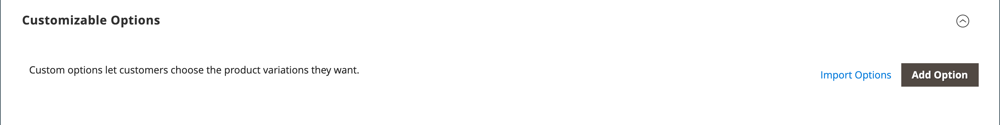

# Produkteinstellungen - [!UICONTROL Customizable Options]

Das Hinzufügen anpassbarer Optionen zu einem Produkt ist eine einfache Möglichkeit, eine Auswahl von Optionen mit Text-, Auswahl- und Datumseingabetypen anzubieten. Anpassbare Optionen sind eine gute Lösung, wenn Ihre Inventaranforderungen einfach sind. Da sie jedoch auf Varianten einer einzelnen SKU basieren, können sie nicht zur Verwaltung von Lagerbeständen oder als Grundlage von Preisregelbedingungen verwendet werden. Wenn Sie mehrere Produkte mit denselben Optionen haben, können Sie ein Produkt einrichten und die Optionen in die anderen Produkte importieren.

Wenn ein Kunde ein Produkt mit einer anpassbaren Option kauft, wird eine Beschreibung jeder ausgewählten Option unter der Produktbeschreibung angezeigt und jeder zugehörige Markup (oder Markdown) wird automatisch auf den Preis des Artikels angewendet.

{width="700" zoomable="yes"}

Wenn eine Warenkorb-Preisregel durch den Kauf ausgelöst wird, gilt die ursprüngliche Berechnung zunächst für den Produktpreis und sekundär für den Einzelpostenpreis mit einer Anpassung für anwendbare anpassbare Optionen. Im folgenden Beispiel kauft der Kunde eine Reisetasche für 74,00 $ sowie eine anpassbare Option für ein Monogramm. Auf den Basisproduktpreis wird ein Aufschlag von 14,80 US-Dollar angewendet, und der angepasste Preis wird als 88,80 US-Dollar angezeigt. In diesem Fall Trigger der Kauf der Reisetasche eine Warenkorb-Preisregel basierend auf der Produkt-SKU und wendet einen Rabatt auf den Kauf sowie kostenlosen Versand an. Obwohl die Warenkorbpreisregel nicht durch die anpassbare Option ausgelöst wird, wendet sie den Rabatt auf den Warenkorbinhalt an, der das Markup für die anpassbare Option enthält.

{width="700" zoomable="yes"}

>[!NOTE]
>
>Auf die anpassbaren Optionen mit Festpreis wird kein Rabatt für Katalogpreisregeln angewendet.

## Anpassbare Optionen erstellen

1. Öffnen Sie das Produkt im Bearbeitungsmodus.

1. Scrollen Sie nach unten und erweitern Sie  den Abschnitt _[!UICONTROL Customizable Options]_.

1. Klicken Sie auf **[!UICONTROL Add Option]**.

   {width="600" zoomable="yes"}

1. Füllen Sie die neuen Optionseinstellungen aus:

   - Geben Sie **[!UICONTROL Option Title]** einen Namen für die Option ein.

   - Legen Sie die **[!UICONTROL Option Type]** für den Typ der Dateneingabe fest.

   - Wenn die Option für den Kauf des Produkts nicht erforderlich ist, deaktivieren Sie das Kontrollkästchen **[!UICONTROL Required]** .

1. Füllen Sie die Felder entsprechend dem Dateneingabetyp aus:

   - Geben Sie **[!UICONTROL Title]** einen Namen für diese Option ein.

   - (Optional) Geben Sie **[!UICONTROL Price]** einen Aufschlag oder einen Markdown aus dem Basisproduktpreis ein, der für diese Option gilt.

   - Legen Sie **[!UICONTROL Price Type]** auf eine der folgenden Einstellungen fest:

      - `Fixed` - Der Preis der Variante unterscheidet sich vom Preis des Basisprodukts durch einen festen Geldbetrag, z. B. 1 $.
      - `Percentage` - Der Preis der Variante unterscheidet sich vom Preis des Basisprodukts um einen Prozentsatz, z. B. 10 %.

   - (Optional) Geben Sie einen **[!UICONTROL SKU]** für die Option ein. Die Option-SKU ist ein Suffix, das zur Produkt-SKU hinzugefügt wird.

   - Wenn die _[!UICONTROL Option Type]_`File` ist, legen Sie die Parameter für die Datei fest. Geben Sie **[!UICONTROL Compatible File Extensions]**die gültigen Erweiterungen als kommagetrennte Werte ein (z. B. `png, jpg, gif`). Geben Sie **[!UICONTROL Maximum Image Size]**die maximale Bildgröße in Pixel ein. Wenn es sich um einen Texteintrag handelt, geben Sie den Höchstwert für **[!UICONTROL Maximum Characters]**ein.

   {width="600" zoomable="yes"}

1. (Optional) Wenn Sie eine weitere anpassbare Option hinzufügen möchten, klicken Sie auf **[!UICONTROL Add Option]**.

   - Vervollständigen Sie die Einstellungen wie zuvor.

   - Um die Reihenfolge der Optionen zu ändern, klicken Sie auf das Symbol _[!UICONTROL Order]_ und ziehen Sie die Option an eine neue Position in der Liste.

   Wiederholen Sie diesen Schritt für jede hinzuzufügende Option.

1. Klicken Sie abschließend auf **[!UICONTROL Save]**.

## Anpassbare Optionen importieren

1. Klicken Sie _Abschnitt „Anpassbare Optionen_ auf **[!UICONTROL Import Options]**.

1. Alle Produkte mit anpassbaren Optionen werden im Raster angezeigt.

1. Aktivieren Sie in der Liste das Kontrollkästchen des Produkts mit den Optionen, die Sie importieren möchten.

1. Klicken Sie auf **[!UICONTROL Import]**.

1. Wenn Sie fertig sind, können Sie weitere benutzerdefinierte Optionen hinzufügen oder auf **[!UICONTROL Save and Close]** klicken.

## Eingabetypen

| Typ | Beschreibung |
|---------------------|---------------|
| [!UICONTROL Text] | Eine Eingabezeile oder ein Textfeld, in die bzw. das der Kunde die erforderlichen Informationen eingeben kann. Optionen:  **[!UICONTROL Field]**- Ein einzeiliges Eingabefeld für Text. **[!UICONTROL Area]**: Ein mehrzeiliges Eingabefeld. Dieser Typ unterstützt keine erweiterte Formatierung wie HTML. Verwenden Sie die maximale Zeichenzahl, um die Länge des Textes zu begrenzen, der eingegeben werden kann, und stellen Sie sicher, dass der eingegebene Text in der Admin-Liste korrekt dargestellt wird. |
| [!UICONTROL File] | Ermöglicht dem Kunden das Hochladen einer Datei. |
| [!UICONTROL Select] | Ermöglicht dem Kunden die Auswahl einer einzelnen Option oder mehrerer Optionen, je nach verwendetem Eingabetyp. Optionen:  **[!UICONTROL Drop-down]**- Eine Dropdown-Liste von Optionen, die nur eine Auswahl zulässt. **[!UICONTROL Radio Buttons]** : Ein Satz von Optionen, die nur eine Auswahl zulassen. **[!UICONTROL Checkbox]**- Ein Kontrollkästchen ist eine Variante einer Ja/Nein-Option. Wenn das Produkt mehrere Kontrollkästchen hat, können mehrere Auswahlen vorgenommen werden. **[!UICONTROL Multiple Select]** : Ein Dropdown-Listenfeld mit Optionen, für die mehrere Auswahlmöglichkeiten zulässig sind. Um mehrere Optionen auszuwählen, halten Sie die Strg- (PC) oder Befehlstaste (Mac) gedrückt und klicken Sie auf die einzelnen Optionen. |
| [!UICONTROL Date] | Ermöglicht dem Kunden die Eingabe eines Datums oder einer Uhrzeit oder die Auswahl des Werts aus einem Kalender. Optionen:  **[!UICONTROL Date]**: Ein Eingabefeld für einen Datumswert. Das Datum kann direkt in das Feld eingegeben oder aus einer Liste oder einem Kalender ausgewählt werden. Die Eingabemethode und das Format werden durch die Konfiguration [Datums- und Uhrzeitoptionen](attributes-input-types.md#date-and-time-options) bestimmt. **[!UICONTROL Date & Time]** : Ein Eingabefeld für einen Datums- und Uhrzeitwert. **[!UICONTROL Time]**: Ein Eingabefeld für einen Zeitwert. |

{style="table-layout:auto"}
