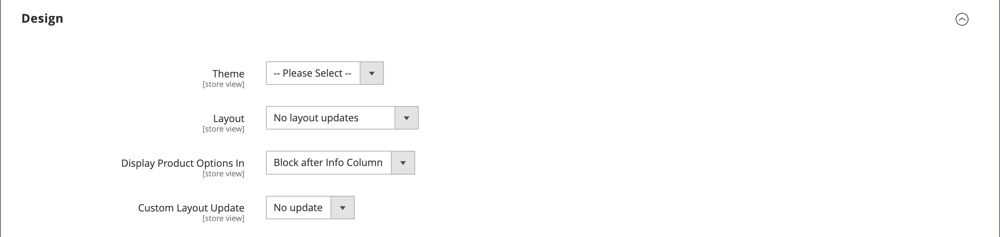

# Produkteinstellungen - [!UICONTROL Design]

Mit den _[!UICONTROL Design]_können Sie ein anderes Design auf die Produktseite anwenden, das Spalten-Layout ändern, festlegen, wo die Produktoptionen angezeigt werden, und benutzerdefinierten XML-Code eingeben.

{width="600" zoomable="yes"}

>[!NOTE]
>
>Wenn dasselbe Produkt mehreren Kategorien mit unterschiedlichen Designeinstellungen für jede Kategorie zugewiesen wird, wird empfohlen, in den Konfigurationsoptionen für die Suchmaschinenoptimierung **[!UICONTROL Use Categories Path for Product URLs]** = `Yes` [ festlegen](../configuration-reference/catalog/catalog.md#search-engine-optimization). Um auf diese Einstellung zuzugreifen, gehen Sie zu **[!UICONTROL Stores]** > _[!UICONTROL Settings]_>**[!UICONTROL Configuration]**, erweitern Sie **[!UICONTROL Catalog]**und wählen Sie im linken Bereich unten **[!UICONTROL Catalog]**aus und erweitern Sie dann den **[!UICONTROL Search Engine Optimization]**auf der Seite.

| Feld | [Umfang](../getting-started/websites-stores-views.md#scope-settings) | Beschreibung |
|---|---|----|
| [!UICONTROL Theme] | Shop-Ansicht |  (nur Adobe Commerce) Ermöglicht das Anwenden eines anderen Designs auf das Produkt. Optionen: (Alle verfügbaren Designs) |
| [!UICONTROL Layout] | Shop-Ansicht | Ermöglicht die Anwendung eines anderen [Layouts](../content-design/page-layout.md) auf die Produktseite. Optionen:  **[!UICONTROL No layout updates]**- Standardmäßig sind Layout-Aktualisierungen für die Produktseite nicht verfügbar. **[!UICONTROL Empty]** - Ermöglicht die Definition eines eigenen Layouts, z. B. einer 4-spaltigen Seite. (XML ist ein Verständnis erforderlich.)  **[!UICONTROL 1 column]**- Wendet ein einspaltiges Layout auf die Produktseite an. **[!UICONTROL 2 columns with left bar]** - Wendet ein zweispaltiges Layout mit einer linken Seitenleiste auf die Produktseite an.  **[!UICONTROL 2 columns with right bar]**- Wendet ein zweispaltiges Layout mit einer rechten Seitenleiste auf die Produktseite an. **[!UICONTROL 3 columns]** - Wendet ein dreispaltiges Layout auf die Produktseite an.  **[!UICONTROL Page -- Full Width]**- ([[!DNL Page Builder]](../page-builder/introduction.md) erforderlich) Wendet das Layout „Vollbreite“ für CMS-Seiten auf die Produktseite an. **[!UICONTROL Category -- Full Width]** - ([!DNL Page Builder] erforderlich) Wendet das Layout mit der gesamten Breite für Kategorieseiten auf die Produktseite an.  **[!UICONTROL Product -- Full Width]**- ([!UICONTROL Page Builder] erforderlich) Wendet das Layout mit der gesamten Breite für Produktseiten auf die Produktseite an. |
| [!UICONTROL Display Product Options In] | Shop-Ansicht | Legt fest, wo die Produktoptionen auf der Produktseite angezeigt werden. Optionen: `Product Info Column` / `Block after Info Column` |
| [!UICONTROL Custom Layout Update] | Shop-Ansicht | Wird verwendet, um auf Optionen zuzugreifen, um ein benutzerdefiniertes Layout auf der Produktseite zu aktualisieren. |

{style="table-layout:auto"}
