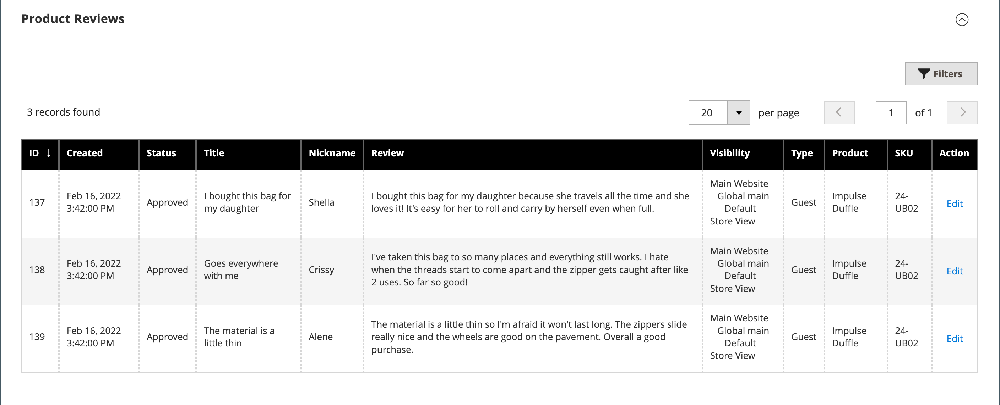

# Produkteinstellungen - [!UICONTROL Product Reviews]

Im Abschnitt _[!UICONTROL Product Reviews]_&#x200B;sind alle Bewertungen aufgelistet, die Kunden zu dem Produkt eingereicht haben. Dieser Abschnitt wird mit den anderen Produktinformationen erst angezeigt, nachdem ein neues Produkt zum ersten Mal gespeichert wurde. Weitere Informationen finden Sie unter [Produktbewertungen](../merchandising-promotions/product-reviews.md).

{width="600" zoomable="yes"}

## Feldverweis

| Feld | Beschreibung |
|--- |--- |
| [!UICONTROL ID] | Eindeutige numerische ID, die für den Produktüberprüfungseintrag generiert wurde |
| [!UICONTROL Created] | Datum der Veröffentlichung der Überprüfung |
| [!UICONTROL Status] | Überprüfungsstatus (`Pending`, `Approved` oder `Not Approved`) |
| [!UICONTROL Title] | Überprüfungstitel |
| [!UICONTROL Nickname] | Der Spitzname des Benutzers, der die Überprüfung verlassen hat |
| [!UICONTROL Review] | Kundenbewertung zum aktuellen Produkt |
| [!UICONTROL Visibility] | Sichtbarkeit in Bewertungen |
| [!UICONTROL Type] | Typ des Benutzers, der die Überprüfung verlassen hat (`Guest` oder `Customer`) |
| [!UICONTROL Product] | Überprüfter Produktname |
| [!UICONTROL SKU] | Die eindeutige Lagerhaltungseinheit, die dem Produkt zugewiesen ist |
| [!UICONTROL Action] | Öffnet das Produkt im Bearbeitungsmodus |

{style="table-layout:auto"}

## Moderate Bewertungen für ein bestimmtes Produkt

1. Navigieren Sie in der _Admin_-Seitenleiste zu **[!UICONTROL Catalog]** > **[!UICONTROL Products]**.

1. Suchen Sie das Produkt und öffnen Sie es im Bearbeitungsmodus.

1. Scrollen Sie zum Abschnitt _[!UICONTROL Product Reviews]_.

1. Klicken Sie auf **[!UICONTROL Edit]** , um eine Produktüberprüfung mit `Pending` Status durchzuführen und die Details anzuzeigen und zu bearbeiten.

1. Festlegen des Status für die Überprüfung:

   - Um eine ausstehende Überprüfung zu genehmigen, wählen Sie `Approved` aus.
   - Um eine Überprüfung abzulehnen, wählen Sie `Not Approved` aus.
   - Sie können den Prüfungsstatus jederzeit wieder in `Pending` ändern.

1. Klicken Sie abschließend auf **[!UICONTROL Save Review]**.

Überprüfungen mit dem Status `Pending` und `Not Approved` werden nicht in der Storefront angezeigt.

