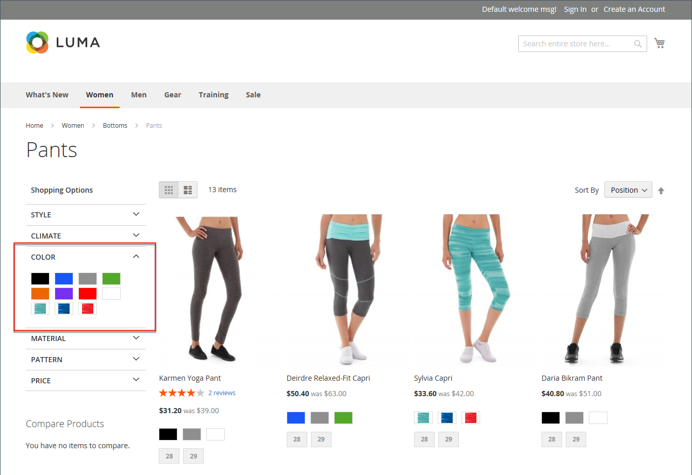

# Produktmuster

Kunden haben hohe Erwartungen an die Auswahl einer Farbe, und es ist wichtig, dass Produktbeschreibungen jede verfügbare Farbe, jedes Muster oder jede verfügbare Textur genau darstellen. Zum Beispiel sind die Hosen im folgenden Beispiel nicht in Rot, Grün und Blau verfügbar. Stattdessen sind sie nur in bestimmten Farben von Rot, Grün und Blau verfügbar, die wahrscheinlich einzigartig für dieses Produkt sind.

{width="700" zoomable="yes"}

Bei [konfigurierbaren Produkten](product-create-configurable.md) kann die Farbe durch ein visuelles Farb- oder Textmuster oder ein Eingabesteuerelement angezeigt werden. Farbfelder können auf der Produktseite, in Produktlisten und in der [ Navigation verwendet ](navigation-layered.md). Auf der Produktseite werden Farbfelder synchronisiert, um das entsprechende Produktbild anzuzeigen, wenn das Farbfeld ausgewählt ist. Wenn der Kunde das Farb-/Bildmuster auswählt, wird der entsprechende Wert im Eingabefeld angezeigt und das Farb-/Bildmuster wird als aktuelle Auswahl dargestellt.

>[!NOTE]
>
>Musterattribute können so konfiguriert werden, dass entsprechende einfache Produktbilder nicht angezeigt werden, wenn das Muster ausgewählt ist. Legen Sie dazu den Wert der Option _[!UICONTROL Update Product Preview Image]_&#x200B;auf der Seite [!UICONTROL Attribute Edit] in der Admin Console auf `No` fest.

## Textbasierte Farbfelder

Wenn für ein Farbfeld kein Bild verfügbar ist, wird der Attributwert als Text angezeigt. Ein textbasiertes Farb-/Bildmuster ist wie eine Schaltfläche mit einer Textbeschriftung und verhält sich wie ein Farb-/Bildmuster mit einem Bild. Wenn textbasierte Farbfelder verwendet werden, um die verfügbaren Größen anzuzeigen, werden alle Größen durchgestrichen, die nicht verfügbar sind.

{width="700" zoomable="yes"}

## Farbfelder in der mehrschichtigen Navigation

Farbfelder können auch in der mehrschichtigen Navigation verwendet werden, wenn die _[!UICONTROL Use in Layered Navigation]_-Eigenschaft des Farbattributs auf `Yes` festgelegt ist. Das folgende Beispiel zeigt sowohl textbasierte als auch Farbbildmuster in der mehrschichtigen Navigation.

{width="700" zoomable="yes"}

## Erstellen von Farbfeldern für Produkte

Farbfelder können als Komponente des `color`-Attributs definiert oder lokal für ein bestimmtes Produkt eingerichtet und als „Produktbilder[ hochgeladen ](product-image.md#upload-an-image).

In den früheren Beispielen ist die Hose „Sylvia Capri“ in bestimmten Werten von `red`, `green` und `blue` erhältlich. Da die Farbfelder aus dem Produktbild entnommen wurden, sind sie jeweils eine wahre Darstellung der Farbe. Das Attribut `color` wird verwendet, um die Informationen für alle Produktfarben und Farbfelder zu verwalten.

### Schritt 1: Erstellen der Farbfelder

Verwenden Sie eine der folgenden Methoden, um Farbfelder für Ihre Produkte zu erstellen.

#### Methode 1: Farbfeld hinzufügen

1. Um die tatsächliche Farbe eines Produkts zu erfassen, öffnen Sie das Bild in einem Fotoeditor und verwenden Sie das Pipettenwerkzeug, um die genaue Farbe zu identifizieren und den entsprechenden Hexadezimalwert zu beachten.

   {width="400"}

1. Navigieren Sie in _Admin_-Seitenleiste zu **[!UICONTROL Stores]** > _[!UICONTROL Attributes]_>**[!UICONTROL Product]**.

1. Öffnen Sie im Raster das Attribut _color_ im Bearbeitungsmodus.

1. Stellen Sie sicher, dass **[!UICONTROL Catalog Input Type for Store Owner]** auf `Visual Swatch` gesetzt ist.

1. Wenn Sie es vorziehen, entsprechende einfache Produktbilder nicht anzuzeigen, wenn der Musterabschnitt „Farbfeld“ auf der Seite „Produktanzeige“ ausgewählt ist, legen Sie **[!UICONTROL Update Product Preview Image]** auf `No` fest.

1. Klicken Sie unter _[!UICONTROL Manage Swatch (Values of Your Attribute)]_&#x200B;auf **[!UICONTROL Add Swatch]**&#x200B;und führen Sie folgende Schritte aus:

   {width="600" zoomable="yes"}

   - Klicken Sie in _Spalte_ Muster“ auf das neue Muster und wählen Sie **[!UICONTROL Choose a color]** aus dem Menü aus.

     {width="500" zoomable="yes"}

   - Platzieren Sie den Cursor im Farbwähler in das Feld **#**, löschen Sie den aktuellen Wert und geben Sie den sechsstelligen Hexadezimalwert der neuen Farbe ein.

     {width="500" zoomable="yes"}

   - Um den Musterabschnitt zu speichern, klicken Sie auf _Farbrad_ ( ) unten rechts in der Farbauswahl.

   - Geben Sie in _Spalte &quot;_&quot; einen Titel ein, um die Farbe für den Store-Administrator zu beschreiben.

     Bei Bedarf können Sie auch die Übersetzung der Farbe für jede unterstützte Sprache eingeben. Im folgenden Beispiel wird die SKU als Referenz in die Beschriftung _Admin_ aufgenommen, da die Farben nur für ein bestimmtes Produkt verwendet werden. Sie können ein Leerzeichen oder einen Unterstrich in die Beschriftung aufnehmen, jedoch keinen Bindestrich.

   - Wählen Sie in der Spalte _Ist_) das Farbfeld aus, das die Standardoption sein soll.

   - Um die Reihenfolge der Farbfelder zu ändern, klicken Sie auf das Symbol _[!UICONTROL Order]_ und ziehen Sie das Element an eine neue Position in der Liste.

     {width="400"}

1. Wenn Sie fertig sind, klicken Sie auf **[!UICONTROL Save Attribute]** und aktualisieren Sie den Cache, wenn Sie dazu aufgefordert werden.

1. Öffnen Sie jedes Produkt im Bearbeitungsmodus und aktualisieren Sie das **Color**-Attribut mit dem richtigen Farbfeld.

   Gehen Sie wie folgt vor, um mehrere Produkte gleichzeitig zu aktualisieren.

#### Methode 2: Hochladen eines Musterbilds

1. Um ein Bild für ein Muster zu erfassen, öffnen Sie das Produktbild in einem Fotoeditor und speichern Sie einen quadratischen Bereich des Bildes, der die Farbe, das Muster oder die Textur darstellt.

   Bei Bedarf können Sie diese Aktion für jede Variante des Produkts wiederholen.

   Die Größe und die Abmessungen des Farbfelds werden durch das Design bestimmt. Im Allgemeinen hilft das Speichern eines Bildes als Quadrat, das Seitenverhältnis eines Musters beizubehalten.

   {width="400"}

1. Navigieren Sie in _Admin_-Seitenleiste zu **[!UICONTROL Stores]** > _[!UICONTROL Attributes]_>**[!UICONTROL Product]**.

1. Öffnen Sie im Raster das Attribut **[!UICONTROL color]** im Bearbeitungsmodus.

1. Stellen Sie sicher, dass **[!UICONTROL Catalog Input Type for Store Owner]** auf `Visual Swatch` gesetzt ist.

1. Wenn Sie es vorziehen, entsprechende einfache Produktbilder nicht anzuzeigen, wenn der Musterabschnitt „Farbfeld“ auf der Seite „Produktanzeige“ ausgewählt ist, legen Sie **[!UICONTROL Update Product Preview Image]** auf `No` fest.

1. Klicken Sie unter _[!UICONTROL Manage Swatch]_(Werte Ihres Attributs) auf **[!UICONTROL Add Swatch]**&#x200B;und führen Sie folgende Schritte aus:

   - Klicken Sie in der Spalte _[!UICONTROL Swatch]_&#x200B;auf das neue Farbfeld, um das Menü anzuzeigen, und wählen Sie **[!UICONTROL Upload a file]**&#x200B;aus.

   - Navigieren Sie zur von Ihnen vorbereiteten Musterdatei und wählen Sie die hochzuladende Datei aus.

   - Wiederholen Sie diese Schritte für jedes Farb-/Bildmuster.

   - Geben Sie die Beschriftungen für die Admin- und Storefront ein.

     In diesem Beispiel wird die SKU der Admin-Beschriftung als Referenz hinzugefügt, da diese Farben nur für ein bestimmtes Produkt verwendet werden. Sie können ein Leerzeichen oder einen Unterstrich in die Beschriftung aufnehmen, jedoch keinen Bindestrich.

     {width="500" zoomable="yes"}

1. Wenn Sie fertig sind, klicken Sie auf **[!UICONTROL Save Attribute]** und aktualisieren Sie den Cache, wenn Sie dazu aufgefordert werden.

1. Öffnen Sie jedes Produkt im Bearbeitungsmodus und aktualisieren Sie das **[!UICONTROL Color]** mit dem richtigen Farbfeld.

   Gehen Sie wie folgt vor, um mehrere Produkte gleichzeitig zu aktualisieren.

### Schritt 2: Aktualisieren der Produkte

1. Navigieren Sie in der _Admin_-Seitenleiste zu **[!UICONTROL Catalog]** > **[!UICONTROL Products]**.

1. Verwenden Sie die **[!UICONTROL Filter]**, um die Liste nach Name oder SKU anzuzeigen und nur die entsprechenden Produkte einzuschließen.

1. Aktivieren Sie im Raster das Kontrollkästchen jedes Produkts, für das das Farbfeld gilt.

1. Legen Sie **[!UICONTROL Actions]** auf `Update Attributes` fest.

   In diesem Beispiel sind alle blauen Konfigurationen der Hose ausgewählt.

   {width="600" zoomable="yes"}

1. Scrollen Sie nach unten zum Attribut **[!UICONTROL Color]** und aktivieren Sie das Kontrollkästchen **[!UICONTROL Change]** .

   {width="400"}

1. Wählen Sie das Farbfeld aus, das für die ausgewählten Produkte gilt, und klicken Sie auf **[!UICONTROL Save]**.

1. Aktualisieren Sie bei Aufforderung den Cache.

   {width="200"}

## Hinzufügen von Farbfeldern zu einem einfachen Produkt

1. Navigieren Sie in der _Admin_-Seitenleiste zu **[!UICONTROL Catalog]** > **[!UICONTROL Products]**.

1. Öffnen Sie ein Produkt im Bearbeitungsmodus und überprüfen Sie den Produktstatus (sollte aktiviert sein).

1. Klicken Sie auf **[!UICONTROL Create Configurations]** Schaltfläche (unter der Registerkarte `Configurations` ).

1. Wählen Sie im Popup-Fenster das Farbattribut und die **[!UICONTROL Next]** aus.

1. Wählen Sie Farbfelder aus dem Attribut aus, das Sie in dieses Produkt aufnehmen möchten.

1. Klicken Sie in der Fortschrittsleiste auf **[!UICONTROL Next]**.

1. [Konfigurieren Sie die Bilder, den Preis und die ](product-create-configurable.md#step-3-configure-the-images-price-and-quantity).

   Legen Sie in diesem Schritt die Bilder, die Preise und die Menge jeder Konfiguration fest. Die verfügbaren Optionen sind für alle identisch, und Sie können nur eine auswählen. Sie können dieselbe Einstellung auf alle SKUs anwenden, eine eindeutige Einstellung auf jede SKU anwenden oder die Einstellungen für vorerst überspringen.

1. Wenn die Konfiguration der Bilder, des Preises und der Menge abgeschlossen ist, klicken Sie oben rechts auf **[!UICONTROL Next]**.

   Die aktuellen Produktvarianten werden unten im Abschnitt Konfiguration angezeigt. Wenn Sie mit den Konfigurationen zufrieden sind, klicken Sie auf **[!UICONTROL Generate Products]**.
