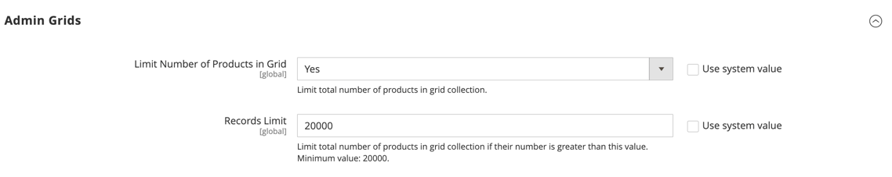

# Erweitert > Admin

{{config}}

## [!UICONTROL Admin User Emails]

<!-- zoom -->

Weitere Informationen zum Ändern dieser Einstellungen finden Sie unter [Kennwort vergessen und E-Mail zurücksetzen](../../systems/permissions-users-all.md#forgotten-password-and-reset-emails).

| Feld | [Umfang](../../getting-started/websites-stores-views.md#scope-settings) | Beschreibung |
|---------------------------------------------|------------------------------------------------------------------------|----------------------------------------------------------------------------------------------------------------------------------------------------------------------------------------------------------------|
| [!UICONTROL Forgot Password Email Template] | Global | Identifiziert die E-Mail-Vorlage, die für die Nachricht verwendet wird, die gesendet wird, wenn ein Administrator sein Kennwort vergisst. Standardvorlage: `Forgot Admin Password` |
| [!UICONTROL Forgot and Reset Email Sender] | Global | Identifiziert den Store-Kontakt, der als Absender der E-Mail _Kennwort vergessen_ angezeigt wird. Standardabsender: `General Contact` Andere Absenderoptionen: `Sales Representative`, `Customer Support`, `Custom Email` |
| [!UICONTROL User Notification Template] | Global | Bestimmt die E-Mail-Vorlage, die als Standard für Admin-Benachrichtigungen verwendet wird. Standardvorlage: `User Notification` |

{style="table-layout:auto"}

## [!UICONTROL Startup Page]

<!-- zoom -->

Weitere Informationen zum Ändern dieser Einstellungen finden Sie unter [Ändern der Startseite](../../getting-started/admin-dashboard.md#change-the-startup-page) im _Erste Schritte_.

| Feld | [Umfang](../../getting-started/websites-stores-views.md#scope-settings) | Beschreibung |
|---------------------------|------------------------------------------------------------------------|------------------------------------------------------------------|
| [!UICONTROL Startup Page] | Global | Bestimmt die Admin-Landingpage, die nach der Anmeldung angezeigt wird. |

{style="table-layout:auto"}

### [!UICONTROL Startup Page]

| Bereich |                                                                                                                                                                                                                                                                                                                                                                           | Option |
|---------------------------------------------------------|---------------------------------------------------------------------------------------------------------------------------------------------------------------------------------------------------------------------------------------------------------------------------------------------------------------------------------------------------------------------------|---------------------------------------------------------------------------------------------------------------------------------------------------------------------------------------------------------------------------------------------------------------------------------------------------------------------------------------------------------------------------------------------------------------------------------------------------------------------------------------------------------------------------------------------------------------------------------------------|
| [`Dashboard`](../../getting-started/admin-dashboard.md) |                                                                                                                                                                                                                                                                                                                                                                           |                                                                                                                                                                                                                                                                                                                                                                                                                                                                                                                                                                                             |
| `Sales` | `Operations` | [`Quotes`](../../b2b/quotes.md)   [`Orders`](../../stores-purchase/orders.md) [`Invoices`](../../stores-purchase/invoices.md) [`Shipments`](../../stores-purchase/shipments.md) [`Credit Memos`](../../stores-purchase/credit-memos.md) [`Billing Agreements`](../../stores-purchase/paypal-billing-agreements.md) [`Returns`](../../stores-purchase/returns.md)   [`Transactions`](../../stores-purchase/transactions.md) `Braintree Virtual Terminal` |
| `Catalog` | [`Inventory`](../../inventory-management/introduction.md) | [`Products`](../../catalog/products-list.md) [`Categories`](../../catalog/categories.md) [`Shared Catalog`](../../b2b/catalog-shared-create.md)  |
| `Customers` | [`All Customers`](../../customers/customers-all.md) [`Now Online`](../../customers/now-online.md) [`Customer Groups`](../../customers/customer-groups.md) [`Segments`](../../customers/customer-segments.md)   [`Companies`](../../b2b/account-companies.md) |                                                                                                                                                                                                                                                                                                                                                                                                                                                                                                                                                                                             |
| `Marketing` | `Promotions` | [`Catalog Price Rule`](../../merchandising-promotions/price-rules-catalog.md)  [`Cart Price Rules`](../../merchandising-promotions/price-rules-cart.md))  [`Related Products Rules`](../../merchandising-promotions/product-related-rules.md)   [`Gift Card Accounts`](../../stores-purchase/product-gift-card-accounts.md)  |
|                                                         | [`Private Sales`](../../merchandising-promotions/events-private-sales.md)  | [`Events`](../../merchandising-promotions/event-configure.md)  [`Invitations`](../../merchandising-promotions/invitations.md) |
|                                                         | `Communications` | [`Email Templates`](../../systems/email-templates.md)  [`Newsletter Template`](../../merchandising-promotions/newsletter-template.md)  [`Newsletter Queue`](../../merchandising-promotions/newsletter-queue.md)  [`Newsletter Subscribers`](../../merchandising-promotions/newsletter-subscribers.md)  [`Email Reminders`](../../merchandising-promotions/email-reminder-rules.md)  |
|                                                         | `SEO & Search` | [`Search Terms`](../../catalog/search-terms.md)  [`Search Synonyms`](../../catalog/search-terms.md#search-synonyms)  [`URL Rewrites`](../../merchandising-promotions/url-rewrite.md)  [`Site Map`](../../merchandising-promotions/sitemap-xml.md) |
|                                                         | [`User Content`](../../catalog/settings-advanced-product-reviews.md) | [`All Reviews`](../../catalog/settings-advanced-product-reviews.md)  [`Pending Reviews`](../../merchandising-promotions/product-reviews-moderate.md)   |
| `Content` | `Elements` | [`Pages`](../../content-design/pages.md) [`Hierarchy`](../../content-design/page-hierarchy.md)  [`Blocks`](../../content-design/blocks.md) [`Dynamic Blocks`](../../content-design/dynamic-blocks.md)  [`Widgets`](../../content-design/widgets.md) [`Media Gallery`](../../content-design/media-storage.md) |
|                                                         | `Design` | [`Configuration`](../../content-design/configuration.md) [`Themes`](../../content-design/themes.md) [`Schedule`](../../content-design/schedule.md) |
|                                                         | `Content Staging`   | [Dashboard](../../content-design/content-staging.md) |
| `Reports` | [`Marketing`](../../getting-started/marketing-reports.md) | `Products in Cart` `Search Terms` `Abandoned Carts` `Newsletter Problem Reports` |
|                                                         | [`Reviews`](../../getting-started/review-reports.md) | `By Customer`  `By Products`  |
|                                                         | [`Sales`](../../getting-started/sales-reports.md) | `Orders` `Tax` `Invoiced` `Shipping` `Refunds` `Coupons` `PayPal Settlement` `Braintree Settlement` |
|                                                         | `System Insights` | [`Site-Wide Analysis Tool`](https://experienceleague.adobe.com/docs/commerce-operations/tools/site-wide-analysis-tool/access.html)  |
|                                                         | [`Customers`](../../getting-started/customer-reports.md) | `Order Total` `Order Count` `New` `Wish Lists` `Segments`  |
|                                                         | [`Products`](../../getting-started/product-reports.md) | `Views` `Bestsellers` `Low Stock` `Ordered` `Downloads` |
|                                                         | [`Private Sales`](../../getting-started/private-sales-reports.md)  | `Invitations` `Invited Customers` `Conversions` |
|                                                         | `Statistics` | [`Refresh Statistics`](../../getting-started/sales-reports.md#refresh-statistics) |
|                                                         | [`Business Intelligence`](../../getting-started/business-intelligence.md) | `Advanced Reporting` `BI Essentials`  |
|                                                         | `Customer Engagement` | `Dashboard` `Importer Status` `Automation Enrollment` `Campaign Sends` `SMS Sends` `Cron Tasks` `Log Viewer` `Abandoned Carts` |
| `Stores` | `Settings` | [`All Stores`](../../stores-purchase/stores.md) [`Configuration`](../../configuration-reference/guide-overview.md) [`Terms and Conditions`](../../stores-purchase/terms-and-conditions.md) [`Order Status`](../../stores-purchase/order-status.md) |
|                                                         | [`Inventory`](../../inventory-management/introduction.md) | [`Sources`](../../inventory-management/sources-stocks.md#sources) [`Stocks`](../../inventory-management/sources-stocks.md#stocks) |
|                                                         | [`Taxes`](../../stores-purchase/taxes.md) | [`Tax Rules`](../../stores-purchase/tax-rules.md) [`Tax Zones and Rates`](../../stores-purchase/tax-zones-rates.md) |
|                                                         | [`Currency`](../../stores-purchase/currency.md) | [`Currency Rates`](../../stores-purchase/currency-configuration.md) [`Currency Symbols`](../../stores-purchase/currency-configuration.md#step-5-customize-currency-symbols-optional) |
|                                                         | `Attributes` | [`Customer`](../../systems/data-attributes-customer.md) [`Customer Address`](../../systems/data-attributes-customer.md#customer-addresses) [`Product`](../../systems/data-attributes-product.md) [`Attribute Set`](../../catalog/attribute-sets.md) [`Returns`](../../stores-purchase/attributes-returns.md) [`Ratings`](../../merchandising-promotions/product-reviews.md#create-custom-ratings) |
|                                                         | `Other Settings` | [`Reward Exchange Rates`](../../merchandising-promotions/reward-exchange-rates.md) [`Gift Wrapping`](../../stores-purchase/cart-configuration.md#gift-wrap) [`Gift Registry`](../../merchandising-promotions/gift-registry-create.md) |
| `System` | [`Data Transfer`](../../systems/data-transfer.md) | [`Import`](../../systems/data-import.md) [`Export`](../../systems/data-export.md) [`Import/Export Tax Rates`](../../systems/data-transfer-tax-rates.md) [`Import History`](../../systems/data-import.md#import-history) [`Scheduled Import/Export`](../../systems/data-scheduled-import-export.md) |
|                                                         | `Extensions` | [`Integrations`](../../systems/integrations.md) |
|                                                         | `Tools` | [`Cache Management`](../../systems/cache-management.md) [`Index Management`](../../systems/index-management.md) |
|                                                         | `Support` | [`System Report`](../../systems/support.md#system-reports) |
|                                                         | `Permissions` | [`All Users`](../../systems/permissions-users-all.md) [`Locked Users`](../../systems/permissions-users-all.md#locked-users) [`User Roles`](../../systems/permissions-user-roles.md) |
|                                                         | `Action Log`  | [`Report`](../../systems/action-log.md) [`Archive`](../../systems/action-log-archive.md) [`Bulk Actions`](../../systems/action-log-bulk-actions.md) |
|                                                         | `Other Settings` | [`Notifications`](../../systems/notifications.md) [`Custom Variables`](../../systems/variables-custom.md) [`Manage Encryption Key`](../../systems/encryption-key.md) |
| `Find Partners & Extensions` |                                                                                                                                                                                                                                                                                                                                                                           |                                                                                                                                                                                                                                                                                                                                                                                                                                                                                                                                                                                             |

{style="table-layout:auto"}

<!-- Feature still in development 
## [!UICONTROL Unified Experience]

The [!UICONTROL Unified Experience] option is available in Adobe Commerce deployments that have the Commerce Admin Unified Experience extension loaded. This extension enables integration with Experience Cloud to streamline cross-application workflows between Commerce and other Experience Cloud solutions. See [Adobe Experience Cloud Integration for Commerce Admin](../../getting-started/admin-unified-experience-integration-overview.md).

| Field        | [Scope](../../getting-started/websites-stores-views.md#scope-settings) | Description                                                                                                                                                                                                                                                                                                                                                                    |
|--------------|------------------------------------------------------------------------|--------------------------------------------------------------------------------------------------------------------------------------------------------------------------------------------------------------------------------------------------------------------------------------------------------------------------------------------------------------------------------|
| Enable       | Global                                                                 | Determines if the Commerce instance uses the Experience Cloud integration. Before enabling this feature, review the [requirements and configuration instructions](../../getting-started/admin-unified-experience-integration-overview.md). Options: Yes/No.                                                                                                                    |
| Project Name | Global                                                                 | Identifies the instance in the Experience Cloud Commerce Projects workspace when the Unified Experience is enabled. The name can contain only alphanumeric characters and spaces. Defaults to the [cloud environment name](https://experienceleague.adobe.com/docs/commerce-cloud-service/user-guide/architecture/pro-architecture.html?lang=en#pro-environment-architecture). |

{style="table-layout:auto"}

-->

## [!UICONTROL Admin Base URL]

<!-- zoom -->

Weitere Informationen zum Festlegen dieser Optionen finden Sie unter [Konfigurieren der Basis](../../stores-purchase/store-urls.md#configure-the-base-url)URL im _Handbuch für Stores und Kauferlebnisse_.

| Feld | [Umfang](../../getting-started/websites-stores-views.md#scope-settings) | Beschreibung |
|------------------------------------|------------------------------------------------------------------------|-----------------------------------------------------------------------------------------------------------------------------------------------------------------------------------------------------------------------------------|
| [!UICONTROL Use Custom Admin URL] | Global | Bestimmt, ob eine benutzerdefinierte URL für den Zugriff auf den Admin verwendet wird. Optionen: `Yes` / `No` |
| [!UICONTROL Custom Admin URL] | Global | Gibt eine benutzerdefinierte URL für den Zugriff auf den Admin an. Standardmäßig entspricht die Admin-URL der Basis-URL. **Wichtig:** Die Admin-URL muss sich in derselben Commerce-Installation befinden und denselben Dokumentstamm wie die Storefront haben. |
| [!UICONTROL Use Custom Admin Path] | Global | Bestimmt, ob ein benutzerdefinierter Pfad verwendet wird, um auf den Administrator zuzugreifen. Der Standardpfad lautet `admin`. Optionen: `Yes` / `No` |
| [!UICONTROL Custom Admin Path] | Global | Ändert den Namen des standardmäßigen Administratorpfads in etwas, das schwer zu erraten ist. Geben Sie den benutzerdefinierten Pfadnamen in Kleinbuchstaben ein. Beispiel: `aardvark` |

{style="table-layout:auto"}

## [!UICONTROL Security]

<!-- zoom -->

Weitere Informationen zum Festlegen dieser Optionen finden Sie unter [Konfigurieren der Admin](../../systems/security-admin.md) im _Handbuch für Admin-Systeme_.

| Feld | [Umfang](../../getting-started/websites-stores-views.md#scope-settings) | Beschreibung |
|--------------------------------------------------------|------------------------------------------------------------------------|--------------------------------------------------------------------------------------------------------------------------------------------------------------------------------------------------------------------------------------------------------------------------------------------------------------------------------------------------------------------------------------------------------------------------------------------------------------------------------------------------------------------------------------------------------------------------------------------------------|
| [!UICONTROL Admin Account Sharing] | Shop-Ansicht | Bestimmt, ob ein Administrator-Benutzer von verschiedenen Geräten gleichzeitig beim selben Konto angemeldet werden kann. Optionen:  **`Yes`**- Ermöglicht mehrere aktive Sitzungen vom selben Administratorkonto aus. **`No`** - Erlaubt nur eine aktive Sitzung pro Admin-Konto. |
| [!UICONTROL Password Reset Protection Type] | Shop-Ansicht | Bestimmt die Methode, die zum Verwalten von Anfragen zum Zurücksetzen von Passwörtern verwendet wird. Optionen:  **`By IP and Email`**- Das Kennwort kann online zurückgesetzt werden, nachdem eine Antwort von der Benachrichtigung an die mit dem Admin-Konto verknüpfte E-Mail-Adresse gesendet wurde. **`By IP`** - Das Passwort kann online ohne zusätzliche Bestätigung zurückgesetzt werden.  **`By Email`**- Das Kennwort kann nur zurückgesetzt werden, indem per E-Mail auf die Benachrichtigung geantwortet wird, die an die mit dem Admin-Konto verknüpfte E-Mail-Adresse gesendet wird. **`None`** - Das Kennwort kann nur vom Store-Administrator zurückgesetzt werden. |
| [!UICONTROL Recovery Link Expiration Period (hours)] | Global | Bestimmt, wie viele Stunden ein Link zur Passwortwiederherstellung gültig bleibt. |
| [!UICONTROL Max Number of Password Reset Requests] | Shop-Ansicht | Bestimmt die maximale Anzahl von Passwortanfragen, die pro Stunde gesendet werden können. |
| [!UICONTROL Min Time Between Password Reset Requests] | Shop-Ansicht | Bestimmt die Mindestanzahl von Minuten zwischen den Anforderungen zum Zurücksetzen des Kennworts. |
| [!UICONTROL Add Secret Key to URLs] | Global | Wenn diese Option aktiviert ist, wird zur Vorbeugung gegen Exploits ein geheimer Schlüssel an die Admin-URL angehängt. Optionen: `Yes` / `No` |
| [!UICONTROL Login Is Case Sensitive] | Global | Bestimmt, ob die von einem Benutzer eingegebenen Anmeldedaten mit den gespeicherten übereinstimmen müssen. Optionen: `Yes` / `No` |
| [!UICONTROL Admin Session Lifetime (seconds)] | Global | Bestimmt die Länge einer Admin-Sitzung in Sekunden. |
| [!UICONTROL Maximum Login Failures to Lockout Account] | Global | Bestimmt, wie oft sich Admin-Benutzer anmelden können, bevor ihre Konten gesperrt werden. Wenn das Feld leer ist, wird kein Minimum festgelegt. Standardwert: `6` |
| [!UICONTROL Lockout Time (minutes)] | Global | Bestimmt die Anzahl der Minuten, die ein Admin-Konto gesperrt ist, bevor der Benutzer erneut versuchen kann, sich anzumelden. Standardwert: `30` |
| [!UICONTROL Password Lifetime (days)] | Global | Bestimmt die Anzahl der Tage bis zum Ablauf eines Administratorkennworts. Wenn das Feld leer ist, wird keine Lebensdauer festgelegt. Standardwert: `90` |
| [!UICONTROL Password Change] | Global | Legt fest, ob Admin-Benutzer ihre Kennwörter ändern müssen. Optionen:  **`Forced`**- Erfordert, dass Admin-Benutzer ihr Passwort ändern, nachdem das Konto eingerichtet wurde. **`Recommended`** - empfiehlt, dass Admin-Benutzer ihr Passwort ändern, nachdem das Konto eingerichtet wurde. |

{style="table-layout:auto"}

## [!UICONTROL Dashboard]

<!-- zoom -->

Weitere Informationen zum Festlegen dieser Optionen finden Sie unter [Admin-](../../getting-started/admin-dashboard.md)) im _Erste Schritte_.

| Feld | [Umfang](../../getting-started/websites-stores-views.md#scope-settings) | Beschreibung |
|----------------------------|------------------------------------------------------------------------|-------------------------------------------------------------------------------------------------------|
| [!UICONTROL Enable Charts] | Global | Bestimmt, ob das Dashboard ein Diagramm enthält, das aus aktuellen Verkaufsdaten generiert wurde. Optionen: `Yes` / `No` |

{style="table-layout:auto"}

## [!UICONTROL Admin Grids]

<!-- zoom -->

Weitere Informationen zum Festlegen dieser Optionen finden Sie unter [Begrenzen der ](../../catalog/products-list.md#limit-product-display)) im _Handbuch zur Katalogverwaltung_.

>[!NOTE]
>
>Um die Leistung großer Kataloge zu verbessern, wird empfohlen, die Anzahl der im Raster angezeigten Produkte zu begrenzen.

| Feld | [Umfang](../../getting-started/websites-stores-views.md#scope-settings) | Beschreibung |
|-----------------------------------------------|------------------------------------------------------------------------|-------------------------------------------------------------------------------------------------------------------------------------|
| [!UICONTROL Limit Number of Products in Grid] | Global | Bestimmt, ob die Anzahl der im Raster angezeigten Produkte auf den _[!UICONTROL Records Limit]_Wert beschränkt ist. Optionen: `Yes` / `No` |
| [!UICONTROL Records Limit] | Global | Legt die maximale Anzahl von Produkten im Produktraster fest. Der standardmäßige Mindestwert ist `20000`. |

## [!UICONTROL CAPTCHA]

<!-- zoom -->

Weitere Informationen zum Festlegen dieser Optionen finden Sie unter [CAPTCHA](../../systems/security-captcha.md) im _Admin-_.

| Feld | [Umfang](../../getting-started/websites-stores-views.md#scope-settings) | Beschreibung |
|-------------------------------------------------------|------------------------------------------------------------------------|-------------------------------------------------------------------------------------------------------------------------------------------------------------------------------------------------------------------------------------------------------------------------------------------------------------------------------------------------------------------------------------------------------------------------------------------------------------------------------------------------------------------------------------------------------------------------------------------------------------------------------------------------------------------------------------------------------------------------------------------------------------------------------------------------|
| [!UICONTROL Enable CAPTCHA in Admin] | Global | Aktiviert CAPTCHA für die Administratoranmeldung. Optionen: `Yes` / `No` |
| [!UICONTROL Font] | Global | Bestimmt die Schriftart, die für die Anzeige von CAPTCHA verwendet wird. Um Ihre eigene Schriftart hinzuzufügen, legen Sie die Schriftartdatei im selben Verzeichnis wie die Commerce-Instanz ab und fügen Sie die Deklaration zur Datei config.xml unter `app/code/Magento/Captcha/etc` Standardschriftart hinzu:` LinLibertine` |
| [!UICONTROL Forms] | Global | Bestimmt die Formulare, in denen CAPTCHA verwendet wird. Optionen: `Admin Login` / `Admin Forgot Password` |
| [!UICONTROL Displaying Mode] | Global | Bestimmt, wann das CAPTCHA angezeigt wird. Optionen:  **`Always`**- CAPTCHA ist immer für die Anmeldung erforderlich. **`After number of attempts to login`** - Zeigt das [!UICONTROL Number of Unsuccessful Attempts to Login] an. Geben Sie die Anzahl der zulässigen Anmeldeversuche ein. Der Wert 0 (Null) entspricht der Einstellung des Anzeigemodus auf „Immer“. Diese Option gilt nicht für die Formulare „Kennwort vergessen“ und „Benutzer erstellen“. Wenn CAPTCHA aktiviert und so eingestellt ist, dass es angezeigt wird, ist es immer im Formular enthalten. **Hinweis**: Um die Anzahl erfolgloser Anmeldeversuche zu verfolgen, wird jeder Anmeldeversuch unter einer E-Mail-Adresse und von einer IP-Adresse gezählt. Die maximale Anzahl von Anmeldeversuchen, die von derselben IP-Adresse aus zulässig sind, beträgt 1.000. Diese Einschränkung gilt nur, wenn CAPTCHA aktiviert ist. |
| [!UICONTROL Number of Unsuccessful Attempts to Login] | Global | Bestimmt, wie oft eine Person versuchen kann, sich anzumelden, bevor das Konto gesperrt wird. Um die Anzahl erfolgloser Anmeldeversuche zu verfolgen, verfolgt das System die Versuche von einer einzelnen E-Mail-Adresse aus einer einzelnen IP-Adresse. Die maximal zulässige Anzahl von Versuchen von derselben IP-Adresse ist 1.000. Diese Einschränkung gilt nur, wenn CAPTCHA aktiviert ist. |
| [!UICONTROL CAPTCHA Timeout (minutes)] | Global | Bestimmt die Lebensdauer des aktuellen CAPTCHA. Wenn das CAPTCHA abläuft, muss der Benutzer die Seite neu laden. |
| [!UICONTROL Number of Symbols] | Global | Bestimmt die Anzahl der im CAPTCHA verwendeten Symbole. Der maximal zulässige Wert ist `8`. Sie können auch einen Bereich angeben, z. B. `5-8`. |
| [!UICONTROL Symbols Used in CAPTCHA] | Global | Bestimmt, welche Symbole im CAPTCHA verwendet werden. Nur Buchstaben (a-z und A-Z) und Zahlen (0-9) sind zulässig. Der Standardsatz von Symbolen, die im Feld vorgeschlagen werden, schließt ähnlich aussehende Symbole wie i, l oder 1 aus. Die Anzeige dieser Symbole in CAPTCHA verringert die Wahrscheinlichkeit, dass ein Benutzer CAPTCHA korrekt erkennt. |
| [!UICONTROL Case Sensitive] | Global | Bestimmt, ob bei den im CAPTCHA verwendeten Zeichen zwischen Groß- und Kleinschreibung unterschieden wird. Optionen: `Yes` / `No` |

{style="table-layout:auto"}

## [!UICONTROL Admin Actions Logging]

{{ee-feature}}

<!-- zoom -->

Weitere Informationen zum Festlegen dieser Optionen finden Sie unter [Aktionsprotokollarchiv](../../systems/action-log-archive.md) im _Admin-_.

| Feld | [Umfang](../../getting-started/websites-stores-views.md#scope-settings) | Beschreibung |
|-----------------------------|------------------------------------------------------------------------|-----------------------------------------------------------------------------------------------------------------------------------------------------------------------------------------------------------------------------------------------------------------------------------------------------------------------------------------------------------------------------------------------------------------------------------------------------------------------------------------------------------------------------------------------------------------------------------------------------------------------------------------------------------------------------------------------------------------------------------------------------------------------------------------------------------------------------------------------------------------------------------------------------------------------------------------------------------------------------------------------------------------------------------------------------------------------------------------------------------------------------------------------------------------------------------------------------------------------------------------------------------------------------------------------------------------------------------------------------------------------------------------------------------------------------------------------------------------------------------------------------------------------------------------------------------------------------------------------------------------------------------------------------------------------------------------------------------------------------------------------------------------------------------------------|
| [!UICONTROL Enable Actions] | Global | Aktiviert die Aktionsprotokollierung für jede der ausgewählten Aktionen:  `Admin My Account`  `Admin Permission Roles`  `Admin Permission Users`  `Admin Sign In`  `CMS Hierarchy`  `Cache Management`  `Catalog Ratings`  `CMS Blocks`  `CMS Pages`  `Cart Price Rules`  `Catalog Attributes`  `Catalog Categories`  `Catalog Events`  `Catalog Price Rules`  `Catalog Product Tax Classes`  `Catalog Product Templates`  `Catalog Products`  `Catalog Reviews`  `Catalog Search`  `Checkout Terms and Conditions`  `Companies`  `Company Credit`  `Custom Variables`  `Customer Groups`  `Customer Invitations`  `Customer Tax Classes`  `Customers`  `Design Configuration`  `Gift Card Accounts`  `Gift Registry Entity`  `Gift Registry Type`  `Index Management`  `Login as a Customer`  `Manage Currency Rates`  `Manage Customer Address Attributes`  `Manage Customer Attributes`  `Manage Design`  `Manage Dynamic Blocks`  `Manage Segments`  `Manage Store Views`  `Manage Stores`  `Manage Websites`  `Negotiable Quotes`  `Newsletter Queue`  `Newsletter Subscribers`  `Newsletter Templates`  `PayPal Settlement Reports`  `Reports`   `Reward Points Rates`  `Rule-Based Product Relations`  `Sales Archive`  `Sales Credit Memos`  `Sales Invoices`  `Sales Order Status`  `Sales Orders`  `Sales Shipments`  `Shared Catalog`  `Shopping Cart Management`  `Store Credit`  `System Backups`  `System Configuration`  `Tax Rates`  `Tax Rules`  `Transactional Emails`  `URL Rewrites`  `Widget`  `XML Sitemap` |

{style="table-layout:auto"}

## [!UICONTROL Admin Usage]

<!-- zoom -->

Weitere Informationen zum Festlegen dieser Optionen finden Sie unter [Nutzungsdatenerfassung](../../getting-started/admin.md#usage-data-collection) im _Erste Schritte_.

| Feld | Umfang | Beschreibung |
|------------------------------------------|--------|--------------------------------------------------------------------------------------------------------------------------------------------------------------------------------------------------------------------------------------------------------------------------------------------------------------------------------------------------------------------------------------------------------------------------------------------------------------------------------------------------------------------------------------------------------------------------------------------------------------|
| [!UICONTROL Enable Admin Usage Tracking] | Global | Erteilt Adobe die Berechtigung, Admin-Nutzungsdaten zu erfassen, um das Erlebnis bei der Verwendung von _Admin_ und zugehörigen Produkten und Services zu verbessern. Durch die Datenerfassung wird auch _Produktinterne Anleitung_ ermöglicht, die interaktive Inhalte wie Hilfe, QuickInfos, Anleitungen zu schrittweisen Anleitungen, Onboarding-Informationen, Funktionsankündigungen und mehr für den _Administrator_ bereitstellt. Einzelne Admins werden in den Nutzungsdaten nicht angegeben. Optionen:  **`Yes`**- Ermöglicht die Datenerfassung und aktiviert _Produktinterne Anleitung_. **`No`** - Ermöglicht keine Datenerfassung und aktiviert _Produktinterne Anleitung_. |

{style="table-layout:auto"}
