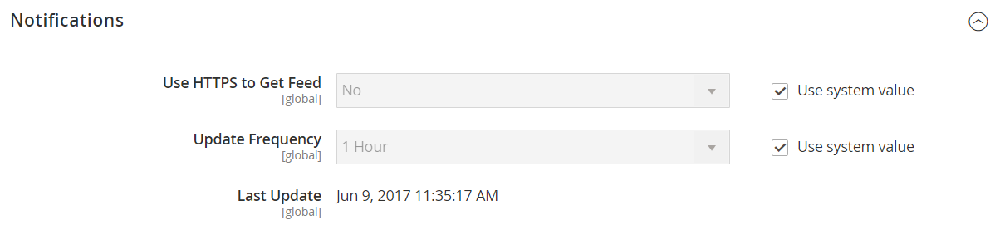

# [!UICONTROL Advanced] > [!UICONTROL System]

{{config}}

## [!UICONTROL Cron (Scheduled Tasks)]

<!-- zoom -->

Weitere Informationen zum Ändern dieser Konfigurationseinstellungen finden Sie unter [Cron (geplante Aufgaben)](../../systems/cron.md).

### [!UICONTROL index]

<!-- zoom -->

| Feld | [Anwendungsbereich](../../getting-started/websites-stores-views.md#scope-settings) | Beschreibung |
|--- |--- |--- |
| [!UICONTROL Generate Schedules Every] | Global | Bestimmt die Häufigkeit in Minuten, mit der Zeitpläne generiert werden. |
| [!UICONTROL Schedule Ahead for] | Global | Bestimmt die Anzahl der Minuten vor der Erstellung von Zeitplänen. |
| [!UICONTROL Missed if Not Run Within] | Global | Bestimmt die Anzahl der Minuten, bevor ein noch nicht ausgeführter Cron-Auftrag als verpasst markiert wird. |
| [!UICONTROL History Cleanup Every] | Global | Bestimmt die Anzahl der Minuten, die vergehen, bevor der Cron-Verlauf bereinigt wird. |
| [!UICONTROL Success History Lifetime] | Global | Bestimmt die Anzahl der Minuten, in denen der Datensatz mit erfolgreich abgeschlossenen Cron-Aufträgen in der Datenbank beibehalten wird. |
| [!UICONTROL Failure History Lifetime] | Global | Bestimmt die Anzahl der Minuten, in denen der Datensatz mit fehlgeschlagenen Cron-Aufträgen in der Datenbank gespeichert wird. |
| [!UICONTROL Use Separate Process] | Global | Bestimmt, ob Cron-Aufträge parallel als separate Prozesse ausgeführt werden. Optionen: `Yes` / `No` |

{style="table-layout:auto"}

### [!UICONTROL default]

<!-- zoom -->

| Feld | [Anwendungsbereich](../../getting-started/websites-stores-views.md#scope-settings) | Beschreibung |
|--- |--- |--- |
| [!UICONTROL Generate Schedules Every] | Global | Bestimmt die Häufigkeit in Minuten, mit der Zeitpläne generiert werden. |
| [!UICONTROL Schedule Ahead for] | Global | Bestimmt die Anzahl der Minuten vor der Erstellung von Zeitplänen. |
| [!UICONTROL Missed if Not Run Within] | Global | Bestimmt die Anzahl der Minuten, bevor ein noch nicht ausgeführter Cron-Auftrag als verpasst markiert wird. |
| [!UICONTROL History Cleanup Every] | Global | Bestimmt die Anzahl der Minuten, die vergehen, bevor der Cron-Verlauf bereinigt wird. |
| [!UICONTROL Success History Lifetime] | Global | Bestimmt die Anzahl der Minuten, in denen der Datensatz mit erfolgreich abgeschlossenen Cron-Aufträgen in der Datenbank beibehalten wird. |
| [!UICONTROL Failure History Lifetime] | Global | Bestimmt die Anzahl der Minuten, in denen der Datensatz mit fehlgeschlagenen Cron-Aufträgen in der Datenbank gespeichert wird. |
| [!UICONTROL Use Separate Process] | Global | Bestimmt, ob Cron-Aufträge parallel als separate Prozesse ausgeführt werden. Optionen: `Yes` / `No` |

{style="table-layout:auto"}

## [!UICONTROL MySQL Message Queue Cleanup]

{{ee-feature}}

<!-- zoom -->

| Feld | [Anwendungsbereich](../../getting-started/websites-stores-views.md#scope-settings) | Beschreibung |
|--- |--- |--- |
| [!UICONTROL Successful Messages Lifetime] | Global | Bestimmt die Lebensdauer erfolgreicher Nachrichten in Minuten. Geben Sie null ein, um die Bereinigung zu überspringen. Standard: `10080` 7 Tage |
| [!UICONTROL New Messages Lifetime] | Global | Bestimmt die Lebensdauer neuer Nachrichten in Minuten. Geben Sie null ein, um die Bereinigung zu überspringen. Standard: `10080` 7 Tage |
| [!UICONTROL Failed Messages Lifetime] | Global | Bestimmt die Lebensdauer von fehlgeschlagenen Nachrichten in Minuten. Geben Sie null ein, um die Bereinigung zu überspringen. Standard: `10080` 7 Tage |
| [!UICONTROL Retry Messages in Progress After] | Global | Bestimmt, wie lange das System auf eine laufende Nachricht wartet, bevor es es erneut versucht. Standard: `1440` 24 Stunden |

{style="table-layout:auto"}

## [!UICONTROL Mail Sending Settings]

<!-- zoom -->

Weitere Informationen zum Ändern dieser Einstellungen finden Sie unter [E-Mail-Kommunikation konfigurieren](../../systems/email-communications.md) im _Administratorsystemanleitung_.

>[!IMPORTANT]
>
>**Sicherheitshinweis** Es wird empfohlen, dass alle Händler ihre E-Mail-Versandkonfiguration sofort festlegen, um sich vor einer kürzlich identifizierten potenziellen Remote-Code-Ausführungsauswertung zu schützen. Bis dieses Problem behoben ist, wird dringend empfohlen, [!DNL Sendmail] für E-Mail-Kommunikation. Im [!UICONTROL Mail Sending Settings], stellen Sie sicher, dass [!UICONTROL Set Return Path] auf `No`.

| Feld | [Anwendungsbereich](../../getting-started/websites-stores-views.md#scope-settings) | Beschreibung |
|--- |--- |--- |
| [!UICONTROL Disable Email Communications] | Store-Ansicht | Bestimmt, ob E-Mail-Kommunikation für den Store aktiviert ist. Optionen: `Yes` / `No` |
| [!UICONTROL Transport] | Store-Ansicht | Bestimmt den Transporttyp für E-Mail-Nachrichten aus dem Store. Optionen: `Sendmail` / `SMTP` |
| [!UICONTROL Host] | Store-Ansicht | (Nur für SMTP- und Windows-Server) Bestimmt den Namen, der für den Verweis auf den Host verwendet wird. Standardwert: `localhost` |
| [!UICONTROL Port (25)] | Store-Ansicht | (Nur für SMTP- und Windows-Server) Identifiziert den für die E-Mail-Kommunikation verwendeten Anschluss. Standardwert: `25` |
| [!UICONTROL Set Return-Path] | Store-Ansicht | Bestimmt, ob eine Routing-Adresse für zurückgegebene E-Mails verwendet wird. Optionen: `No` / `Yes` / `Specified` |

{style="table-layout:auto"}

### SMTP-Optionen

Wenn Sie SMTP im Transporttyp auswählen, stehen zusätzliche Optionen zur Konfiguration der SMTP-Serververbindung zur Verfügung.

<!-- zoom -->

| Feld | [Anwendungsbereich](../../getting-started/websites-stores-views.md#scope-settings) | Beschreibung |
|--- |--- |--- |
| [!UICONTROL Username] | Store-Ansicht | Anmeldename des SMTP-Servers |
| [!UICONTROL Password] | Store-Ansicht | Kennwort für die SMTP-Serveranmeldung. |
| [!UICONTROL Auth] | Store-Ansicht | Bestimmt den Authentifizierungstyp für die SMTP-Serververbindung. Optionen: `NONE` / `PLAIN` / `LOGIN` |
| [!UICONTROL SSL] | Store-Ansicht | Bestimmt den Überprüfungstyp für das Host-Sicherheitszertifikat. Optionen: `SSL` / `TLS` |

{style="table-layout:auto"}

## [!UICONTROL Currency]

<!-- zoom -->

Weitere Informationen zum Ändern dieser Einstellung finden Sie unter [Währungskonfiguration](../../stores-purchase/currency-configuration.md) im _Handbuch für Stores und Einkaufserlebnisse_.

| Feld | [Anwendungsbereich](../../getting-started/websites-stores-views.md#scope-settings) | Beschreibung |
|--- |--- |--- |
| [!UICONTROL Installed Currencies] | Global | Gibt die Währungen an, die derzeit für die Commerce-Installation verfügbar sind. Zu den Optionen gehören alle verfügbaren Währungen, wobei installierte Währungen ausgewählt sind. |

{style="table-layout:auto"}

## [!UICONTROL Security]

<!-- zoom -->

Weitere Informationen zum Ändern dieser Einstellungen finden Sie unter [Sitzungsverwaltung](../../systems/security-session-management.md) im _Administratorsystemanleitung_.

| Feld | [Anwendungsbereich](../../getting-started/websites-stores-views.md#scope-settings) | Beschreibung |
|--- |--- |--- |
| [!UICONTROL Max Session Size in Admin] | Global | Begrenzen Sie die maximale Sitzungsgröße in Byte. Verwendung `0` , um zu deaktivieren. |
| [!UICONTROL Max Session Size in Storefront] | Global | Begrenzen Sie die maximale Sitzungsgröße in Byte. Verwendung `0` , um zu deaktivieren. |

{style="table-layout:auto"}

## [!UICONTROL Notifications]

<!-- zoom -->

Weitere Informationen zum Ändern dieser Einstellungen finden Sie unter [Systembenachrichtigungen](../../systems/notifications.md) im _Administratorsystemanleitung_.

| Feld | [Anwendungsbereich](../../getting-started/websites-stores-views.md#scope-settings) | Beschreibung |
|--- |--- |--- |
| [!UICONTROL Use HTTPS to Get Feed] | Global | Bestimmt, ob Admin-Benachrichtigungen über einen sicheren Kanal bereitgestellt werden. Optionen: `Yes` / `No` |
| Aktualisierungshäufigkeit | Global | Bestimmt die Häufigkeit von Aktualisierungen der Admin-Nachricht. Optionen: `1 Hour` / `2 Hours` / `6 Hours` / `12 Hours` / `24 Hours` |
| [!UICONTROL Last Update] | Global | Gibt Datum und Uhrzeit der letzten Aktualisierung der Nachricht an. |

{style="table-layout:auto"}

## [!UICONTROL Scheduled Backup Settings]

<!-- zoom -->

Weitere Informationen zum Ändern dieser Einstellungen finden Sie unter [Systemsicherungen](../../systems/backups.md) im _Administratorsystemanleitung_.

{{$include /help/_includes/backups-note.md}}

| Feld | [Anwendungsbereich](../../getting-started/websites-stores-views.md#scope-settings) | Beschreibung |
|--- |--- |--- |
| [!UICONTROL Enable Scheduled Backup] | Global | Bestimmt, ob die Commerce-Instanz automatisch nach einem regulären Zeitplan gesichert wird. Optionen: `Yes` / `No` |
| [!UICONTROL Backup Type] | Global | Bestimmt die Elemente der Commerce-Instanz, die im Backup enthalten sind. Optionen: `Database` / `Database and Media` / `System` / `System (excluding Media)` |
| [!UICONTROL Start Time] | Global | Gibt die Stunde, Minute und Sekunde an, in der die geplante Sicherung beginnt. |
| [!UICONTROL Frequency] | Global | Bestimmt, wie oft die geplante Sicherung stattfindet. Optionen: `Daily` / `Weekly` / `Monthly` |
| [!UICONTROL Maintenance Mode] | Global | Bestimmt, ob der Speicher während der geplanten Sicherung in den Wartungsmodus versetzt wird. Optionen: `Yes` / `No` |

{style="table-layout:auto"}

## [!UICONTROL Admin Actions Log Archiving]

{{ee-feature}}

<!-- zoom -->

Weitere Informationen zum Ändern dieser Einstellungen finden Sie unter [Aktionsprotokoll-Archiv](../../systems/action-log-archive.md) im _Administratorsystemanleitung_.

| Feld | [Anwendungsbereich](../../getting-started/websites-stores-views.md#scope-settings) | Beschreibung |
|--- |--- |--- |
| [!UICONTROL Log Entry Lifetime, Days] | Store-Ansicht | Bestimmt die Anzahl der Tage, in denen Admin-Aktionen im Admin-Aktionen-Archiv aufbewahrt werden. Standard: `60` |
| [!UICONTROL Log Archiving Frequency] | Store-Ansicht | Bestimmt, wie oft die Admin-Aktionsprotokolle archiviert werden. Optionen: `Daily` / `Weekly` / `Monthly` |

{style="table-layout:auto"}

## [!UICONTROL Full Page Cache]

{{beta2-patches-updates}}

<!-- zoom -->

Weitere Informationen zum Ändern dieser Einstellungen finden Sie unter [Vollseitenzwischenspeicherung](../../systems/cache-management.md#full-page-caching) im _Administratorsystemanleitung_.

<!-- zoom -->

| Feld | [Anwendungsbereich](../../getting-started/websites-stores-views.md#scope-settings) | Beschreibung |
|--- |--- |--- |
| [!UICONTROL Caching Application] | Global | Bestimmt die Anwendung, die zum Verwalten des ganzseitigen Cache verwendet wird. Optionen:  **`Built-in Application`**- Für die Produktionsumgebung nicht empfohlen. **`Varnish Caching`** - Für die Produktionsumgebung empfohlen. |
| [!UICONTROL TTL for public content] | Global | Bestimmt die Lebensdauer des Cache für öffentliche Inhalte in Sekunden. Standardwert: `120` |
| **[!UICONTROL Varnish Configuration]** |  |  |
| [!UICONTROL Access list] | Global | Gibt die IP-Adressen an, die die Varnish-Konfiguration bereinigen können, um eine Konfigurationsdatei zu generieren. Trennen Sie mehrere Einträge durch ein Komma. Standardwert: `localhost` |
| [!UICONTROL Backend host] | Global | Gibt den Backend-Host an, der Konfigurationsdateien generiert. Standardwert: `localhost` |
| [!UICONTROL Backend port] | Global | Gibt den Backend-Port an, der zum Generieren von Konfigurationsdateien verwendet wird. Standardwert: `8080` |
| [!UICONTROL Grace period] | Global | Gibt die Übergangsphase in Sekunden zum Generieren einer Konfigurationsdatei an. Standardwert: `300` |
| **[!UICONTROL Export Configuration]** |  |  |
| [!UICONTROL Export VCL for Varnish 4] | Global | Exportiert die `varnish.vcl` -Datei für Version 4. |
| [!UICONTROL Export VCL for Varnish 5] | Global | Exportiert die `varnish.vcl` -Datei für Version 5. |
| [!UICONTROL Export VCL for Varnish 6] | Global | Exportiert die `varnish.vcl` -Datei für Version 6. |

{style="table-layout:auto"}

## [!UICONTROL Storage Configuration for Media]

<!-- zoom -->

Weitere Informationen zum Ändern dieser Einstellungen finden Sie unter [Verwenden einer Mediendatenbank](../../content-design/media-storage-database.md) im _Anleitung für Inhalt und Design_.

| Feld | [Anwendungsbereich](../../getting-started/websites-stores-views.md#scope-settings) | Beschreibung |
|--- |--- |--- |
| [!UICONTROL Media Storage] | Global | Bestimmt die Methode zum Speichern von Mediendateien. Standardeinstellung: `File System` |
| [!UICONTROL Environment Update Time] | Global | Bestimmt die Häufigkeit der Aktualisierungen der Mediendatei-Umgebung in Sekunden. Standardwert: `3600` |

{style="table-layout:auto"}

<!-- zoom -->

>[!IMPORTANT]
>
>Die Speichermethode für Datenbankmedien wird seit Adobe Commerce und Magento Open Source 2.4.3 nicht mehr unterstützt.

| Feld | [Anwendungsbereich](../../getting-started/websites-stores-views.md#scope-settings) | Beschreibung |
|--- |--- |--- |
| [!UICONTROL Media Storage] | Global | Gibt die Datenbank als Methode zum Speichern von Mediendateien an. |
| [!UICONTROL Select Media Database] | Global | Identifiziert den Namen der Datenbank, die für die Medienspeicherung verwendet wird. Standardeinstellung: `default_setup` |
| [!UICONTROL Synchronize] |  | Synchronisiert die Übertragung aller Medien an den angegebenen Datenbankspeicherort. |
| Aktualisierungszeit der Umgebung | Global | Bestimmt die Häufigkeit der Aktualisierungen der Mediendatei-Umgebung in Sekunden. Standardwert: `3600` |

{style="table-layout:auto"}

## [!UICONTROL Bulk Actions]

{{ee-feature}}

<!-- zoom -->

Weitere Informationen zum Ändern dieser Einstellungen finden Sie unter [Massenaktionen](../../systems/action-log-bulk-actions.md) im _Administratorsystemanleitung_.

| Feld | [Anwendungsbereich](../../getting-started/websites-stores-views.md#scope-settings) | Beschreibung |
|--- |--- |--- |
| [!UICONTROL Days Saved in Log] | Global | Bestimmt die Anzahl der Tage, in denen Massenaktionen im _Massenaktionsprotokoll_ Archiv. Standard: `60` |

{style="table-layout:auto"}

## [!UICONTROL Scheduled Import/Export File History Cleaning]

{{ee-feature}}

<!-- zoom -->

Weitere Informationen zum Ändern dieser Einstellungen finden Sie unter [Geplanter Import und Export](../../systems/data-scheduled-import-export.md) im _Administratorsystemanleitung_.

| Feld | [Anwendungsbereich](../../getting-started/websites-stores-views.md#scope-settings) | Beschreibung |
|--- |--- |--- |
| [!UICONTROL Save File, Days] | Global | Bestimmt die Anzahl der Tage, in denen die Verlaufsdateien für den Import/Export gespeichert werden. |
| [!UICONTROL Enable Scheduled File History Cleaning] | Global | Aktiviert die geplante Dateibereinigung von Import-/Exportdateien. Optionen: `Yes` / `No` |
| [!UICONTROL Clean Now] |  | Überschreibt die geplante Bereinigung und löscht die Import-/Exportverlaufsdateien sofort. |
| [!UICONTROL Start Time] | Global | Gibt die Stunde, Minute und Sekunde der Bereinigung der Import-/Exportverlaufsdatei an. |
| [!UICONTROL Frequency] | Global | Legt fest, wie oft die Import-/Exportverlaufsdateien bereinigt werden. Optionen: `Daily` / `Weekly` / `Monthly` |
| [!UICONTROL Error Email Recipient] | Global | Die E-Mail-Adresse der Person, die beim Bereinigen des Verlaufs der Import-/Exportdatei eine Benachrichtigung erhält, wenn ein Fehler auftritt. Trennen Sie mehrere Adressen durch Kommas. |
| [!UICONTROL Error Email Sender] | Global | Identifiziert den Store-Kontakt, der als Absender der Benachrichtigung angezeigt wird. Standardabsender: `General Contact` |
| [!UICONTROL Error Email Template] | Global | Gibt die E-Mail-Vorlage an, die für die Benachrichtigung über den Bereinigungsfehler der Import-/Exportdatei verwendet wird. Standardvorlage: `File History Clean Failed` |

{style="table-layout:auto"}

## [!UICONTROL Image Upload Configuration]

<!-- zoom -->

<!-- [Image Upload Configuration](https://docs.magento.com/user-guide/system/action-log-bulk-actions.html) -->

| Feld | [Anwendungsbereich](../../getting-started/websites-stores-views.md#scope-settings) | Beschreibung |
|--- |--- |--- |
| [!UICONTROL Quality] | Global | Bestimmt die JPG-Qualität für das in der Größe angepasste Bild. Eine niedrigere Qualität verringert die Dateigröße. Verwenden Sie 80-90 %, um die Dateigröße bei hoher Qualität zu reduzieren. Standard: `80` |
| [!UICONTROL Enable Frontend Resize] | Global | Aktivieren Sie diese Einstellung, damit Commerce die Größe großer, übergroßer Bilder ändern kann, die Sie für die _Produktdetails_ Seite. Commerce ändert die Größe der Bilddateien mithilfe von JavaScript, bevor die Datei hochgeladen wird. Wenn die Größe des Bildes geändert wird, behält es die genauen Proportionen bei, die erfüllt werden sollen, und überschreitet nicht die größte Größe für &quot;Maximale Breite&quot;oder &quot;Maximale Höhe&quot;. Standard: `Yes` |
| [!UICONTROL Maximum Width] | Global | Legt die maximale Pixelbreite für das Bild fest. Wenn die Größe des Bildes geändert wird, überschreitet es diese Breite nicht. Standard: `1920` |
| [!UICONTROL Maximum Height] | Global | Legt die maximale Pixelhöhe für das Bild fest. Wenn die Größe des Bildes geändert wird, überschreitet es diese Höhe nicht. Standard: `1200` |

{style="table-layout:auto"}

## [!UICONTROL Media Gallery]

<!-- zoom -->

| Feld | [Anwendungsbereich](../../getting-started/websites-stores-views.md#scope-settings) | Beschreibung |
|--- |--- |--- |
| [!UICONTROL Enable Old Media Gallery] | Global | Aktiviert oder deaktiviert die alte Mediensalerie. |

{style="table-layout:auto"}

## [!UICONTROL Media Gallery Image Optimization]

<!-- zoom -->

| Feld | [Anwendungsbereich](../../getting-started/websites-stores-views.md#scope-settings) | Beschreibung |
|--- |--- |--- |
| [!UICONTROL Enable Image Optimization] | Global | Bestimmt, ob die Größe von Bildern geändert wird, um die Dateigröße der in den Inhalt eingefügten Bilder zu verringern. Originalbilder werden in der Media Gallery beibehalten. |
| [!UICONTROL Maximum Width] | Global | Die maximale Breite (in Pixel) für Bilder, die aus der Media Gallery in den Inhalt eingefügt werden. |
| [!UICONTROL Maximum Height] | Global | Die maximale Höhe (in Pixel) für Bilder, die aus der Media Gallery in den Inhalt eingefügt werden. |

{style="table-layout:auto"}

## [!UICONTROL Adobe Stock Integration]

<!-- zoom -->

Weitere Informationen zum Konfigurieren dieser Einstellungen finden Sie unter [Adobe Stock-Integration](../../content-design/adobe-stock.md) im _Anleitung für Inhalt und Design_.

| Feld | [Anwendungsbereich](../../getting-started/websites-stores-views.md#scope-settings) | Beschreibung |
|--- |--- |--- |
| [!UICONTROL Enabled Adobe Stock] | Global | Aktiviert oder deaktiviert die Adobe Stock-Integration. |
| [!UICONTROL API Key (Client ID)] | Global | Zum Verbinden Ihres Stores mit dem Adobe Stock-Dienst ist ein API-Schlüssel erforderlich. |
| [!UICONTROL Client Secret] | Global | Der Client Secret für Ihre Adobe Stock-Integration ist erforderlich. |
| [!UICONTROL Test Connection] |  | Führt einen Test aus, um zu überprüfen, ob der API-Schlüssel für die Verwendung mit dem Adobe Stock-Dienst gültig ist. |

{style="table-layout:auto"}
