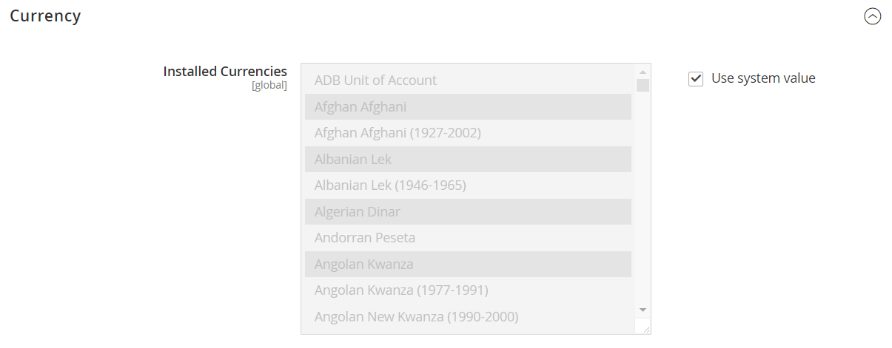
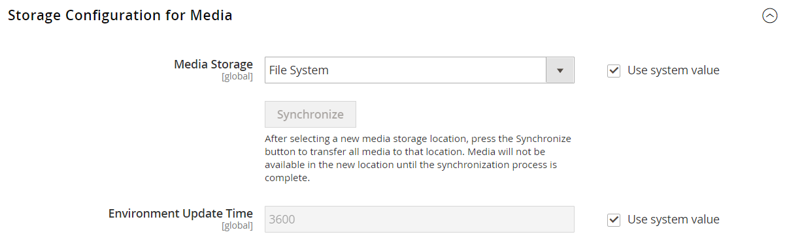

# [!UICONTROL Advanced] > [!UICONTROL System]

{{config}}

## [!UICONTROL Cron (Scheduled Tasks)]

<!-- zoom -->

Weitere Informationen zum Ändern dieser Konfigurationseinstellungen finden Sie unter [Cron (geplante Aufgaben)](../../systems/cron.md).

### [!UICONTROL index]

<!-- zoom -->

| Feld | [Scope](../../getting-started/websites-stores-views.md#scope-settings) | Beschreibung |
|--- |--- |--- |
| [!UICONTROL Generate Schedules Every] | Global | Bestimmt die Häufigkeit in Minuten, mit der Zeitpläne generiert werden. |
| [!UICONTROL Schedule Ahead for] | Global | Bestimmt die Anzahl der Minuten im Voraus, die Zeitpläne generiert werden. |
| [!UICONTROL Missed if Not Run Within] | Global | Bestimmt die Anzahl der Minuten, nach denen ein Cron-Vorgang, der noch nicht ausgeführt wurde, als verpasst markiert wird. |
| [!UICONTROL History Cleanup Every] | Global | Bestimmt die Anzahl der Minuten, die vergehen, bevor der Cron-Verlauf bereinigt wird. |
| [!UICONTROL Success History Lifetime] | Global | Bestimmt die Anzahl der Minuten, die der Datensatz der erfolgreich abgeschlossenen Cron-Aufträge in der Datenbank gespeichert wird. |
| [!UICONTROL Failure History Lifetime] | Global | Bestimmt die Anzahl der Minuten, die der Datensatz fehlgeschlagener Cron-Aufträge in der Datenbank gespeichert wird. |
| [!UICONTROL Use Separate Process] | Global | Bestimmt, ob Cron-Aufträge parallel als separate Prozesse ausgeführt werden. Optionen: `Yes` / `No` |

{style="table-layout:auto"}

### [!UICONTROL default]

<!-- zoom -->

| Feld | [Scope](../../getting-started/websites-stores-views.md#scope-settings) | Beschreibung |
|--- |--- |--- |
| [!UICONTROL Generate Schedules Every] | Global | Bestimmt die Häufigkeit in Minuten, mit der Zeitpläne generiert werden. |
| [!UICONTROL Schedule Ahead for] | Global | Bestimmt die Anzahl der Minuten im Voraus, die Zeitpläne generiert werden. |
| [!UICONTROL Missed if Not Run Within] | Global | Bestimmt die Anzahl der Minuten, nach denen ein Cron-Vorgang, der noch nicht ausgeführt wurde, als verpasst markiert wird. |
| [!UICONTROL History Cleanup Every] | Global | Bestimmt die Anzahl der Minuten, die vergehen, bevor der Cron-Verlauf bereinigt wird. |
| [!UICONTROL Success History Lifetime] | Global | Bestimmt die Anzahl der Minuten, die der Datensatz der erfolgreich abgeschlossenen Cron-Aufträge in der Datenbank gespeichert wird. |
| [!UICONTROL Failure History Lifetime] | Global | Bestimmt die Anzahl der Minuten, die der Datensatz fehlgeschlagener Cron-Aufträge in der Datenbank gespeichert wird. |
| [!UICONTROL Use Separate Process] | Global | Bestimmt, ob Cron-Aufträge parallel als separate Prozesse ausgeführt werden. Optionen: `Yes` / `No` |

{style="table-layout:auto"}

## [!UICONTROL MySQL Message Queue Cleanup]

{{ee-feature}}

<!-- zoom -->

| Feld | [Scope](../../getting-started/websites-stores-views.md#scope-settings) | Beschreibung |
|--- |--- |--- |
| [!UICONTROL Successful Messages Lifetime] | Global | Bestimmt die Lebensdauer erfolgreicher Nachrichten in Minuten. Geben Sie null ein, um die Bereinigung zu überspringen. Standard: `10080` (7 Tage) |
| [!UICONTROL New Messages Lifetime] | Global | Bestimmt die Lebensdauer neuer Nachrichten in Minuten. Geben Sie null ein, um die Bereinigung zu überspringen. Standard: `10080` (7 Tage) |
| [!UICONTROL Failed Messages Lifetime] | Global | Bestimmt die Lebensdauer von fehlgeschlagenen Nachrichten in Minuten. Geben Sie null ein, um die Bereinigung zu überspringen. Standard: `10080` (7 Tage) |
| [!UICONTROL Retry Messages in Progress After] | Global | Bestimmt, wie lange das System auf eine laufende Nachricht wartet, bevor es einen erneuten Versuch unternimmt. Standard: `1440` (24 Stunden) |

{style="table-layout:auto"}

## [!UICONTROL Mail Sending Settings]

<!-- zoom -->

Weitere Informationen zum Ändern dieser Einstellungen finden Sie unter [Konfigurieren von E-Mail-Nachrichten](../../systems/email-communications.md) in der _Handbuch für Admin-Systeme_.

>[!IMPORTANT]
>
>**Sicherheitshinweis** Wir empfehlen allen Händlern, ihre E-Mail-Versandkonfiguration sofort einzustellen, um sich vor einem kürzlich identifizierten potenziellen Remote-Code-Ausführungsangriff zu schützen. Bis dieses Problem behoben ist, wird dringend empfohlen, Folgendes zu vermeiden [!DNL Sendmail] für E-Mail-Kommunikation. In der [!UICONTROL Mail Sending Settings], stellen Sie sicher, dass [!UICONTROL Set Return Path] ist festgelegt auf `No`.

| Feld | [Scope](../../getting-started/websites-stores-views.md#scope-settings) | Beschreibung |
|--- |--- |--- |
| [!UICONTROL Disable Email Communications] | Shop-Ansicht | Bestimmt, ob E-Mail-Nachrichten für den Store aktiviert sind. Optionen: `Yes` / `No` |
| [!UICONTROL Transport] | Shop-Ansicht | Bestimmt den Transporttyp für E-Mail-Nachrichten aus dem Store. Optionen: `Sendmail` / `SMTP` |
| [!UICONTROL Host] | Shop-Ansicht | (Nur für SMTP- und Windows-Server) Bestimmt den Namen, mit dem auf den Host verwiesen wird. Standardwert: `localhost` |
| [!UICONTROL Port (25)] | Shop-Ansicht | (Nur für SMTP- und Windows-Server) Identifiziert den Port, der für die E-Mail-Kommunikation verwendet wird. Standardwert: `25` |
| [!UICONTROL Set Return-Path] | Shop-Ansicht | Bestimmt, ob für zurückgesendete E-Mails eine Routing-Adresse verwendet wird. Optionen: `No` / `Yes` / `Specified` |

{style="table-layout:auto"}

### SMTP-Optionen

Wenn Sie SMTP am Übertragungstyp auswählen, stehen zusätzliche Optionen zum Konfigurieren der SMTP-Server-Verbindung zur Verfügung.

<!-- zoom -->

| Feld | [Scope](../../getting-started/websites-stores-views.md#scope-settings) | Beschreibung |
|--- |--- |--- |
| [!UICONTROL Username] | Shop-Ansicht | Anmeldename des SMTP-Servers. |
| [!UICONTROL Password] | Shop-Ansicht | Kennwort für die SMTP-Serveranmeldung. |
| [!UICONTROL Auth] | Shop-Ansicht | Bestimmt den Authentifizierungstyp für die SMTP-Server-Verbindung. Optionen: `NONE` / `PLAIN` / `LOGIN` |
| [!UICONTROL SSL] | Shop-Ansicht | Bestimmt den Verifizierungstyp für das Host-Sicherheitszertifikat. Optionen: `SSL` / `TLS` |

{style="table-layout:auto"}

## [!UICONTROL Currency]

<!-- zoom -->

Weitere Informationen zum Ändern dieser Einstellung finden Sie unter [Währungskonfiguration](../../stores-purchase/currency-configuration.md) in der _Handbuch zu Stores und Kauferlebnissen_.

| Feld | [Scope](../../getting-started/websites-stores-views.md#scope-settings) | Beschreibung |
|--- |--- |--- |
| [!UICONTROL Installed Currencies] | Global | Gibt die Währungen an, die derzeit für die Commerce-Installation verfügbar sind. Die Optionen umfassen alle verfügbaren Währungen, wobei die installierten Währungen ausgewählt sind. |

{style="table-layout:auto"}

## [!UICONTROL Security]

<!-- zoom -->

Weitere Informationen zum Ändern dieser Einstellungen finden Sie unter [Sitzungsverwaltung](../../systems/security-session-management.md) in der _Handbuch für Admin-Systeme_.

| Feld | [Scope](../../getting-started/websites-stores-views.md#scope-settings) | Beschreibung |
|--- |--- |--- |
| [!UICONTROL Max Session Size in Admin] | Global | Begrenzen Sie die maximale Sitzungsgröße in Byte. Verwenden von `0` zu deaktivieren. |
| [!UICONTROL Max Session Size in Storefront] | Global | Begrenzen Sie die maximale Sitzungsgröße in Byte. Verwenden von `0` zu deaktivieren. |

{style="table-layout:auto"}

## [!UICONTROL Notifications]

<!-- zoom -->

Weitere Informationen zum Ändern dieser Einstellungen finden Sie unter [Systembenachrichtigungen](../../systems/notifications.md) in der _Handbuch für Admin-Systeme_.

| Feld | [Scope](../../getting-started/websites-stores-views.md#scope-settings) | Beschreibung |
|--- |--- |--- |
| [!UICONTROL Use HTTPS to Get Feed] | Global | Legt fest, ob Admin-Benachrichtigungen über einen sicheren Kanal gesendet werden. Optionen: `Yes` / `No` |
| Aktualisierungshäufigkeit | Global | Bestimmt die Aktualisierungshäufigkeit der Admin-Nachrichten. Optionen: `1 Hour` / `2 Hours` / `6 Hours` / `12 Hours` / `24 Hours` |
| [!UICONTROL Last Update] | Global | Gibt Datum und Uhrzeit der letzten Nachrichtenaktualisierung an. |

{style="table-layout:auto"}

## [!UICONTROL Backup Settings]

<!-- zoom -->

{{$include /help/_includes/backups-note.md}}

Weitere Informationen zum Ändern dieser Einstellungen finden Sie unter [Systemsicherungen](../../systems/backups.md) in der _Handbuch für Admin-Systeme_.

| Feld | [Scope](../../getting-started/websites-stores-views.md#scope-settings) | Beschreibung |
|--- |--- |--- |
| [!UICONTROL Enable Backup] | Global | Legt fest, ob die Commerce-Instanz Backups zulässt. Optionen: `Yes` / `No` |
| [!UICONTROL Enable Scheduled Backup] | Global | (Wird angezeigt, wenn _[!UICONTROL Enable Backup]_ist festgelegt auf `Yes`.) Bestimmt, ob die Commerce-Instanz automatisch nach einem regulären Zeitplan gesichert wird. Optionen: `Yes` / `No` |
| [!UICONTROL Scheduled Backup Type] | Global | (Wird angezeigt, wenn _[!UICONTROL Enable Scheduled Backup]_ist festgelegt auf `Yes`.) Bestimmt die Elemente der Commerce-Instanz, die im Backup enthalten sind. Optionen: `Database` / `Database and Media` / `System` / `System (excluding Media)` |
| [!UICONTROL Start Time] | Global | (Wird angezeigt, wenn [!UICONTROL Enable Scheduled Backup] ist festgelegt auf `Yes`.) Gibt die Stunde, Minute und Sekunde an, in der das geplante Backup beginnt. |
| [!UICONTROL Frequency] | Global | (Wird angezeigt, wenn [!UICONTROL Enable Scheduled Backup] ist festgelegt auf `Yes`.) Bestimmt, wie oft das geplante Backup durchgeführt wird. Optionen: `Daily` / `Weekly` / `Monthly` |
| [!UICONTROL Maintenance Mode] | Global | (Wird angezeigt, wenn [!UICONTROL Enable Scheduled Backup] ist festgelegt auf `Yes`.) Bestimmt, ob der Speicher während des geplanten Backups in den Wartungsmodus versetzt wird. Optionen: `Yes` / `No` |

{style="table-layout:auto"}

## [!UICONTROL Admin Actions Log Archiving]

{{ee-feature}}

<!-- zoom -->

Weitere Informationen zum Ändern dieser Einstellungen finden Sie unter [Aktionsprotokoll-Archiv](../../systems/action-log-archive.md) in der _Handbuch für Admin-Systeme_.

| Feld | [Scope](../../getting-started/websites-stores-views.md#scope-settings) | Beschreibung |
|--- |--- |--- |
| [!UICONTROL Log Entry Lifetime, Days] | Shop-Ansicht | Bestimmt, wie viele Tage Admin-Aktionen im Admin-Aktionsarchiv aufbewahrt werden. Standard: `60` |
| [!UICONTROL Log Archiving Frequency] | Shop-Ansicht | Legt fest, wie oft die Admin-Aktionsprotokolle archiviert werden. Optionen: `Daily` / `Weekly` / `Monthly` |

{style="table-layout:auto"}

## [!UICONTROL Full Page Cache]

<!-- zoom -->

Weitere Informationen zum Ändern dieser Einstellungen finden Sie unter [Vollständige Seitenzwischenspeicherung](../../systems/cache-management.md#full-page-caching) in der _Handbuch für Admin-Systeme_.

<!-- zoom -->

| Feld | [Scope](../../getting-started/websites-stores-views.md#scope-settings) | Beschreibung |
|--- |--- |--- |
| [!UICONTROL Caching Application] | Global | Bestimmt die Anwendung, die zur Verwaltung des Vollseiten-Caches verwendet wird. Optionen:  **`Built-in Application`**- Wird für die Produktionsumgebung nicht empfohlen. **`Varnish Caching`** - Wird für die Produktionsumgebung empfohlen. |
| [!UICONTROL TTL for public content] | Global | Bestimmt die Lebensdauer des öffentlichen Inhalts-Caches in Sekunden. Standardwert: `120` |
| [!UICONTROL Handles param size] | global | Gibt die maximale Anzahl von [Layout-Griffe](https://developer.adobe.com/commerce/frontend-core/guide/layouts/#layout-handles) zur Verarbeitung am [`{BASE-URL}/page_cache/block/esi`](https://experienceleague.adobe.com/docs/commerce-operations/configuration-guide/cache/use-varnish-esi.html) HTTP-Endpunkt. Eine Größenbeschränkung kann die Sicherheit und Leistung verbessern. Standardwert: `100` |
| **[!UICONTROL Varnish Configuration]** |  |  |
| [!UICONTROL Access list] | Global | Gibt die IP-Adressen an, die die Lackkonfiguration bereinigen können, um eine Konfigurationsdatei zu generieren. Trennen Sie mehrere Einträge durch ein Komma. Standardwert: `localhost` |
| [!UICONTROL Backend host] | Global | Gibt den Backend-Host an, der Konfigurationsdateien generiert. Standardwert: `localhost` |
| [!UICONTROL Backend port] | Global | Gibt den Backend-Port an, der zum Generieren von Konfigurationsdateien verwendet wird. Standardwert: `8080` |
| [!UICONTROL Grace period] | Global | Legt fest, wie lange Varnish veraltete Inhalte bereitstellt, wenn das Backend nicht responsiv ist. Standardwert: `300` |
| **[!UICONTROL Export Configuration]** |  |  |
| [!UICONTROL Export VCL for Varnish 4] | Global | Exportiert die `varnish.vcl` -Datei für Version 4. |
| [!UICONTROL Export VCL for Varnish 5] | Global | Exportiert die `varnish.vcl` Datei für Version 5. |
| [!UICONTROL Export VCL for Varnish 6] | Global | Exportiert die `varnish.vcl` -Datei für Version 6. |

{style="table-layout:auto"}

## [!UICONTROL Storage Configuration for Media]

<!-- zoom -->

Weitere Informationen zum Ändern dieser Einstellungen finden Sie unter [Verwenden einer Mediendatenbank](../../content-design/media-storage-database.md) in der _Inhalts- und Design-Handbuch_.

| Feld | [Scope](../../getting-started/websites-stores-views.md#scope-settings) | Beschreibung |
|--- |--- |--- |
| [!UICONTROL Media Storage] | Global | Bestimmt die Methode zum Speichern von Mediendateien. Standardeinstellung: `File System` |
| [!UICONTROL Environment Update Time] | Global | Bestimmt, wie oft die Mediendateiumgebung in Sekunden aktualisiert wird. Standardwert: `3600` |

{style="table-layout:auto"}

<!-- zoom -->

>[!IMPORTANT]
>
>Die Datenbankspeichermethode wird seit Adobe Commerce und Magento Open Source 2.4.3 nicht mehr unterstützt.

| Feld | [Scope](../../getting-started/websites-stores-views.md#scope-settings) | Beschreibung |
|--- |--- |--- |
| [!UICONTROL Media Storage] | Global | Gibt die Datenbank als Methode zum Speichern von Mediendateien an. |
| [!UICONTROL Select Media Database] | Global | Gibt den Namen der für die Medienspeicherung verwendeten Datenbank an. Standardeinstellung: `default_setup` |
| [!UICONTROL Synchronize] |  | Synchronisiert die Übertragung aller Medien an den angegebenen Datenbankspeicherort. |
| Umgebungsaktualisierungszeit | Global | Bestimmt, wie oft die Mediendateiumgebung in Sekunden aktualisiert wird. Standardwert: `3600` |

{style="table-layout:auto"}

## [!UICONTROL Bulk Actions]

{{ee-feature}}

<!-- zoom -->

Weitere Informationen zum Ändern dieser Einstellungen finden Sie unter [Massenaktionen](../../systems/action-log-bulk-actions.md) in der _Handbuch für Admin-Systeme_.

| Feld | [Scope](../../getting-started/websites-stores-views.md#scope-settings) | Beschreibung |
|--- |--- |--- |
| [!UICONTROL Days Saved in Log] | Global | Bestimmt die Anzahl der Tage, die Massenaktionen im _Massenaktionsprotokoll_ Archivieren. Standard: `60` |

{style="table-layout:auto"}

## [!UICONTROL Scheduled Import/Export File History Cleaning]

{{ee-feature}}

<!-- zoom -->

Weitere Informationen zum Ändern dieser Einstellungen finden Sie unter [Geplanter Import und Export](../../systems/data-scheduled-import-export.md) in der _Handbuch für Admin-Systeme_.

| Feld | [Scope](../../getting-started/websites-stores-views.md#scope-settings) | Beschreibung |
|--- |--- |--- |
| [!UICONTROL Save File, Days] | Global | Bestimmt die Anzahl der Tage, die Import-/Exportverlaufsdateien gespeichert werden. |
| [!UICONTROL Enable Scheduled File History Cleaning] | Global | Aktiviert die zeitgesteuerte Bereinigung der Import-/Exportdateien. Optionen: `Yes` / `No` |
| [!UICONTROL Clean Now] |  | Überschreibt die geplante Bereinigung und bereinigt sofort die Import-/Exportverlaufsdateien. |
| [!UICONTROL Start Time] | Global | Gibt die Stunde, Minute und Sekunde der Bereinigung der Import-/Exportverlaufsdatei an. |
| [!UICONTROL Frequency] | Global | Legt fest, wie oft die Import-/Exportverlaufsdateien bereinigt werden. Optionen: `Daily` / `Weekly` / `Monthly` |
| [!UICONTROL Error Email Recipient] | Global | Die E-Mail-Adresse der Person, die eine Benachrichtigung erhalten soll, wenn ein Fehler auftritt, während der Import-/Exportdateiverlauf bereinigt wird. Trennen Sie mehrere Adressen durch ein Komma. |
| [!UICONTROL Error Email Sender] | Global | Identifiziert den Store-Kontakt, der als Absender der Benachrichtigung angezeigt wird. Standardabsender: `General Contact` |
| [!UICONTROL Error Email Template] | Global | Identifiziert die E-Mail-Vorlage, die für die Benachrichtigung bezüglich eines Bereinigungsfehlers bei der Import-/Exportdatei verwendet wird. Standardvorlage: `File History Clean Failed` |

{style="table-layout:auto"}

## [!UICONTROL Image Upload Configuration]

<!-- zoom -->

<!-- [Image Upload Configuration](https://docs.magento.com/user-guide/system/action-log-bulk-actions.html) -->

| Feld | [Scope](../../getting-started/websites-stores-views.md#scope-settings) | Beschreibung |
|--- |--- |--- |
| [!UICONTROL Quality] | Global | Bestimmt die JPG-Qualität für das skalierte Bild. Geringere Qualität reduziert die Dateigröße. Verwenden Sie 80-90 %, um die Dateigröße mit hoher Qualität zu reduzieren. Standard: `80` |
| [!UICONTROL Enable Frontend Resize] | Global | Aktivieren Sie diese Einstellung, damit Commerce die Größe großer, übergroßer Bilder ändern kann, die Sie für das _Produktdetails_ Seite. Commerce ändert die Größe der Bilddateien mithilfe von JavaScript, bevor die Datei hochgeladen wird. Wenn die Größe des Bildes geändert wird, werden die exakten Proportionen beibehalten und die größte Größe für Maximale Breite oder Maximale Höhe wird nicht überschritten. Standard: `Yes` |
| [!UICONTROL Maximum Width] | Global | Bestimmt die maximale Pixelbreite für das Bild. Wenn die Größe des Bildes geändert wird, wird diese Breite nicht überschritten. Standard: `1920` |
| [!UICONTROL Maximum Height] | Global | Bestimmt die maximale Pixelhöhe für das Bild. Wenn die Größe des Bildes geändert wird, wird diese Höhe nicht überschritten. Standard: `1200` |

{style="table-layout:auto"}

## [!UICONTROL Media Gallery]

<!-- zoom -->

| Feld | [Scope](../../getting-started/websites-stores-views.md#scope-settings) | Beschreibung |
|--- |--- |--- |
| [!UICONTROL Enable Old Media Gallery] | Global | Aktiviert oder deaktiviert die alte Mediensammlung. |

{style="table-layout:auto"}

## [!UICONTROL Media Gallery Image Optimization]

<!-- zoom -->

| Feld | [Scope](../../getting-started/websites-stores-views.md#scope-settings) | Beschreibung |
|--- |--- |--- |
| [!UICONTROL Enable Image Optimization] | Global | Legt fest, ob die Größe von Bildern geändert wird, um die Dateigröße der in den Inhalt eingefügten Bilder zu reduzieren. Originalbilder werden in der Mediensammlung aufbewahrt. |
| [!UICONTROL Maximum Width] | Global | Die maximale Breite (in Pixel) für Bilder, die aus der Mediensammlung in den Inhalt eingefügt wurden. |
| [!UICONTROL Maximum Height] | Global | Die maximale Höhe (in Pixel) für Bilder, die aus der Mediensammlung in den Inhalt eingefügt wurden. |

{style="table-layout:auto"}

## [!UICONTROL Adobe Stock Integration]

<!-- zoom -->

Weitere Informationen zum Konfigurieren dieser Einstellungen finden Sie unter [Adobe Stock-Integration](../../content-design/adobe-stock.md) in der _Inhalts- und Design-Handbuch_.

| Feld | [Scope](../../getting-started/websites-stores-views.md#scope-settings) | Beschreibung |
|--- |--- |--- |
| [!UICONTROL Enabled Adobe Stock] | Global | Aktiviert oder deaktiviert die Adobe Stock-Integration. |
| [!UICONTROL API Key (Client ID)] | Global | Ein API-Schlüssel ist erforderlich, um Ihren Store mit dem Adobe Stock-Service zu verbinden. |
| [!UICONTROL Client Secret] | Global | Das Client-Geheimnis für Ihre Adobe Stock-Integration ist erforderlich. |
| [!UICONTROL Test Connection] |  | Führt einen Test aus, um zu überprüfen, ob der API-Schlüssel für die Verwendung mit dem Adobe Stock-Service gültig ist. |

{style="table-layout:auto"}
