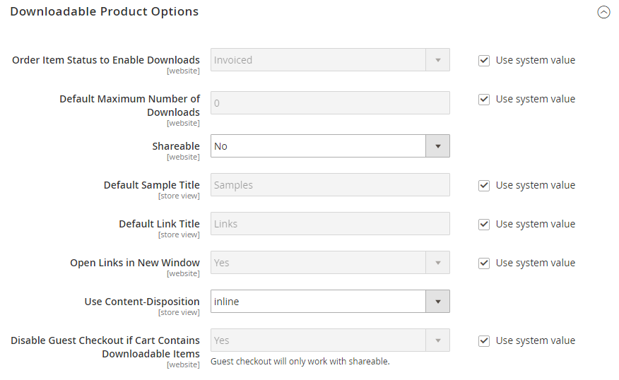
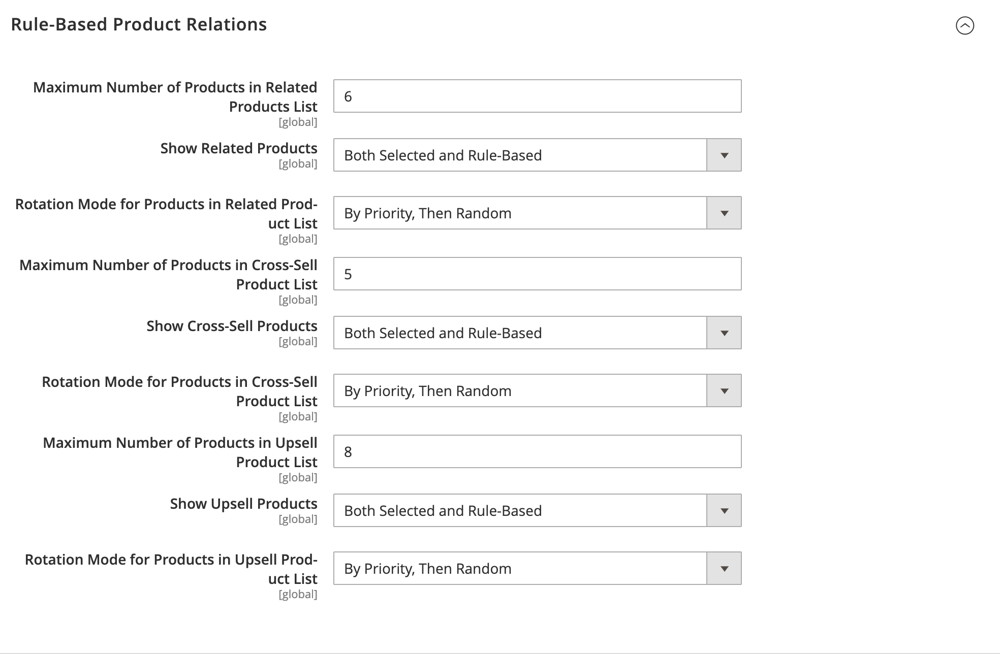

# [!UICONTROL Catalog] > [!UICONTROL Catalog]

{{config}}

## [!UICONTROL Product Fields Auto-Generation]

<!-- zoom -->

<!-- [Product Fields Auto-Generation](https://docs.magento.com/user-guide/catalog/product-fields-autogenerated.html) -->

| Feld | [Anwendungsbereich](../../getting-started/websites-stores-views.md#scope-settings) | Beschreibung |
|--- |--- |--- |
| [!UICONTROL Mask for SKU] | Global | Bestimmt den Standardwert des SKU-Felds basierend auf Platzhalterwerten aus anderen Feldern und jedem eingegebenen zusätzlichen Text. Standardplatzhalter:  Produktname - `{{name}}` |
| [!UICONTROL Mask for Meta Title] | Global | Bestimmt den Standardwert des Felds Metadatentitel basierend auf Platzhalterwerten aus anderen Feldern und jedem eingegebenen zusätzlichen Text. Standardplatzhalter:  Produktname - `{{name}}` |
| [!UICONTROL Mask for Meta Keywords] | Global | Bestimmt den Standardwert der _Meta-Suchbegriffe_ -Feld basierend auf Platzhalterwerten aus anderen Feldern und jedem zusätzlichen eingegebenen Text. Standardplatzhalter:  Produktname - `{{name}}` |
| [!UICONTROL Mask for Meta Description] | Global | Bestimmt den Standardwert des Felds Metadatenbeschreibung basierend auf Platzhalterwerten aus anderen Feldern und jedem eingegebenen zusätzlichen Text. Standardplatzhalter:  Produktname - `{{name}}`  Beschreibung - `{{description}}` |

{style="table-layout:auto"}

## [!UICONTROL Product Reviews]

<!-- zoom -->

<!-- [Product Reviews](https://docs.magento.com/user-guide/marketing/product-reviews.html) -->

| Feld | [Anwendungsbereich](../../getting-started/websites-stores-views.md#scope-settings) | Beschreibung |
|--- |--- |--- |
| [!UICONTROL Enabled] | Store-Ansicht | Aktiviert Produktüberprüfungen. Optionen: `Yes` / `No` |
| [!UICONTROL Allow Guests to Write Reviews] | Webseite | Stellt fest, ob Kunden ein Konto mit Ihrem Store öffnen müssen, um Produktüberprüfungen schreiben zu können. |

{style="table-layout:auto"}

## [!UICONTROL Storefront]

<!-- zoom -->

<!-- [Storefront](https://docs.magento.com/user-guide/catalog/navigation-product-listings.html) -->

| Feld | [Anwendungsbereich](../../getting-started/websites-stores-views.md#scope-settings) | Beschreibung |
|--- |--- |--- |
| [!UICONTROL List Mode] | Store-Ansicht | Bestimmt das Format der Suchergebnisliste. Optionen:  **`Grid Only`**- Formatiert die Liste als Raster aus Zeilen und Spalten. Jedes Produkt wird in einer einzigen Zelle des Rasters angezeigt. **`List Only`** - Formatiert die Liste mit jedem Produkt in einer separaten Zeile.  **`Grid (default / List)`**- Standardmäßig werden Produkte in der Rasteransicht angezeigt und können in die Listenansicht umgeschaltet werden. **`List (default / Grid)`** - Standardmäßig werden Produkte in der Listenansicht angezeigt und können in die Rasteransicht umgeschaltet werden. |
| [!UICONTROL Products per Page on Grid Allowed Values] | Store-Ansicht | Bestimmt die Anzahl der Produkte, die in der Rasteransicht angezeigt werden. Um eine Auswahl an Optionen bereitzustellen, geben Sie mehrere durch Kommas getrennte Werte ein. |
| [!UICONTROL Products per Page on Grid Default Value] | Store-Ansicht | Bestimmt die Anzahl der Produkte, die standardmäßig in der Rasteransicht pro Seite angezeigt werden. |
| [!UICONTROL Products per Page on List Allowed Values] | Store-Ansicht | Bestimmt die Anzahl der Produkte, die in der Listenansicht angezeigt werden. Um eine Auswahl an Optionen bereitzustellen, geben Sie mehrere durch Kommas getrennte Werte ein. |
| [!UICONTROL Products per Page on List Default Value] | Store-Ansicht | Bestimmt die Anzahl der Produkte, die standardmäßig in der Listenansicht pro Seite angezeigt werden. |
| Sortieren der Produktliste nach | Store-Ansicht | Bestimmt die Sortierreihenfolge der Suchergebnisliste. Die Auswahl der Optionen wird durch die Anzeigeeinstellungen der Kategorie und die verfügbaren Attribute bestimmt, die auf `Used for Sorting in Product Listing`. Die Standardeinstellung ist `Use All Available Attributes` und enthält normalerweise Best Value, Name und Preis. Diese Einstellung gilt nicht für die [!DNL Live Search] [Seiten-Widget &quot;Produktliste&quot;](https://experienceleague.adobe.com/en/docs/commerce-merchant-services/live-search/live-search-storefront/plp-styling). |
| [!UICONTROL Allow All Products per Page] | Store-Ansicht | Wenn auf `Yes`, enthält die `ALL` im Steuerelement &quot;Pro Seite anzeigen&quot;. |
| [!UICONTROL Remember Category Pagination] | Global | Wenn auf `Yes`, werden die aktuellen Kategoriepaginierungswerte gespeichert, wenn Kunden von einer Kategorie zur anderen in [Produktlisten](../../catalog/navigation-product-listings.md). Das Speichern des Werts verwendet mehr Cache-Speicher und kann sich auf die Art und Weise auswirken, wie Seiten von Suchmaschinen indiziert werden. Optionen: `Yes` / `No` (Standard) |
| [!UICONTROL Use Flat Catalog Category] | Global | Aktiviert die [flache Kategorienstruktur](../../catalog/catalog-flat.md) (nicht empfohlen). Optionen: `Yes` / `No` |
| [!UICONTROL Use Flat Catalog Product] | Global | Aktiviert die flache Produktstruktur. (nicht empfohlen) Optionen: `Yes` / `No` |
| [!UICONTROL Swatches per Product] | Store-Ansicht | Bestimmt die Anzahl der für jedes Produkt verfügbaren Farbfelder. Standard: `16` |
| [!UICONTROL Show Swatches in Product List] | Store-Ansicht | Bestimmt, ob die Muster in der Produktliste angezeigt werden. Optionen: `Yes` / `No` |
| [!UICONTROL Show Swatch Tooltip] | Store-Ansicht | Legt fest, ob die QuickInfo für Muster angezeigt wird. Optionen: `Yes` / `No` |

{style="table-layout:auto"}

## [!UICONTROL Product Alerts]

<!-- zoom -->

<!-- [Product Alerts](https://docs.magento.com/user-guide/catalog/inventory-product-alerts.html) -->

| Feld | [Anwendungsbereich](../../getting-started/websites-stores-views.md#scope-settings) | Beschreibung |
|--- |--- |--- |
| [!UICONTROL Allow Alerts When Product Price Changes] | Store-Ansicht | Bestimmt, ob E-Mail-Warnungen für Produktpreisänderungen verfügbar sind. Optionen: `Yes` / `No` |
| [!UICONTROL Price Alert Email Template] | Store-Ansicht | Identifiziert die Vorlage, die für E-Mail-Warnungen zu Produktpreisänderungen verwendet wird. Standardvorlage: `Product price alert` |
| [!UICONTROL Allow Alert When Product Comes Back in Stock] | Webseite | Bestimmt, ob Kunden einen Warnhinweis erhalten können, wenn das Produkt wieder vorrätig ist. Optionen: `Yes` / `No` |
| [!UICONTROL Stock Alert Email Template] | Store-Ansicht | Identifiziert die Vorlage, die für E-Mail-Benachrichtigungen zu Lagerwarnungen verwendet wird. Standardvorlage: `Product stock alert` |
| [!UICONTROL Alert Email Sender] | Store-Ansicht | Bestimmt den Store-Kontakt, der als Absender der E-Mail-Warnung zur Produktwarnung angezeigt wird. Optionen: `General Contact` / `Sales Representative` / `Customer Support` / `Custom Email` |

{style="table-layout:auto"}

## [!UICONTROL Product Alerts Run Settings]

<!-- zoom -->

<!-- [Product Alerts Run Settings](https://docs.magento.com/user-guide/catalog/inventory-product-alert-run-settings.html) -->

| Feld | [Anwendungsbereich](../../getting-started/websites-stores-views.md#scope-settings) | Beschreibung |
|--- |--- |--- |
| [!UICONTROL Frequency] | Global | Wählen Sie aus, wie oft Produktwarnungen gesendet werden. Optionen: `Daily` / `Weekly` / `Monthly` |
| [!UICONTROL Start Time] | Global | Wählen Sie die Tageszeit aus, zu der der Produktwarnungsprozess beginnt. Diese Zeit sollte nach jeder Preis- oder Bestandsaktualisierung liegen. |
| [!UICONTROL Error Email Recipient] | Global | Identifizieren Sie die E-Mail-Adresse der Person (normalerweise ein Store-Administrator), die eine E-Mail-Benachrichtigung erhalten soll, wenn im Produktwarnungsprozess ein Fehler auftritt. |
| [!UICONTROL Error Email Sender] | Global | Wählen Sie die Rolle aus, die die E-Mail erhält `from`. |
| [!UICONTROL Error Email Template] | Global | Wählen Sie die E-Mail-Vorlage aus, die für Benachrichtigungen zu Produktwarnungsfehlern verwendet werden soll. |

{style="table-layout:auto"}

## [!UICONTROL Product Image Placeholders]

<!-- zoom -->

<!-- [Product Image Placeholders](https://docs.magento.com/user-guide/catalog/product-image-placeholders.html) -->

| Feld | [Anwendungsbereich](../../getting-started/websites-stores-views.md#scope-settings) | Beschreibung |
|--- |--- |--- |
| [!UICONTROL Base Image] | Store-Ansicht | Identifiziert die für das Basisbild ausgewählte Platzhalterdatei. |
| [!UICONTROL Small Image] | Store-Ansicht | Identifiziert die Platzhalterdatei, die für das kleine Bild ausgewählt wurde. |
| [!UICONTROL Swatch] | Store-Ansicht | Identifiziert die für das Muster ausgewählte Platzhalterdatei. |
| [!UICONTROL Thumbnail] | Store-Ansicht | Gibt die Platzhalterdatei an, die für die Miniaturansicht ausgewählt wurde. |
| [!UICONTROL Choose File] |  | Navigiert zur Datei und lädt sie als Platzhalterbild für den Typ hoch. |

{style="table-layout:auto"}

## [!UICONTROL Recently Viewed/Compared Products]

<!-- zoom -->

<!-- Recently Viewed/Compared Products](https://docs.magento.com/user-guide/marketing/products-viewed-compared.html) -->

| Feld | [Anwendungsbereich](../../getting-started/websites-stores-views.md#scope-settings) | Beschreibung |
|--- |--- |--- |
| [!UICONTROL Synchronize widget products with backend storage] | Global | Bestimmt die Synchronisierung von Produkt-Widget-Informationen, z. B. Produkt-ID, mit der Datenbank. Dies ermöglicht die Wiederverwendung von Informationen auf anderen Geräten. |
| [!UICONTROL Show for Current] | Webseite | Beschränkt die angezeigten Produkte auf die aktuelle Website. Optionen: `Website` / `Store` / `Store View` |
| [!UICONTROL Default Recently Viewed Products Count] | Store-Ansicht | Bestimmt die maximale Anzahl der zuletzt angezeigten Produkte, die in der Liste angezeigt werden. |
| [!UICONTROL Default Recently Compared Products Count] | Store-Ansicht | Bestimmt die maximale Anzahl der kürzlich verglichenen Produkte, die in der Liste angezeigt werden. |
| [!UICONTROL Lifetime of products in Recently Viewed Widget] | Global | Bestimmt, wie lange angezeigte Produkte in Sekunden in der zuletzt angezeigten Liste angezeigt werden. |
| [!UICONTROL Lifetime of products in Recently Compared Widget] | Global | Bestimmt, wie lange (in Sekunden) verglichene Produkte in der kürzlich verglichenen Liste angezeigt werden. |

{style="table-layout:auto"}

## [!UICONTROL Product Video]

<!-- zoom -->

<!-- [Product Videos](https://docs.magento.com/user-guide/catalog/product-video.html) -->

| Feld | [Anwendungsbereich](../../getting-started/websites-stores-views.md#scope-settings) | Beschreibung |
|--- |--- |--- |
| [!UICONTROL YouTube API key] | Store-Ansicht | Gibt den API-Schlüssel an, der für die Verbindung mit dem YouTube-Server erforderlich ist. |
| [!UICONTROL Autostart base video] | Store-Ansicht | Um das Video nach dem Laden der Seite automatisch zu starten, setzen Sie auf `Yes`. |
| [!UICONTROL Show related video] | Store-Ansicht | Um verwandte Videos anzuzeigen, setzen Sie auf `Yes`. |
| [!UICONTROL Auto restart video] | Store-Ansicht | Um die automatische Wiedergabe des Videos zu aktivieren, setzen Sie auf `Yes`. |

{style="table-layout:auto"}

## [!UICONTROL Price]

<!-- zoom -->

<!--Price](https://docs.magento.com/user-guide/catalog/catalog-price-scope.html) -->

| Feld | [Anwendungsbereich](../../getting-started/websites-stores-views.md#scope-settings) | Beschreibung |
|--- |--- |--- |
| [!UICONTROL Catalog Price Scope] | Global | Bestimmt den Umfang der Basiswährung. Optionen: `Global` / `Website` |
| [!UICONTROL Default Product Price] | Global |  (Nur Adobe Commerce) Definiert ggf. den standardmäßigen Produktpreis. |

{style="table-layout:auto"}

## [!UICONTROL Layered Navigation]

>[!NOTE]
>
>Die in diesem Abschnitt beschriebene Standardsuchkonfiguration unterscheidet sich von [Live Search](https://experienceleague.adobe.com/docs/commerce-merchant-services/live-search/overview.html).

<!-- [Layered Navigation - Automatic (equalize price ranges)](https://docs.magento.com/user-guide/catalog/navigation-layered-configuration.html) -->

<!-- zoom -->

<!-- zoom -->

<!-- zoom -->

| Feld | [Anwendungsbereich](../../getting-started/websites-stores-views.md#scope-settings) | Beschreibung |
|--- |--- |--- |
| [!UICONTROL Display Product Count] | Store-Ansicht | Bestimmt, ob die Produktanzahl nach jedem Attribut, Preisbereich und jeder Kategorie angezeigt wird. Optionen: `Yes` / `No` |
| [!UICONTROL Price Navigation Step Calculation] | Store-Ansicht | Bestimmt die Methode, mit der die [Preisnavigationsschritt](../../catalog/navigation-layered.md#configure-price-navigation)). Optionen:  `Automatic (equalize price ranges)` - Basiert die Berechnung auf der Preisspanne der Produkte der Gruppe.  `Automatic (equalize product counts)` - Basiert die Berechnung auf der Anzahl der Produkte der Gruppe. legt eine Schwelle für die Mindestanzahl von Produkten in der Gruppe fest, um zu verhindern, dass diese in kleinere Gruppen unterteilt werden.  `Manual` - Verwendet das Trennzeichen-Limit, das Sie für Preisintervalle eingeben. |
| [!UICONTROL Default Price Navigation Step] | Store-Ansicht | Bestimmt die Anzahl der Produkte, die in jedem Schritt enthalten sind. |
| [!UICONTROL Maximum Number of Price Intervals] | Store-Ansicht | Legt eine Begrenzung für die Anzahl der Preisintervalle fest, die in der Navigation mit Ebenen angezeigt werden. |

{style="table-layout:auto"}

## [!UICONTROL Category Permissions]

{{ee-feature}}

<!-- zoom -->

<!-- [Category Permissions](https://docs.magento.com/user-guide/catalog/category-permissions.html) -->

| Feld | [Anwendungsbereich](../../getting-started/websites-stores-views.md#scope-settings) | Beschreibung |
|--- |--- |--- |
| [!UICONTROL Enable] | Global | Aktiviert Kategorieeinschränkungen. Die Verwendung dieser Funktion schränkt standardmäßig alle Kategorien ein. Optionen: `Yes` / `No` |
| [!UICONTROL Allow Browsing Category] | Webseite | Bestimmt, wer Kategorien durchsuchen darf. Optionen:  `Yes, for Everyone` - Ermöglicht allen Besuchern und Kunden, die Kategorie zu durchsuchen.  `Yes, for Specified Customer Groups` - Ermöglicht nur Mitgliedern ausgewählter Kundengruppen das Durchsuchen der Kategorie.  `No, Redirect to Landing Page` - Verweigert den Zugriff auf die Kategorie und leitet zur ausgewählten Seite weiter. |
| [!UICONTROL Display Product Prices] | Webseite | Steuert die Anzeige der Produktpreise für die Kategorie. Optionen:  `Yes, for Everyone` - Ermöglicht jedem, den Preis der Produkte in der Kategorie zu sehen.  `Yes, for Specified Customer Groups` - Ermöglicht es nur Mitgliedern ausgewählter Kundengruppen, den Preis der Produkte in der Kategorie anzuzeigen.  `No` - Deaktiviert die Anzeige der Produktpreise für die Kategorie. |
| [!UICONTROL Allow Adding to Cart] | Webseite | Bestimmt, wer Produkte aus der Kategorie kaufen kann. Optionen:  `Yes, for Everyone` - Ermöglicht jedem, Produkte der Kategorie in seinen Warenkorb zu legen.  `Yes, for Specified Customer Groups` - Ermöglicht es nur Mitgliedern ausgewählter Kundengruppen, Produkte aus der Kategorie in ihren Warenkorb zu platzieren.  `No` - Ermöglicht niemandem, Produkte der Kategorie in ihren Warenkorb zu legen. |
| [!UICONTROL Disallow Catalog Search by] | Webseite | Identifiziert die Kundengruppen, die nicht nach Produkten in der Kategorie suchen dürfen. |

{style="table-layout:auto"}

## [!UICONTROL Search Engine Optimization]

<!-- zoom -->

<!-- [Search Engine Optimization](https://docs.magento.com/user-guide/catalog/product-search-engine-optimization.html) -->

| Feld | [Anwendungsbereich](../../getting-started/websites-stores-views.md#scope-settings) | Beschreibung |
|--- |--- |----------------------------------------------------------------------------------------------------------------------------------------------------------------------------------------------------------------------------------------------------------------------------------------------------------------------------------------------------------------------------------------------------------|
| [!UICONTROL Popular Search Terms] | Store-Ansicht | Bestimmt, ob _Beliebte Suchbegriffe_ wird im Store implementiert. Diese Einstellung gilt nicht für Stores, die [Live Search](https://experienceleague.adobe.com/docs/commerce-merchant-services/live-search/overview.html). Optionen: `Enable` / `Disable` |
| [!UICONTROL Product URL Suffix] | Store-Ansicht | Bestimmt, ob ein Suffix wie HTML oder HTM auf Produkt-URLs angewendet wird. Bei Verwendung darf der Suffix keinen Punkt vor dem Suffix enthalten, da er automatisch angewendet wird. |
| [!UICONTROL Category URL Suffix] | Store-Ansicht | Bestimmt, ob ein Suffix wie HTML oder HTM auf Kategorie-URLs angewendet wird. Bei Verwendung darf der Suffix keinen Punkt vor dem Suffix enthalten, da er automatisch angewendet wird. |
| [!UICONTROL Use Categories Path for Product URLs] | Store-Ansicht | Bestimmt, ob Kategoriepfade in Produkt-URLs enthalten sind. Dies kann dazu führen, dass mehrere URLs auf dieselbe Seite verweisen, was sich auf den Suchrang auswirken kann. Weitere Informationen finden Sie unter [Kanonisches Meta-Tag](../../merchandising-promotions/meta-data.md#canonical-meta-tag). |
| [!UICONTROL Create Permanent Redirect for URLs if URL Key Changed] | Store-Ansicht | Bestimmt, ob eine permanente Umleitung automatisch erstellt wird, wenn sich ein URL-Schlüssel ändert. Bei Implementierung ist das Kontrollkästchen Benutzerdefinierte Weiterleitung für alte URL erstellen unter dem Feld Produkt-URL-Schlüssel standardmäßig ausgewählt. Optionen: `Yes` / `No` |
| [!UICONTROL Generate "category/product" URL Rewrites] | Global | Ermittelt, ob Adobe Commerce Daten generiert und in Umschreibungstabellen speichert, wenn ein Benutzer eine Kategorie speichert, die viele zugewiesene Produkte enthält. Optionen: `Yes` / `No`   **_Wichtig:_**Das Speichern dieser generierten Daten in eine URL-Umschreibungstabelle kann die Leistung beeinträchtigen. Siehe [Automatische Produktumleitungen](../../merchandising-promotions/url-redirect-product-automatic.md) für weitere Informationen. |
| [!UICONTROL Apply transliteration for product URL] | Store-Ansicht | Bestimmt, ob beim Erstellen oder Aktualisieren von Produkt-URLs eine Transliteration angewendet wird. Optionen: `Yes` / `No`. Der Standardwert ist auf `Yes`.   In bestimmten Anwendungsfällen sollten Sie die Transliteration deaktivieren. Wenn Sie beispielsweise einen Online-Store auf Chinesisch betreiben, empfehlen die Best Practices von SEO, dass die Produkt-URLs mit dem Produktnamen übereinstimmen. Festlegen der Option auf `No` ermöglicht die Verwendung chinesischer Zeichen in Produkt-URLs anstelle eines ASCII-Entsprechens. |
| [!UICONTROL Page Title Separator] | Store-Ansicht | Identifiziert das Zeichen, das den Kategorienamen und die Unterkategorie in der Titelleiste des Browsers trennt. |
| [!UICONTROL Use Canonical Link Meta Tag for Categories] | Store-Ansicht | Wenn mehrere URLs auf dieselbe Kategorieseite verweisen, verwendet diese Option ein kanonisches Meta-Tag, um die Kategorie-URL zu identifizieren, die von Suchmaschinen indiziert werden soll. Die URL enthält einen vollständigen Namen für die Kategorie, die das Meta-Tag verwendet. Dadurch werden doppelte Inhalte reduziert und SEO verbessert. Optionen: `Yes` / `No` |
| [!UICONTROL Use Canonical Link Meta Tag for Products] | Store-Ansicht | Wenn mehrere URLs auf dieselbe Produktseite verweisen, verwendet diese Option ein kanonisches Meta-Tag, um die Produkt-URL zu identifizieren, die von Suchmaschinen indiziert werden soll. Die URL enthält einen vollständigen Namen für das Produkt, das das Meta-Tag verwendet. Dadurch werden doppelte Inhalte reduziert und SEO verbessert. Optionen: `Yes` / `No` |

{style="table-layout:auto"}

## [!UICONTROL Category Top Navigation]

<!-- zoom -->

<!-- Category Top Navigation](https://docs.magento.com/user-guide/catalog/navigation-top.html) -->

| Feld | [Anwendungsbereich](../../getting-started/websites-stores-views.md#scope-settings) | Beschreibung |
|--- |--- |--- |
| [!UICONTROL Maximal Depth] | Global | Bestimmt die Anzahl der Unterkategorien in der oberen Navigation. Der Standardwert von `0` gibt keine Begrenzung für die Anzahl der Ebenen. |

{style="table-layout:auto"}

## [!UICONTROL Catalog Search]

Es gibt zwei Varianten der Konfiguration der Katalogsuche: die Einstellungen, die verfügbar sind, wenn [[!DNL Live Search]](https://experienceleague.adobe.com/docs/commerce-merchant-services/live-search/overview.html) installiert ist und die für den nativen Adobe Commerce verfügbar sind. Befolgen Sie die Anweisungen für Ihre Installation.

### Adobe Commerce mit [!DNL Live Search]

Bei der Installation der Live-Suche enthält die Katalogsuche die folgenden Konfigurationseinstellungen:

<!-- zoom -->

<!-- [Catalog Search for Live Search](https://docs.magento.com/user-guide/catalog/search-configuration.html) -->

| Feld | [Anwendungsbereich](../../getting-started/websites-stores-views.md#scope-settings) | Beschreibung |
|--- |--- |--- |
| [!UICONTROL Minimal Query Length] | Store-Ansicht | Die Mindestanzahl von Zeichen, die bei einer Katalogsuche zulässig ist. Der für diese Option eingestellte Wert muss mit dem entsprechenden Bereich kompatibel sein, der in Ihren Elasticsearch-Suchmaschinenkonfigurationen festgelegt ist. Wenn Sie diesen Wert beispielsweise auf `2` in Adobe Commerce den Wert in Ihrer Suchmaschine aktualisieren. |
| [!UICONTROL Maximum Query Length] | Store-Ansicht | Die maximal zulässige Anzahl von Zeichen bei einer Katalogsuche. Der für diese Option eingestellte Wert muss mit dem entsprechenden Bereich kompatibel sein, der in Ihren Elasticsearch-Suchmaschinenkonfigurationen festgelegt ist. Wenn Sie diesen Wert beispielsweise in Adobe Commerce auf 300 setzen, aktualisieren Sie den Wert in Ihrer Suchmaschine. |
| [!UICONTROL Number of top search results to cache] | Store-Ansicht | Die Anzahl der beliebten Suchbegriffe und Ergebnisse, die für schnellere Antworten zwischengespeichert werden sollen. Wert eingeben von `0` speichert alle Suchbegriffe und Ergebnisse bei der zweiten Eingabe zwischen. Standardwert: `100` |
| [!UICONTROL Autocomplete Limit] | Store-Ansicht | Bestimmt die maximale Anzahl von Zeilen, die in der [Storefront-Popover] Seite. Der Standardwert kann bei der Installation der Live-Suche geändert und später aktualisiert werden, indem Sie diese Konfigurationseinstellung ändern. Standardwert: `8` |

{style="table-layout:auto"}

### Adobe Commerce mit Elasticsearch

Das native Adobe Commerce mit Elasticsearch umfasst die folgenden Konfigurationseinstellungen:

<!-- zoom -->

<!-- [Catalog Search](https://docs.magento.com/user-guide/catalog/search-configuration.html) -->

>[!IMPORTANT]
>
>Aufgrund der Ankündigung zum Ende der Unterstützung für Elasticsearch 7 vom August 2023 wird empfohlen, dass alle Adobe Commerce-Kunden zur OpenSearch 2.x-Suchmaschine migrieren. Informationen zur Migration Ihrer Suchmaschine während der Produktaktualisierung finden Sie unter [Migration zu OpenSearch](https://experienceleague.adobe.com/docs/commerce-operations/upgrade-guide/prepare/opensearch-migration.html) im _Upgrade-Handbuch_.

| Feld | [Anwendungsbereich](../../getting-started/websites-stores-views.md#scope-settings) | Beschreibung |
|--- |--- |--- |
| [!UICONTROL Minimal Query Length] | Store-Ansicht | Die Mindestanzahl von Zeichen, die bei einer Katalogsuche zulässig ist. Der für diese Option eingestellte Wert muss mit dem entsprechenden Bereich kompatibel sein, der in Ihren Elasticsearch-Suchmaschinenkonfigurationen festgelegt ist. Wenn Sie diesen Wert beispielsweise auf `2` in Adobe Commerce den Wert in Ihrer Suchmaschine aktualisieren. |
| [!UICONTROL Maximum Query Length] | Store-Ansicht | Die maximal zulässige Anzahl von Zeichen bei einer Katalogsuche. Der für diese Option eingestellte Wert muss mit dem entsprechenden Bereich kompatibel sein, der in Ihren Elasticsearch-Suchmaschinenkonfigurationen festgelegt ist. Wenn Sie diesen Wert beispielsweise in Adobe Commerce auf 300 setzen, aktualisieren Sie den Wert in Ihrer Suchmaschine. |
| [!UICONTROL Number of top search results to cache] | Store-Ansicht | Die Anzahl der beliebten Suchbegriffe und Ergebnisse, die für schnellere Antworten zwischengespeichert werden sollen. Wert eingeben von `0` speichert alle Suchbegriffe und Ergebnisse bei der zweiten Eingabe zwischen. Standardwert: `100` |
| [!UICONTROL Enable EAV Indexer] | Global | Bestimmt, ob Sie den Produkt-EAV-Indexer aktivieren oder deaktivieren möchten. Diese Funktion verbessert die Indexierungsgeschwindigkeit und verhindert, dass der Indexer von Drittanbietererweiterungen verwendet wird. Diese Option wird nur für Elasticsearch oder Elasticsearch 5.0+ Suchmaschinen angezeigt. Standardoption: `Yes` für aktiviert |
| [!UICONTROL Autocomplete Limit] | Store-Ansicht | Die maximale Anzahl von Suchanfragen, die unter dem Suchfeld angezeigt werden sollen, um die Suche automatisch zu vervollständigen. Durch die Beschränkung dieses Betrags wird die Leistung von Suchvorgängen erhöht und die angezeigte Listengröße verringert. Standardwert: `8` |
| Suchmaschine | Global | Gibt die Suchmaschine an, die zur Verarbeitung von Anforderungen für Katalogdaten erforderlich ist. Elasticsearch 7.6.x ist für alle Adobe Commerce-Installationen erforderlich. Option: `Elasticsearch 7` |
| [!UICONTROL Elasticsearch Server Hostname] | Global | Gibt den Namen des Elasticsearch-Servers an. Standardwert: `elasticsearch.internal` |
| [!UICONTROL Elasticsearch Server Port] | Global | Gibt die Nummer des vom Elasticsearch verwendeten Serveranschlusses an. Standardwert: `9200` |
| [!UICONTROL Elasticsearch Index Prefix] | Global | Weist ein Präfix zu, um den Elasticsearch-Index zu identifizieren. Standardwert: `magento2` |
| [!UICONTROL Enable Elasticsearch HTTP Auth] | Global | Wenn diese Option aktiviert ist, fordert Sie vor dem Zugriff auf Elasticsearch Server über die HTTP-Authentifizierung zur Eingabe eines Benutzernamens und Kennworts auf. Optionen: `Yes` / `No` |
| [!UICONTROL Elasticsearch HTTP Username] | Global | Wann _Aktivieren der Elasticsearch-HTTP-Authentifizierung_ auf `Yes`, gibt den Benutzernamen für die Elasticsearch-HTTP-Authentifizierung an. |
| [!UICONTROL Elasticsearch HTTP Password] | Global | Wann _Aktivieren der Elasticsearch-HTTP-Authentifizierung_ auf `Yes`, gibt das Kennwort für die Elasticsearch-HTTP-Authentifizierung an. |
| [!UICONTROL Elasticsearch Server Timeout] | Global | Bestimmt die Anzahl der Sekunden, bevor eine Zeitüberschreitung beim Server eintritt. Standardwert: `15` |
| [!UICONTROL Test Connection] |  | Validiert die Elasticsearch-Verbindung. |
| [!UICONTROL Enable Search Recommendations] | Store-Ansicht | Bestimmt, ob Suchempfehlungen angeboten werden, wenn eine Suche keine Ergebnisse zurückgibt und unter der `Related search terms` auf der Suchergebnisseite. Optionen: `Yes` / `No`  Wenn &quot;Ja&quot;festgelegt ist, werden zusätzliche Optionen für _[!UICONTROL Search Recommendations Count]_und_[!UICONTROL Shows Results Count for Each Recommendation]_. |
| [!UICONTROL Search Recommendations Count] | Store-Ansicht | Gibt die Anzahl der als Empfehlungen angebotenen Suchbegriffe an. Standardmäßig werden maximal fünf angezeigt. |
| [!UICONTROL Show Results Count for Each Recommendation] | Store-Ansicht | Wenn festgelegt auf `Yes`festgelegt ist, wird die Anzahl der für die vorgeschlagene Suchempfehlung gefundenen Produkte in den Klammern angezeigt. Optionen: `Yes` / `No` |
| [!UICONTROL Enable Search Suggestions] | Store-Ansicht | Bestimmt, ob Suchvorschläge für häufige Rechtschreibfehler angezeigt werden. Wenn diese Option aktiviert ist, werden Suchvorschläge für alle Anfragen angeboten, die keine Ergebnisse zurückgeben, und unter dem `Did you mean` im Abschnitt **Suchergebnisse** Seite. Suchvorschläge können sich auf die Leistung der Suche auswirken. Wenn festgelegt auf `Yes`, werden zusätzliche Optionen für die Option Recommendations für die Suche aktivieren und die zugehörigen Felder angezeigt. Optionen: `Yes` / `No` |
| [!UICONTROL Search Suggestions Count] | Store-Ansicht | Bestimmt die Anzahl der angebotenen Suchvorschläge. Beispiel: `2` |
| [!UICONTROL Show Results Count for Each Suggestion] | Store-Ansicht | Bestimmt, ob die Anzahl der Suchergebnisse für jeden Vorschlag angezeigt wird. Abhängig vom Design wird die Zahl normalerweise in Klammern nach dem Vorschlag angezeigt. Optionen: `Yes` / `No` |
| [!UICONTROL Minimum Terms to Match] | Store-Ansicht | Gibt einen Wert an, der der Anzahl der Begriffe aus Ihrer Abfrage entspricht, mit denen die Suchergebnisse übereinstimmen sollen, damit sie zurückgegeben werden. Dadurch wird eine optimale Ergebnisrelevanz für Käufer sichergestellt. Prozentwerte korrelieren mit einer Zahl. Bei Bedarf können sie abgerundet und als Mindestanzahl von Begriffen verwendet werden, die in Ihrer Abfrage übereinstimmen. Der Wert kann eine negative oder positive Ganzzahl, einen negativen oder einen positiven Prozentsatz, eine Kombination aus zwei oder mehreren Kombinationen sein. Weitere Informationen finden Sie unter [Parameter &quot;minimum_should_match&quot;](https://www.elastic.co/guide/en/elasticsearch/reference/current/query-dsl-minimum-should-match.html) in der Dokumentation zum Elasticsearch. |

{style="table-layout:auto"}

## [!UICONTROL Downloadable Product Options]

<!-- zoom -->

<!-- [Downloadable Product Options](https://docs.magento.com/user-guide/catalog/product-download-options.html) -->

| Feld | [Anwendungsbereich](../../getting-started/websites-stores-views.md#scope-settings) | Beschreibung |
|--- |--- |--- |
| [!UICONTROL Order Item Status to Enable Downloads] | Webseite | Bestimmt den Status, den eine Bestellung aufweisen muss, bevor Downloads verfügbar werden. Optionen: `Pending` / `Invoiced` |
| [!UICONTROL Default Maximum Number of Downloads] | Webseite | Bestimmt die standardmäßige Anzahl der Downloads, die einem Kunden zur Verfügung stehen. |
| [!UICONTROL Shareable] | Webseite | Bestimmt, ob Kunden sich bei ihren Konten anmelden müssen, um auf den Download-Link zugreifen zu können. Optionen:  **Ja** - Ermöglicht den Versand des Links per E-Mail, der dann für andere freigegeben werden kann.  **Nein** - Erfordert Kunden, sich bei ihren Konten anzumelden, um auf den Downloadlink zuzugreifen. |
| [!UICONTROL Default Sample Title] | Store-Ansicht | Der Standardtitel für alle Beispieldateien. |
| [!UICONTROL Default Link Title] | Store-Ansicht | Der Standardlink für alle herunterladbaren Titel. |
| [!UICONTROL Opens Links in New Window] | Webseite | Bestimmt, ob der Download-Link in einem neuen Browser-Fenster geöffnet wird. Optionen: `Yes` / `No` |
| [!UICONTROL Use Content Disposition] | Store-Ansicht | Bestimmt, wie der Link zum herunterladbaren Inhalt bereitgestellt wird, als E-Mail-Anhang oder als Inline-Link in einem Browserfenster. Optionen:  **`Attachment`**- Der Download-Link wird als E-Mail-Anhang bereitgestellt. **`Inline`** - Der Downloadlink wird als Inline-Link auf einer Webseite bereitgestellt. |
| [!UICONTROL Disable Guest Checkout if Cart Contains Downloadable Items] | Webseite | Bestimmt, ob sich Kunden, die herunterladbare Produkte kaufen, für ein Konto registrieren und sich anmelden müssen, um den Checkout-Prozess abzuschließen. Optionen:  **`Yes`**- Wenn der Warenkorb herunterladbare Produkte enthält, muss sich der Gast entweder für ein Konto registrieren oder sich bei einem vorhandenen Konto anmelden, um den Kauf abzuschließen. **`No`** - Der Download-Link wird als Inline-Link im Textkörper der E-Mail-Nachricht bereitgestellt.    _**Hinweis:**_ Der Checkout für Gast ist nur für Download-Produkte verfügbar, wenn &quot;Sharable&quot;auf `Yes`. |

{style="table-layout:auto"}

## [!UICONTROL Date & Time Custom Options]

<!-- zoom -->

<!-- Date & Time Custom Options](https://docs.magento.com/user-guide/stores/attribute-date-time-options.html) -->

| Feld | [Anwendungsbereich](../../getting-started/websites-stores-views.md#scope-settings) | Beschreibung |
|--- |--- |--- |
| [!UICONTROL Use JavaScript Calendar] | Store-Ansicht | Bestimmt, ob der JavaScript-Kalender als Eingabesteuerelement für Datumsfelder verwendet wird. Optionen: `Yes` / `No`  Wenn auf `No`, wird für jeden Teil des Datumsfelds eine separate Dropdown-Liste angezeigt. |
| [!UICONTROL Date Fields Order] | Store-Ansicht | Legt die Reihenfolge der drei Datumsfelder fest. Optionen: `Day` / `Month` / `Year` |
| [!UICONTROL Time Format] | Store-Ansicht | Legt das Zeitformat auf eine 12- oder 24-Stunden-Uhr fest. Optionen: `12h AM/PM` / `24h` |
| [!UICONTROL Year Range] | Store-Ansicht | Definiert den Anfang und das Ende des Zeitraums von Jahren, der im _Jahr_ -Feld. Der Wert muss im JJJ-Format eingegeben werden. |

{style="table-layout:auto"}

## [!UICONTROL Catalog Events]

{{ee-feature}}

<!-- zoom -->

<!-- [Catalog Events](https://docs.magento.com/user-guide/marketing/events-private-sales.html) -->

| Feld | [Anwendungsbereich](../../getting-started/websites-stores-views.md#scope-settings) | Beschreibung |
|--- |--- |--- |
| [!UICONTROL Enable Catalog Events Functionality] | Webseite | Bestimmt, ob das Ereignismodul aktiviert ist. |
| [!UICONTROL Enable Catalog Event Widget on Frontend] | Store-Ansicht | Bestimmt, ob das Ereignis-Widget in der Storefront verfügbar ist. Dies ist ein statischer Block mit Informationen zu Ereignissen auf Ihrer Site. |
| [!UICONTROL Number of Events to be Displayed in the Event Slider Widget] | Store-Ansicht | Bestimmt die Anzahl der Ereignisse, die im Widget des Ereignisreglers auf den Kategorieseiten angezeigt werden. Verwenden Sie zum Überschreiben die `limit="x"` -Variable. |
| [!UICONTROL Events to Scroll per Click in Event Slider Widget] | Store-Ansicht | Bestimmt die Anzahl der Ereignisse, die im Widget des Ereignisreglers auf CMS-Seiten wie der Startseite angezeigt werden. Verwenden Sie zum Überschreiben die `scroll="x"` -Variable. |

{style="table-layout:auto"}

## [!UICONTROL Rule-Based Product Relations]

{{ee-feature}}

<!-- zoom -->

<!-- [Rule-Based Product Relations](https://docs.magento.com/user-guide/marketing/product-related-rules.html) -->

| Feld | [Anwendungsbereich](../../getting-started/websites-stores-views.md#scope-settings) | Beschreibung |
|--- |--- |--- |
| [!UICONTROL Maximum Number of Products in Related Products List] | Global | Bestimmt die maximale Anzahl von Produkten, die im _Verwandte Produkte_ Liste. |
| [!UICONTROL Show Related Products] | Global | Bestimmt, welche Liste verwandter Produkte im Store angezeigt wird. Es kann sich entweder um die Liste handeln, die in den Produktinformationen manuell ausgewählt wird, um die Liste, die als Antwort auf eine Produktbeziehungsregel generiert wird, oder um eine Kombination aus beiden. Optionen: `Both Selected and Rule-Based` / `Selected Only` / `Rule-Based Only` |
| [!UICONTROL Rotation Mode for Products in Related Products List] | Global | Bestimmt die Reihenfolge, in der Produkte im _Verwandte Produkte_ angezeigt. Optionen: `Do not rotate` / `Shuffle` |
| [!UICONTROL Maximum Number of Products in Cross-Sell Product List] | Global | Bestimmt die maximale Anzahl von Produkten, die in der Querverkaufsliste angezeigt werden können. |
| [!UICONTROL Show Cross-Sell Products] | Global | Bestimmt, welche Liste von Querverkaufsprodukten im Store angezeigt wird. Es kann sich entweder um die Liste handeln, die in den Produktinformationen manuell ausgewählt wird, um die Liste, die als Antwort auf eine Produktbeziehungsregel generiert wird, oder um eine Kombination aus beiden. Optionen: `Both Selected and Rule-Based` / `Selected Only` / `Rule-Based Only` |
| [!UICONTROL Rotation Mode for Products in Cross-Sell Products List] | Global | Bestimmt die Reihenfolge, in der Produkte in der Liste &quot;Cross-Sell Products&quot;angezeigt werden. Optionen: Nicht drehen/mischen |
| [!UICONTROL Maximum Number of Products in Upsell Product List] | Global | Bestimmt die maximale Anzahl von Produkten, die im _Upsell-Produkte_ Liste. |
| [!UICONTROL Show Upsell Products] | Global | Bestimmt, welche Liste von Upsell-Produkten im Store angezeigt wird. Es kann sich entweder um die Liste handeln, die in den Produktinformationen manuell ausgewählt wird, um die Liste, die als Antwort auf eine Produktbeziehungsregel generiert wird, oder um eine Kombination aus beiden. Optionen: `Both Selected and Rule-Based` / `Selected Only` / `Rule-Based Only` |
| [!UICONTROL Rotation Mode for Products in Upsell Product List] | Global | Bestimmt die Reihenfolge, in der Produkte in der Liste Upsell-Produkt angezeigt werden. Optionen: `Do not rotate` / `Shuffle` |

{style="table-layout:auto"}
