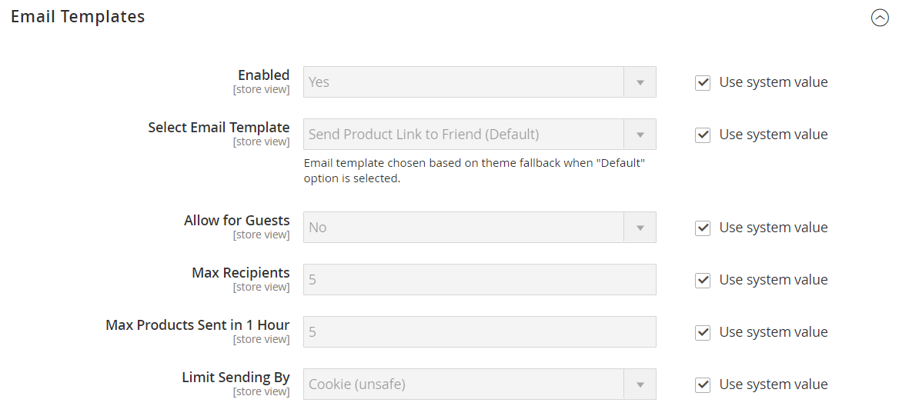

# [!UICONTROL Catalog] > [!UICONTROL Email to a Friend]

{{config}}

## [!UICONTROL Email Templates]

<!-- zoom -->

<!-- [Email Templates](https://docs.magento.com/user-guide/marketing/email-template-configuration.html) -->

| Feld | [Anwendungsbereich](../../getting-started/websites-stores-views.md#scope-settings) | Beschreibung |
|--- |--- |--- |
| [!UICONTROL Enabled] | Store-Ansicht | Aktiviert den Prozess, der Kunden die Möglichkeit gibt, E-Mails über Produkte in Ihrem Geschäft an Freunde zu senden. Optionen: `Yes` / `No` |
| [!UICONTROL Select Email Template] | Store-Ansicht | Identifiziert die E-Mail-Vorlage, die für von der _E-Mail an einen Freund_ -Funktion. Standardvorlage: `Send Product to Friend` |
| [!UICONTROL Allow for Guests] | Store-Ansicht | Bestimmt, ob der Absender ein registrierter Kunde sein muss, um E-Mails über ein Produkt an Freunde zu senden. Optionen: `Yes` / `No` |
| [!UICONTROL Max Recipients] | Store-Ansicht | Begrenzt die Anzahl der Personen, die auf der Verteilerliste für eine einzelne E-Mail stehen können. |
| [!UICONTROL Max Products Sent in 1  Hour] | Store-Ansicht | Beschränkt die Anzahl der Produkte, die von einem einzelnen Benutzer über einen Zeitraum von einer Stunde freigegeben werden können. |
| [!UICONTROL Limit Sending By] | Store-Ansicht | Bestimmt die Methode zur Identifizierung des Absenders. Zu den Optionen gehören:  **`IP Address`**- (Empfohlen) Identifiziert den Absender anhand der IP-Adresse des Computers, der zum Senden der Produkt-E-Mails verwendet wird. **`Cookie (unsafe)`** - Identifiziert den Absender anhand eines Browser-Cookies. Diese Methode ist nicht sicher, da der Benutzer das Cookie löschen kann, um die Einschränkung zu vermeiden. |

{style="table-layout:auto"}
