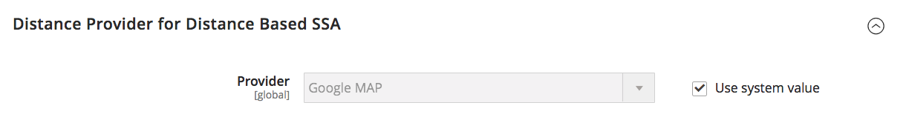

# [!UICONTROL Catalog] > [!UICONTROL Inventory]

{{config}}

>[!NOTE]
>
>[!DNL Inventory Management] für Adobe Commerce und Magento Open Source bietet Ihnen die Tools zur Verwaltung Ihres Produktbestands. Händler mit einem einzigen Geschäft zu mehreren Lagern, Geschäften, Abholstandorten, Ablagelagern und mehr können diese Funktionen nutzen, um die Mengen für den Verkauf zu halten und Sendungen für komplette Bestellungen abzuwickeln. Weitere Informationen zu diesen Funktionen und dazu, wie Sie sie zur Verwaltung von Lagern an mehreren Standorten verwenden können, finden Sie in der [_[!DNL Inventory Management] Benutzerhandbuch _](https://experienceleague.adobe.com/docs/commerce-admin/inventory/introduction.html).

## [!UICONTROL Stock Options]

<!-- zoom -->

<!-- [Stock Options](https://docs.magento.com/user-guide/catalog/inventory-options-global.html) -->

| Feld | [Anwendungsbereich](../../getting-started/websites-stores-views.md#scope-settings) | Beschreibung |
|--- |--- |--- |
| [!UICONTROL Decrease Stock When Order is Placed] | Global | Wenn auf `Yes`verringert die Lagermenge bei der Bestellung. Mit _Verwalten von Lagern_ aktiviert ist, werden Reservierungen für die bestellten Produkte und Mengen angegeben. Optionen: `Yes` / `No` |
| [!UICONTROL Set Items' Status to be in Stock When Order is Cancelled] | Store-Ansicht | Wenn auf `Yes`, gibt das Element beim Abbruch der Bestellung auf Lager zurück. Mit _Verwalten von Lagern_ aktiviert ist, wird die Reservierung für die stornierten Produkte und Mengen freigegeben. Optionen: `Yes` / `No` |
| [!UICONTROL Display Out of Stock Products] | Global | Wenn auf `Yes`zeigt Produkte an, die nicht vorrätig sind. Wenn auch Produktwarnungen aktiviert sind, können sich Kunden für eine Benachrichtigung anmelden, wenn das Produkt verfügbar wird. Optionen: `Yes` / `No` |
| [!UICONTROL Only X left Threshold] | Webseite | Legt den Schwellenwert für die `Only x left` Nachricht. Wenn Sie beispielsweise auf 3 setzen, wird die Meldung angezeigt, wenn mindestens drei Elemente auf Lager sind. Die Meldung wird nicht angezeigt, wenn der Wert auf `0`. |
| [!UICONTROL Display products availability in Stock on Storefront] | Store-Ansicht | Wenn auf `Yes`, zeigt eine `In Stock` oder `Out of Stock` auf der Produktseite angezeigt. Optionen: `Yes` / `No` |
| [!UICONTROL Enable Inventory Check On Cart Load] | Global | Bestimmt, ob beim Laden eines Produkts in den Warenkorb eine Bestandsüberprüfung durchgeführt wird. Die Deaktivierung dieser Bestandsüberprüfung kann die Leistung bei Checkout-Schritten verbessern, insbesondere wenn viele Artikel im Warenkorb sind. Wenn Sie die Vorab-Validierung jedoch überspringen, können Kunden _nicht vorrätig_ Fehler später im Checkout-Prozess. Optionen: `Yes` / `No` |
| [!UICONTROL Synchronize with Catalog] | Global | Wenn festgelegt auf `Yes`, werden die Bestandsdaten entsprechend den Katalogänderungen angepasst (z. B. Produkterneuerungen, Änderungen der Produkt-SKU und Änderungen des Produkttyps) und sorgen für Konsistenz zwischen Bestand und Katalog. Optionen: `Yes` / `No` |

{:style=&quot;table-layout:auto&quot;}

## [!UICONTROL Product Stock Options]

<!-- zoom -->

<!-- [Product Stock Options](https://docs.magento.com/user-guide/catalog/inventory-options-global.html) -->

| Feld | [Anwendungsbereich](../../getting-started/websites-stores-views.md#scope-settings) | Beschreibung |
|--- |--- |----------------------------------------------------------------------------------------------------------------------------------------------------------------------------------------------------------------------------------------------------------------------------------------------------------------------------------------------------------------------------------------------------------------------------------------------------------------------------------------------------------------------------------------------------------------------------------------------------------------------------------------------------------------------------------------------------------------------------------------------------------------------------------|
| [!UICONTROL Manage Stock] | Global | Bestimmt, ob Sie die vollständige Bestandskontrolle verwenden, um die Elemente in Ihrem Katalog zu verwalten. Optionen:  **Ja** - Aktiviert die vollständige Bestandskontrolle, um die Anzahl der derzeit auf Lager befindlichen Artikel zu verfolgen.  **Nein** - verfolgt nicht die Anzahl der aktuell auf Lager befindlichen Artikel. |
| [!UICONTROL Backorders] | Global | Bestimmt, wie Ihr Store Rückstände verwaltet. Ein Rückstand ändert den Verarbeitungsstatus der Bestellung nicht. Die Mittel werden weiterhin unmittelbar bei der Bestellung zugelassen oder erfasst, unabhängig davon, ob das Produkt vorrätig ist. Wenn das Produkt verfügbar wird, wird es versandt. Optionen:  **Keine Rückschritte** - Keine Nachbestellungen, wenn das Produkt nicht vorrätig ist.  **Menge unter 0 zulassen** - Akzeptiert Rückstände, wenn die Menge unter null fällt.  **Menge unter 0 zulassen und Kunde benachrichtigen** - Akzeptiert Rückaufträge, wenn die Menge unter null fällt, benachrichtigt Kunden jedoch darüber, dass weiterhin Bestellungen aufgegeben werden können. |
| [!UICONTROL Use deferred Stock update] | Global |  (Nur Adobe Commerce) Bestimmt, ob die Bestandsaktualisierung verschoben werden soll, wenn Rückorder zulässig sind (die _Rücksendungen_ -Option auf einen beliebigen Wert außer `No backorders` Standardwert). Es funktioniert für ein einzelnes Produkt oder eine ganze Website und verwendet die _Auftragswarteschlange_ -Mechanismus, um eine asynchrone Aktualisierung der Kennzahlen für die Lagerbestandsmenge zu ermöglichen, nachdem die Bestellungen aufgegeben wurden. Diese Option funktioniert auch mit [Asynchrone Bestellplatzierung](https://experienceleague.adobe.com/docs/commerce-operations/performance-best-practices/high-throughput-order-processing.html#asynchronous-order-placement) in Kombination mit [Inventory management](../../inventory-management/introduction.md). |
| Maximale im Warenkorb zulässige Menge | Global | Bestimmt die maximale Anzahl von Produkten, die in einer Bestellung erworben werden können. Standardmäßig ist die maximale Menge auf 10.000 festgelegt. |
| [!UICONTROL Out-of-Stock Threshold] | Global | Bestimmt den Lagerbestand, bei dem eine Ware als nicht vorrätig gilt. Optionen:  **Positiver Betrag** - mit _Rückstände_ deaktiviert ist, geben Sie einen positiven Betrag ein. Wenn Rückaufträge aktiviert sind, wird dieser Betrag ignoriert.  **Null** - mit _Rückstände_ aktiviert, Eingabe `0` ermöglicht unendliche Rückläufe.  **Negativer Betrag** - mit _Rückstände_ aktiviert ist, wird empfohlen, einen negativen Betrag einzugeben. Der Betrag wird der Verkaufsmenge hinzugefügt. Geben Sie beispielsweise -50 ein, um Bestellungen bis zu diesem Betrag zuzulassen. |
| [!UICONTROL Minimum Qty Allowed in Shopping Cart] | Global | Bestimmt den Mindestbetrag eines Artikels, der gemäß Kundengruppe zum Kauf verfügbar ist. Standardmäßig ist die Mindestmenge auf 1 gesetzt. Klicks **[!UICONTROL Add Minimum Qty]** um einen anderen Wert für eine bestimmte Kundengruppe einzugeben. |
| [!UICONTROL Notify for Quantity Below] | Global | Bestimmt den Lagerbestand, bei dem die Benachrichtigung gesendet wird, dass der Bestand unter den Schwellenwert gefallen ist. |
| [!UICONTROL Enable Qty Increments] | Global | Bestimmt, ob Artikel in Mengenschritten verkauft werden können. Optionen: `Yes` / `No` |
| [!UICONTROL Qty Increments] | Global | Legt die Anzahl der Produkte fest, aus denen eine Mengenerhöhung besteht. |
| [!UICONTROL Automatically Return Credit Memo Item to Stock] | Global | Bestimmt, ob in Kreditkarten enthaltene Elemente automatisch in den Bestand zurückgegeben werden. Optionen: `Yes` / `No` |

{:style=&quot;table-layout:auto&quot;}

## [!UICONTROL Admin Bulk Operations]

<!-- zoom -->

<!-- [Admin Bulk Operations](https://docs.magento.com/user-guide/catalog/inventory-options-global.html) -->

>[!NOTE]
>
>So konfigurieren und unterstützen Sie **Asynchrone Warteschlangenmanager**, müssen Sie die Befehlszeile verwenden. Dies erfordert möglicherweise Hilfe von Entwicklern. Siehe [Starten von Nachrichtenwarteschlangen-Verbrauchern](https://experienceleague.adobe.com/docs/commerce-operations/configuration-guide/cli/start-message-queues.html) im _Konfigurationshandbuch_.

| Feld | [Anwendungsbereich](../../getting-started/websites-stores-views.md#scope-settings) | Beschreibung |
|--- |--- |--- |
| [!UICONTROL Run asynchronously] | Global | Bestimmt, ob Sie Massenvorgänge für Massenproduktaktionen asynchron ausführen, einschließlich [Massengut](../../inventory-management/bulk-assignment.md) Zuweisen von Quellen, Aufheben der Zuweisung von Quellen und [Bestandsübertragung an Quelle](../../inventory-management/inventory-transfer.md). Sie erfasst Massenaktionen bis zum _[!UICONTROL Asynchronous batch size]_, dann führt diese Aktionen aus. Diese Funktion ist standardmäßig deaktiviert. Es wird empfohlen, Ihre Leistung mit Massenaktionen zu überprüfen, bevor Sie die Aktivierung vornehmen. Optionen: **`Yes`**- Führt alle Massenvorgänge für [!DNL Inventory Management] asynchron. Um dies zu aktivieren, müssen Sie einen asynchronen Warteschlangenmanager konfigurieren. **`No`**- Standard. Führt keine asynchronen Massenvorgänge aus. |
| [!UICONTROL Asynchronous batch size] | Global | Satz **[!UICONTROL Run asynchronously]** nach `Yes` , um einen Wert für _[!UICONTROL Asynchronous batch size]_-Feld.  Die standardmäßige Batch-Größe ist 100. Wenn Massenprozesse diesen Wert erreichen, werden sie ausgeführt. |

{:style=&quot;table-layout:auto&quot;}

## [!UICONTROL Inventory Indexer Settings]

| Feld | [Anwendungsbereich](../../getting-started/websites-stores-views.md#scope-settings) | Beschreibung |
|--- |--- |--- |
| [!UICONTROL Stock/Source reindex strategy] | Global | Bestimmt die Strategie für die Neuindizierung von Beständen/Quellen. Optionen: `Synchronous` / `Asynchronous` (Für den asynchronen Modus muss ein asynchroner Warteschlangenmanager konfiguriert werden.) |

>[!NOTE]
>
> Aufgrund der Abhängigkeiten von Inventaraktualisierungen für die auftragsbezogenen Aktivitäten wird der Inventarindexer auch bei der Produktspeicherung ausgelöst, unabhängig von der `Synchronous` oder `Asynchronous` -Einstellung.

{:style=&quot;table-layout:auto&quot;}

## [!UICONTROL Distance Provider for Distance Based SSA]

<!-- zoom -->

<!-- [Distance Providers for Distance Based SSA](https://docs.magento.com/user-guide/catalog/inventory-configure-distance-priority.html) -->

| Feld | [Anwendungsbereich](../../getting-started/websites-stores-views.md#scope-settings) | Beschreibung |
|--- |--- |--- |
| [!UICONTROL Provider] | Global | Bestimmt den Anbieter, der für den Algorithmus zur Auswahl der Distance Priority Source verwendet werden soll. Diese Funktion ist standardmäßig aktiviert. Optionen:  **`Google MAP`**- Verwendet Google-Dienste zur Berechnung der Entfernung und der Uhrzeit zwischen der Lieferadresse und den Quellspeicherorten (Adresse und GPS-Koordinaten). Für diese Option ist ein Google-API-Schlüssel erforderlich, für den möglicherweise Gebühren über Google anfallen. **`Offline Calculation`** - Berechnet die Entfernung mithilfe einer eingebetteten Datenbank, um die nächstgelegene Quelle für die Lieferzieladresse zu bestimmen. Um diese Option verwenden zu können, benötigen Sie möglicherweise Hilfe von Entwicklern, um zunächst den Inhalt des Datenbankspeicherorts für alle Länder herunterzuladen, die Sie über eine Befehlszeile versenden. |

{:style=&quot;table-layout:auto&quot;}

## [!UICONTROL Google Distance Provider]

<!-- zoom -->

<!-- [Google Distance Provider](https://docs.magento.com/user-guide/catalog/inventory-configure-distance-priority.html) -->

| Feld | [Anwendungsbereich](../../getting-started/websites-stores-views.md#scope-settings) | Beschreibung |
|--- |--- |--- |
| [!UICONTROL Google API key] | Global | Geben Sie den Google-API-Schlüssel für den Google MAP-Provider ein. Der Schlüssel stammt aus dem [!DNL Google Maps Platform] und sollten [!DNL Geocoding API] und [!DNL Distance Matrix API] aktiviert. Weitere Informationen finden Sie unter [Konfigurieren des Distance Priority-Algorithmus](../../inventory-management/distance-priority-algorithm.md#configure-the-distance-priority-algorithm) im _Inventory management-Anleitung_. |
| [!UICONTROL Computation mode] | Global | Bestimmt die Anweisungen und Pfade zur Berechnung der Entfernung von der Lieferadresse und allen dem Lager zugewiesenen Quellen. Standardmäßig verwenden Berechnungen den Fahrmodus. Optionen:  **`Driving`**- Standardeinstellung, fordert Standardfahrtanweisungen über das Straßennetz an. **`Walking`** - Fordern Sie Wanderwege mit Fußgängerwegen und Bürgersteigen an (sofern verfügbar).  **`Bicycling`**- fordert Fahrradwege mit Fahrradwegen und bevorzugten Straßen (derzeit nur in den USA und einigen kanadischen Städten verfügbar). |
| [!UICONTROL Value] | Global | Gibt an, was für die Entfernung und die Zeit der Quellstandorte zur Lieferzieladresse berechnet und zurückgegeben werden soll. Der Distance Priority Algorithm empfiehlt die Quelle mit der kürzesten Entfernung oder der kürzesten Zeit zur Lieferzieladresse, die schneller und möglicherweise kostengünstiger zur Erfüllung von Sendungen ist. Optionen:  **`Distance`**- Gibt die Entfernung zwischen Punkten in Metriken (Kilometer und Meter) oder dem Kaiserreich (Meilen und Füßen) zurück. **`Time to Destination`** - Gibt die erforderliche Zeit zurück, um von den Quellspeicherorten in Stunden und Minuten zur Lieferadresse zu gelangen. |

{:style=&quot;table-layout:auto&quot;}
