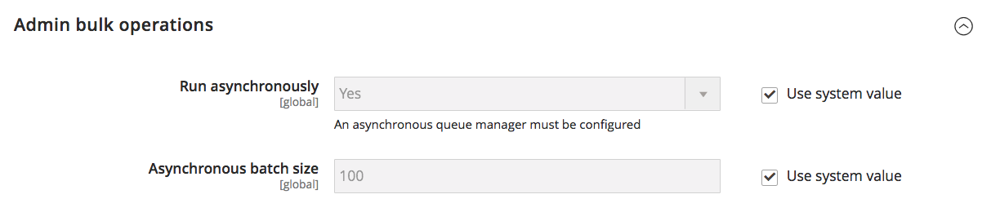

# [!UICONTROL Catalog] > [!UICONTROL Inventory]

{{config}}

>[!NOTE]
>
>[!DNL Inventory Management] für Adobe Commerce und Magento Open Source bietet Ihnen die Tools zur Verwaltung Ihres Produktbestands. Händler mit einem einzigen Shop für mehrere Lager, Geschäfte, Abholorte, Drop-Versender und mehr können diese Funktionen verwenden, um Mengen für den Verkauf zu verwalten und Sendungen zu bearbeiten, um Bestellungen abzuschließen. Weitere Informationen zu diesen Funktionen und deren Verwendung zur Verwaltung von Lagern an mehreren Orten finden Sie im [_[!DNL Inventory Management] Benutzerhandbuch _](https://experienceleague.adobe.com/docs/commerce-admin/inventory/introduction.html?lang=de).

## [!UICONTROL Stock Options]

<!-- zoom -->

<!-- [Stock Options](https://experienceleague.adobe.com/de/docs/commerce-admin/inventory/configuration/global-options) -->

| Feld | [Umfang](../../getting-started/websites-stores-views.md#scope-settings) | Beschreibung |
|--- |--- |--- |
| [!UICONTROL Decrease Stock When Order is Placed] | Global | Wenn auf `Yes` gesetzt, verringert die Lagermenge, wenn der Auftrag erteilt wird. Wenn _Lager verwalten_ aktiviert ist, werden Reservierungen für die bestellten Produkte und Mengen eingegeben. Optionen: `Yes` / `No` |
| [!UICONTROL Set Items' Status to be in Stock When Order is Cancelled] | Shop-Ansicht | Ist hierfür `Yes` festgelegt, wird der Artikel bei Stornierung des Auftrags auf Lager zurückgegeben. Wenn _Lager verwalten_ aktiviert ist, wird die Reservierung für die stornierten Produkte und Mengen gelöscht. Optionen: `Yes` / `No` |
| [!UICONTROL Display Out of Stock Products] | Global | Wenn auf `Yes` festgelegt, zeigt Produkte an, die nicht vorrätig sind. Wenn auch Produktwarnungen aktiviert sind, können sich Kunden anmelden, um benachrichtigt zu werden, wenn das Produkt verfügbar wird. Optionen: `Yes` / `No` |
| [!UICONTROL Only X left Threshold] | Website | Legt den Schwellenwert für die `Only x left` fest. Wenn beispielsweise auf 3 gesetzt, wird die Meldung angezeigt, wenn ein Artikel drei oder weniger auf Lager ist. Die Meldung wird nicht angezeigt, wenn der Wert auf `0` gesetzt ist. |
| [!UICONTROL Display products availability in Stock on Storefront] | Shop-Ansicht | Wenn auf `Yes` gesetzt, wird eine `In Stock` oder eine `Out of Stock` auf der Produktseite angezeigt. Optionen: `Yes` / `No` |
| [!UICONTROL Enable Inventory Check On Cart Load] | Global | Bestimmt, ob beim Laden eines Produkts in den Warenkorb eine Bestandsprüfung durchgeführt wird. Durch Deaktivieren dieser Inventarprüfung kann die Leistung bei Checkout-Schritten verbessert werden, insbesondere wenn sich viele Artikel im Warenkorb befinden. Wenn Sie jedoch die Vorab-Validierung überspringen, können Kunden _nicht vorrätig_ Fehler später im Checkout-Prozess sehen. Optionen: `Yes` / `No` |
| [!UICONTROL Synchronize with Catalog] | Global | Wenn auf `Yes` festgelegt, werden die Inventardaten entsprechend den Katalogänderungen angepasst (z. B. Produktentnahmen, Änderungen der Produkt-SKU und Änderungen des Produkttyps) und es wird die Konsistenz zwischen Bestand und Katalog gewahrt. Optionen: `Yes` / `No` |

{style="table-layout:auto"}

## [!UICONTROL Product Stock Options]

<!-- zoom -->

<!-- [Product Stock Options](https://experienceleague.adobe.com/de/docs/commerce-admin/inventory/configuration/global-options) -->

| Feld | [Umfang](../../getting-started/websites-stores-views.md#scope-settings) | Beschreibung |
|--- |--- |----------------------------------------------------------------------------------------------------------------------------------------------------------------------------------------------------------------------------------------------------------------------------------------------------------------------------------------------------------------------------------------------------------------------------------------------------------------------------------------------------------------------------------------------------------------------------------------------------------------------------------------------------------------------------------------------------------------------------------------------------------------------------------|
| [!UICONTROL Manage Stock] | Global | Legt fest, ob die Artikel im Katalog mit vollständiger Bestandskontrolle verwaltet werden. Optionen:  **Ja** - Aktiviert die vollständige Bestandskontrolle, um die Anzahl der aktuell auf Lager befindlichen Artikel zu verfolgen.  **Nein** - Verfolgt nicht die Anzahl der aktuell auf Lager befindlichen Artikel. |
| [!UICONTROL Backorders] | Global | Legt fest, wie Ihr Store Auftragsrückstände verwaltet. Eine Nachbestellung ändert den Verarbeitungsstatus der Bestellung nicht. Die Mittel werden unmittelbar nach Auftragserteilung noch bewilligt oder eingezogen, unabhängig davon, ob das Produkt auf Lager ist. Sobald das Produkt verfügbar wird, wird es versendet. Optionen:  **Keine**: - Akzeptiert keine Nachbestellungen, wenn das Produkt nicht vorrätig ist.  **Menge unter 0 zulassen** - Akzeptiert Nachbestellungen, wenn die Menge unter null fällt.  **Menge unter 0 zulassen und Kunde benachrichtigen** - Akzeptiert Nachbestellungen, wenn die Menge unter null fällt, benachrichtigt Kunden jedoch, dass weiterhin Bestellungen aufgegeben werden können. |
| [!UICONTROL Use deferred Stock update] | Global |  (nur Adobe Commerce) Legt fest, ob die Lageraktualisierung aufgeschoben werden soll, wenn Auftragsrückstände zulässig sind (die Option _Auftragsrückstände_ ist auf einen Wert festgelegt, der über den `No backorders` Standardwert hinausgeht). Sie funktioniert für ein einzelnes Produkt oder eine gesamte Website und verwendet den Mechanismus _Auftragswarteschlange_, damit die Inventarmengenindikatoren nach der Bestellung asynchron aktualisiert werden können. Diese Option funktioniert auch mit [asynchroner Auftragserteilung](https://experienceleague.adobe.com/docs/commerce-operations/performance-best-practices/high-throughput-order-processing.html?lang=de#asynchronous-order-placement) in Kombination mit [Inventory management](../../inventory-management/introduction.md). |
| Maximal zulässige Menge im Warenkorb | Global | Bestimmt die maximale Anzahl eines Produkts, das in einer einzigen Bestellung gekauft werden kann. Standardmäßig ist die maximale Menge auf 10.000 festgelegt. |
| [!UICONTROL Out-of-Stock Threshold] | Global | Bestimmt den Lagerbestand, bei dem ein Produkt als nicht vorrätig gilt. Optionen:  **Positiver Betrag** - Wenn _Nachbestellungen_ deaktiviert ist, geben Sie einen positiven Betrag ein. Bei aktivierten Auftragsrückständen wird dieser Betrag ignoriert.  **Null** - Wenn &quot;_Backorders_ aktiviert ist, ermöglicht die Eingabe von `0` unendliche Backorders.  **Negativer Betrag** - Bei aktiviertem _Backorders_ wird empfohlen, einen negativen Betrag einzugeben. Der Betrag wird der Verkaufsmenge hinzugefügt. Geben Sie beispielsweise -50 ein, um Bestellungen bis zu diesem Wert zuzulassen. |
| [!UICONTROL Minimum Qty Allowed in Shopping Cart] | Global | Bestimmt den Mindestbetrag eines Artikels, der je nach Kundengruppe zum Kauf verfügbar ist. Standardmäßig ist die Mindestmenge auf 1 festgelegt. Klicken Sie auf **[!UICONTROL Add Minimum Qty]** , um einen anderen Wert für eine bestimmte Kundengruppe einzugeben. |
| [!UICONTROL Notify for Quantity Below] | Global | Bestimmt den Bestand, bei dem die Benachrichtigung gesendet wird, dass der Bestand unter den Schwellenwert gefallen ist. |
| [!UICONTROL Enable Qty Increments] | Global | Legt fest, ob Artikel in Mengenschritten verkauft werden können. Optionen: `Yes` / `No` |
| [!UICONTROL Qty Increments] | Global | Bestimmt die Anzahl der Produkte, aus denen ein Mengenzuwachs besteht. |
| [!UICONTROL Automatically Return Credit Memo Item to Stock] | Global | Legt fest, ob Artikel, die in Gutschriften enthalten sind, automatisch an das Lager zurückgegeben werden. Optionen: `Yes` / `No` |

{style="table-layout:auto"}

## [!UICONTROL Admin Bulk Operations]

<!-- zoom -->

<!-- [Admin Bulk Operations](https://experienceleague.adobe.com/de/docs/commerce-admin/inventory/configuration/global-options) -->

>[!NOTE]
>
>Zum Konfigurieren und Unterstützen **asynchroner Warteschlangen** Manager“ müssen Sie die Befehlszeile verwenden. Dies erfordert möglicherweise die Unterstützung eines Entwicklers. Siehe [Starten von Nachrichtenwarteschlangen-](https://experienceleague.adobe.com/docs/commerce-operations/configuration-guide/cli/start-message-queues.html?lang=de) im _Konfigurationshandbuch_.

| Feld | [Umfang](../../getting-started/websites-stores-views.md#scope-settings) | Beschreibung |
|--- |--- |--- |
| [!UICONTROL Run asynchronously] | Global | Bestimmt, ob Massenvorgänge asynchron für Massenproduktaktionen ausgeführt werden, einschließlich [Massenzuweisung](../../inventory-management/bulk-assignment.md) Zuweisen von Quellen, Aufheben der Zuweisung von Quellen und [Übertragen des Inventars an die Quelle](../../inventory-management/inventory-transfer.md). Sie sammelt Massenaktionen bis zum _[!UICONTROL Asynchronous batch size]_&#x200B;und führt diese Aktionen aus. Diese Funktion ist standardmäßig deaktiviert. Es wird empfohlen, vor der Aktivierung die Leistung mit Massenaktionen zu überprüfen. Optionen: **`Yes`**: Führt alle Massenvorgänge für [!DNL Inventory Management] asynchron aus. Zur Aktivierung müssen Sie einen Manager für asynchrone Warteschlangen konfigurieren. **`No`**- Standard. Führt keine Massenvorgänge asynchron aus. |
| [!UICONTROL Asynchronous batch size] | Global | Legen Sie **[!UICONTROL Run asynchronously]** auf `Yes` fest, um einen Wert für _[!UICONTROL Asynchronous batch size]_&#x200B;Feld einzugeben.  Die standardmäßige Batch-Größe ist 100. Wenn Massenprozesse diesen Wert erreichen, werden sie ausgeführt. |

{style="table-layout:auto"}

## [!UICONTROL Inventory Indexer Settings]

| Feld | [Umfang](../../getting-started/websites-stores-views.md#scope-settings) | Beschreibung |
|--- |--- |--- |
| [!UICONTROL Stock/Source reindex strategy] | Global | Legt die Strategie für die Neuindizierung von Aktien/Quellen fest. Optionen: `Synchronous` / `Asynchronous` (ein asynchroner Warteschlangenmanager muss für den asynchronen Modus konfiguriert werden) |

{style="table-layout:auto"}

>[!NOTE]
>
> Aufgrund der Abhängigkeiten von Bestandsaktualisierungen für die auftragsbezogenen Aktivitäten wird der Inventar-Indexer auch bei der Produktspeicherung ausgelöst, unabhängig von der `Synchronous`- oder `Asynchronous`.

## [!UICONTROL Distance Provider for Distance Based SSA]

<!-- zoom -->

<!-- [Distance Providers for Distance Based SSA](https://experienceleague.adobe.com/de/docs/commerce-admin/inventory/configuration/distance-priority-algorithm) -->

| Feld | [Umfang](../../getting-started/websites-stores-views.md#scope-settings) | Beschreibung |
|--- |--- |--- |
| [!UICONTROL Provider] | Global | Bestimmt den Provider, der für den Source-Auswahlalgorithmus „Distanzpriorität“ verwendet werden soll. Diese Funktion ist standardmäßig aktiviert. Optionen:  **`Google MAP`**- Verwendet Google-Services zur Berechnung der Entfernung und Zeit zwischen der Versandzieladresse und den Quellorten (Adresse und GPS-Koordinaten). Diese Option erfordert einen Google-API-Schlüssel und kann über Google Gebühren verursachen. **`Offline Calculation`** - Berechnet die Entfernung mithilfe einer eingebetteten Datenbank, um die Quelle zu ermitteln, die der Versandzieladresse am nächsten liegt. Um diese Option verwenden zu können, benötigen Sie möglicherweise Entwicklerunterstützung, um den Inhalt des Datenbankspeicherorts für alle Länder, die Sie versenden, zunächst über eine Befehlszeile herunterzuladen. |

{style="table-layout:auto"}

## [!UICONTROL Google Distance Provider]

<!-- zoom -->

<!-- [Google Distance Provider](https://experienceleague.adobe.com/de/docs/commerce-admin/inventory/configuration/distance-priority-algorithm) -->

| Feld | [Umfang](../../getting-started/websites-stores-views.md#scope-settings) | Beschreibung |
|--- |--- |--- |
| [!UICONTROL Google API key] | Global | Geben Sie den Google-API-Schlüssel für den Google MAP-Provider ein. Der Schlüssel stammt aus dem [!DNL Google Maps Platform] und sollte [!DNL Geocoding API] und [!DNL Distance Matrix API] aktiviert haben. Weitere Informationen finden Sie unter [Konfigurieren des Distance Priority ](../../inventory-management/distance-priority-algorithm.md#configure-the-distance-priority-algorithm)) im _Inventory management-Handbuch_. |
| [!UICONTROL Computation mode] | Global | Bestimmt die Richtungen und Pfade zur Berechnung des Abstands von der Versandadresse und allen dem Lager zugewiesenen Quellen. Standardmäßig verwenden Berechnungen den Fahrmodus . Optionen:  **`Driving`**- Standardeinstellung, fordert Standard-Fahrtrichtungen über das Straßennetz an. **`Walking`** - Fragen Sie nach einer Wegbeschreibung über Fußgängerwege und Bürgersteige (sofern verfügbar).  **`Bicycling`**- Beantragt Radwege über Radwege und bevorzugte Straßen (derzeit nur in den USA und einigen kanadischen Städten verfügbar). |
| [!UICONTROL Value] | Global | Gibt an, was für die Entfernung und Zeit der Quellorte berechnet und an die Versandzieladresse zurückgegeben werden soll. Der Distance Priority Algorithm empfiehlt die Quelle mit der kürzesten Entfernung oder kürzesten Zeit zur Versandzieladresse, was eine schnellere und möglicherweise billigere Erfüllung von Sendungen ermöglicht. Optionen:  **`Distance`**- Gibt die Entfernung zwischen Punkten in Metriken (Kilometer und Meter) oder in „imperial“ (Meilen und Füße) zurück. **`Time to Destination`** - Gibt die benötigte Zeit zurück, um von den Quellorten zur Lieferadresse zu reisen, in Stunden und Minuten. |

{style="table-layout:auto"}
