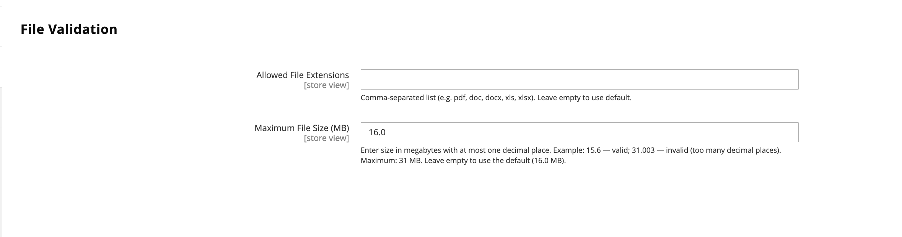

# [!UICONTROL Catalog] > [!UICONTROL Product File Attributes]

{{config}}

## [!UICONTROL Configure Allowed File Types and Size]

| Feld | [Umfang](../../getting-started/websites-stores-views.md#scope-settings) | Beschreibung |
|--- |--- |--- |
| [!UICONTROL Allowed File Extensions] | Global | Eine kommagetrennte Liste der zulässigen Dateitypen, z. B. `pdf,doc,docx,txt`. Lassen Sie das Feld leer, um die standardmäßigen zulässigen Dateitypen zu verwenden: PDF, DOC, DOCX, XLS, XLSX, PPT, PPTX, TXT, CSV, ZIP. |
| [!UICONTROL Maximum File Size] | Global | Die maximal zulässige Dateigröße in MB, z. B. `20.0`. Der Standardwert ist 16 MB. Die maximal zulässige Dateigröße beträgt 31 MB. |

{style="table-layout:auto"}
