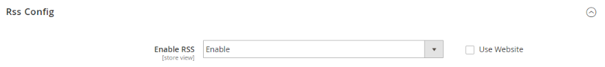
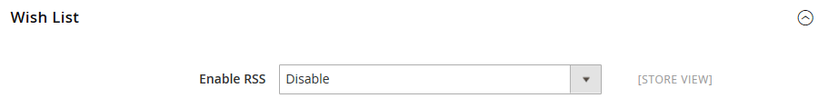
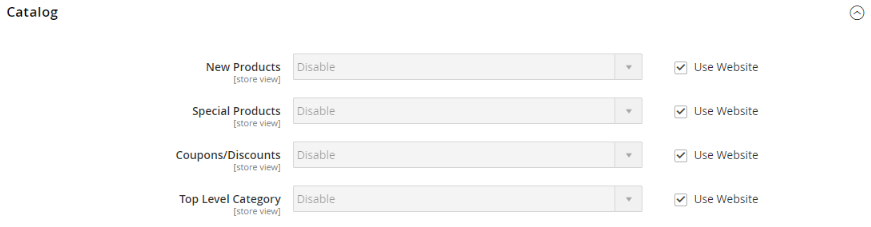
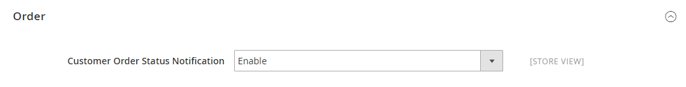

# [!UICONTROL Catalog] > [!UICONTROL RSS Feeds]

{{config}}

## [!UICONTROL Rss Config]

<!-- zoom -->

<!-- [Rss Config](https://experienceleague.adobe.com/en/docs/commerce-admin/marketing/communications/social-rss) -->

| Feld | [Umfang](../../getting-started/websites-stores-views.md#scope-settings) | Beschreibung |
|--- |--- |--- |
| [!UICONTROL Enable RSS] | Shop-Ansicht | Ermöglicht Kunden den Empfang von RSS-Feeds aus dem Store. |

{style="table-layout:auto"}

Weitere Informationen zur Verwendung von RSS-Feeds nach deren Aktivierung finden Sie unter [Social Media- und RSS-Feeds](../../merchandising-promotions/social-rss.md).

## [!UICONTROL Wish List]

<!-- zoom -->

<!-- [Wish List](https://experienceleague.adobe.com/en/docs/commerce-admin/stores-sales/shopper-tools/wish-lists/wishlists) -->

| Feld | [Umfang](../../getting-started/websites-stores-views.md#scope-settings) | Beschreibung |
|--- |--- |--- |
| [!UICONTROL Enable RSS] | Shop-Ansicht | Nach der Aktivierung wird ein RSS-Feed-Link oben auf den Wunschlistenseiten angezeigt. Die Seite zur Freigabe der Wunschliste enthält ein Kontrollkästchen, das der Kunde auswählen kann, um in freigegebenen Wunschlisten eine Verknüpfung mit dem Feed herzustellen. |

{style="table-layout:auto"}

## [!UICONTROL Catalog]

<!-- zoom -->

<!-- [Catalog](https://experienceleague.adobe.com/en/docs/commerce-admin/catalog/catalog-menu) -->

| Feld | [Umfang](../../getting-started/websites-stores-views.md#scope-settings) | Beschreibung |
|--- |--- |--- |
| [!UICONTROL New Products] | Shop-Ansicht | Wenn diese Option aktiviert ist, werden Benachrichtigungen über neue Produkte veröffentlicht, die zum Store-Katalog hinzugefügt wurden. |
| [!UICONTROL Special Products] | Shop-Ansicht | Wenn diese Option aktiviert ist, werden Benachrichtigungen zu Produkten mit Sonderpreisen veröffentlicht. |
| [!UICONTROL Coupons/Discounts] | Shop-Ansicht | Wenn diese Option aktiviert ist, werden Benachrichtigungen über Gutscheine oder Rabatte veröffentlicht. |
| [!UICONTROL Top Level Category] | Shop-Ansicht | Veröffentlicht Benachrichtigungen über Änderungen an der Kategoriestruktur auf oberster Ebene Ihres Katalogs, die im Hauptmenü angezeigt werden. |

{style="table-layout:auto"}

## [!UICONTROL Order]

<!-- zoom -->

<!-- [Order](https://experienceleague.adobe.com/en/docs/commerce-admin/stores-sales/order-management/orders/order-status#notification) -->

| Feld | [Umfang](../../getting-started/websites-stores-views.md#scope-settings) | Beschreibung |
|--- |--- |--- |
| [!UICONTROL Customer Order Status Notification] | Shop-Ansicht | Ermöglicht Kunden, ihren Bestellstatus per RSS-Feed zu verfolgen. Nach der Aktivierung wird ein RSS-Feed-Link auf der Bestellung angezeigt |

{style="table-layout:auto"}
